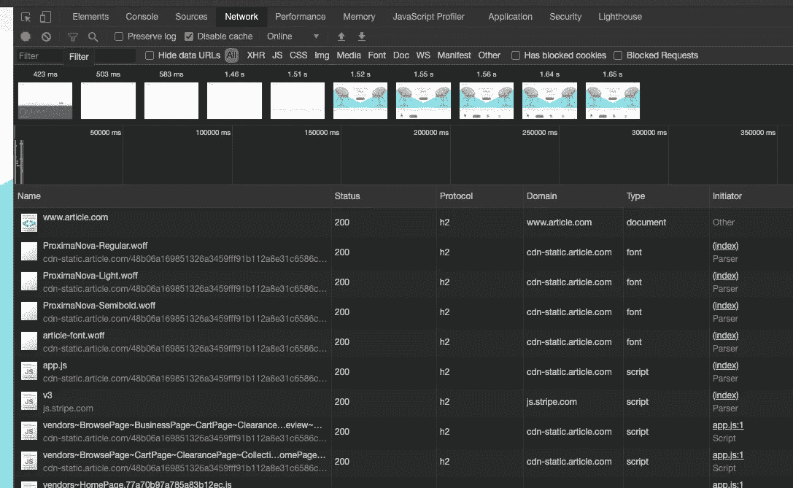
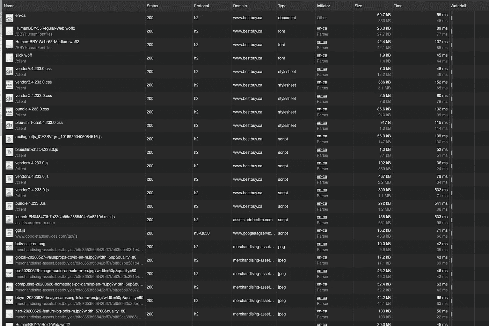
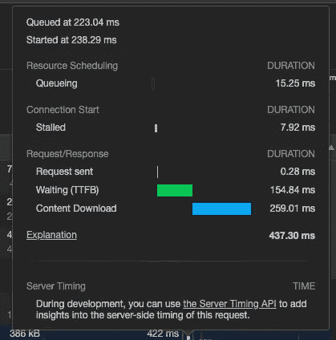
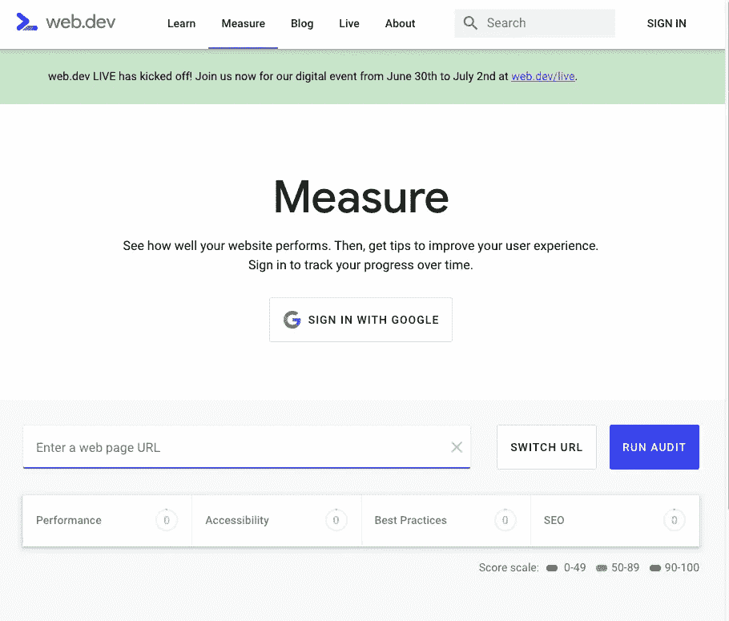

# 我如何调试性能不佳的网络

> 原文：<https://medium.com/nerd-for-tech/how-i-debug-poor-performance-network-e41b2cb963cb?source=collection_archive---------16----------------------->

## 想知道为什么你的网站加载很慢吗？让我们弄清楚它，然后推它一把

任何工程师在将产品投入生产时，性能都应该是首要考虑的事情之一。你可以在你的应用中拥有最好的用户界面和最精美的动画，但是如果性能很差，比如需要很长时间才能加载，可能没有人会注意到你的杀手级应用，这将是一个遗憾。

在这篇文章中，让我们关注网络。这里的网络指的是展示应用程序所需的文件的实际传输时间。有时可能是物理障碍，比如糟糕的网络，但有时只是同时运送了太多的东西。我们不能修复人们拥有的互联网，但我们可以修复我们的应用程序。

# 工具

现在大多数浏览器在各自的 devtool 中都有一个网络标签。这将向您显示浏览器在访问网站时下载的所有内容。它按照下载的顺序显示请求，谁试图下载它，它们的大小，下载时间。它有很多细节，但也可能迷失在其中。

在这里，我将使用 Chrome，当然，如果你使用 IE 进行调试，我不会评判你。其实我会佩服你的。

# 网络

当我打开网络选项卡时，这里有很多信息。我们在这里看到，当我们登陆 BestBuy 时，它正在下载必要的字体、CSS 文件、JavaScripts，然后是页面上显示的图像。默认情况下，它按照请求被触发的顺序显示，每一行都有一些关于每个请求的信息。

## 草案

这表示请求使用什么协议来传输这些文件。对于一个标准的网站，我们通常会看到它是上面显示的`http 1.1`还是`h2`。这两个协议的主要区别在于`h2`默认允许你同时请求多个文件。简单地说，这意味着你的浏览器可以同时下载多个文件，而不是在`http 1.1`中一次只能下载一个文件。虽然浏览器会做一些聪明的事情，但它不像`h2`那样有效。在这里，`h2`之前的性能提示是使用`webpack`或`gulp`将所有文件连接成一个文件，这样我们的开销会更少。现在大多数浏览器、服务器和 CDN 默认使用`h2`。我看到`gpt.js`在用`h3`，在这里变得冒险。

## 发起人

它基本上是告诉你是谁开始这个请求的。它可以来自 HTML，也可以是 JavaScript 中的一个方法。这非常有助于理解这些请求是如何发生的。

## 大小

这是不言自明的:浏览器下载的实际文件大小。如果只有 1 个数字，那么它就是浏览器下载的文件大小，但是如果它显示 2 个数字，那么上面的数字是下载的文件大小，下面的数字是解压缩文件后的文件大小。它有时可能会显示它是从内存中加载的，这是因为它已经被浏览器从您以前的访问中缓存了，这样可以节省时间，并且不需要再次重新下载数据。

## 时间

浏览器下载文件所花费的时间。这通常是一个很好的指标，表明可能出了什么问题。快速浏览这个专栏可以让你更好地理解这个网站是如何运作的。

## 瀑布

这向您显示了浏览器发送请求的确切顺序，以及在每次下载的每个阶段花费的时间。

将鼠标悬停在工具栏上，它会向您显示一些信息，例如它在下载队列中等待了多长时间，服务器何时响应，以及检索此响应。

## 附加信息

开发工具底部的这些数据也非常有帮助。它显示了到目前为止浏览器已经触发了多少个请求，使用的总带宽，DOMContentLoaded 事件以及 Load 事件的触发时间。

# 怎么花了这么长时间？

每个网站都有自己的衡量标准，所以假设大多数请求在 200 毫秒内得到满足，也许我们有一些资产需要更长的时间。我们检查它是什么文件，并应用不同的优化技术。大多数时候，它通常是一个图像，因为现在每个网站都有这些大而漂亮的图像试图抓住你的注意力，所以你不会反弹。你可以在合适的时间查看我在 [Serving Image 上的帖子来优化你的图像。](https://sdust.dev/content-posts-2019-08-30-serving-image-at-the-right-time/)

如果是 JavaScript 或 CSS 文件，我们可以检查下载的大小。我的经验是，如果每个文件都大于 250 kb，那么我们应该尽量把它变小。你可以有自己的度量标准，但这是我的默认值。然后，我们可以进行以下检查:

*   文件是像使用 GZIP 一样被压缩的吗
*   我们是否在使用 CDN 服务来缩短响应时间
*   我们发布的代码是客户真正需要的吗

如果你正在使用 Vue，那么你可以查看[如何不减慢你的 Vue 应用](https://sdust.dev/content-posts-2020-05-23-how-not-to-slow-your-vue-app/)获得更多提示。

# 我们在下载什么？

如前所述，默认情况下，在 network 选项卡中，请求按照它们被触发的顺序列出。作为工程师，我们应该对什么是重要的有一个总的概念。如果你有 CSS 文件，但是下载得太晚，导致页面什么都不显示，那就有问题了。

如果您看到一些异常情况，如除非很早就请求滚动到页面底部，否则用户不会看到的图像，我们可以检查发起者，以检查在哪里以及哪个方法发起了请求。

营销团队会在网站上做一些跟踪，以了解更多关于客户的信息。Google Tag Manager 是一个很好的工具，但是我们可能会下载很多第三方库，最终会降低网站的速度。

*   我们是否提前下载了太多
*   一些资产在第一次登陆页面时是必要的吗
*   我们能推迟一些请求吗
*   所有的第三方库都是必要的吗？它们加载得太快了吗

# 我们下载了多少？

如协议部分所述，我们可以知道这些文件是如何使用哪种协议下载的。`h2`已经被证明是从`http 1.1`的巨大进步，所以配置你的服务器和 CDN 使用`h2`，如果你能控制它的话。这样你就可以同时下载多个文件，而不用互相等待。但你知道一切都需要平衡。尝试调整 [webpack splitchunks](https://webpack.js.org/plugins/split-chunks-plugin/) 并测试性能。

# 奖金

Google Chrome 有一个 Lighthouse 标签，可以为你的网站生成一个性能报告。或者你可以访问 [web.dev](https://web.dev) 对任何 URL 进行测量。它会给你一些可以改进的建议和如何改进的提示。

如果你觉得它有帮助，请帮我一个忙，把这篇文章分享给其他人，这样我们可以更快地浏览网页。

*原发布于*[*https://sdust . dev*](https://sdust.dev/content-posts-2020-07-04-how-i-debug-poor-performance-network/)*。*