# 我如何使用 CircleCI 部署 Terraform 资源

> 原文：<https://medium.com/nerd-for-tech/how-i-deployed-terraform-resources-with-circleci-628aa29ed514?source=collection_archive---------2----------------------->

图片来源:Unsplash 的 Bianca Ackermann

作为 DevOps 学习之旅的一部分，我有机会使用另一个令人印象深刻的 CI/CD 工具。在这次自动化冒险中，我遵循了一个颇有见地的 HashiCorp 教程，该教程提供了对 CircleCI 的了解。除了部署一个动画、拼图风格的网站并将其存储在 AWS 简单存储服务(s3)上，我还了解了一个非常有用的持续集成工具。

**什么是持续集成？**

持续集成(CI)是将来自多个开发人员的代码提交融合到一个无缝管道中的过程。随着频繁的(最佳实践建议每天)提交，小批量的代码被构建，并被测试错误。如果测试成功，则进行部署。一个令人满意的部署然后导致生产。因此，CI 中的关键步骤是提交、构建和测试。我们将在另一个项目中更详细地讨论持续部署。

**CircleCI 解释**

CircleCI 是一个持续集成工具，用于构建、提交和测试代码库。在其网站上，CircleCI 吹嘘的功能包括:

版本控制系统(VCS)集成 GitHub 和 BitLocker

自动化测试

通知，在管道出现故障时

自动化部署

值得注意的是，该网站还将詹金斯列为主要竞争对手，并鼓励用户从它转向 CircleCI。让我们通过使用 CircleCI 部署一些 Terraform 基础设施来测试它！

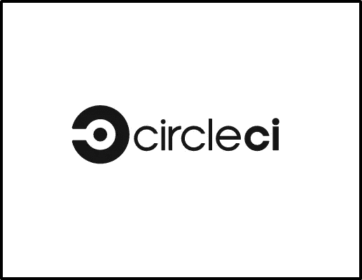

CircleCI 的标志

**自动化定义**

自动化是创建一个重复的行动过程，需要最少或没有人为干预。如果实施得当，在完成需要大量重复的任务时，使用自动化流程还可以降低用户出错的风险**。**在本练习中，我们将使用自动化来运行 Terraform 配置。

**材料**

一个 [AWS](https://aws.amazon.com/) 账号

一篇 CircleCI 的记述。如果您还没有 CircleCI 的帐户，您可以[用您的 GitHub 帐户注册一个。](https://circleci.com/signup/)

**一个 [GitHub](https://github.com/) 账号**

您选择的集成开发环境(IDE)。对于这个项目，我将使用 Visual Studio 代码(VSC)来查看编辑文件。在本次练习中，Windows PowerShell 也将占据重要位置。

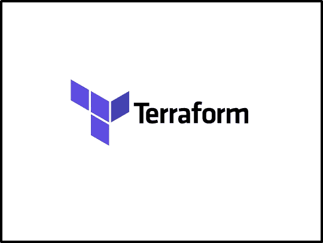

Terraform 标志

**第一步:从 HashiCorp 学习 Fork 演示代码**

在这次活动中，我们将跟随哈希公司的[教程](https://learn.hashicorp.com/tutorials/terraform/circle-ci?in=terraform/automation)。我从 HashiCorp 的 [GitHub](https://github.com/hashicorp/learn-terraform-circleci) 库获取了演示代码，并将其克隆到我的电脑上。

从 GitHub 克隆 repo 的说明。图片来源:哈希公司

完成这些步骤后，我创建了一个目录，并在其中进行了更改。

进入我们目录的图像

在我们继续之前，我们应该回顾一下将要运行的 config.yml 文件。为此，请在 IDE 中打开该文件。

**第二步:查看 CircleCI 配置**

**带 CircleCI 的四个工作**

在自动化 Terraform 工作流程的过程中，我们的 CircleCI 配置将完成四项工作。

**“计划—应用”作业:**该作业将使用“hashicorp/terraform: light”图像，根据 hashicorp 的说法，该图像包含一个 terraform 二进制文件。该作业执行检出步骤并运行“terraform init”命令。它还将通过运行“terraform plan -out”命令创建一个名为“tfapply”的文件。

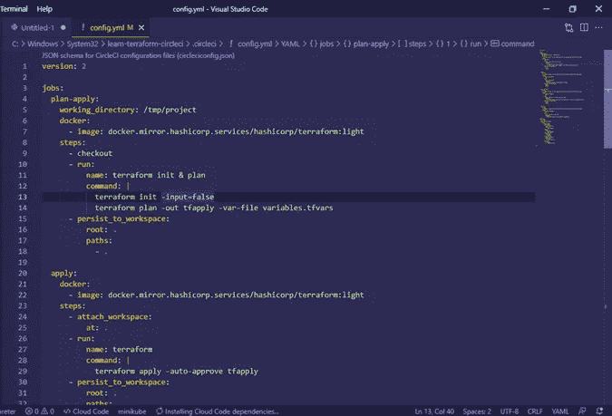

CircleCI 配置中“计划-应用”和“应用”作业的可视化

**“应用”作业:**在该作业中，HashiCorp 声明“应用作业中的‘attach _ workspace’步骤加载‘plan’作业中先前持久化的工作空间。”“应用”作业将运行“terraform apply”命令来执行我们在上一步中创建的“tfapply”。“自动批准”标志允许用户绕过多个确认批准的提示。

***“*计划—销毁*”*作业:**该作业生成销毁已部署基础设施的计划。

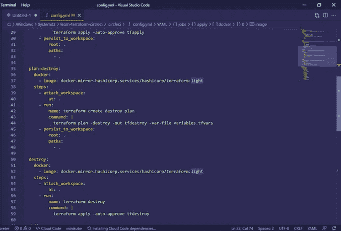

CircleCI 运行的“计划-销毁”和“销毁”作业的屏幕截图

“摧毁”工作:流程的这一部分执行摧毁基础设施的计划。

HashiCorp 建议用户在运行时密切关注“计划—销毁”和“销毁”作业。可能会出现中断，用户应该监控每个作业的进度。作为一名新人，我会密切关注所有正在进行的工作。

**工作流程**

工作流程是 CircleCI 配置的最后一部分。它协调流水线中每个作业的顺序和要求。HashiCorp 解释说,“计划 _ 批准 _ 申请”工作流以有序的方式贯穿流程的每一步，并据此创建申请。

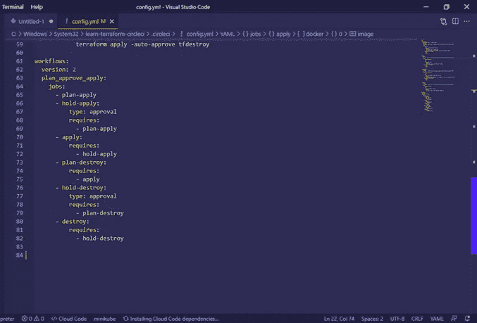

我们“学习-地形-circleci”配置的工作流程

**第三步:在 CircleCI 建立项目**

现在我们已经回顾了 CircleCI 将要运行的作业和工作流，让我们在 CircleCI 中设置我们的项目。

由于我们的 CircleCI 账户与我们的 GitHub 账户相关联，您会看到分叉回购已经列在“项目”下。当您尝试此项目时，选择蓝色的“设置项目”按钮，并继续下一个屏幕。

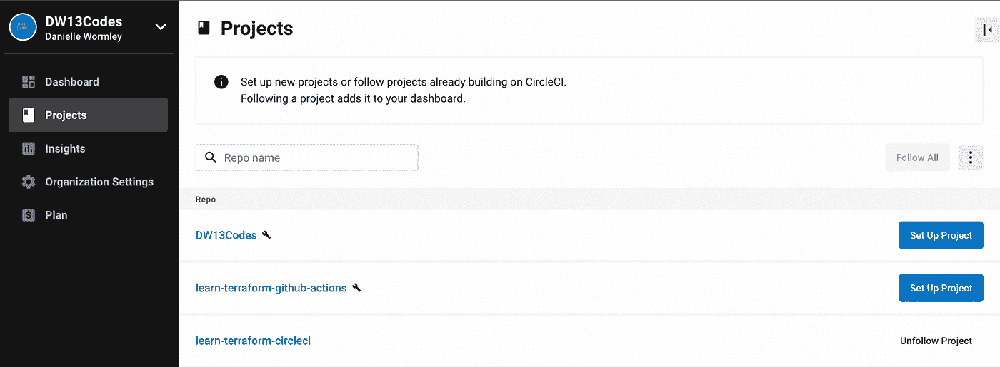

CircleCI“项目”屏幕的视觉效果

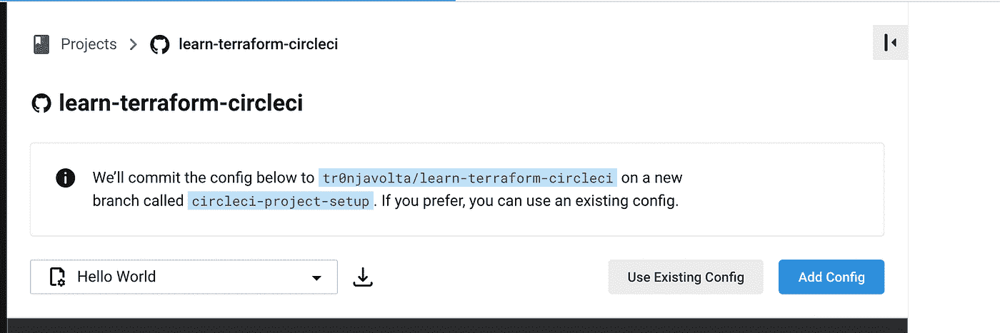

图片来源:哈希公司

到达以下屏幕后，选择“Hello World ”,并为新项目单击“使用现有配置”选项。将出现一个弹出窗口，确认" config.yml "文件的创建。此时，单击“开始构建”按钮。

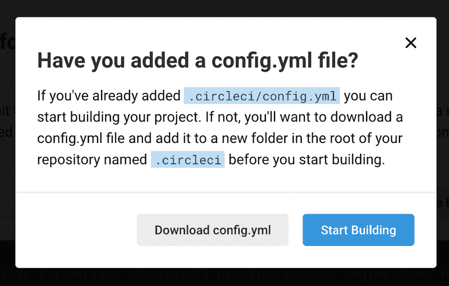

图片来源:哈希公司

CircleCI 将立即尝试在管道内运行作业，但没有成功。出现这种结果是因为无缝操作所需的两个关键部分缺失。我们必须在“环境变量”屏幕中输入我们的 AWS 访问密钥 ID 和 AWS 秘密访问密钥，然后保存它们以继续我们的项目。我已经包含了一个“环境变量”屏幕的视图，不包括我的 AWS 凭证。

CirlceCI“环境变量”屏幕的图像

在下面的屏幕上，CircleCI 显示了所关注项目的名称、管道中每个作业的状态、工作流、repo 分支/提交和设置。

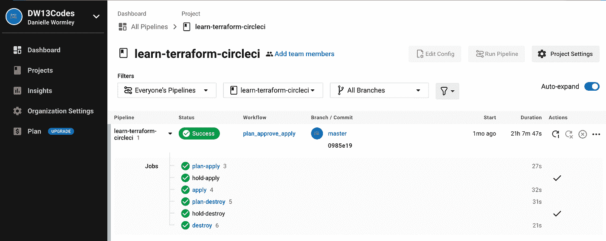

成功运行后 circleci 中“learn-terraform-circleci”项目屏幕的图像

**第四步:创建后端**

既然我们已经回顾了 CircleCI 将要运行的作业和工作流，那么让我们回到本练习开始时创建的目录，并为它启动后端。在切换到“s3_backend”目录后，我将运行“terraform init”命令。“terraform init”命令初始化这个目录、后端和提供者插件。

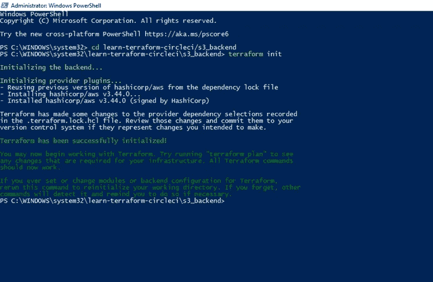

“terraform init”命令及其结果的图像

启动后，下一步将需要“terraform apply”命令来执行配置。如下图所示，Terraform 的试探性动作列表立即出现。在您审阅并批准建议的操作后，键入“是”进行确认。确认后，批准的活动开始发生。

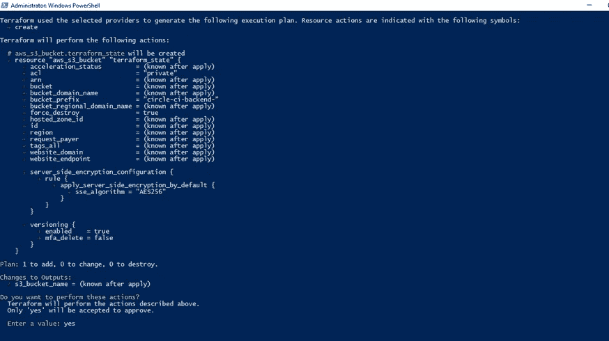

“terraform apply”命令输出的视觉效果

“terraform apply”命令创建了一个 S3 桶，该桶需要 12 秒才能生成。

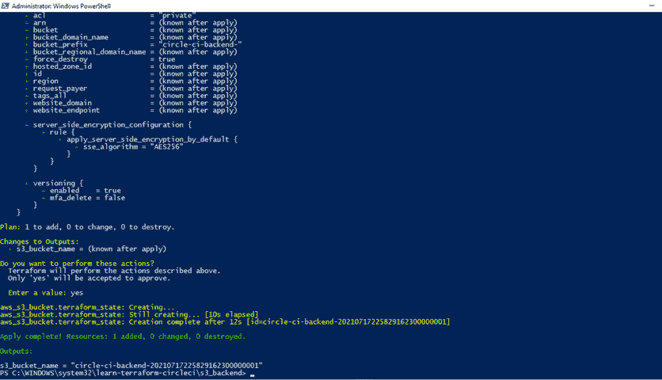

创建 S3，在键入“是”以确认“terraform 应用”操作后

**第五步:建立地形变量**

在这个阶段，需要返回到“learn-terraform-circleci”本地库。完成后，使用您选择的文件编辑器打开“main.tf”文件。除了您的首选 AWS 区域之外，使用生成的“S3 _ 存储桶 _ 名称”更新此文件。

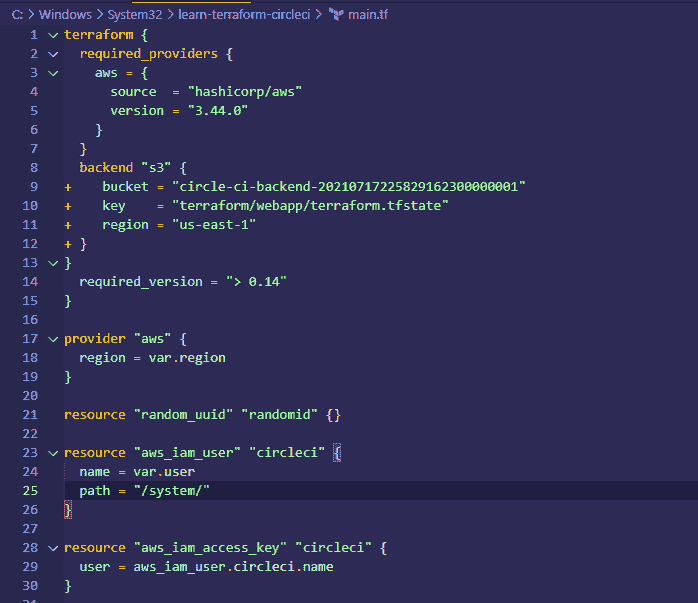

修改后的“main.tf”文件的图像

更新并保存“main.tf”文件后，打开“variables.tfvars”文件，用部署变量修改它。

更新的“variable.tfvars”文件的可视化

**第六步:启动 CircleCI 工作流程**

项目的下一部分需要通过 GitHub 存储库启动 CircleCI 工作流。

*   **git add main . TF variables . TF vars:**向 GitHub repo 添加更改。
*   **git commit -m“添加远程后端和变量定义”:**用一条消息提交这些更改。
*   **git push:** 将更改推送到我的分叉存储库中的主分支，以启动 CircleCI 运行。

更新 GitHub 存储库中信息的 git 操作的屏幕截图

CircleCI 站点内的项目审查表明部署将顺利运行。

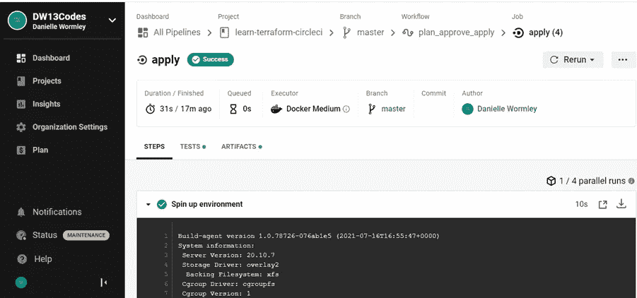

启动 CircleCI 工作流后“应用”作业的图像

当我深入了解工作流时，流程细节显示“应用”流程已经完成，添加了七个资源。

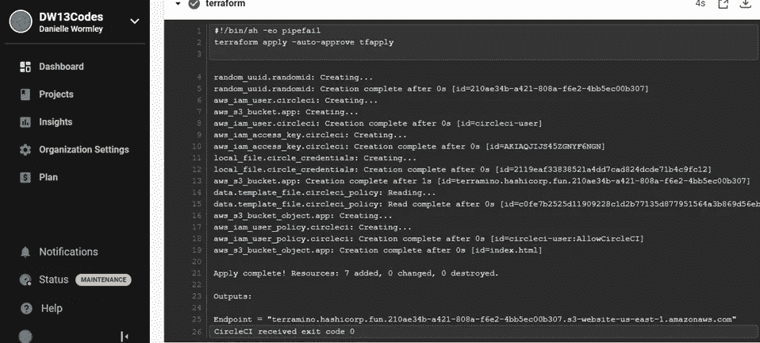

CircleCI 中显示的“应用”流程的视觉效果

图像特写，显示了添加了七个资源的成功应用

**第七步:查看 AWS 资源**

我再次访问我的 AWS 控制台，查看生成的“circle-ci-back end”S3 的状态，并看到它已成功创建和部署。对 AWS 资源的审查还揭示了第二个 s3 的创建，“terramino.hashicorp.fun”，其中包含了惊喜。

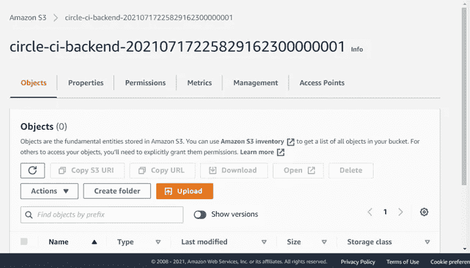

AWS 控制台中“circle-ci-back end”S3 的屏幕截图

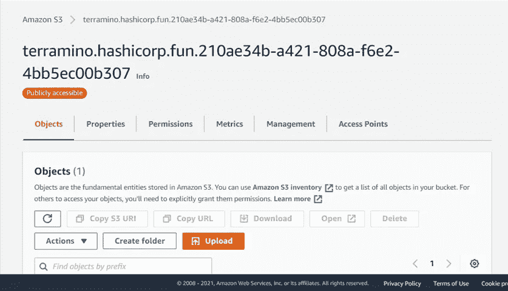

AWS 控制台中“terra mino . hashi corp . fun”S3 的图像

**第八步:检查我们的工作**

在回顾了所有变量并确认了已部署的资源之后，终于到了检查我们工作的时候了。导航到“应用”输出中提供的端点(地址)后会发生什么？

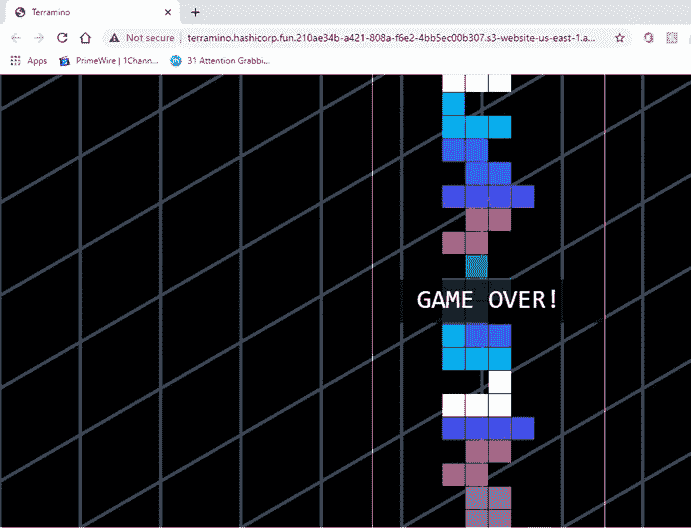

用 CirlceCI 成功运行 CI/CD 后，保存在 S3 上的拼图式动画

我们得到了一个巨大的惊喜:一个名为“Terranimo”的益智类游戏，由 HashiCorp 开发！在动画结束时，当所有的拼图块填满屏幕顶部，一个“游戏结束！”消息出现。

**第九步:破坏资源**

现在我们已经展示了很酷的动画，我们必须破坏设置。我们不想因为继续运行只有暂时需求的资源而招致任何不必要的 AWS 费用。如下图所示，单击“保留—销毁”按钮表示批准。这一步将启动“销毁”过程。

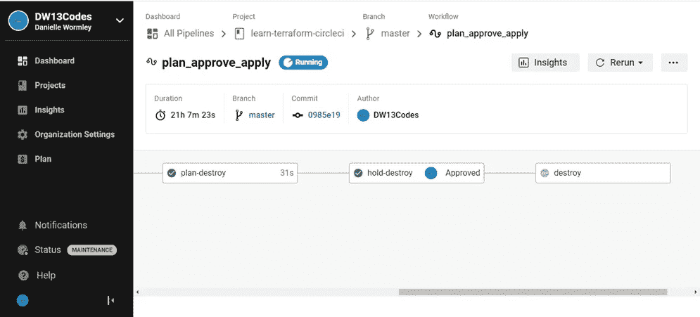

circle ci“plan _ approve _ apply”屏幕的视觉效果，带有已批准的“保留-销毁”选项和“销毁”作业的待定状态

不久之后，“销毁”过程将结束。

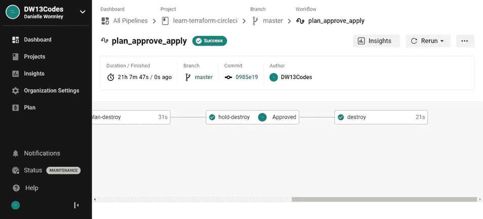

已完成的“销毁”过程的图像

返回到项目仪表板，以确保管道的状态。

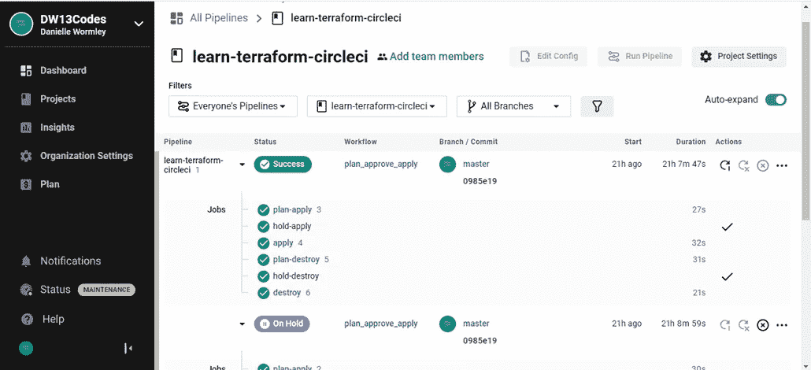

“learn-terraform-circleci”项目的屏幕截图，显示了所有必需作业的成功运行

要最终销毁该项目中的所有资源，请返回到本地存储库并输入“terraform destroy”命令来删除最终的资源。

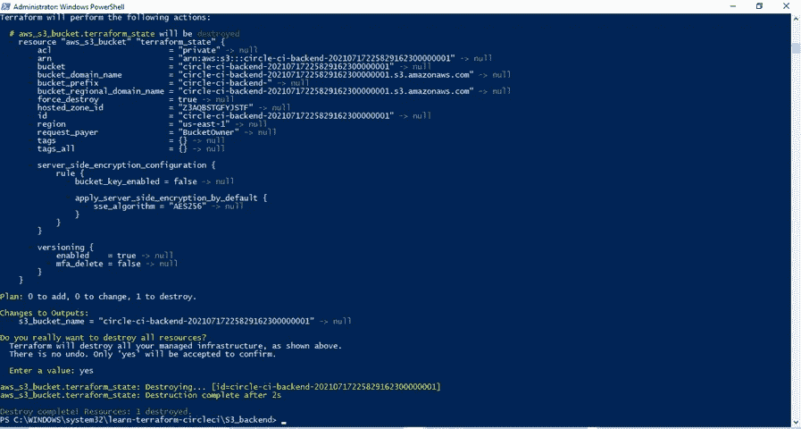

对已部署的体系结构运行“terraform destroy”的屏幕截图

这个项目很有挑战性，但也很有趣！虽然这个练习让我想起了童年时喜爱的某个视频游戏，但它也展示了 CircleCI 是一个多么有价值的 CI 工具。在这个项目中，我了解到 CircleCI 的自动化工作流程如何有效地在管道中的所有作业中运行 Terraform 配置。HashiCorp Learn 的"[使用 CircleCI](https://learn.hashicorp.com/tutorials/terraform/circle-ci?in=terraform/automation) 部署 Terraform 基础设施"练习是该项目的基础。我期待在我的职业转型过程中尝试更多的自动化工具！