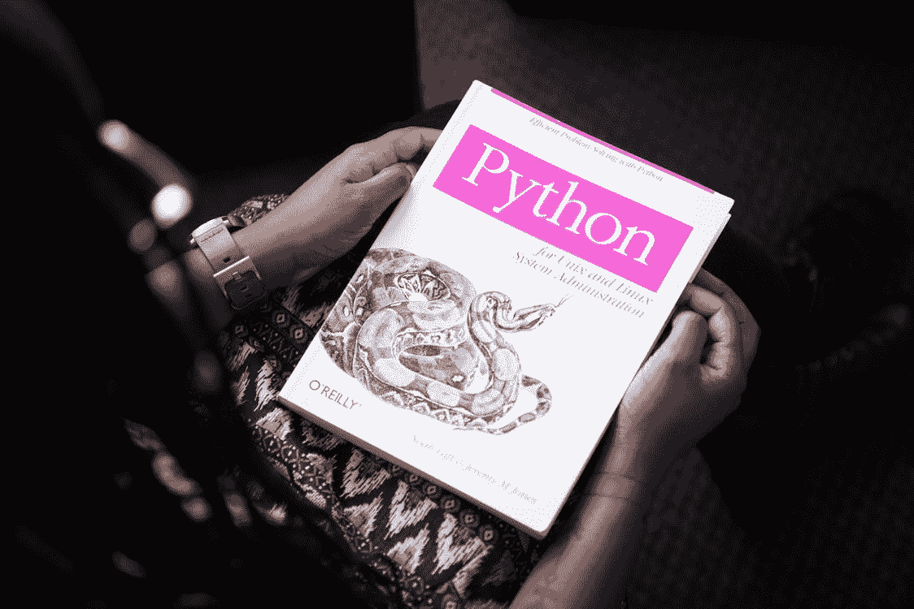

# 过去五年我是如何使用 Python 的

> 原文：<https://medium.com/nerd-for-tech/how-i-have-used-python-over-the-last-five-years-86336a95f689?source=collection_archive---------2----------------------->

有人说 Python“什么都能用”是很常见的。总的来说，我同意这一点。Python 有一个非常丰富的库生态系统，其简单的语法使得代码可读性更好，也更容易编写。

我使用 Python 已经快五年了(时断时续)，所以我决定为这种美妙的语言编写一个用例列表。我相信这可能对初级程序员更有价值，因为我希望这可以给你一些想法，为什么你应该尽早学习 Python 而不是其他语言。然而，在这个列表中可能会有一个用例，使得高级程序员决定在他们的下一个个人项目中使用 Python)。

封面图片([来源](https://www.pexels.com/photo/python-book-1181671/))

# Hello 编程

是的，我的第一个“Hello world”就是用 Python 写的。从那以后，我学习了 Python 中的一般编程概念，直到今天，当某件事/某人要求我写代码时，我仍然尽可能默认使用 Python。

条件从句、循环、数据结构等等我都学过了。在 Python 中。按照这个想法，我已经学习了 Python 中的概念，现在，当需要时，我“简单地”在使用其他语言时查找这些概念和操作的语法。对一种语言/框架有偏好是很好的，但是永远记住你正在学习如何做某事，语言只是你如何解释你试图做的事情。

# 网页抓取

这些年来，我用 Python 做了相当多的网络搜集工作。这是一个立刻吸引我的领域，我想出了很多借口来练习这个技能。有一次，我做了一个所谓的“每日新闻刮刀”，浏览了我当时跟踪的一些新闻来源。有些有可用的 API(例如 Reddit、Hacker News)，但其他的我必须自己抓取网页(例如 Webtoons、Wccftech)。最终结果是通过 Python 脚本生成了一个基本的 HTML+CSS 页面。这不是托管在任何地方，我只是每天手动运行脚本，在一个地方获取新闻。

我还应该提到在网络抓取方面有一些变化。有时你静态地与网页交互，也就是说，你加载网页，通过指向 HTML 元素来读取信息，就是这样；其他你需要与页面交互来显示你想要的信息，例如，点击一个按钮来显示一个文本框，或者填写用户凭证来登录并具有认证的访问。实际上，我的经验是使用 BeautifulSoup4 进行静态网页抓取，使用 Selenium 进行动态网页抓取。

# 使用 API

这是一个相当普通的话题，但是我非常喜欢用 Python 进行 API 调用。requests 是一个非常好的库，可以发送常见的 GET 和 POST 请求，它的函数包括一些非常有用的参数，可以处理不同的身份验证场景。

例如，即使我使用 Postman 来测试一个 API，我也可以复制粘贴生成的代码，将调用集成到我的 Python 脚本中。

# Web 开发

老实说，我没有用 Python 做过严肃的 web 开发。我很早就接触过 Flask，但那时我只是将注意力转向了 JavaScript 和 Angular(尽管那些日子也早已过去)。作为 Python 的拥护者，我当然喜欢用 Python 进行 web 开发，但是随着时间的推移，我的注意力越来越多地转移到了数据科学上。

然而，我真的想喊出 Streamlit，我最近对 Python 的痴迷。基本上，它是一个低代码库，用来构建 web 应用程序，真正让用户明白拥有一个图形界面来与代码交互是多么有价值。该团队的职位更多地是为了展示数据科学项目，例如，让用户调整机器学习模型的参数，以立即看到结果。根据我的经验，我尽可能使用 Streamlit 作为一种简单的方法来创建一个前端，只需点击几下就可以部署到 Heroku。我最近的申请是为我玩过的两个游戏生成壁纸。

# 数据科学(数据工程、数据分析和 ML)

是的，这对我来说绝对是个大事件。和许多人一样，我开始使用 pandas、NumPy 和 Matplotlib 来转换和可视化数据。但是，随着时间的推移，我已经扩展到使用 Python 连接数据库(MySQL 和 Postgres)，并最终使用机器学习。

我从数据分析开始，学习表格数据(pandas 和 NumPy)的基本原理，并通过编程可视化数据(即当时不使用 Excel)。我学到了很多关于数据整形的知识，以达到可视化所需的形状，这在我使用 SQL 和 Power BI 时至今日都有所帮助。

我在 Python 中做的数据工程很少，但是我已经学会了如何通过编程连接到数据库来创建/读取/更新/删除数据。有一次，我使用 Stack Overflow 开发人员调查数据集来处理数据并将其存储在 Postgres 数据库中。然后，我使用 Psycopg2 库通过 Python 中的 SQL 查询来使用这些数据，并使用 Plotly(Matplotlib 的一种替代方案)来可视化这些数据。

最近，我也开始通过 Databricks 深入研究 PySpark(即 Spark 的 Python 实现),但这远不止是“云上的大规模熊猫”,所以我还有很多要学，特别是要编写优化的 PySpark 代码。

最后，对于 ML，我仍然认为自己是 ML 的初学者，因为我的大部分经验都是围绕简单的分类和回归模型。然而，我也曾在 Azure Machine Learning Studio 的上下文中使用 Python 来开发、部署和测试 ML 模型。在未来，我打算建立更复杂的模型，或者至少创建更有价值的模型，并在某个时候将计算机视觉添加到我的技能组合中。

# 图像处理/生成

令人惊讶的是，在过去的 1-2 年里，这个对我来说已经相当大了。随着我越来越多地在社交媒体上发布，我开始编写 Python 来自动化我发布的图像(例如推特截图和引用)，在某个时候，我开始为我玩的游戏开发壁纸生成器。

手机动漫游戏(是的，我指的是 gachas)通常都有粉丝维基，里面充满了信息和角色简介，所以我一直在搜集角色艺术的 URL。然后我使用几个 Python 脚本来加载这些图像，应用一些变换，如调整大小、添加阴影、添加自定义背景等。生成手机和桌面壁纸。

Pillow 是一个极好的程序库，可以处理和转换图像，这些壁纸生成个人项目是我在文章中提到的所有其他领域的顶点。我编写图像处理脚本，抓取源字符艺术图像，并通过 Streamlit 将生成器作为 web 应用程序投入使用。

# 任务自动化

这是另一个一般性的话题。因为 Python 有如此多的库，所以很容易发现其他人已经编写了代码来自动化您的一项无聊任务。不要忽视内置的库，它们也为您的自动化需求提供了大量的功能和模块。

例如，我认为每日新闻抓取示例在某种程度上是自动化的，因为它消除了我打开多个网站的需要。有了它，我只需要运行脚本并查看单个网页。

其他例子包括重命名文件夹中的许多文件和发送电子邮件等任务。

# (基础)视频游戏开发

作为一个更轻松的结尾，我还用 Python 制作了视频游戏。我没有构建任何令人印象深刻的 3D 开放世界视频游戏，它实际上是像 21 点(纸牌游戏)一样简单的东西。

为此我使用了 Pygame，这是一个非常有趣的月来尝试这个库。在我的 Python/编程之旅的早期，我遇到了 Pygame，所以我对最终拥有某种图形输出印象深刻。我做了一些随机的事情，比如在屏幕上生成随机颜色的卢比(塞尔达传说中的货币)，但是总的来说，21 点游戏是 Pygame 中最复杂的部分。我创建了资产(即卡片)，然后为这个玩家对 cpu 游戏构建了逻辑和图形界面。

# 结论

这就是我对 Python 的体验。我想我已经有了这种奇妙语言的各种应用，所以我想分享它们，以防你正在寻找学习 Python 的借口或寻找在新的个人项目中使用的想法。祝你 Python 编码的日子愉快:-)