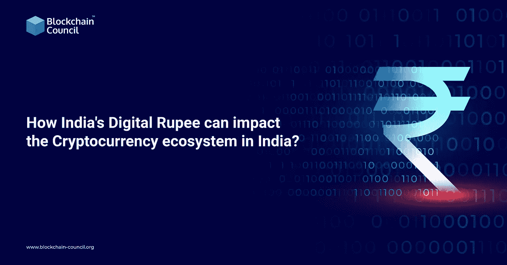

# 印度的数字卢比如何影响印度的加密货币生态系统？

> 原文：<https://medium.com/nerd-for-tech/how-indias-digital-rupee-can-impact-the-cryptocurrency-ecosystem-in-india-aa48e8375216?source=collection_archive---------4----------------------->

预计中央银行数字货币或 CBDC，即数字卢比，将于 2022 年或 2023 年实施。他是提出 2022 财年工会预算的人。据部长称，印度储备银行(RBI)将推出数字货币，这将依赖于区块链技术。即便如此，它也会与传统的 [**加密货币交易**](https://www.blockchain-council.org/certifications/certified-cryptocurrency-trader/) 不同，就像比特币或以太一样。这些主要是去中心化，据 [**加密货币专家**](https://www.blockchain-council.org/certifications/certified-cryptocurrency-expert/) 。

关注我们的媒体出版物，获取最新的区块链更新—[**https://medium.com/blockchaincouncil**](https://medium.com/blockchaincouncil)

62 岁的 Sitharaman 在她的预算报告中说，新的数字卢比将促进国家的经济增长。“巨大的推动”产生了“更有效和更经济的货币管理解决方案”

财政部长在她的讲话中没有就期待已久的央行数字货币给出进一步的细节。后来，她澄清说，新的数字卢比将在媒体会议上给予特殊待遇。这将不同于其他加密资产和**加密货币交易**。

# 这个数字卢比，或者说央行数字货币是什么？

印度央行数字货币(俗称 CBDC)将印度储备银行定义为一种由中央银行提供的虚拟形式的法定现金。简单来说，它是印度卢比的虚拟代表，卢比是一种纸币。因此，它可以用常规现金一换一。

# 即将到来的数字卢比有什么意义？

加密货币专家称，央行数字货币将拥有所有优势。它将和加密货币以及其他数字支付方式一样。首先，数字货币不会被撕裂、烧毁或受到物理伤害。他们也不会在身体上丢失。与纸质票据相比，虚拟现金的持续时间将是无限的。同时迁移到数字支付方式将具有明显的优势。由于交易将是数字化的，国家将在货币印刷上节省资金。付款将会很快，即使在最偏远的地方也可以支付。与加密货币相比，数字货币将提供另一个重要优势。它将由一个中央机构管理，减少比特币等其他虚拟货币的波动风险。它把我们带到了两者之间唯一的显著区别。

# 数字卢比与现在的比特币有何不同？

此前，人们不知道印度本土的虚拟货币会如何演变。最新的预算在这个问题上有所澄清。他们核实了该国对区块链和其他技术的利用情况。虽然以前认为比特币和数字卢比之间有区别，但目前这两者之间几乎没有区别。

根据定义，区块链技术是一个分散的机构。这意味着它的所有数据基本上都存在于一系列计算机中。据**密码审计员**称，它增加了数据对人类和网络攻击的弹性。这个网络将跨越其创造者的平台进行国际部署。主要针对比特币等加密货币。一种稍微不同的形式将会出现在数字卢比中。虚拟货币不会以分散的形式出现，因为它总是处于印度央行的监管之下。也就是说，一个实体控制其生产和流通。这与真正意义上的分权是完全对立的。

在新的数字卢比的情况下，“分散”一词仅适用于区块链技术。以及它的服务器系统。印度储备银行将被要求在未来建立这种联系。然而，它也将包括银行和其他与他们有联系的组织。

# 理解数字卢比及其对技术带来的威胁

根据**加密货币专家**的说法，数字卢比的技术生态可能是网络攻击的目标，就像当前的支付机制一样。此外，在金融知识贫乏的地方，虚拟支付相关欺诈的激增可能会蔓延到数字卢比。因此，与数字卢比互动的企业必须保持高度的网络安全措施和加密货币教育。同时强调金融知识。

该行业接受数字卢比的能力部分取决于技术准备。高速计算机和通信网络的改进非常重要。普通人存储和处理数字卢比的合适技术的可用性也是需要的。印度贫困地区对技术的接受度很低，这可能会限制数字卢比的普及。还会加剧金融产品和服务中现有的失衡。

# 结论

CBDCs 是未来每个央行武器库的组成部分。这需要细致的校准和巧妙的执行方法。与利益相关者的互动和概念阶段的关注对于创建 CBDC 至关重要。它具有重大的积极影响，同时带来最小的技术风险。建设 CBDC 的技术问题很难夸大，因为它们将影响国家 GDP 和金融监管。