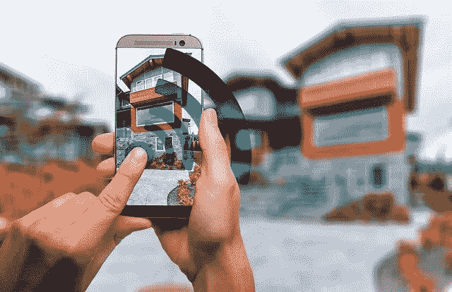
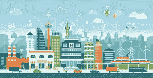
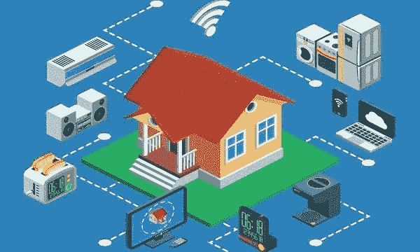
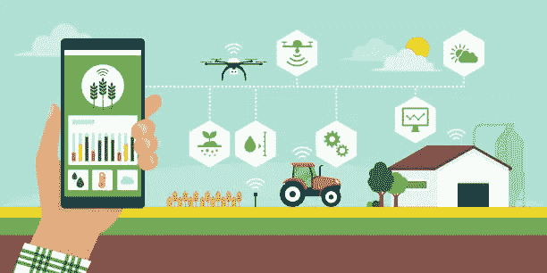
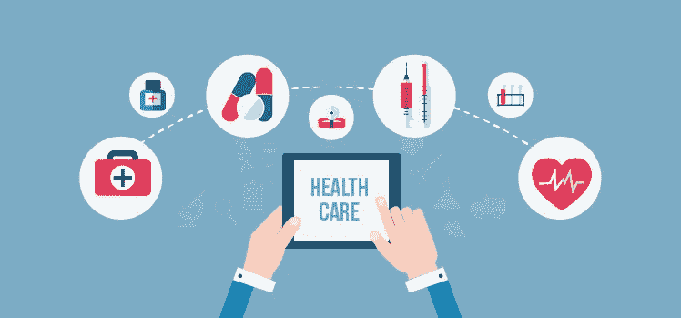

# 物联网如何改变我们的生活？

> 原文：<https://medium.com/nerd-for-tech/how-iot-is-changing-our-lives-94b173d4f030?source=collection_archive---------10----------------------->

# 介绍

在这场正在进行的第四次工业革命中，物联网正在深刻地改变我们的生活。物联网可能包括几乎任何东西，如智能手机、心脏监测器、牲畜追踪器。甚至是飞机的喷气发动机。物联网设备将对我们生活的几个方面产生重要影响。这些包括我们如何生活、驾驶、饲养动物和农作物。

物联网设备和传感器以及高级数据分析正在帮助我们减少世界上一些大城市的空气污染。同样，它改善了农业和我们的食物供应，甚至检测和包含致命的病毒。在本文中，我们将探讨物联网如何潜在地改变我们的生活。

# 描述

# 智能城市

城市是造成气候变化的最大因素。一些城市已经感受到海平面上升和日益严重的天气事件的影响。然而，城市同样是基于物联网系统的巨大孵化器。这些系统使城市生活更有吸引力。例如快速、便捷的交通系统、受保护的路灯和节能建筑。

随着全世界越来越多的人进入城市，对水和能源的需求将会增加。此外，将会有更高的需求，增加疾病爆发、污染、交通堵塞和犯罪的可能性。目前，大多数发达国家需要应对人口老龄化问题。政府可以通过在每栋建筑和每条道路上安装传感器来构建城市的 3D 虚拟表示，以对城市面临的日常挑战进行更深入的分析。

物联网技术可以支持各种挑战，包括:

*   调节照明
*   电梯
*   能量守恒
*   改进火灾预防或探测
*   [跟踪替代运输方式。](https://www.technologiesinindustry4.com/)

同样，通过管理用水、减少用电和产热，智能城市也更具可持续性，从而减少高达 15%的温室气体排放。

# 智能家居

虽然我们还没有到每个人都买得起智能家居的地步，但有一些组件可以让我们的日常生活变得轻松。智能电器，比如冰箱和洗衣机，可以在牛奶不够的时候给我们发短信，或者告诉我们衣服干了。一个智能建筑组织系统，如加热和冷却或窗帘，可能有助于节约能源和金钱。

# 智能农业

全世界的种植者都在使用物联网来减少水和肥料的消耗。他们试图减少浪费，提高产品的质量或产量。例子；

*   [跟踪农田周围的小气候](https://www.technologiesinindustry4.com/)
*   持续监控温度变化和湿度水平。
*   易腐商品从田间转移到仓库保存，以延长其保质期，消除浪费。

农作物的种植会受到两个因素的危险影响。气候变化增加了干旱的频率和严重性。让有害昆虫得以繁衍。婴儿潮一代农民的退休和替代工人数量的不足将导致农场人手不足。农民可以通过确定灌溉、施肥或收获的最佳时间来减少水和肥料的浪费。大数据同样可以根据过去的天气模式提供本地化的天气预报。这将有助于农民做出更好的决策。

# 医疗保健转型

[物联网可能会通过以下方式改变医疗保健行业:](https://www.technologiesinindustry4.com/)

*   支持医生更快地访问患者数据。
*   可穿戴、联网的传感器设备。
*   它能精确跟踪病人的心率、脉搏甚至血压。
*   可穿戴设备是医疗保健领域最重要的物联网应用。

物联网技术同样帮助医生和其他医疗专业人员监控独立生活的患者的健康状况。如果病人忘记吃药或没有在设定的时间离开卧室，传感器和机器人助手可以提醒护理人员。[科学家们甚至设计了可穿戴的血糖监测器来帮助糖尿病患者。](https://www.technologiesinindustry4.com/)

# 运输

联网自动驾驶汽车(CAV)和自动驾驶电动汽车(AEV)可以通过实时交通管理来帮助减少交通拥堵。从而减少驾驶中的人为错误。此外，CAV 可以为老年人和残疾人提供更多的机动性。同时，这将有助于减少碳排放。

当每一栋建筑和设备都变得相关联时，在基础设施上添加联网的无人驾驶汽车不仅可行，而且明智。CAV 和 AEV 的系统设计将包括场级智能基础设施。例如，路边单元、激光雷达和雷达传感器。不受天气影响的现场传感器将收集行人和骑自行车者的数据。路边单元管理车辆和基础设施之间近乎实时的信息交换。后端软件会；

*   [控制微服务](https://www.technologiesinindustry4.com/)
*   将骑士整合到云中
*   机器学习分析将识别潜在风险
*   像行人和骑自行车的人一样提醒汽车
*   通过基于云的微服务管理乘客需求，创造最佳交通条件。

这样，CAV 和 AEV 将提高交通安全，为更多人提供机动性，同时减少排放。

更多详情请访问:[https://www . technologiesinindustry 4 . com/2021/12/how-IOT-is-changing-our-lifes . html](https://www.technologiesinindustry4.com/2021/12/how-iot-is-changing-our-lives.html)