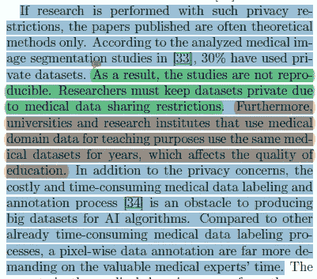
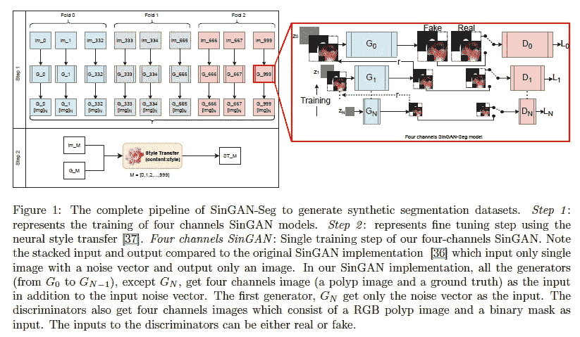
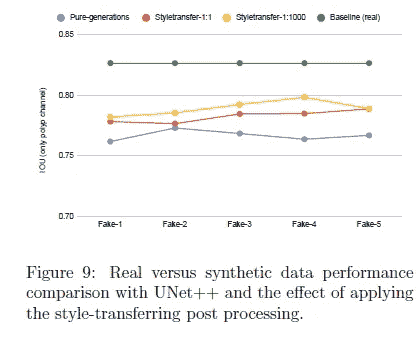
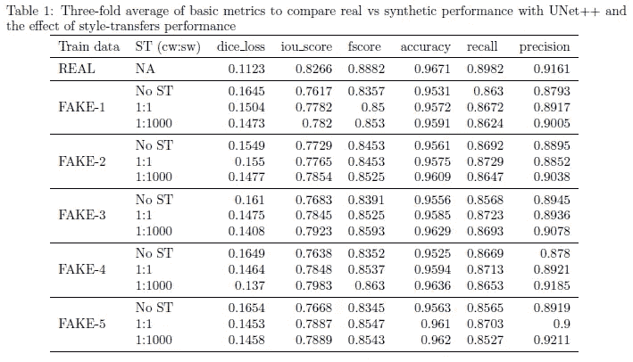

# SinGAN-Seg 是如何解决医学机器学习的数据问题的？

> 原文：<https://medium.com/nerd-for-tech/how-is-singan-seg-solving-the-medical-machine-learnings-data-problem-26c10e1ecbcc?source=collection_archive---------5----------------------->

## 一个创新的方法+令人鼓舞的结果使这篇论文有价值

医疗机器学习在可重复性和数据方面存在严重问题。

1.  由于不同的数据法规，跨境数据共享可能会很困难。当涉及到他们研究的可重复性时，这会导致很多问题。要阅读关于复制危机的更多信息，请查看这篇文章，它解释了这个问题以及如何解决这个问题。
2.  更具体到医学机器学习，数据集本身往往很小。创建更大的数据集需要投入大量的专家时间。这是因为，与普通人可以注释的普通图像数据集不同，医学数据集只能由专家注释。

这正是“ [SinGAN-Seg:用于医学图像分割的合成训练数据生成](https://arxiv.org/abs/2107.00471)”的作者着手解决的问题。他们的目标是创建一个数据生成架构，可以从单个输入生成多个图像。并且使这些生成的图像在图像分割任务中有用。他们为什么追求这些目标？他们是如何试图做到这一点的？这次尝试成功了吗？我将在这篇文章中讨论所有这些以及更多内容。和往常一样，带注释的论文在本文的末尾，以防你想了解我对这篇论文的更多见解。

# 为什么使用假图像？

这可能对你来说很特别。现在世界上有超过 70 亿人口。当然，我们可以通过使用现实生活中的图像产生足够的数据。我们研究自动贴标/标记解决方案不是更好吗？随着所有计算机视觉工作进入这一领域，想要专注于它并不是不合理的。

然而，这忽略了一个重要的事实。到目前为止，还没有关于在研究中共享医疗数据的标准化政策。这意味着在挪威的团队可能无法与在印度的团队共享他们使用的医疗数据(特别是如果它包含挪威公民的医疗数据)。如前所述，复制危机是一个非常现实的问题。如果我们使用合成图像，没有这样的规定阻止我们。这使得数据可以共享，研究可以重现。

作者讨论挑战

还有一点需要注意的是，“真实”数据不一定比合成数据好。可能很难获得体内息肉的高质量图像。虽然当数据集较小时，低质量的图像对于以后改进模型至关重要，但这只会损害模型的性能。由于数据集大小是该领域的一个问题，因此研究不同的数据扩充策略是明智的。事实证明，在机器学习的多个领域，这是一个投资回报率很高的领域。

# 实验过程

用作者的话说，“在辛甘-赛格的流水线中，如图 1 所示有两个主要步骤:(1)训练新的辛甘-赛格生成模型和(2)风格转换”下面是该架构的外观:

第一步相对简单。基于 SinGAN 架构，我们生成了大量图像(在这个例子中是息肉)。SinGAN-Seg 中的调整来自额外的输入(一个基本事实掩码)。这使得输入(和输出)为 4 个通道(RGB+地面真实),而不是原始 SinGAN 架构中通常的 3 个通道(RGB)。用论文的话说，“*这个修改的主要目的是生成四通道合成输出，它由一个合成图像和相应的地面真实遮罩*组成。”真正让我感到创新的是第二步。

神经类型转移

神经类型转移是我还没有完全忘记的概念之一。你可以把一张图片的内容和另一张图片的风格结合起来。我将在我的 YouTube 上讨论这个概念，[，所以请务必在这里订阅以保持更新](https://www.youtube.com/channel/UC1JX4z0BxxNDzniJe1skzTQ?view_as=subscriber)。这种看似神奇的现象与我们的案例有什么关系？

这篇论文的作者做了一些天才的事情。为了模仿现实生活中的数据将要产生的图像，他们使用了 style transfer to ***将真实图像的样式转移到生成的图像上。*** 这才叫高明。这意味着我们拥有看起来和感觉上都像真实生活数据的合成图像。想更全面地了解这个非常酷的系统，请看下面的视频。它更详细地介绍了这些步骤(包括作者引用的一段很酷的话)。它也进入了其他人可能能够在他们自己的机器学习项目中应用它的一些方式。

表现出一些爱。请务必留下您的反馈

# 估价

看我作品的人都是很实际的人，总是在寻找结果。不要担心，因为作者提供了大量的结果。让我会心一笑的一件事是他们在各种评估中的严格程度。他们确保展示他们的合成数据如何与真实数据进行对比，以及合成数据是否是较小数据集的有效数据扩充。除此之外，我们看到团队使用了各种度量标准。*最后，使用验证倍数计算骰子损失、IOU 分数、F 分数、准确度、召回率和精确度进行比较。*“看到了吧。他们用**交叉验证！！**

这是他们进行的第一组实验的结果。这里，我们采用 4 个不同的数据集，并评估它们的架构。绿色是基线(仅真实图像)。然后我们有两种风格转移的合成图像(黄色和红色)，最后是纯合成图像(蓝色)。我们看到两件有趣的事情:1) Real 优于一切，2) Styletransfer 与纯代相比在性能上有优势。真实和风格转换之间的表现也没有太大的差异。要更全面地了解各种数据集的性能，请查看下表:

当我们看跨指标的数字时，我们看到了相近的表现

这给了我们一个相当有趣的结果。我们看到，当我们可能对真实数据有任何数据共享限制时，合成图像(尤其是风格转换图像)甚至可以用作替代方法。*根据表 1 所示的结果，与使用合成数据作为训练数据相比，当使用真实数据作为训练数据时，UNet++分段网络表现更好。然而，作为训练数据的真实数据和合成数据之间的小性能差距意味着从 SinGAN-Seg 生成的合成数据可以用作共享分割数据的替代方案，而不是真实数据集，真实数据集的共享受到限制。”这是论文作者的一句话。结果很难反驳。*

但是还有另外一个原因。合成数据可以作为小型数据集的良好数据扩充吗？根据作者的说法，“*这项研究表明，从一个小的真实数据集生成的这些合成数据可以提高分割机器学习模型的性能。例如，当真实息肉数据集大小为 5 来训练我们的 UNnet++模型时，具有 50 个样本的合成数据集显示出比使用真实数据样本的 IOU 分数提高了 30%。*“我们清楚地看到，对于非常小的数据集，这是提高分段任务性能的一个很好的方法。

# 关闭

这篇论文非常激动人心。我印象最深的是样式转换的使用，以及我们如何从单个输入生成无限的样本。这在未来肯定有很大的发展空间。我可以看到，随着数据共享政策变得标准化，以及我们将更多的政策集成到增强中，这将变得非常强大。

现在，我们可以在注释上投入最少的专家时间就能获得很好的性能，这是一个巨大的优势。

# 纸

# 向我伸出手

如果这篇文章让你对联系我感兴趣，那么这一部分就是为你准备的。你可以在任何平台上联系我，或者查看我的其他内容。如果你想讨论家教，发短信给我。我帮助人们进行机器学习、人工智能、数学、计算机科学和编码面试。

如果你想支持我的工作，使用我的免费罗宾汉推荐链接。我们都有免费的股票，对你没有风险。所以不使用它只是失去了免费的钱。

查看我在 Medium 上的其他文章。:[https://rb.gy/zn1aiu](https://machine-learning-made-simple.medium.com/)

我的 YouTube:【https://rb.gy/88iwdd 

在 LinkedIn 上联系我。我们来连线:【https://rb.gy/m5ok2y】T4

我的 insta gram:[https://rb.gy/gmvuy9](https://rb.gy/gmvuy9)

我的推特:[https://twitter.com/Machine01776819](https://twitter.com/Machine01776819)

我的子任务:[https://devanshacc.substack.com/](https://devanshacc.substack.com/)

twitch 现场对话:[https://rb.gy/zlhk9y](https://rb.gy/zlhk9y)

获得罗宾汉的免费股票:[https://join.robinhood.com/fnud75](https://join.robinhood.com/fnud75)