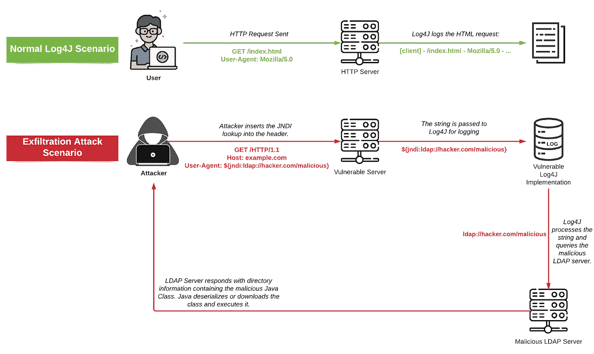
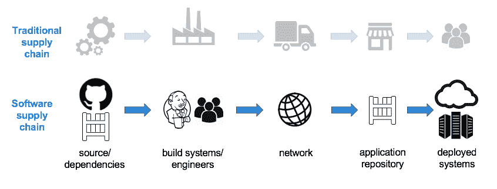

# SBOMs 如何防止类似 Log4j 的攻击

> 原文：<https://medium.com/nerd-for-tech/how-sboms-could-prevent-attacks-like-log4j-a9f83122fd3b?source=collection_archive---------5----------------------->

当今的大多数软件包都包含大量第三方组件。因此，企业必须主动监控和管理这些包，以维护它们的安全性和功能。

为了跟踪这些组件，软件工程师通常使用软件材料清单(SBOM)。一个软件的许多依赖项和元素都列在这个机器可读的列表中。

# 软件材料清单

如今，大多数软件都是由专有的和开源的第三方软件组件组成的复杂混合体。当处理大量零件时，保留所有零件及其来源的运行列表至关重要。如果不这样做，您将很难监控您正在使用的组件，这可能会导致使用过时或危险的代码。

SBOM 是用来创建软件的数据集合。基本信息包括许可信息、版本号、组件数据和供应商。所有事实的书面总结减少了制造者和使用者的危险。

# Log4j 是什么？

Apache 日志服务包括 Log4j，这是一个基于 Java 的日志程序。Log4j 是众多 Java 日志框架中的一个，被互联网上数百万 Java 应用程序广泛使用。它跟踪故障和常规系统程序等事件，并向系统管理员和用户发出诊断警报。它是来自 [Apache 软件基金会](https://apache.org/)的开源软件。

当点击一个糟糕的 web 链接时，会出现 404 错误消息，这就是 Log4j 工作的一个例子。这意味着，根据您试图访问的 web 链接所在的 web 服务器，没有这样的网页。Log4j 还用于为服务器的系统管理员记录事件。

[Log4Shell](https://nakedsecurity.sophos.com/2021/12/13/log4shell-explained-how-it-works-why-you-need-to-know-and-how-to-fix-it/) 是由 Log4j 引起的，这是一个晦涩但却无处不在的软件，是数百万台个人电脑的一部分。该应用程序用于跟踪各种计算机系统中发生在幕后的各种操作。

# Log4Shell 漏洞

Log4Shell 使用 Log4j 特性，该特性允许用户为日志消息格式定义定制代码。这个特性允许 Log4j 不仅记录与每个服务器登录尝试相关联的用户名，如果一个单独的服务器保存了连接用户名和实际姓名的目录，还可以记录这个人的实际姓名。为此，Log4j 服务器必须与保存真实名称的服务器进行通信。

另一方面，这段代码可能不仅仅用于格式化日志消息。Log4j 可以使用来自第三方服务器的软件代码进行更新，这些软件代码可以在目标 PC 上执行许多操作。这使得黑客能够窃取关键信息，控制目标系统，并向与易受攻击网站通信的其他用户传播恶意代码。

[来源](https://www.prplbx.com/resources/blog/log4j/)

# 威胁

黑客正在寻找不安全的服务器，并配置设备在整个互联网上传播有害的有效载荷。他们的目标是通过查询 web 服务器等服务来产生日志消息，从而实施类似 404 错误的攻击。Log4j 将查询视为指令，因为它包含恶意准备的内容。

这些指令可以生成反向外壳，允许攻击者服务器远程控制目标服务器，或者使目标服务器成为僵尸网络成员。僵尸网络是一组被入侵的系统，它们协同工作，代表黑客执行协调一致的行动。

大量黑客已经在滥用 Log4Shell。从加密《我的世界》服务器的勒索软件团伙到比特币挖矿黑客组织，再到试图从地缘政治对手那里获取关键信息的与中国和朝鲜有关的黑客，不一而足。比利时国防部表示，Log4Shell 正被用于攻击其系统。

尽管该漏洞最初于 2021 年 12 月 10 日公之于众，但人们仍在不断寻找新的方法来利用它。

# SBOMs 如何防止 Log4j 攻击？

很难确定 Log4j 是否正在某个软件系统中使用，因为它通常与其他程序捆绑在一起。因此，系统管理员必须清点他们的软件以查看它是否存在。如果一个人不知道自己有问题，他们要根除这种易感性要困难得多。

[来源](https://www.docker.com/blog/securing-enterprise-software-supply-chain-using-docker/)

Log4Shell 包含在软件供应链中。软件和实物一样，在打包成最终产品之前要经过几个组织和软件包。当出现问题时，这些软件通常会被“打补丁”——在适当的位置进行修正。

SBOM 是技术系统的成分列表，当发现新的缺陷时，公司可以对其进行检查。这使他们能够确定是否有需要修补的易受攻击的软件。许多主要的联邦网络机构都在强调这一思维过程。

这不是一个新的思维过程。然而，在 Log4j 崩溃之后，它正在获得牵引力，这导致政府当局和企业高管与大量非常有害的缺陷进行斗争，这些缺陷可能隐藏在遍布数字生态系统的软件中。

SBOMs 可能加快了 Log4j 清理过程。它们特别适合解决 Log4j 提出的最严重的问题之一——一些易受攻击的开源软件非常常见，并且深深埋藏在公司的数字系统中，以至于他们的 IT 和网络员工都没有意识到它们的存在。

国土安全部网络安全和基础设施安全局(CISA)的高级顾问 Allan Friedman 说:“Log4j 让人们明白，如果我们今天有 SBOMs，这将容易得多。它帮助人们认识到，这是一种真正的、可以用金钱来量化的东西。”

# 摘要

你可能在问作为一个用户，你能对 Log4j 做些什么。不幸的是，很难确定一个软件包是否利用了 Log4j，以及它是否使用了该程序的易受攻击版本。然而，你可以通过记住计算机安全专家的建议来保持安全:确保你所有的软件在 SBOM 是最新的，并采取其他预防措施。