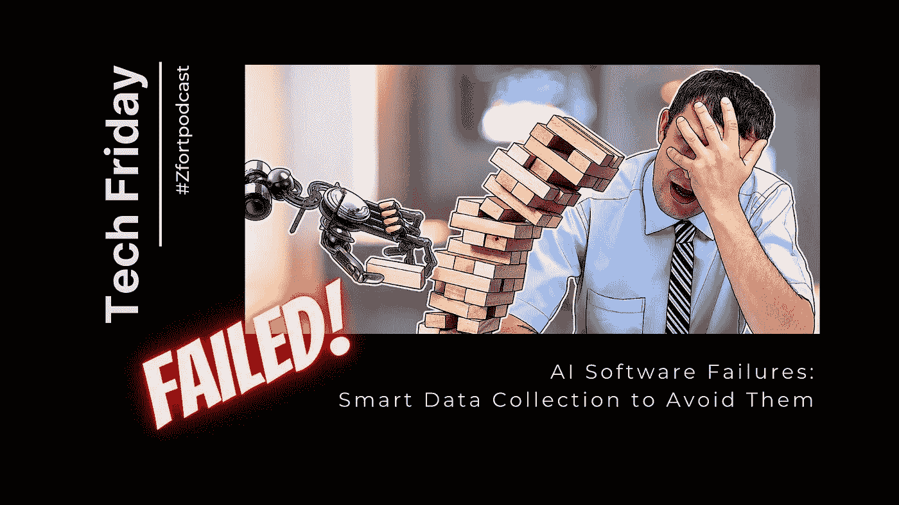

# 如何通过智能数据收集避免人工智能失败

> 原文：<https://medium.com/nerd-for-tech/how-to-avoid-ai-failure-with-smart-data-collection-452d1cb77390?source=collection_archive---------19----------------------->

传统上，任何软件都是基于程序员设计的算法，旨在执行特定的功能。但在人工智能软件的情况下，我们面临着做出不可预测的决定。

飞利浦全球软件标准负责人帕特·贝尔德(Pat Baird)表示:“对于这些机器学习系统，程序员不会告诉软件如何解决问题”。在人工智能编程的特殊情况下，开发的结果是软件能够在数据中找到模式。事实是，程序员不知道软件做出某个决定的原因，他只是拼凑了一个计算一大堆东西的引擎。

人工智能软件避免潜在问题的指南应该从“确保在所有事情之前获得良好的数据”这样的话开始。正如帕特·贝尔德对传统软件所说的那样，

*“是垃圾进，垃圾出。但接下来会发生的是，你的数据中有垃圾，由于你不知道软件是如何工作的，这将是一个问题。”*

那么，我们在使用 AI apps 时面临的常见问题有哪些？Pad 给出了几个真实的例子，说明收集不当的数据会导致不真实的结果。

**例子一——“糟糕的数据开始”**
它展示了可穿戴设备无法识别旅行模式，而追踪器显示在一次吉普车越野探险后行走了 20，000 多步。“这是因为所有的坑坑洼洼，以及我在吉普车里被扔了多少次，”贝尔德说。

**示例二—“过度拟合”**
这里我们讨论的是也会导致不准确的过多数据集。从大量的有效数据和值中，程序选择对我们来说不是目标的模式进行分析和训练。一个很好的例子是图像识别软件，其目标是确定阿拉斯加哈士奇狗和狼之间的区别。Baird 是这样评论的:“数据表现良好，但它是根据背景线索，而不是程序员想要的线索提取的。实际情况是，人们的狗的大多数照片是在夏天或秋天的某个时候在他们的后院拍摄的，而狼的照片是在冬天野外拍摄的。这个软件看起来很棒，可以检测出阿拉斯加哈士奇和狼的区别，但实际上是在检测地面上是否有雪。”

**示例三—“拟合不足”**
另一个问题是由于收集的数据不足而出现的。这么简单的理由，对吧..？通常，它最终会基于噪音而不是真实的东西做出决定。

**自主水平—需要思考的问题** 另一个问题出现在我们准备给予技术的责任分担上。它应该有什么样的自主水平？仅仅给你正确的驾驶方向就足够了吗，或者我们需要一辆自动驾驶汽车来真正为我们驾驶？
好消息是，大多数从事数据收集的公司已经找到了更好的质量控制方法。但是，我们能在开发一个优秀的人工智能系统时消除错误吗？我们应该如何处理它？

**那么，我们如何避免人工智能开发中的失败呢？**

以下是非常基本的原则:

1.  收集相关的和经过核实的数据
2.  收集足够的数据
3.  确保数据是多样化的
4.  仔细考虑这些数据是否证明我们赋予人工智能的力量是正确的

幸运的是，领先公司的技术开发和实施提供了一个从他人的错误中学习并创造“更清洁”技术的机会。

*也可用音频格式* [*此处*](https://www.buzzsprout.com/965905/8435552) *。*

*由* [*Zfort 集团*](https://www.zfort.com/) *创建。*