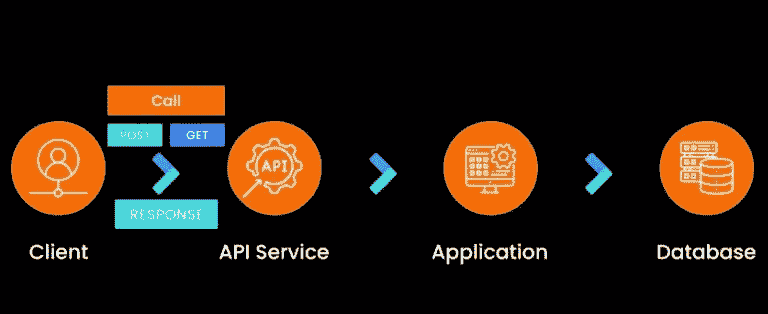
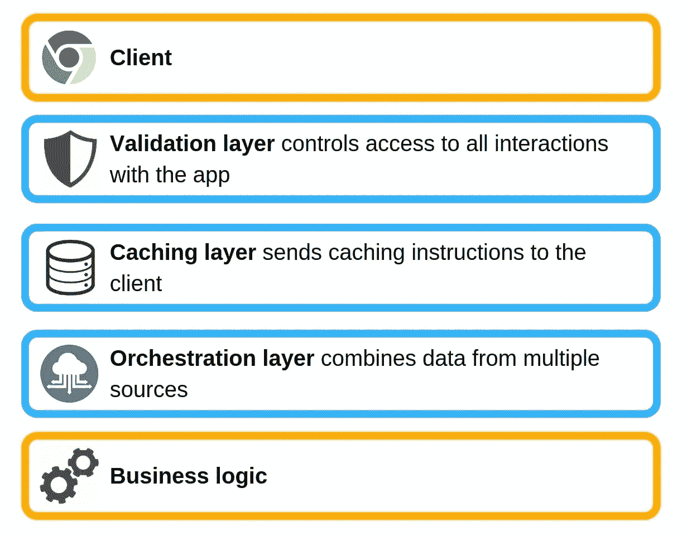

# 如何构建 API:完整指南

> 原文：<https://medium.com/nerd-for-tech/how-to-build-an-api-a-complete-guide-13a7bda6fcdb?source=collection_archive---------0----------------------->

## 关于 API 开发的全面指南，包括其类型、工具、特性、API 如何工作以及最佳实践。

你是技术极客还是在技术世界工作的人？如果是的话，那么我们确信你可能在很多情况下听说过“API”这个术语。如果我们必须非常精确地定义 API 及其重要性，那么它的存在几乎无处不在——从订票到付款。因此，它在商界有着非常突出的地位。我们将在本帖中涵盖所有这些以及更多内容。

> ***什么是 API？***

[应用编程接口](https://aws.amazon.com/what-is/api/)软件是一组指令或标准，使软件或应用程序能够无缝地相互通信，并允许最终用户在使用时获得更好的服务。

举个例子，有很多时候，你想玩一个特定的游戏，然后你被要求连接到一个社交媒体账户。当你这样做的时候，你就不用手动修改了。数据访问直接从社交媒体帐户完成，然后您可以访问游戏并开始玩游戏。

所以你现在可以对这个软件有一个基本的概念了。它消除了从头构建程序或平台的依赖性。一个平台足以处理这项任务，因为数据共享是通过该应用程序与其他应用程序共享的，从而简化了整体用户体验。

> ***是什么让 API 脱颖而出？其独特的功能***

**授权**
授权动作允许识别特定用户是否被允许在源上执行特定动作。

**分页**
分页或简而言之，分页是一个过程，通过它您可以确定要执行的数据显示的百分比以及显示的频率。

**错误处理**

**验证**
这允许验证数据的正确性。基本上有两种类型-服务器端和客户端，在前者中，它考虑识别存在的属性的种类，以及属性的要求是否重要，而在后者中，在提示的基础上提供反馈，给出错误条目的细节。

> ***不同的 API 类型***

*   其他用户可以使用开放或公共 API。借助这些工具，外部用户可以轻松访问不同的数据和服务。这是因为软件是开源的。
*   **内部或私有 API** 帮助内部用户只能访问数据。例如，这可能包括公司的员工。
*   **复合 API** 是不同数据和服务的组合，用于增强和加速 web 界面内的执行过程。
*   **不向公众公开的合作伙伴 API** 。它严格要求开发者获得特定的权限和许可，因此访问变得轻而易举。

> ***与 API 开发相关的术语***

在进行 API 开发之前，请确保了解以下术语。

*   **API Key** 用于认证用户、开发者或调用程序的身份。
*   **端点**充当服务器和 API 之间的交互接触点。
*   **JSON** 用于执行数据交换。
*   **POST** 用于将数据发送到 API 服务器，以便资源更新和创建它们是一项简单的任务。
*   **API 节流**API 使用在预定义的时间段内得到控制。

> ***API 开发工具***

说到 API 开发，有很多工具可用。以下是开发人员用于 API 开发的工具。

*   除了使互联应用程序的开发成为一项无缝任务之外，还用于自动化应用程序和服务之间的数据传输。
*   **Dredd** 用于在后端验证 API 描述，了解其对于使用目的是否有效。
*   **APIMatic** 用于生成 SDK 和软件中不同更新的剩余更新。
*   **沙箱**用于降低与集成第三方 API 相关的风险和成本。
*   **Postman** 用于评估 API 性能和自动化。
*   **SoapUI** 用于自动化功能和非功能测试的执行方式。
*   **以 API 开发为目的的招摇**。PayPal，Apigee，微软用的是 Swagger。
*   **Jmeter** 用于 RESTful API 的性能测试任务。

> ***API 操作***

看一下下图，观察 API 的功能。

图片来源:semidotinfotech.com

在上图中，你可以看到 API 的工作方式。看看这方面的详细解释，让你更容易理解。

*   客户端发送响应，发布响应，或者将响应转发给 API。
*   API 然后把它们转移到应用程序中。
*   然后，数据库执行这些操作。

因此，总而言之，它的操作非常简单，让用户在与应用程序交互时，可以轻松地进行交流，并轻松地执行操作。

> ***API 开发过程中需要遵循的步骤***

**拥有工具知识**

确保你知道一套合适的工具，可以让你沉浸在这个旅程中。

1.  Postman 供开发人员运行、测试和分析整体 API 性能。
2.  AuthO 对您使用的 API 进行授权和认证。
3.  API-灵活执行 web API 开发的平台。
4.  API 科学确定了 API 的内部和外部性能。
5.  代码管理 GitHub。
6.  APIMatic 和 API Transformer 将代码和软件开发工具包转换成首选格式。

**检查要添加的功能**

当您开始 API 开发之旅时，这些特性是您的 API 中的必备特性。

*   修改时间戳，允许用户根据时间和日期等规范无缝搜索数据。
*   为用户排序，以接收他们正在搜索的不同页面，以便用户可以方便地对数据进行排序。
*   OAuth 授权使授权成为一个简单的过程。
*   RESTful 操作确保创建有效的 API 框架，允许您在失败时执行上传任务。

**关注用户**

除了了解功能和操作，关注用户也很重要。这意味着你需要问以下问题。

*   谁将从您的 API 中受益？
*   用户对 API 的最终需求是什么？
*   你如何创建一个能为 API 创造奇迹的 API 呢？

一旦你有了所有这些问题的答案，你将能够得到你的 API 的一个线框，并分别使它功能完整和健壮。

> ***如何设计开发 API？***

以下是您在开始 API 开发之旅时需要遵循的步骤。

**在设计阶段**

确保你的设计符合五个方面。它们包括可用性、可靠性、可伸缩性、可测试性和安全性。

因此，将设计分成几层。查看下图，以更好地掌握这些图层。

图片来源:mindk.com

如上图所示，设计需要分成三层，即验证、缓存和编排。第一个控制对应用程序的所有交互的访问。第二个将与缓存相关的指令发送给客户端，最后一个将来自多个来源的数据组合起来，以一种相当简化的方式实现业务逻辑。

完成这项任务后，请确保符合安全标准。因此，合并 API 密钥和 OpenID 以无缝进行身份验证，并防止堆栈跟踪泄漏、不正确的身份验证等事件。

完成这个阶段后，你就可以进入开发阶段了。

**在开发阶段**

在 API 开发过程中遵循这些步骤，允许它以一种相当健壮的方式运行，并避免面临任何崩溃。

*   使客户的响应标准化，以标准方式处理相同的响应。这可以通过定义响应来完成。
*   在响应消息中描述错误，以处理不同的异常并返回正确的 HTTP 状态代码，这样错误消息就得到标准化，任何敏感信息都不会被暴露。
*   通过指定它接收的请求类型、它提供的响应等来构建 API 端点。
*   实现分页以减少响应时间，并保护 API 免受任何潜在的 DDoS 攻击。
*   是否对 API 进行了评估，以检查其性能，是否运行得很快？这可以通过插入一个关于代码使用或性能分析的语句来实现，比如 PHP 的 PHP profilers，或者 Node.js 的 Clinic.js
*   执行缓存来检查数据请求是否被精确地处理。
*   编写文档让其他开发人员方便地使用。
*   如果 API 是公共的，添加版本控制，这样用户就可以在不同的任务中使用不同的版本。
*   使用节流来处理 API 中突然增加的流量，并防止 DDoS 攻击事件。

**测试阶段**

一旦你设计和开发了 API，你需要测试它。我们建议您执行内部和外部测试。

这些是你可以用来确定你创建的 API 是最高质量的一些方法。

*   如果数据给出现实的结果。
*   如果独立运作是可能的。
*   如果它能处理高流量、用户高峰等。
*   如果它能成功模拟错误

当所有这些步骤都很容易实现时，你可以确信你的 API 将会给你的最终用户带来最好的价值，也给企业带来最好的结果。

同样重要的是，要知道那些承诺简化 API 开发的最佳实践。

> ***API 开发的最佳实践***

以下是业内公认的实践，有望简化您的 API 开发之旅。

*   用于重定向流量溢出、API 备份等的节流。
*   通过执行函数 custom HTTP Header X-HTTP-Method-Override，获取 RESTful API 来覆盖 HTTP。
*   通过向开发专家提供重要的资源，从而加快服务开发和实现的速度。
*   创建广泛的文档，以确保开发人员了解如何执行不同的流程来提供一流的用户体验。
*   使用基于令牌的身份验证来增加 API 的安全性。

## 包扎

API 从两个主要角度观察到了它的重要性。一是从软件开发的角度，二是从业务协作的角度。请注意，API 还提供无条件的支持，以提高企业的盈利能力。怎么会？通过提供所需的技术连接。通过阅读这篇文章，希望您对什么是 API、API 如何工作以及如何构建一个成功的 API 有一个大致的了解。