# 如何对没有标记的数据进行分类

> 原文：<https://medium.com/nerd-for-tech/how-to-classify-data-without-markup-64746a4c66e1?source=collection_archive---------6----------------------->

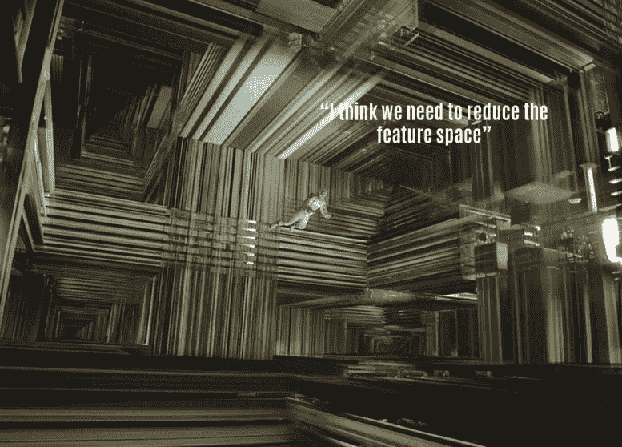

“我认为我们需要减少特征空间”

用户每天上传大约 100 万条内容到应用程序，不仅包括迷因，还包括种族主义、暴力、色情和其他不合适的内容。

以前，我们手动检查所有这些，但现在我们正在开发基于卷积神经网络的自动调节。我们已经训练该系统将内容分为三类:它识别哪些内容可以包含在用户提要中，哪些内容需要删除，以及哪些内容对共享提要隐藏。为了使算法更加准确，我们决定添加一个规范来删除以前没有这种标记的内容。

我将借助于一个说明性的例子向你展示我们是如何做的。本帖面向熟悉 Python 的人(不一定是数据科学和机器学习的标配)。

# 无标记分类

**任务:**实现对象分类。

**初始数据和条件:**大量没有标记或任何细节的数据。

**解决方案:**首先，我们将上传数据并进行初步分析:

我们有一个大小如下的数据集:(1，797，64)。这是一个相对较小的数据集，不到 2000 个；然而，如果我们有一个代表性的样本来反映所考虑的整个集合的特征，这可能就足够了。在这种情况下，每个对象有 64 个特征，如果它们都是二进制的(如果它们的值是 0 或 1)，我们需要 2⁶⁴例子来涵盖所有可能的选项。对于从三个或更多可能值中取一的零件，总样本量甚至更重要。只有少数特征携带了真实生活中物体的基本信息，而且它们从可允许的集合中获取的值要少得多。

首先，让我们在屏幕上显示几行:

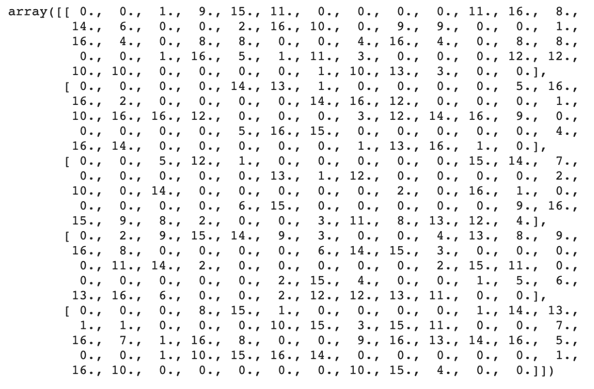

有时，在没有额外聚合的情况下分析原始数据是有帮助的。在这个例子中，我们可以看到数组是以 float 格式保存的，但是我们没有看到单个元素在句点后带有数字，好像它们都是整数一样。

在处理任何数据之前，您应该查看不同要素(列)的统计数据。让我们看看几个随机的专栏。我们将从第 30 列到第 35 列，使用熊猫图书馆显示统计数据。

“描述”方法允许您从下表中查看一组最常用的统计数据。特性的值以零为中心分组，以平均值表示。对于样本中的所有对象，还有一些特征的值为零，因此它们不提供信息，可以从进一步的分析中排除。

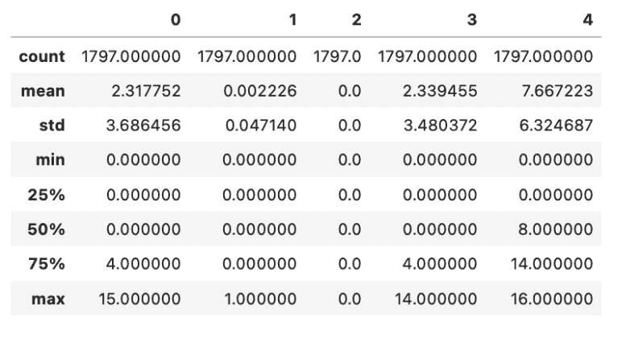

分析数据的方法有很多种，其中很多都与图形表示有关。数据科学家喜欢使用成对相关图。它们允许您检测特征之间的关系，这会导致特征空间的减少。此外，我们可以使用它们来找到特性和目标(期望值)之间的关联，但是我们没有标记，所以这个场景对我们来说是不可行的。

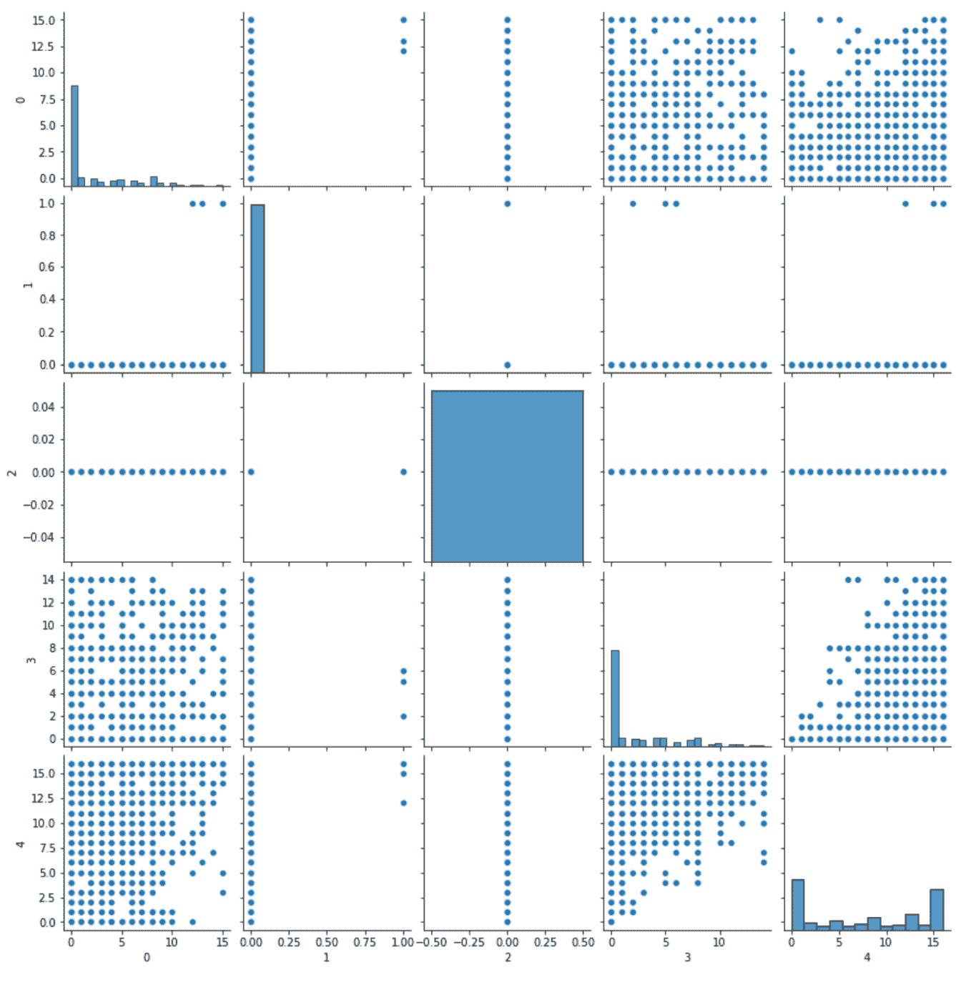

在我们的例子中，我们只能看到所有的特性都取整数值。成对相关的缺乏并不排除大量片段之间同时存在关系。但是不可能看到这样的数据特征，因为我们有一个 64 维的特征空间。即使存在对象被分组的区域，通过任何图形方法检测这一点也将是极其困难或不可能的。

在这种情况下，我们需要减少特征空间的维度，并以二维或三维的形式显示出来，这样我们的意识就可以应付了。

# 降维

首先，让我们去掉不变的特征。我们已经揭示了所有对象的值为 0 的特征的存在，所以我们平静地将它们从整个样本中移除。我们的目标是分离实体，这意味着主要信息将用于区分它们。

有许多方法可以降低特征空间的维数，同时保持其信息量。我们将在这篇文章中使用 UMap 算法，因为我们已经在任务中使用了它。与其他非线性降维算法相比，它的优势之一是在单个数据集上训练模型，然后使用相同的转换将它用于新数据。

为此，我们使用一个现成的[库](https://umap-learn.readthedocs.io/en/latest/index.html)。这里最重要的参数是您希望作为输出的一部分获得的组件数量(压缩当前特征空间所需的维度)。我们选择两个是因为 2D 平面可以在图表中直观地显示出来:

接下来，我们使用“fit”命令执行训练。我们没有很多数据，所以我们在整个集合上训练模型，但如前所述，它可能比最终的少:

然后，我们转换所有数据:

结果我们得到一个降维，其中样本数相同，但只有两个特征:(1797，2)。

让我们简单地告诉你[这是如何工作的](https://ru.wikipedia.org/wiki/UMAP) : UMap 通过连接 n 维空间中最近邻居的边来建立一个加权图，然后在低维区域创建另一个图表，并使其更接近原始图表，以保持对象的相对位置。它使相近的事物彼此更接近，而遥远的物体彼此之间将保持更远的距离，所有这些都在降低维度。

让我们画出由此产生的 2D 向量:

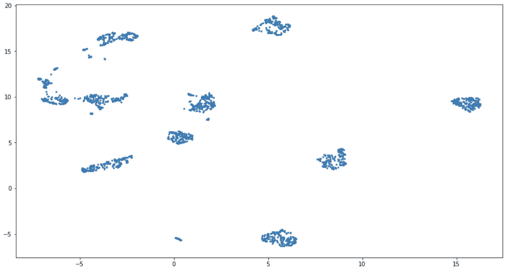

该图显示了十大组点和几个较小的点。接下来，我们将执行聚类，也就是说，我们将根据一个参数或规则将空间分成多个区域。

# 使聚集

让我们使用 [k-mean 算法](https://ru.wikipedia.org/wiki/%D0%9C%D0%B5%D1%82%D0%BE%D0%B4_k-%D1%81%D1%80%D0%B5%D0%B4%D0%BD%D0%B8%D1%85) (KMeans)，它基于最小化聚类点与这些聚类中心的总二次偏差。

让我们设置对 10 个分类的搜索(在上图中有 10 个分类)，对最后的类进行训练和预测:

让我们用聚类给图片着色，因为算法将它们很好地分开了:

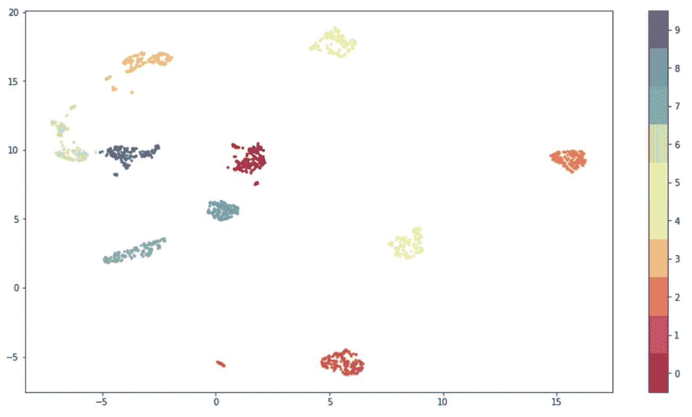

得到的聚类序列号可以被认为是未标记样本的类别。要对新数据进行分类，您需要依次对它们应用预先训练好的 UMap 和 KMeans 算法，并获得这些对象的分类编号。

现在我要揭示一个小秘密:它不仅仅是数据。

# 输入数据

在我们的训练示例中，数据是带有手写数字的 8×8 像素图像。如果所有像素的亮度值在一行中从左到右从上到下排列，我们得到一个长度为 64 的向量——正好是我们之前处理过的向量。像素强度是以 uint8 格式指定的，可能只取 0 到 255 之间的整数值，这意味着我们一开始的观察是正确的。

总的来说，数据集包含从 0 到 9 的数字。也就是说，它只有十个类(我们设法定义了相同数量的集群):

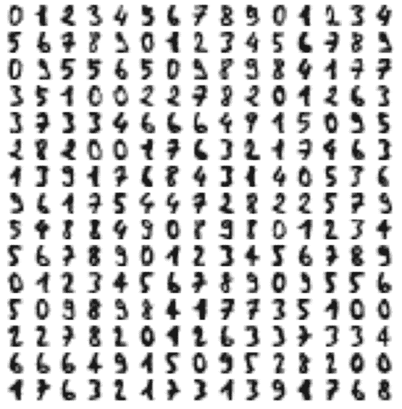

现在我们有了实际的类，并且我们知道哪个字符串对应于哪个标签。如果我们使用已经找到的变换来描述类在更小空间中的适当分布，我们得到以下结果:

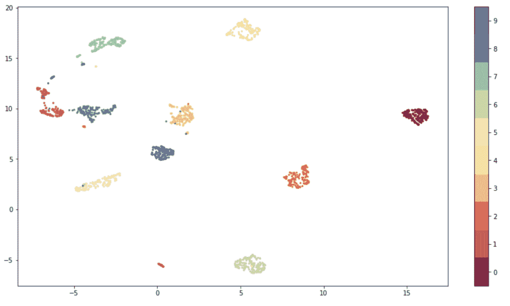

# 分类准确度

上图显示，在大多数情况下，只有负责簇号的颜色不同。k-mean 方法随机标记图像，并且类 0 在其图像中不暗示零。如果您更改编号，您将看到有多少示例被正确分类。

许多指标显示了单个数字的方法有多好。最广为人知的度量是准确性，即测试集中所有示例的正确答案的比率。这种方法有一个很大的缺点，因为它没有具体说明错误到底是什么。这个和其他整数度量的使用对于多类分类来说非常不方便，因为一个数字不能清楚地显示哪些类是相互混淆的。

这正是我们现在所处的情况，所以我们应该使用一个误差矩阵。为了构建它，我们将使用 [pycm](https://www.pycm.ir/doc/) 库:

在这段代码中，y_pred 包含了我们前面发现的重新编号的集群值。其中使用了最常见的实际类作为新值。产生的误差矩阵如下所示:

*   水平方向是我们的方法预测的类别。
*   正确的类别垂直显示。
*   相交单元格显示满足两个条件的对象数量。

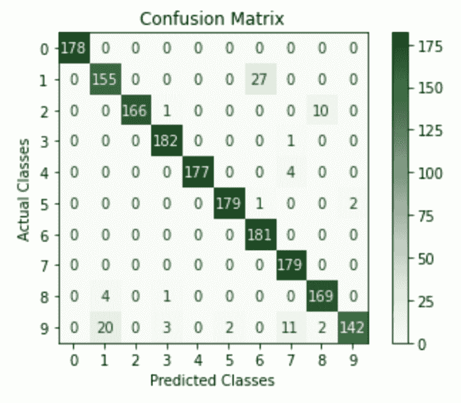

出于某种原因，真正的一类中有 27 个样本被定义为六。让我们看看为什么会发生这种情况，并看看数据集中的图像。

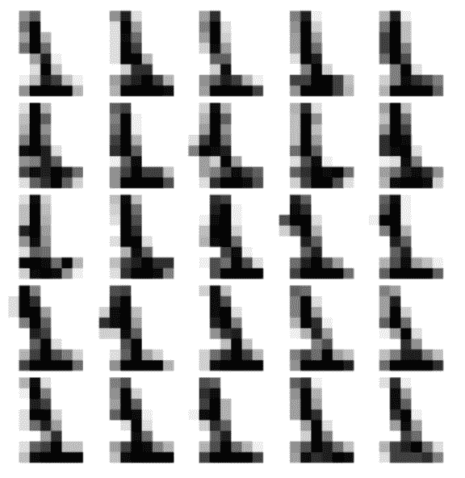

*被归类为六的*

乍一看，这些物体不像六。但是如果我们回到实际的类标记，我们会看到一小组离其他的标记很远，更接近于 6。

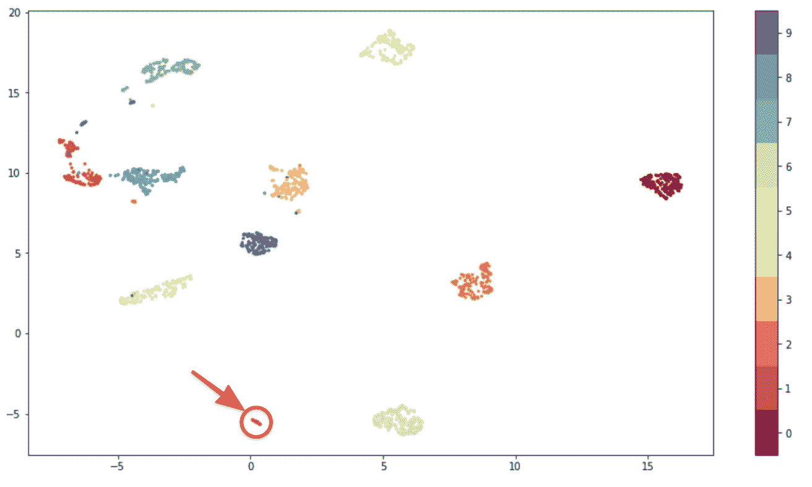

而真正的六和一真的很像，所以在这种情况下，问题不是出在我们的模型上而是出在那些有这样笔迹的人身上:

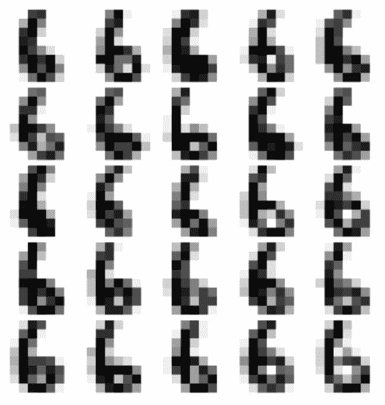

*正确分类的六个*

# 最后

同样，我们将确保风险内容，如风景、枪支和穿泳衣的女孩，不会对所有用户开放，而只对那些不介意这些内容的用户开放。然而，在我们的例子中，考虑的不是像素值，而是特定的模式。

这些模式由在大型数据集上预先训练的神经网络定义。然而，在其原始状态下，该神经网络并不适合我们解决移除不想要的内容的主要任务，因为它不知道我们的三个类:

*   批准:图像放在应用程序的集合部分；
*   不适合:图片不显示在一般的 feed 中，而是保留在用户的 feed 中(穿泳衣的女孩和穿泳裤的男人，自拍，以及任何不是 memes 的东西)；
*   有风险:图片被禁止，不再对任何 iFunny 用户开放(种族主义，色情，肢解，以及任何属于“非法内容”定义的内容)。

我们必须在这些课程上对网络进行进一步的再培训。但是我们会在下一篇文章中详细讨论这个问题。

*作者:雅罗斯拉夫·穆尔扎耶夫，丰公司数据科学家*