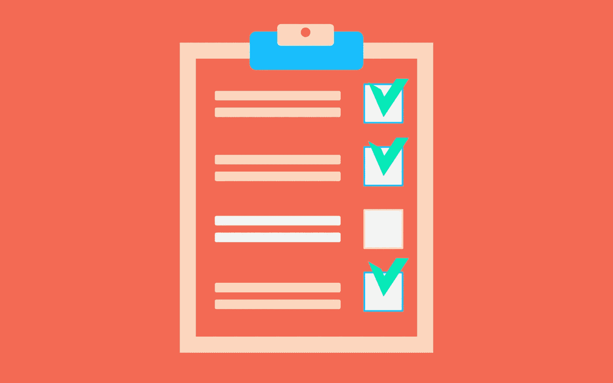
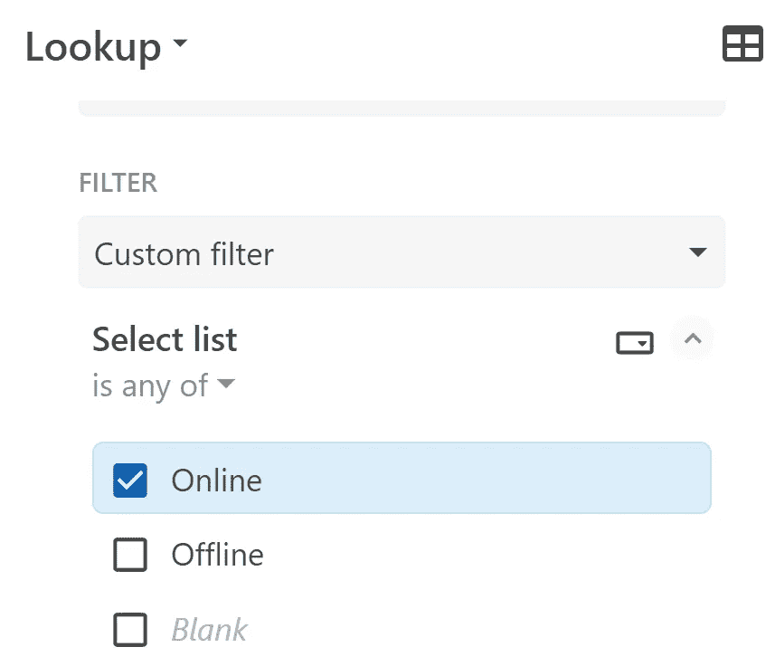
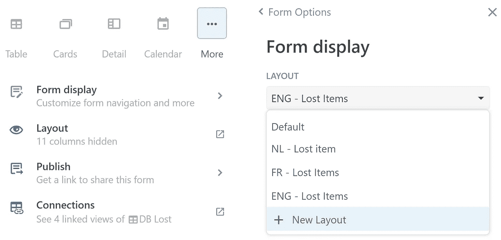

# 如何对表单进行编码？

> 原文：<https://medium.com/nerd-for-tech/how-to-coda-a-form-774409c4f374?source=collection_archive---------6----------------------->

如何对表单进行编码？

## 将表格转换成(多个)表单——在 Coda 之外使用表单

我喜欢 Typeform.com 的早期版本，易用性、灵活性、报告工具和电子邮件跟进给我留下了深刻的印象。许多年后的 2020 年，我遇到了 Paperform.co 的 T2，在我看来，这是收集和处理数据的更好方式。我的客户喜欢他们所看到的，并且理所当然地认为数据会从一个表格中轻轻飘入[结尾](https://coda.io/docs?r=O8dJLrFiTDS_2ttrz-1brA)的表格中。

正如你所理解的，当涉及到技术时，你需要做一些事情来使它工作。在这种情况下，我用扎皮尔作为 Paperform.co 和 Coda 之间的桥梁。长话短说，客户喜欢它，我喜欢它，主要是对结果感到高兴。我写了一篇关于如何使用 Paperform.co 和 Coda(以及 Zapier)保持数据一致的博文，当你阅读时，我不得不稍微修改一下以正确显示数据并保护其完整性。

2020 年 12 月，Coda 推出了另一种表格视图: [Coda 表格](https://community.coda.io/t/launched-forms/20040)和预填表格的早期更新已经在[2021 年 1 月](https://community.coda.io/t/launched-pre-filled-form-fields/20676)到来。我关注了社区中的一些(主要是热情的)反应，但是我不觉得我想为我的客户使用这些 Coda 表单。这在 2021 年春末发生了变化，当时我的一个客户明确要求集成 Coda 表单。他知道扎皮尔和各种形式的建设者，但不想随着建设和维护桥梁的麻烦。我抱怨了一点，但还是按照要求做了，接下来是我在完善设置时学到的一些东西。

> 剧透:我非常喜欢结尾的形式！

# 5 大优势

付费表单生成器包含了 Coda 表单中尚未提供的各种工具。想想表单内部基于输入的后续操作(分支)，自定义 URL，自定义字体和颜色，以改善表单的外观和感觉，以及更多更多更小和更大的额外功能。虽然这些优势在许多情况下都是相关的，但有一个优势是表单构建者还不具备的*【内部】*。与表或数据库集成以智能地操作数据。

这一优势不可低估，稍后您将会看到。

## 01 —产品选择

有些产品(还)不能在网上销售，因此我们不能在表单中将它们显示为一个选项(使用单选按钮)。解决方案是过滤掉我们通过`LookUp`获得的项目。

我们分两步解决了这个问题。在表 *DB Products* 中，我们添加了一个包含两个选项的列:在线—离线。在表格(类似于卡片和图表的数据视图)下面的表格中，我们使用了自定义过滤器，如图所示。

## 02 —获取新订单的日期和时间

社区中的一些人请求帮助来捕获位于 Coda 之外的表单中的条目的创建日期和时间。功能`Modified()`和`Now()`不起作用。相反，你需要`Created()`

我同意文档不清楚，因为[修改](https://coda.io/formulas#Modified)显示:“获取行或其他对象的修改日期/时间”。

## 03 —提交后发送电子邮件

填写表单时，会在基础表中生成一个新行。通过自动化，我们可以基于新行触发一个动作。一旦整合了 Gmail 包，你就可以发送一个包含名字、地址等共享数据的 Coda 页面。这种设置不需要任何额外的。我在这篇博客中写道:[如何用 Gmail 结尾](https://huizer.medium.com/how-to-coda-with-gmail-e3c01471d649)

或者，您可以使用 Zapier 和 Mailjet 等专业电子邮件平台，并在 Zapier 中使用“新行事件”作为触发器，填写一个漂亮的模板，并通过您选择的电子邮件以专业的方式发送，以享受事后好处，如报告。

## 04 —一张桌子上有多种语言

一旦你的听众使用不同的语言，你可能想用他们的语言询问他们的细节。Coda 提供了一个优雅的解决方案，允许您命名表单视图并生成视图变体。如何获得这个天才的宝石。

如您所见，您进入表单显示，然后打开布局并开始输入名称。请注意，一旦您创建了一个名称，您就不能再对其进行编辑，并且在编辑时，您看不到已经使用的名称。这解释了为什么列表中的第一个版本(实际上是最后添加的版本)与 NL & ENG 版本略有不同。这是有点不方便，但不是一个交易破坏者。

为版本命名后，您就可以开始编辑布局了。您不仅可以更改问题的外观(顺序、位置)以及显示或隐藏问题，还可以更改问题的名称。您在这个名称下创建的表单将包含您放置的逻辑。

下面的技巧让你的表单多语言化。

您看到的第一个元素是基础表中的列名。下面一行是“添加问题或提示”,下面一行是“添加描述”

这里你定义你的问题，有时你添加一些额外的信息来帮助用户更好地理解你的意图。在我们的例子中，结果是一系列的形式，主要在语言方面有所不同。

例如，改变问题的外观不会改变下拉菜单的内容。为了解决这个问题，我为每种语言创建了下拉菜单，显示正确的语言，而隐藏其他语言。在底层表中，我有一个列，它通过`List()`将所有这些列的值集合在一起，这个列最终只填充了一个条目。由于您还不能在列级上做笔记，所以您的列的名称对于保持监督非常重要。

这两种方法可以帮助您以各自的语言为不同的客户群提供服务，而无需创建额外的表。这不是很棒吗？

## 05 —预填充表单

> 预填充的[意味着](https://www.quora.com/What-does-prepopulated-mean?share=1)当你在线输入文本到一个表格中时，一个文本框或字段，即“预填充”的，其信息由系统输入。

我们上下文中的系统是一个 Coda 表。信息通过 URL 到达。下面一个表格用几个字段(列)来显示主要原理。

您会看到*名字*、*姓氏*和*位置*作为主列，它们被添加到带有“？”的表单 URL 中最后。接下来的事情有点特殊，但就是这样的工作方式。您键入列名并添加“=”。结果类似于`“Firstname=”`,在这之后，您添加列的名称，并为每一列添加名称。

列由`“&”`符号分隔，为了有效地处理这个问题，我创建了一个名字为‘AND’的易于使用的列。当您有许多列要匹配时，这无疑提高了整个函数的可读性。每一列都得到`EncodeForUrl()` 函数来处理空格和特殊字符。完整的字符串通过`Hyperlink()`转换成一个 URL。因此，这个 URL 包含了以前留下的所有数据，当用户输入这个数据的新版本时，Coda 中会创建一个新行。因此，任何收到该 URL 的人都可以看到共享的信息。

我计划写一篇关于如何处理同一用户再次填写表单后更新的数据的博客。由于数据直接浮动到我们的表中，所以一切都相当简单。

一些实用点。我已经提到了列“AND”的用法，第二，列名没有空格或特殊字符，如é或，为了避免困难，我用大写字母来表示不同的单词部分，如在 *FirstName* 中。用户可以添加多个图像，但是 Coda 不能返回图像和文件。我想这是所有表单构建者目前都有的一个疏忽。

## 结论

尽管当前的 Coda 表单仍有改进的空间，但与那些只关注表单的产品相比，与 Coda doc 直接集成带来的实际机会是巨大的。你可能会接受这样一个事实，即像分支这样的基本要素(还)不可能实现。

我希望你喜欢这篇文章。如果您有任何问题，请随时联系我们。虽然这篇文章是免费的，但我的工作(包括建议)不会是免费的，但总有聊天的空间，看看可以做些什么。此外，你可以在 [Coda 社区](https://community.coda.io/)和 [Twitter](https://twitter.com/CodaExpert) 上找到我的(免费)贡献

我的名字是克里斯蒂安·许泽，我是许泽自动化公司的所有者。一家专门为 SME 收集数据并保持数据一致的公司。我主要依靠 [Coda](https://coda.io/?r=O8dJLrFiTDS_2ttrz-1brA) ，Mailjet，za pier&paper form 来完成工作。

huizer Automation——Coda 表单编码专家