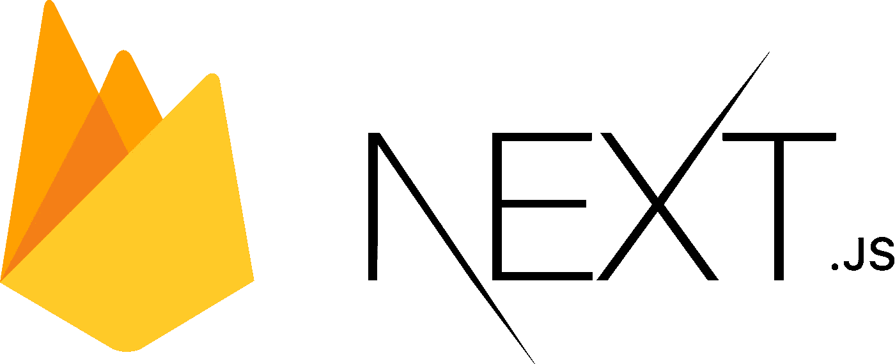

# 如何在没有 Mongoose 的情况下将 React 应用程序连接到 MongoDB

> 原文：<https://medium.com/nerd-for-tech/how-to-connect-your-react-app-to-mongodb-without-mongoose-41af3ce31b7c?source=collection_archive---------6----------------------->

使用 Next.js 和 JavaScript MongoDB 驱动程序作为 Mongoose 的替代

**简介**

当选择一种技术来让 React 应用程序与 MongoDB 进行交互时，总是会想到 Mongoose。它允许您创建对象引用，并用代码对数据库建模。然而，这种抽象牺牲了查询性能，使得它比 JavaScript 的 MongoDB 驱动程序慢。在本教程中，我将介绍使用 Next.js 及其易于使用的 API 路由系统的过程，以便您可以在 React 应用程序中使用驱动程序，而不必依赖外部 API。

**设置 Next.js**

如果你要从头开始，你需要[创建一个 Next.js 应用](https://nextjs.org/docs)。如果你已经在一个现有的 React 应用上工作，你可以[迁移到一个 Next.js 应用](https://nextjs.org/docs/migrating/from-create-react-app)。这种迁移不仅为您提供了轻松生成 API 端点的能力，还为您提供了混合静态&服务器呈现、类型脚本支持、智能绑定、动态路由等功能。

**配置 API 端点**

既然已经有了 Next.js，下一步就是为应用程序创建 API 路由来发送请求。目录`pages/api`中的任何文件都被映射到`api/*`，并被应用程序视为 API 端点而不是页面。我们可以在`pages/api`的 JavaScript 文件中使用 MongoDB 驱动程序编写查询数据库的脚本，然后使用适当的包向端点发送请求。在本教程中，我们将使用 [react-axios](https://www.npmjs.com/package/react-axios) 。

在文件夹中，创建一个名为`example.js`的新文件，并编写一个基本脚本来接收 POST 请求并相应地处理它们。

`req`参数存储 POST 请求中发送的数据。我们将使用这个端点来演示如何为创建、读取和删除操作配置端点，从在 MongoDB 集合中创建一个文档开始。在下面的例子中，`req.body`存储被插入到集合中的文档的对象。

要通过 ObjectID 从集合中检索文档，请使用下面的代码作为指南。在这种情况下，`req.body`存储文档的 MongoDB ObjectID，但是您可以很容易地更改`.find()`方法的参数以满足您的目的。

要删除文档，请遵循下面的代码。`req.body`存储要删除的文档的 MongoDB ObjectID，但是您可以很容易地更改`.deleteOne()`方法的参数以适合您的目的。你也可以使用类似`.deleteMany()`的方法来应对人口大规模外流。

**使用 react-axios 发送请求**

为了使用这些 API 端点，我们需要用适当的主体向`api/insert-file-name-here`(在本教程中是`api/example`)发送请求。例如，如果您将端点配置为删除具有特定 ObjectID 的文档，则您的组件将如下所示:

当然，请求可以在组件中的任何地方完成(最好是在它自己的处理程序方法中)；`componentDidMount()`这里用的是一个例子。如果您使用功能组件，那么让它成为异步组件，允许 axios 根据请求返回承诺。

**将 API 端点用于其他功能**

当然，可用性并不仅限于与数据库的交互。在 React 应用程序中配置一个 API 还可以使用预先训练的模型进行预测，检索和管理站点流量等统计数据，以及后端可能需要处理的任何其他功能。

恭喜你！您已经配置了 API 端点，允许在 React 应用程序中与 MongoDB 数据库进行交互。如果你对我做过的其他项目感兴趣，[去看看我的网站](https://isaacchendev.com/)。如果你有任何事情想联系我，我的 [Github](https://github.com/Iscaraca) 和 [LinkedIn](https://www.linkedin.com/in/isaac-chen-jing-de/) 账户是链接的。