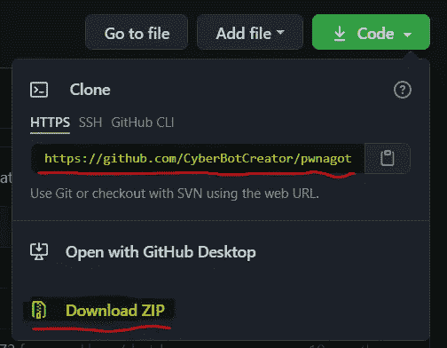
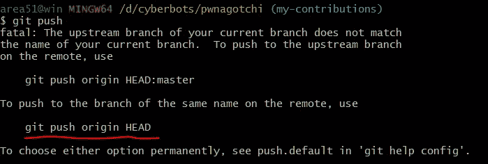
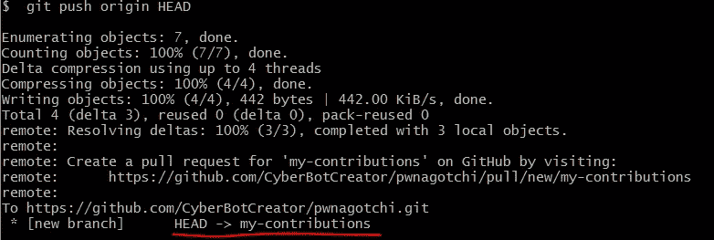
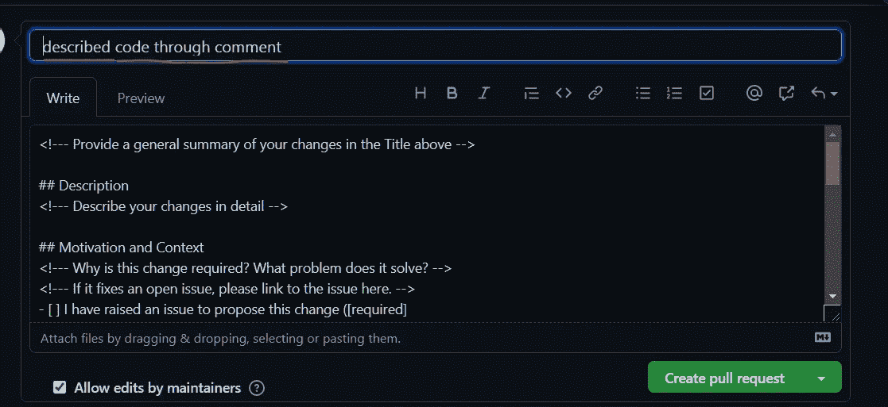

# 如何为 Github 开源项目做贡献

> 原文：<https://medium.com/nerd-for-tech/how-to-contribute-to-github-open-source-projects-a11588141d76?source=collection_archive---------11----------------------->


你有没有想过你最喜欢的工具应该按照你想要的方式工作，或者你发现了一个 bug 或拼写错误，希望有人可以修复它？有了开源议程，你可以做到这一点，或者你可以只为你喜欢的项目做贡献，但是如果你被这个过程淹没了，而从来没有尝试过呢？我也去过那里。

在本文中，我将向您展示如何开始一个开源项目，并立即开始为该项目做出贡献。

## **开源是什么意思？**

我们从一个简单的类比开始，假设你最喜欢的菜是墨西哥玉米卷，现在，在这种情况下，墨西哥玉米卷是一种你消费的产品，但要制作墨西哥玉米卷，你需要有它的食谱，而你没有，你去厨师那里问，“嘿，我能得到墨西哥玉米卷的食谱吗，这样我就可以在家里做了”如果他们拒绝你，那就不是开源，但如果他们接受分享他们的食谱，你可以称之为开源。

现在你可以自己做墨西哥玉米卷了，但你想根据自己的口味改进食谱，用沙拉代替牛肉，结果很棒，并与厨师分享了你修改的食谱。现在由他们决定是否要将这个食谱添加到菜单中。

但是，嘿，你做出了你的第一次贡献！

开源软件也是如此，**它的原始源代码是免费提供的，可以重新分发和修改。**

## 为开源做贡献的好处

*   **它让你脱颖而出。**

当你开始为开源项目做贡献的时候。你会立即与已经在同一个项目中工作的人取得联系。相信我，为开源项目做贡献，你正在打造你的真实简历，这会吸引你未来招聘人员的注意。

*   它帮助你提高技能。

为开源项目做贡献是一项有趣的活动，它帮助你提高编码技能，不知道编码吗？没问题，你实际上不需要学习编码来为开源项目做贡献。无论哪种方式，它肯定会帮助你提高你的人际交往能力。

*   它让你感觉很好。

是的，这让你自我感觉良好，你不仅仅是消费，而是真正地回馈社区，并帮助项目发展。

## 入门指南

要为开源项目做贡献，首先你需要找到一个你想做好的项目...

我建议你，为你已经知道和使用的项目做些贡献，这样你就能很好地理解这个项目是如何运作的。

我个人最喜欢的是 [pwnagotchi](https://github.com/evilsocket/pwnagotchi) (这是一个基于 Ac2 的 AI，用于对 wifi 网络执行认证和关联攻击。)

# 第一步:登录 GitHub

登录你的 Github 账户，如果你没有的话，在这里创建一个。

# 步骤 2:分叉项目存储库

找到您想要派生的项目，并转到它的存储库页面，您会看到类似这样的内容。注意 evilsocket，这意味着我在原来的 pwnagotchi 存储库上。


pwnagotchi 家庭回购

你可以阅读 README.md 文件，这个文件给出了关于这个项目的信息。此外，在分叉项目之前检查贡献指南。

分叉后，整个项目将被复制到您自己的存储库。


在我的回购中复制

# 步骤 3:克隆存储库

现在，您需要将存储库克隆到您的设备上以处理该项目，单击绿色按钮，您可以通过浏览器下载该项目，也可以使用您的终端克隆它。



克隆回购

我将通过终端克隆存储库。如果您在 windows 上，您可以使用 git 终端克隆回购。您可以从[这里](https://git-scm.com/downloads)下载 git 终端，您可以使用以下命令克隆回购。

```
$git clone <link>
```

我用过

```
$git clone [https://github.com/CyberBotCreator/pwnagotchi.git](https://github.com/CyberBotCreator/pwnagotchi.git)
```

# 步骤 4:导航到存储库

您可以使用以下命令导航到下载的存储库。

```
$cd <dir-name> 
```

就我而言

```
$cd pwnagotchi
```

# 第五步:制作树枝

如果您想要进行更改，您应该在主数据库之外进行更改，这样您的更改就不会影响主数据库(主公共存储库)。

同样，对于开源软件，在不同的时间会有很多更新，你不希望你的改变影响到其他人的改变。因此，您应该在单独的分支上进行更改。

以下命令将显示您当前所在的分支。

```
$git branch
master*
```

您可以看到我们在主分支通知' * '上

现在我们需要创建一个新的分支，如下所示。你想用什么名字都行，我就用“我的捐款”

```
$git branch my-contributions
```

# 第六步:切换分支

我们仍然在主分支上，您可以用 git branch 命令来检查。因此，为了将我们的分支切换到分支，我们使用了以下命令。

```
$git checkout my-contributions
Switched to branch 'my-contributions'
```


改变分支

因此，我们现在在“我的贡献”分支上，“我的贡献”分支中的所有内容都链接回“主”，反之亦然，这意味着我们可以将所有新更新从“主”或“我的贡献”拉至“主”。

所以现在你可以打开你最喜欢的 IDE(集成开发系统)开始做改变了。

# 第七步:做出改变

首先，在您最喜欢的 IDE 中打开克隆的存储库，我将在这里使用 Pycharm。

出于演示的目的，我将在代码中添加一个注释。


添加了注释

在这里，你可以看到我在第 103 行添加了一个注释，你可以看到 Pycharm 非常出色地突出显示了更改的行(行号前面的绿色标记)

无论哪种方式，您都可以使用下面的命令在 git 终端中看到所做的更改。

```
$git diff
```


所做的更改

您可以看到 git 终端中所做的更改以绿色显示。

# 步骤 8:与主服务器同步

您所做的更改仅对您是本地的，因此您需要与“主”(主 pwnagotchi repo)同步，如果对主 repo 进行了任何更新，您可以使用以下命令与原始主(即 pwnagotchi repo)同步。

您需要将当前分支更改为“主”

```
$git checkout master
```

您可以看到，我们已经与原始回购同步。


改变分支

因此，现在我们需要从最初的主数据库中提取数据到我们当前的存储库，例如在我的例子中是 cyberbotcreator/pwnagotchi。

```
$git pull
```


从原始回购拉到我们自己的回购

正如您在这里看到的，我们在这里已经是最新的了。此外，在“我的贡献”分支上与你的“主人”保持同步也是一个好习惯。你可以通过“我的贡献”分支，从“主”中提取。

```
$git checkout my-contributions
```

并从“主”转移到“我的贡献”分支。

```
$git pull 
```


从主人那里拉到我的-投稿

因此，为了将“我的贡献”与“主”同步，您可以复制输出中显示的命令，并将<branch>更改为“主”，这意味着它会将数据从“我的贡献”同步到“主”(本地)分支。</branch>

所以对我来说

```
$git branch --set-upstream-to=origin/master my-contributions
```


它将数据从“我的投稿”复制到“主”

# 步骤 9:提交这些变更

我们都很好，让我们将这些更改提交给我们的 Github repo。

我们使用这个命令将我们一起更改的所有文件分组到一个实例中。

```
$git add .
```

现在你添加一个提交消息，它将描述你的改变意味着什么，你可以在那里添加一个注释。

```
$git commit -m "described code through comment"
```

现在你可以推动这些变化。

```
$git push
```



推动变革

现在，通过使用 output 中的命令来推动这些更改可能会有所不同。

```
$git push origin HEAD
```



推动变革

# 步骤 10:发出拉取请求

所以回到我们的 Github repo，如果你看到这条消息，你的更改已经成功地推送到你的 repo。


我们的 Github 回购

因此，点击“比较和拉取请求”来提出拉取请求。

下面您可以看到它是如何显示我们正在做的事情的，我们正在将更改推送到基本存储库“evilsocket/pwnagotchi”的“主”存储库，这些更改来自“我的贡献”分支的主存储库。


提出拉取请求

在下面，您将看到我们的提交消息，您还可以描述这些更改的含义及其描述。



添加提交消息

在提出拉取请求后，它将在主 pwnagotchi repo 中的“拉取请求”选项卡中可用。现在，您必须等待查看者(在该项目中贡献较大的人)进行评论，如果您的更改足够好以满足查看者，他们会将您的请求合并到他们的主分支中。

祝贺您成功地为一个开源项目做出了贡献。