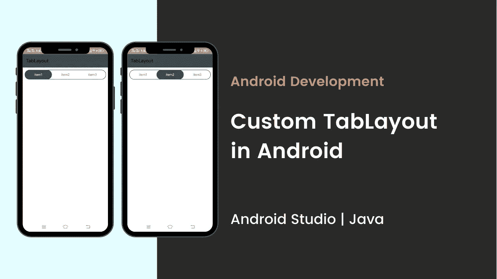

# 如何在 android | Android Studio | Java 中创建自定义选项卡布局

> 原文：<https://medium.com/nerd-for-tech/how-to-create-custom-tab-layout-in-android-android-studio-java-83e87eb837ad?source=collection_archive---------0----------------------->



**如何在 android | Android Studio | Java 中创建自定义选项卡布局**

在本教程中，我们将在 android 中创建一个自定义选项卡布局。自定义选项卡布局帮助您为用户创建更具吸引力的选项卡布局。您可以使用这种方法创建自己的选项卡布局，只需遵循以下步骤。

**我们开始教程吧。**

**在那之前让我们看看，你将会看到什么**

# 步骤 1:创建标签的背景

为选项卡创建两个新的可绘制文件，一个用于选中的选项卡，另一个用于未选中的选项卡布局。

**back_select.xml**

```
<?xml version="1.0" encoding="utf-8"?>
<selector xmlns:android="http://schemas.android.com/apk/res/android">
    <item>
        <shape>
            <gradient
                android:angle="0"
                android:startColor="@color/colorPrimary"
                android:endColor="@color/colorPrimary"/>
            <corners
                android:radius="20dp"/>
        </shape>
    </item>
</selector>
```

**back_tabs.xml**

```
<?xml version="1.0" encoding="utf-8"?>
<selector xmlns:android="http://schemas.android.com/apk/res/android">
    <item>
        <shape>
            <gradient
                android:angle="0"
                android:startColor="@color/white"
                android:endColor="@color/white"/>
            <corners
                android:radius="20dp"/>
            <stroke
                android:width="1dp"
                android:color="@color/black"/>
        </shape>
    </item>
</selector>
```

# 步骤 2:创建自定义选项卡

现在为自定义选项卡布局创建一个新布局。

```
<?xml version="1.0" encoding="utf-8"?>
<LinearLayout xmlns:android="http://schemas.android.com/apk/res/android"
    android:layout_width="match_parent"
    android:layout_height="match_parent"
    xmlns:app="http://schemas.android.com/apk/res-auto"
    app:layout_behavior="@string/appbar_scrolling_view_behavior"
    android:orientation="vertical"> <FrameLayout
        android:layout_width="match_parent"
        android:layout_height="40dp"
        android:layout_margin="10dp"
        android:background="@drawable/back_tabs"> <LinearLayout
            android:layout_width="match_parent"
            android:layout_height="match_parent"
            android:orientation="horizontal"> <TextView
                android:id="@+id/select"
                android:layout_width="match_parent"
                android:layout_height="match_parent"
                android:layout_weight="1"
                android:text=""
                android:background="@drawable/back_select"/> <TextView
                android:layout_width="match_parent"
                android:layout_height="match_parent"
                android:layout_weight="1"
                android:text="" /> <TextView
                android:layout_width="match_parent"
                android:layout_height="match_parent"
                android:layout_weight="1"
                android:text="" />
        </LinearLayout> <LinearLayout
            android:layout_width="match_parent"
            android:layout_height="match_parent"
            android:orientation="horizontal">
            <TextView
                android:id="@+id/item1"
                android:layout_width="match_parent"
                android:layout_height="match_parent"
                android:layout_weight="1"
                android:text="item1"
                android:textColor="@android:color/white"
                android:gravity="center"/> <TextView
                android:id="@+id/item2"
                android:layout_width="match_parent"
                android:layout_height="match_parent"
                android:layout_weight="1"
                android:text="item2"
                android:gravity="center"/> <TextView
                android:id="@+id/item3"
                android:layout_width="match_parent"
                android:layout_height="match_parent"
                android:layout_weight="1"
                android:text="item3"
                android:gravity="center"/> </LinearLayout>
    </FrameLayout></LinearLayout>
```

# 步骤 3:设计主 XML 文件

在主 XML 文件中添加自定义选项卡布局。

```
<?xml version="1.0" encoding="utf-8"?>
<androidx.coordinatorlayout.widget.CoordinatorLayout xmlns:android="http://schemas.android.com/apk/res/android"
    xmlns:app="http://schemas.android.com/apk/res-auto"
    xmlns:tools="http://schemas.android.com/tools"
    android:layout_width="match_parent"
    android:layout_height="match_parent"
    tools:context=".CustomTab"> <com.google.android.material.appbar.AppBarLayout
        android:layout_width="match_parent"
        android:layout_height="wrap_content"
        android:theme="@style/AppTheme"
        android:layout_marginTop="28dp"> <androidx.appcompat.widget.Toolbar
            android:id="@+id/toolbar"
            android:layout_width="match_parent"
            android:layout_height="?attr/actionBarSize"
            android:background="?attr/colorPrimary"
            app:popupTheme="@style/AppTheme" /> </com.google.android.material.appbar.AppBarLayout> <include layout="@layout/content_main" /></androidx.coordinatorlayout.widget.CoordinatorLayout>
```

# 步骤 4:添加功能

现在在主 java 文件中添加这些代码。

```
public class CustomTab extends AppCompatActivity implements View.OnClickListener{ ColorStateList def;
    TextView item1;
    TextView item2;
    TextView item3;
    TextView select; @Override
    protected void onCreate(Bundle savedInstanceState) {
        super.onCreate(savedInstanceState);
        setContentView(R.layout.*activity_custom_tab*); Toolbar toolbar = findViewById(R.id.*toolbar*);
        setSupportActionBar(toolbar);
        item1 = findViewById(R.id.*item1*);
        item2 = findViewById(R.id.*item2*);
        item3 = findViewById(R.id.*item3*);
        item1.setOnClickListener(this);
        item2.setOnClickListener(this);
        item3.setOnClickListener(this);
        select = findViewById(R.id.*select*);
        def = item2.getTextColors();
    } @Override
    public void onClick(View view) {
        if (view.getId() == R.id.*item1*){
            select.animate().x(0).setDuration(100);
            item1.setTextColor(Color.*WHITE*);
            item2.setTextColor(def);
            item3.setTextColor(def);
        } else if (view.getId() == R.id.*item2*){
            item1.setTextColor(def);
            item2.setTextColor(Color.*WHITE*);
            item3.setTextColor(def);
            int size = item2.getWidth();
            select.animate().x(size).setDuration(100);
        } else if (view.getId() == R.id.*item3*){
            item1.setTextColor(def);
            item3.setTextColor(Color.*WHITE*);
            item2.setTextColor(def);
            int size = item2.getWidth() * 2;
            select.animate().x(size).setDuration(100);
        }
    }
}
```

# 您也可以访问之前的教程:

如何在 android 中创建简单的标签页布局？ [**点击这里**](https://www.gbandroidblogs.com/2021/03/how-to-create-tab-layout-using-fragments-in-android.html) 。

如何创建带有徽章的材料选项卡布局。 [**点击这里**](https://www.gbandroidblogs.com/2021/03/how-to-create-material-tab-layout-using-fragments-in-android.html) 。

# 你可以在 YouTube 上关注我:

[戈拉普酒保](https://www.youtube.com/channel/UCqHYLy2nzO0pONL5BueoT6Q)

# 访问我的网站/博客

[www.gbandroidblogs.com](http://www.gbandroidblogs.com)

# 在 Instagram 上关注我

[安卓应用开发者](https://www.instagram.com/androidapps.development.blogs/)

# 跟着我去脸书

GBAndroidBlogs