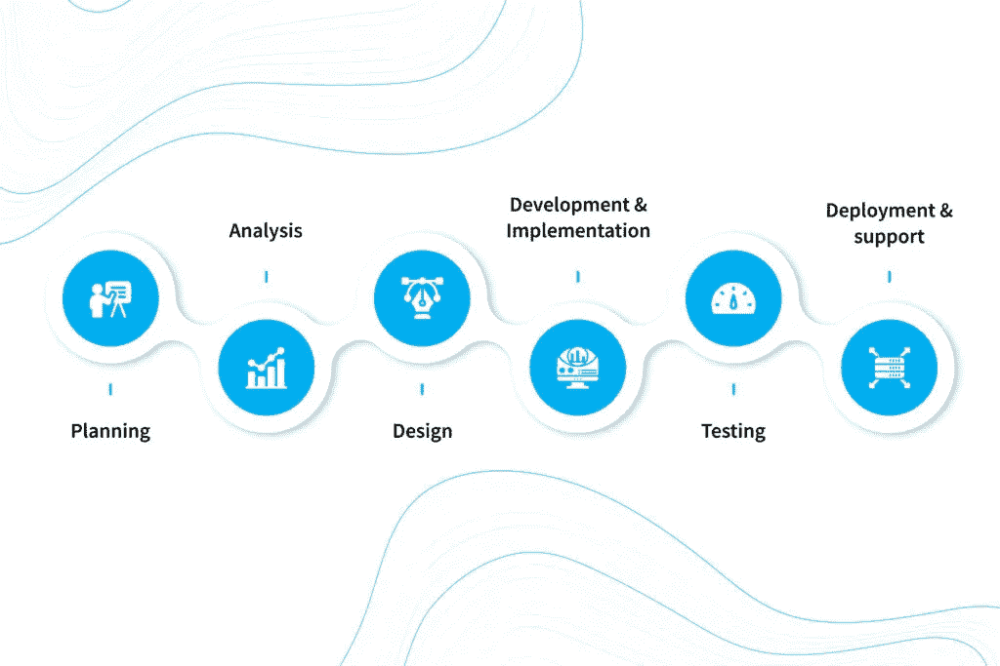
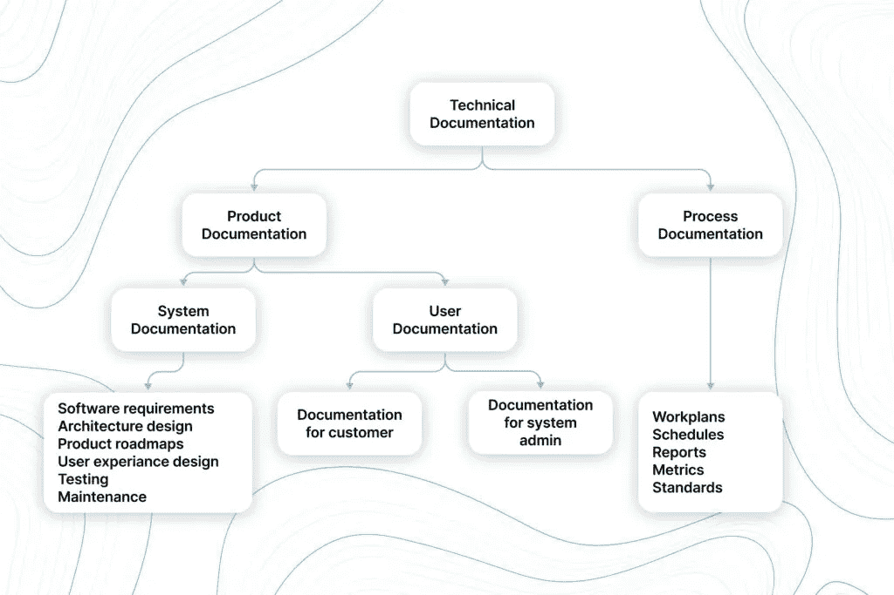
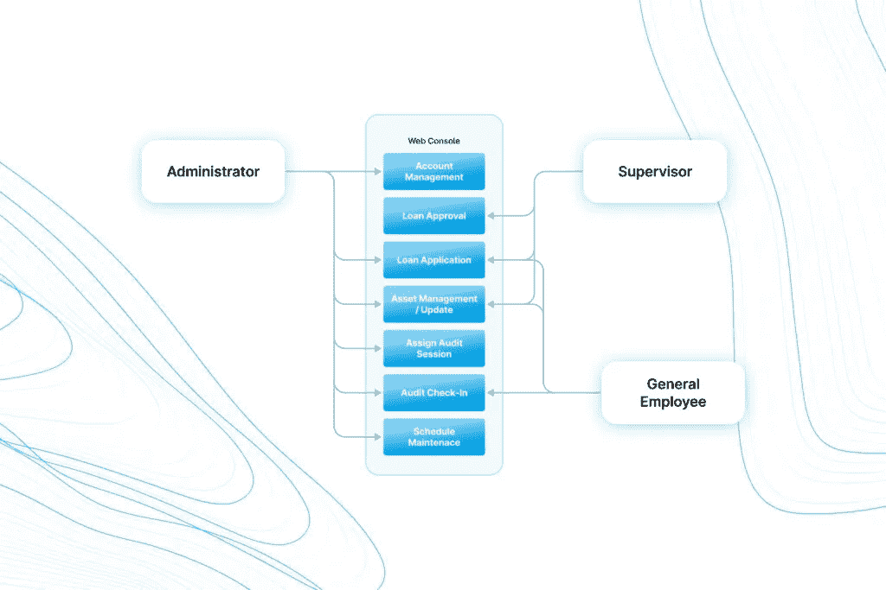
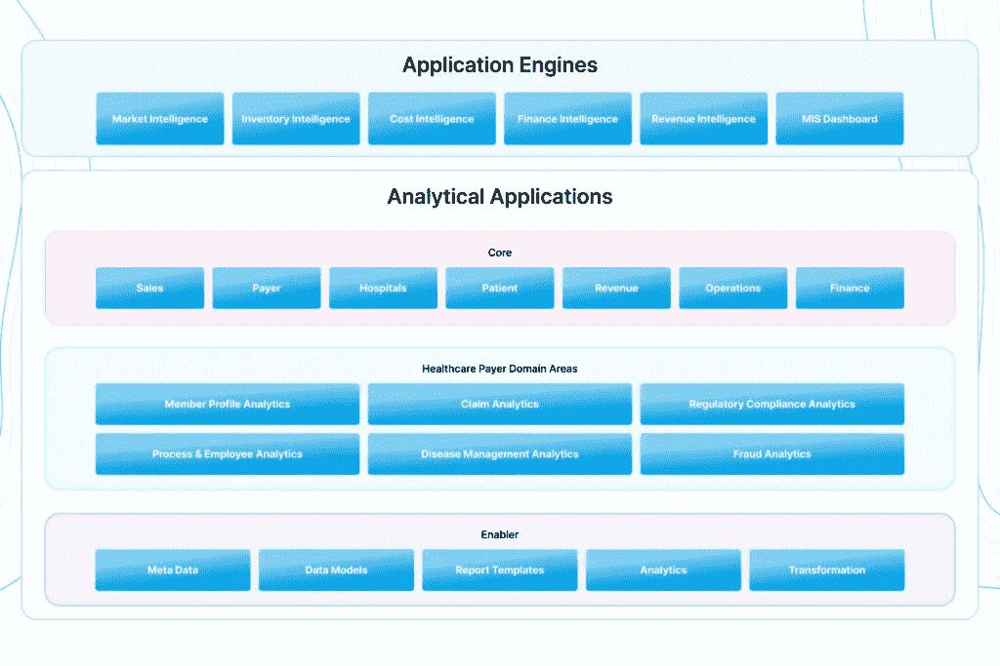

# 如何开发技术软件文档— NIX United

> 原文：<https://medium.com/nerd-for-tech/how-to-develop-technical-software-documentation-nix-united-aa59cd652f55?source=collection_archive---------1----------------------->

书面指南对于任何设备、项目或其他事业都是不可或缺的。在你开始你的工程努力之前，一个[专门的软件开发](https://nix-united.com/services/dedicated-software-development/)团队应该概述所有设想的任务，以便有一个清晰的计划和跟踪进展。一般来说，这就是软件的技术文档所处理的内容。

更具体地说，这个术语包括所有与软件解决方案开发相关的书面材料。技术软件文档允许所有涉众保持在同一页面上，控制项目完成，并确保项目目标。

本文概述了软件技术文档的类型及其对企业的重要性，并提供了如何正确创建项目书面材料的建议。

# 什么是关于软件的技术文档？

无论项目范围如何，技术文档都是至关重要的。它包含了在整个[软件开发生命周期](https://nix-united.com/blog/software-development-life-cycle-nix-approach-to-sdlc/) (SDLC)中创建的各种类型的材料，从解决方案的目的到完整的架构。文档旨在整合所有与项目相关的信息，描述产品功能，并使工程师和利益相关者能够讨论所有关键问题。

软件开发文档的目标包括:

*   相关数据的合并
*   防止由于潜在问题造成的延误
*   对解决方案的全面解释
*   项目开发和相关讨论指南

由于软件的技术文档分为几种类型，它可以由各种专家组成，从技术专家到项目经理。你可以构思一个非常复杂的产品，雇佣一个[软件开发服务](https://nix-united.com/services/software-engineering/)，但是文档应该尽可能的清晰和简洁。

# 技术文档在 SDLC 中的作用:为什么它在软件开发中很重要

SDLC 中的文档旨在使每个人在整个项目生命周期中的生活更加轻松。出于几个原因，它对软件公司的重要性很难被高估。

# 简化决策

快速方便地获取实际技术信息有助于产品团队加快决策过程。有了统一的数据源，团队成员不必不断搜索他们需要的信息。相反，他们可以立即查阅所需的文档，为高效决策创建适当的背景。

# 用户的上下文帮助

解决方案中显示的文档对客户来说非常方便。它允许他们在不脱离环境的情况下消除出现的问题，从而增强可用性和客户体验。

# 额外的营销机会

全面的软件开发文档有助于广告，因为它提供了产品的详细信息。通过向潜在客户展示您的解决方案的所有特性和功能，您可以简化他们做出购买决定的过程。

# 技术支持压力较小

如果用户遇到技术问题，他们可以参考技术文档来解决，从而减少技术支持电话的数量。这反过来又削减了技术支持的预算，改善了客户体验，因为许多用户更喜欢自己解决问题，而不是等待别人来帮助他们。

# 开发者想法的存储

软件开发中的文档可以在项目生命周期的所有阶段记录与您的软件解决方案相关的想法。每当你想对你的产品进行修改并找到有价值的见解来源时，你都可以回到他们身边。

# 进一步项目的路线图

您的技术文档为您未来的项目设定了基准，展示了您的计划、目标和基本的产品功能。这有助于围绕一个共同的目标巩固团队。

# 利益相关者和开发人员之间的顺畅沟通

因为文档记录了关于产品的所有信息，所以它成为一种重要的交流形式。项目干系人和开发人员无需直接联系，即可快速轻松地访问关键数据。文档还为进一步的项目和决策积累知识。

# 技术文档如何伴随开发过程的每个阶段

SDLC 中的技术文档包含该流程的关键步骤:

这一阶段包括旨在确定解决方案可行性的市场调研。相应的文档应该有助于向开发人员解释哪些功能和服务最能吸引目标受众，以及如何构建这些功能。

基于用户需求，涉众制定技术规范并设置任务、术语和测试参数。

这就是项目经理和架构师发挥作用的地方。此阶段的文档包括职责分配、预算、时间表、技术堆栈、体系结构设计、项目限制和风险级别。

# 开发和实施

在这里，开发人员根据产品规格和需求编写代码脚本。

完成的软件经过测试程序，以发现缺陷，检查是否符合所有功能和非功能要求，以及性能是否符合用户的期望。

# 部署和支持

IT 部门在发布后跟踪和维护软件功能，以保证性能满足关键指标。

# 技术文件的类型

软件工程文档是开发道路上的灯塔。其基本目标是确保所有各方共享共同的愿景，并朝着相同的方向前进，以实现项目目标。

文档具有多方面的目的。从客户的角度来看，正确使用解决方案会有所帮助。从开发团队的角度来看，它提供了有效工作所需的统一信息。从营销的角度来看，它通过解释产品如何满足用户的需求来帮助推销产品。

基于软件开发文档的综合性，它被分为两个基本组:

*   **产品文档**:描述软件解决方案。
*   **过程文档**:陈述整个开发过程，并提供所有补充数据。

软件文档的主要类型可以用以下方式表示:

让我们继续更详细地探索技术文档的类型。

# 产品文档

此类别的文档描述了解决方案，并提供了使用该解决方案的指南。通常，产品文档包括技术规范、需求、手册、业务逻辑等等。该组细分为:

*   **系统文档**关注于内部用户，比如产品所有者、软件工程师和业务代表。它描述了系统及其组成部分，包括需求、架构设计描述、程序源代码等。
*   **用户文档**面向客户和系统管理员。它包括手册、安装指南、教程、故障排除指南等。

现在，让我们更深入地研究每种类型的产品文档。

## 系统文档

系统文档向软件工程师和利益相关者传递关于整个系统的信息，帮助他们理解底层技术。文档通常包括但不限于需求描述、架构设计、源代码、质量保证、测试报告和维护指南。

撰写文档时，可以使用普遍可用的技术文档示例或技术文档模板。我们将讨论主要系统文档类型的基本特征。

产品要求

这个部分收集关于系统功能的数据。简单地说，它描述了系统应该做什么。产品需求文档还包含诸如业务规则和用例的一般信息。它的主要目的是陈述产品的目标、功能、特性、行为和维护。

最佳实践是遵循一致的技术文档模板，该模板对所有团队成员都是统一的。这是节省每个人的时间并保持文档简洁的最佳方式。

软件工程师在 SDLC 的所有阶段都致力于用户体验设计。这个过程包括研究、原型制作、可用性检查和设计本身。每个部分都需要各自的文档和交付物。

软件架构设计

产品需求文档解释了需要开发什么，而架构设计文档描述了如何构建它。也被视为技术规范，这些文档包括软件工程师的基本架构决策。文档概述了产品架构，概述了工作范围，并建立了里程碑。它解释了每个产品组件如何帮助解决方案满足需求，并指导所有团队成员选择方法和策略。利用技术文档模板进行架构设计，以包含所有必要的组成部分。

质量保证

QA 工程师用不同的方式测试用户的接受度。以下是几种常见的测试技术:

*   **质量管理计划**设定质量标准和实现质量标准的方法。它旨在管理整个测试活动，主要用于大型项目。
*   **测试策略**描述了测试方法，包括团队结构、资源和测试优先级。
*   **测试计划**概述了在特定时刻应该测试的内容。
*   **测试用例规格**列出了检查每个产品特性的详细操作。
*   **测试清单**:表示要提交的测试范围，并指出哪些测试已完成，哪些测试失败。

维护和帮助指南

这些指南应提供使用建议和故障排除建议。该文档还描述了系统各部分之间的依赖关系。

## 客户文档

这组产品文档面向解决方案用户。反过来，用户也被细分为用户角色，因为他们可能有不同的任务和技能水平。用户文档相应地分为两大类:最终用户和系统管理员。

最终用户文档

简而言之，最终用户文档应该清楚地解释解决方案如何帮助解决用户的问题。这种指导方针可以有各种形式:

*   **入门指南**包含基本说明和产品功能描述。
*   **包含产品安装和运行详细信息的综合手册**。
*   **故障排除指南**提供了关于如何发现和解决产品潜在问题的建议。
*   **在线帮助**可能以视频教程、支持门户或常见问题解答的形式出现。

系统管理员文档

由于系统管理员是高级软件用户，他们不需要如何操作软件的说明。这组用户的文档通常包含安装和更新的要点。标准系统管理员文档包括:

*   **功能描述:**介绍解决方案的功能。
*   **系统管理指南:**描述不同环境中的不同系统行为以及与其他系统的互操作性。它还包括如何处理故障情况的说明。

# 流程文件

这个软件技术文档分支包括所有与产品开发相关的活动。由于正确组织的过程文档，所有的开发阶段都变得透明和易于管理。过程文档特定于每个项目阶段，并有特定的目标。基本上，他们做以下事情:

*   用实际数据伴随每个产品开发阶段
*   为所有利益相关者简化软件开发过程
*   尽量减少系统文档的数量

常见的工艺文件类型包括:

## 工作计划、时间表和评估

每个项目都从计划阶段开始。相应的文档允许经理分配任务和资源，并有机会根据产品的发展做出改变。

## 报告和指标

没有跟踪和衡量进展，你很难取得突出的成果。报告展示了资源在每个阶段是如何使用的，而度量有助于评估效果并确定每个阶段的目标是否达到。

## 雇用证书

工作底稿是在整个项目生命周期中收集软件工程师想法的便利工具。这些文档可以包括关于代码、草图和技术问题的潜在解决方案的某些信息。它们允许存储有价值的项目细节，这在整个产品开发过程中是有帮助的。

这一部分包含了团队在项目实施过程中应该遵守的详尽的编码和用户体验标准。

大多数过程文档与特定的项目阶段相关，这意味着文档可能会很快过时。但是，应小心保存它们，因为它们有助于将来执行类似的任务、故障排除或维护。

过程文档的主要目标是减少系统文档的数量。因此，您应该创建一个最小的文档计划，并使您的写作简洁。

# 为软件开发技术文档并简化项目生命周期的逐步指南

以下是创建文档时应该避免的三种主要情况:

*   过多的信息
*   非结构化信息
*   信息不足

让我们通过提供一些关于制作有效的技术软件文档和[确保软件开发生命周期](https://nix-united.com/blog/secure-software-development-process-nixs-approach-to-secure-sdlc/)的建议来帮助您构建准备过程。

# 建立沟通渠道

沟通是任何项目的里程碑。经过深思熟虑的计划，有效的沟通为加强合作创造了有利和友好的环境。此外，团队成员之间的频繁互动有助于避免许多问题和误解。

在选择沟通渠道时，您应该确保所有团队成员和风险承担者都参与进来。这可能需要远程协作，所以包括最方便和有效的手段。

我们可以建议现场会议、视频会议、管理仪表板、电子邮件、信使和在线交流平台。

在您开始项目之前，就适当的沟通渠道和格式制定一份详细的协议，以便所有各方都能为富有成效的开发过程做出贡献。

# 分析业务需求，塑造亮睛工程

一个优秀的解决方案始于对软件工程公司将交付什么以及客户将从结果中得到什么的清晰理解。因此，开发人员应该在他们设计的东西、客户需要的东西和他们最终要构建的东西之间达成一致。

诀窍是基于客户期望和痛点定义整体项目愿景和目标。连同涉众的需求，这些信息构成了软件开发文档的基础。

# 记录用户需求并研究用例

关注你的客户会让你更接近实现你的商业目标。因此，产品所有者和开发团队应该识别并记录所有功能性和非功能性的用户需求。这将有助于区分产品特性的优先级，排除不必要的特性。

用例图在这个阶段很有用，因为它通过显示参与者和用例来模拟解决方案的功能。该图可视化了系统的功能需求，这些需求将进一步转化为设计决策和开发优先级。

以下示例展示了一个 web 控制台的用例图，其中涉及三个参与者。它还可以作为技术文档的模板。

用户需求文档和用例图解决了以下项目需求:

*   建立可实现的目标，将产品开发思路与商业价值联系起来。
*   为涉众和软件工程团队之间的交流奠定基础。
*   解释特定功能和业务模式的优先级。
*   为获得特定的结果设定责任。
*   降低成本，增加未来利润。

# 创建交互式线框

可点击的线框展示了未来产品的用户界面。该工具对于开发项目文档是不可或缺的，因为它提供了以下机会:评估潜在的系统 UX，揭示缺失的需求，并使各方保持更新。

交互式线框也是一种廉价的方式来验证产品的性能，非常类似于最终版本。通过向客户端演示线框，您可以实现注释并微调屏幕。此外，线框为充分的 UX 文件奠定了基础。

# 概述功能需求

功能规范描述了系统必须能够进行的操作和活动。它包括解决方案的所有功能:从系统的输入到它的行为、数据操作、用户交互和输出。

# 概述非功能性需求

本节涉及质量属性，并代表一般系统属性。这些文档可能包含安全性、容量、兼容性、性能、可靠性、可用性、可扩展性和其他要求。充分创建的文档突出了解决方案的质量属性，保证了出色的 UX，并降低了费用。

# 构建技术架构图

该图概述了可用的系统，并展示了系统各部分如何相互作用。它显示了所有元素的相互依赖性，有助于确保符合系统相关要求。

架构图包含三个主要组件:

*   标准化的数据流程
*   具有逻辑类别的元素中的信息
*   带有补充信息的注释，用于增强解决方案的实施

以下是一家医疗保健企业的技术架构图示例:

# 创建深奥的软件文档的技巧

一旦我们探索了软件开发文档的类型和过程，是时候分享几个编写高质量文档的技巧了。

# 在编码细节之前加入一个“自述”文件

“自述”文件的目的是向用户和程序员描述解决方案。这些文件解释了产品的用途，并包含一个项目概述。除了这些信息，“自述”文件还可能包括:

*   安装和操作说明。
*   包含文件的列表。
*   关于许可的信息。
*   潜在的 bug。
*   学分。

# 设置问题跟踪器以收集反馈

在问题跟踪器的帮助下，记录您的同事或产品用户报告的问题。首先，这将帮助您管理解决问题所采取的步骤，并让团队了解进展情况。第二，如果问题在将来重复出现，问题跟踪器将会出现。在这种情况下，您的团队可以咨询追踪器，查看哪些过程有助于纠正问题。

此外，将编码约定添加到技术文档中是一个好主意。您的解决方案的功能及其整体执行方式取决于编码。因此，有必要告知您的同事您选择了哪种编程方法和风格来保持一致性，并让他们更好地理解他们正在处理的软件。

# 记录文件的每个版本，包括您所做的编辑

您可以遵循最佳实践，在您的软件开发文档中列出创建的文件和编辑的每个版本。实现跟踪版本的统一系统，以便每个团队成员了解存在多少个版本，以及最近更新了哪些版本。

# 使用技术文档模板和工具

技术文档是多种多样的。创建它可能需要大量的时间和资源。这就是为什么软件开发团队可以利用技术文档示例和模板。对于每种类型的文档，您可以找到技术文档模板的多个选项，这些选项要么是免费的，随时可以实施，要么可以根据您的特定目的进行定制。

技术文档模板类型众多，包括以下几种:

1.  通用软件文档模板为软件开发和项目管理提供各种示例。
2.  软件文档的质量保证模板包括测试清单、计划、指南等等。
3.  软件设计模板有助于创建产品或技术规格。

为了进一步简化软件工程团队的工作，您可以利用无数的软件文档工具。就像技术文档模板一样，不同类别的文档都有特定的工具。

用于技术文档的通用工具在模拟产品要求、共享产品信息以及记录功能和流程方面，路线图工具可实现快速信息交换、轻松更新时间表和结构以及其他编辑机会。

关于 uxe 的技术文档工具基本上包括原型工具，用于帮助构建草图、交互式原型等等。面向技术作者的软件文档工具被视为内容管理系统，允许作者轻松地编写、组织和管理各种文档。

这些面向开发人员的文档工具和模板列表远非详尽无遗。如果你努力编写合适的技术文档并简化项目生命周期，你可以求助于软件开发提供商。

# 最后的想法

技术软件文档提高了产品开发过程的效率，并帮助工程团队构建一个优秀的解决方案。要创建优秀的文档，请使它们清晰简洁，遵循最佳实践，并为开发人员使用各自的模板和文档工具。为了获得惊人的结果，请咨询可靠的软件开发提供商并利用专业知识。

*原载于 2022 年 9 月 28 日*[*【https://nix-united.com】*](https://nix-united.com/blog/technical-documentation-in-software-development/)*。*