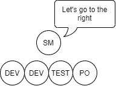
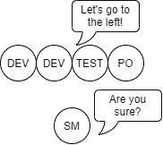
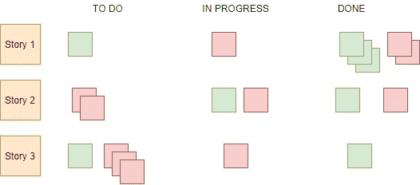
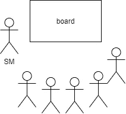

# 如何安排你的 Scrum 每日例会

> 原文：<https://medium.com/nerd-for-tech/how-to-fix-your-scrum-daily-meeting-d749ba41291c?source=collection_archive---------1----------------------->

所有 Scrum 仪式中最被误解和抵制的。

如果你问使用 Scrum 的人他们最不喜欢什么，很多人会说是日常会议。

“太花时间了”、“太浪费时间了”、“让我做真正的工作吧”、“我的会议太多了”等等。

这些是对它的典型抱怨，当然，它们也不是完全错误的。有烟就有火。

每日例会可能是最简单的事情，但却是处理得最糟糕的事情(当然，我也包括在内，有时我会心不在焉，很快就会忘记重点)。

通常，Scrum Masters 会尝试为这些抱怨提供短期解决方案(测量每个人的时间，更好地管理会议，传递发言令牌等)，但是，以我的经验，这些只是需要从根本上解决的更大问题的后果或症状。而根本原因很多时候在于团队的结构或者他们的工作流程是如何设计的。

这篇文章将描述我为提高每日会议的价值所做的一些技巧，这些技巧有望永远减少大多数抱怨。

# 症状:没有人在听

这是日常会议中最常见的问题:真正听团队成员说话的人只有 Scrum 主管和/或产品负责人。这显然是错误的。每日会议的主要目标是同步整个团队，如果没有人在听，就没有真正的同步。

## 主要原因:没有真正的团队

团队被定义为“为一个目标而一起工作的一群人”。但是，这真的是一个团队吗？在这个团队中，每个开发人员都在他们自己的故事中工作，或者开发人员和测试人员在相隔几天的时间里串联工作？答案是绝对的**不**。

“自我组织”的格言很多时候会导致 Joe 组织自己，Mary 组织自己，所有人都在筒仓中工作，因为这是“最有效的方式”(这是另一篇文章，我将讨论为什么我们寻求有效的团队，而不是高效的团队)。此外，许多开发人员喜欢单独工作，所以这一切最终形成了一个空洞的团队。

因此，日常会议行不通的主要原因是，it 团队**不是一个真正的团队**，解决这个问题的主要办法(一如既往)是**激励**的问题。

如果你告诉 Joe(开发者)他的目标是完成故事 1，Mike 有故事 2，他们会同步吗？没有，怎么了？因为他们根本不需要。

但是如果乔和迈克都被分配了第一个故事呢？然后双方会分工合作，朝着同一个目标努力。这是正确的激励。

## 解决方案 1:团队应该在单个故事中工作

如果你推动整个团队在一个故事中工作，那么他们将一起工作，在每天的会议上，他们都将参与讲述昨天发生的事情，什么阻碍了他们，以及他们今天将做什么。

这适用于团队人数少(3-4 人)以及故事多到足以分享的情况。如果团队更大，那么可能会形成迷你团队。我不认为我们能做什么来避免它，然而有迷你团队总比没有团队好，对吗？:).

例如，如果故事是:*作为销售用户，我想查看客户列表*，那么您可以按照以下方式划分任务:

*   任务 1:使用前 20 名创建数据库查询
*   任务 2:显示包含前 20 条记录的网格
*   任务 3:下一页
*   任务 4:上一页
*   任务 5:将数据库查询更新为偏移/限制

由于每个任务都是由一个团队成员完成的，因此所有的参与者都将朝着同一个目标努力:将故事交付给产品。例如，在这种情况下，一个前端开发人员、一个后端开发人员和一个测试人员可以完成这个故事。

## 解决方案 2:开发人员和测试人员一起工作

“无团队”问题的一个变体是开发人员和测试人员在竖井中工作，或者在主团队中的独立子团队中工作(开发人员在一边，测试人员在另一边)。我认为这不是团队的错，甚至也不是 Scrum 大师的错。这来自历史上根深蒂固的工作方式(即工厂装配线)，我们已经知道这是与他人合作的最有效的方式，许多(或大多数)在物理世界中起作用的工作都遵循同样的原则。

如何改善这种情况，让他们一起工作？再说一遍，这都是关于激励的。

如果你告诉测试人员:“你的目标是从开发中获得最多的问题”，那么这将是她的目标。请注意，这种指令或目标也会推动开发人员和测试人员之间不希望的“我们/他们”关系。

另一方面，如果你告诉开发人员和测试人员:“你的目标是在这个 sprint 中尽可能高质量地交付这个故事 X”，那么这将是他们两个人的目标，他们将一起努力实现它。

## 原因:人们是在自言自语，而不是和别人说话

有时，当人们谈论他们正在做的事情时，很常见的是他们开始谈论许多他们知道自己在做什么，但其他人不知道的概念。或者也许他们倾向于不分享他们正在做的事情的细节，让团队的其他人只是挂着或者根本不关心(根本不听)。

例如:“昨天我在排序的过程中工作，今天我将对网格进行分页”。

## 解决方案:“Sacar con cuchara las cosas”

在西班牙语中，我们有这个习语或短语“Sacar con cuchara las cosas”，意思是“从他嘴里挤出话来”。当有人对自己保留或隐瞒一些细节，但为了让别人理解，我们必须从他嘴里套出话来，或者开始提出更多的问题来了解细节(有点像你问你的孩子“学校怎么样？好”)。

根据前面的例子，SM 必须问更多的问题，以便团队的其他成员理解上下文。

*   “昨天我在整理过程中……”
*   “分类什么？”
*   "顾客"
*   "你能给我多一点这方面的信息吗？"
*   “可以按姓名和电话进行分类。上升和下降。今天我将负责编页码。”
*   “还有没有什么边缘案例？”
*   “嗯，实际上是的，因为客户名称可以重复，我们总是需要添加客户 id 作为第二个(和隐藏的)排序标准”。

你看出区别了吗？在后一种情况下，其他团队成员有机会提问或介入，从而丰富讨论内容:

*   “等等！我也有一个客户的故事，我认为我们需要重用相同的数据库查询”。
*   “我认为你对每部手机的排序会导致性能问题，因为…”。

所以基本上，**如果信息不在那里听，那么怎么会有人*听*？。**

# 症状:低价值会议结果

对每日例会的另一个抱怨是“它们是在浪费时间”。事实上，如果会议对与会者没有任何价值(或者价值非常低)，那就是浪费时间。我们会看到一些可能的原因。

## 原因:团队不了解 Scrum

这是新成立的 Scrum 团队中可能发生的一个原因。他们过去大多是单独工作，只有“需要时”才会聚在一起。所有团队成员都认为这是正常的，所以将每日会议推给他们，他们觉得这是一种“强加”或浪费时间。

## 解决方案:培训和解释

典型的解决方案肯定是提供真实世界的例子，制作一些关于它的游戏，试图让他们理解每天开会的价值，以及每天同步对他们来说有多么重要。

然而，他们只有在实践后才会吸收这个概念，所以接下来的原因/解决方案可能会更有效。

## 原因:SM 与团队不一致

日常会议通常由 Scrum 主管主持。但是有许多类型的 Scrum Master:一种完全不“干涉”,让团队自组织，另一种过多地引导会议，以至于会议最终成为 SM 和每个团队成员之间的独白或问答形式。

## 解决方案:壮大团队，了解它的温度

物极必反，同样适用于短信。一个团队需要什么，取决于团队的状态或成长(见塔克曼模型)和他们当前所处的环境。

最初，团队需要一个 SM 来领导会议并主持会议。它集合了团队，教导他们每个成员需要分享什么以及如何分享，并推动整个团队通过每天的会议。

但是，一旦团队了解了会议是如何召开的，理解了同步的价值，随着团队的成长和天生的领导者开始自己崛起，SM 也必须开始从团队的前面撤退一点，悄悄地走到团队的后面。

SM 在前面

背面的 SM

此外，SM 需要检查的一件事是团队温度和环境。有时，当内部或外部发生重大变化时，一个成熟的团队可能会变成一群新手。SM 需要意识到这一点，他有责任帮助团队回到正轨。

例如，一个可能的内部原因是一名高级团队成员离开了团队。这肯定会扰乱工作，并且会导致团队大大降低其速度。新技术的引入也会导致这种情况。

## 原因:视野变窄

当团队聚集在一起讨论 sprint 或项目的进展时，将讨论引向一个可见的共同焦点是非常有益的。这个焦点通常是吉拉或特雷罗董事会。

然而，吉拉或特雷罗或任何其他软件工具的一个主要缺点是它们所能提供的视图空间有限。空间显然受到计算机或笔记本电脑显示器的屏幕分辨率的限制，如果你有一个大型团队，手头有许多故事，有许多任务要执行，那么你将永远无法看到整个画面。

所以，通常情况下，人们会把注意力集中在他们目前看到的东西上，而不是整个 sprint，这实际上是整个团队每天应该讨论的问题。

## 解决方案 1:板与整个冲刺

如果你的团队视野狭窄，那么有两种方法可以解决这个问题。第一个是开阔他们的视野。怎么会？使用一个物理板，或者一个可以帮助你轻松放大和缩小的软件板，在一个视图中看到整个 sprint(我还没有见过任何工具可以做到这一点)。

就我个人而言，我喜欢物理板，因为它们的维护成本非常低，并且非常容易适应新的情况。我最喜欢物理板的一点是，我可以在一个视图中看到整个 sprint(甚至未来的 sprint ),并很快从中得出结论。

真实的故事。回到 2017 年，我和团队(我是 SM)一起做了一个实体板，橙色的便利贴是故事，绿色的便利贴是开发任务，粉色的是测试任务，板上有三列:待办事项、进行中、完成。

我们在开每日例会，sprint 的状态如上图所示。

所以在所有成员都给出了他们的更新后，我问道:“**你看到了什么？”**。我让他们思考了几秒钟，他们开始说:“我们在测试方面落后了”。我们确实接近了冲刺的尾声，故事 2 和 3 的测试已经落后，而开发已经走上正轨。

这在团队中引起了巨大的影响和转折:他们看到了墙上(而不是吉拉上)有一个大板子的价值，并赞赏这样一个事实，即看到 sprint 的进度和状态只是从板子上后退两步以查看全局。

这用一个词来概括:视角。使用一个可以很容易地为整个团队提供视角的工具。

## 解决方案 2: SM 需要加强对全局的关注

也有可能团队没有看到全局，因为 SM 或 PO 都没有关注全局。还记得著名的三个问题吗:你昨天做了什么？，是什么挡住了你？，你今天要做什么？。如果你仔细阅读，你会发现他们非常专注于任务，而不是冲刺。

这就是为什么一组更好的问题是:

1.  你朝着冲刺目标 X 做了什么？。
2.  为了达到冲刺目标 X，你今天会做什么？。
3.  我们会达到目标吗？如果没有，我们能做些什么来解决这个问题？。

带着这些问题，团队将注意力放在冲刺目标上，新的解决方案就会出现。当焦点集中在任务上时，团队的思维倾向于把它的想法局限在任务上。

## 原因:会议不够有见地

会议产生的价值可能与以下因素成正比:

1.  啊哈的次数！时刻发生([韦氏词典](https://www.merriam-webster.com/dictionary/aha%20moment)对它的定义是:*突然意识到、灵感、洞察力、认识或理解的时刻*)。
2.  在会议中决定的行动项目的数量:当可执行的和即时的计划在会议后被决定/同意执行时(并且它们实际上被真正执行)

在以下情况下也会被减去:

1.  会议很无聊，没人记得说了些什么。
2.  讨论了问题，但没有商定可行的解决方案或项目。

## 解决方案 1:难题

Scrum 大师必须具备的能力之一(事实上，任何高级工作人员都必须具备)是意识到并愿意提出困难的问题。困难的问题开启了对真实情况的新见解，并允许团队找到问题的根本原因，从而朝着找到真正的解决方案前进了一步。

困难的问题应该总是以巧妙和诚实的方式提出，但同时要机智和强调过程(我们不应该排除个人背景或知识，但这些问题最好私下解决)。

困难的问题可以从简单的“X 是什么？”更复杂的问题“你认为谁有答案？”或者“如果你的代码失败了会怎么样？”或者“这个 X 是春季目标的高优先级还是低优先级？”甚至是“如果乔错了呢？”。

## 解决方案 2:以总结结束会议

我们的大脑往往具有短暂的注意力和记忆力，如果信息没有以正确的方式组织，那么我们中的许多人就很难记住所讲述或描述的细节。

这就是为什么在会议结束时做一个简单的总结将有助于每个人记住会议的主要项目，并让每个人都有一个总体感觉，即许多事情已经完成，以及我们离 sprint 目标有多远或多近。

此外，最终总结有助于收集整个团队是否正确理解所有内容的反馈。

## 解决方案 3:每日会议的结构

每日会议通常按以下布局举行:一个董事会，所有成员在董事会前形成一个半圆，SM 在董事会旁边，人们轮流(可能从右到左)讨论这三个问题。

虽然这很有效，而且你肯定能从中获得一些价值，但它并不那么有效，尤其是当你在做一层的团队解决方案的时候。这是因为，如果你把会议的叙述(或者人们从头到尾所说的话以及讲述的顺序)抄在纸上或者写成一个故事，那就没有意义了。

如果你想推动成员作为一个团队工作，那么也要推动他们作为一个团队来讲述故事。

因此，一个更好的结构是，会议按照每个故事的顺序进行，所有参与故事的人都谈论并提供状态。这意味着，对于故事 1，Joe、Mike 和 Mary 将谈论它，它进行得如何以及缺少了什么。然后，对于故事 2，Jill 和 Mary 将讲述该故事的状态。

看到玛丽说两次了吗？是的，这是一个后果。但是，如果您记录会议，那么您将会非常清楚每个故事的开始和结束，这比说两次更有价值，不仅对 SM，而且对整个团队，因为对正在发生的事情的理解更加有序和集中。

这种结构还允许您在会议从优先级别到次要级别的过程中做出更好的决策，从而为待办事项中最重要的项目提供更多的资源和时间。

作为最后一部分，我想告诉你为什么每日例会是 Scrum 中最重要的事件。

通常，Scrum 提到的唯一时间盒是冲刺(1-4 周)，然而，我相信有一个更重要:一天(或者一天，或者一天，我不确定如何命名)。

一天中，你从早上 9 点开始，到下午 5-6 点结束一个工作周期。在周期结束时(同样作为一个 sprint)，你应该获得一个有价值的交付，不一定是在用户价值方面，而是在团队价值方面:一些对你的日常目标可测试、可编译、可见或有形的东西，这反过来又对你的 sprint 目标有帮助。

一天是一个周期，因为一旦你回家做任何其他活动，你的注意力就会转移到其他事情上，你开始一点一点地“忘记”你以前做过的事情。因此，重要的是你的周期结束时没有“未完成”的任务，所以在下一个周期(第二天)，你可以从那里开始，朝着冲刺目标取得真正的进展。

而且，像任何其他时间盒一样，通常你在开始时计划你要做什么，希望在结束时你有预期的输出。因此，作为一个有计划事件和回顾事件的 sprint，每天也有这些事件，但是合并成一个事件:每日会议。

每日例会是对前一天所做事情的回顾，以及当天将要做的事情的计划。由于适应性是 Scrum 的支柱之一，这个计划可以根据每个周期(每天)的环境和上下文每天改变。

作为这篇很长的文章的总结，这些是要点

*   许多人不喜欢日常会议，有时，这是一个结构问题。
*   如果没有人在听，那是因为他们不感兴趣。
*   给你的团队一个单一的目标 sprint backlog 中的第一个故事。然后他们会感兴趣，他们会参与和倾听。
*   如果人们一开始没有给出信息，提取信息。
*   为你的团队服务，适应他们的需求和能力。这样每天的会议将会有最大的效果。
*   使用一块能让你快速进入冲刺状态的板子。
*   扩大会议的关注点，始终关注每一次冲刺，而不是每一项任务。
*   敢于提出难题。
*   将会议重组为每个故事(而不再是每个人)。
*   虽然被错过了，但是每日例会是 Scrum 中最重要的事件。这是你唯一可以做出及时决定的时刻，让你在正确的时刻和正确的人一起适应不断变化的环境。

希望这篇文章对你有用，并且让我知道是否有其他的策略可以解决每日例会的问题。

我有意抛弃次要的解决方案，去寻找攻击结构和基础的解决方案。我不是说它们不起作用，也不是说它们没有价值。他们是。但有时我们必须跳出框框，才能永远解决问题。

快乐 scrumming！