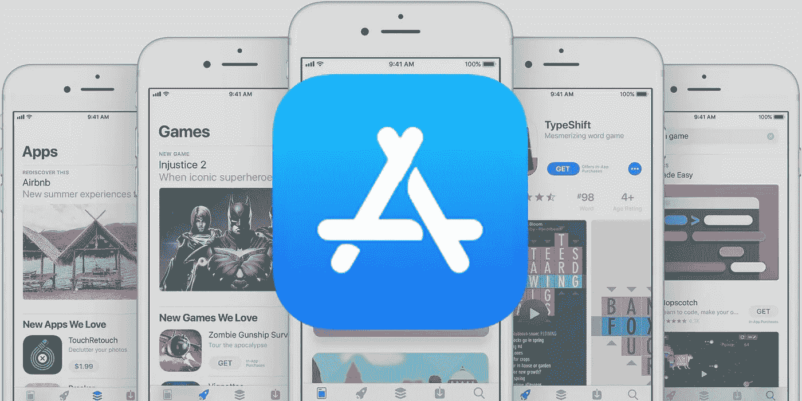

# 如何让你的 Flutter 应用程序进入应用程序商店

> 原文：<https://medium.com/nerd-for-tech/how-to-get-your-flutter-app-to-the-app-store-1fa07b0d6deb?source=collection_archive---------0----------------------->

准确，从零开始详细指南困惑。包括试飞和获取外部链接。我写这个故事是因为许多教程和指南错过了一堆步骤，这里的一些信息很难在网上找到。



## 第一步:要求

你需要做的第一件事是确保你已经在你的设备上正确安装了 Flutter。你可以通过打开一个终端，运行“颤振医生”来确保。如果有任何错误，请在继续之前修复它们。

## 步骤 2:导出路径

打开装有 Flutter SDK 的文件夹。然后，通过终端导航到它并运行“触摸”。zshrc”。这将为您在文件夹中创建一个隐藏文件。然后，打开另一个终端，运行命令`*defaults write com.apple.finder AppleShowAllFiles TRUE ; killall Finder*` 使文件可见。然后只需打开创建的文件并粘贴:

```
export PATH**=**"$PATH:[PATH_OF_FLUTTER_GIT_DIRECTORY]/bin"
```

保存它，你就可以走了！

## 步骤 3: IDE 到 XCode

在首选 IDE 上打开项目，然后通过终端导航到项目的“ios”文件夹。然后，使用以下命令安装 cocoapods:

> sudo 宝石安装椰子

然后，要安装 pub 文件并使用 pod，请按顺序使用以下命令:

> pod 初始化
> 
> 扑扑酒馆 get
> 
> pod 安装
> 
> pod 更新

虽然有些步骤听起来可能不必要，但最好不要跳过任何步骤，以免出错。

## 步骤 4:获得构建

只需从 ios 文件夹导航回根文件夹，然后运行:

> flutter 构建 apk —发布—详细

## 步骤 5:到 XCode

安装颤振插件。然后在你的 IDE 上右击你的项目名，选择 Flutter 选项里面的“在 XCode 上打开 IOS 模块”选项，把它转移到 XCode 上。

## 第六步:Xcode 到 App Store

首先，开一个苹果账户，购买苹果开发者订阅。请等到批准后再继续。

在 XCode 里面打开你的 Flutter 应用后，点击 **Runner** 标签，在 **General** 标签下给它一个唯一的 **Bundle 标识符**。如果您是第一次部署这个应用程序，那么自动生成的应用程序可能是独一无二的。

然后，导航到“签名和功能”选项卡并选择一个团队。如果您没有，只需通过同一个窗口登录您的 Apple Developer 帐户。

现在你可以在浏览器上导航到 developer.apple.com。登录，点击“证书、标识符和配置文件”。导航到“标识符”选项卡。点击蓝色加号图标，选择“应用程序 id ”,然后点击继续。选择“应用程序”并点按“继续”。根据需要输入您的应用描述和之前的捆绑包 id。如果您的应用程序使用下面列出的任何苹果服务，请选择它们，如果没有，请不要选择任何服务。单击继续。

在浏览器上打开一个新标签，输入[appstoreconnect.apple.com。](http://appstoreconnect.apple.com)点击“应用程序”，然后点击蓝色加号，再点击“新应用程序”。在打开的窗口中，选择“IOS”，选择一种主要语言，然后选择我们刚刚通过标识符选项卡添加的捆绑包 ID。最后，为 SKU 输入一个唯一的关键字，然后单击“创建”。

回到 Xcode，在上面写着“Runner >”的标签上，点击设备名称，而不是默认设备，选择“任何 IOS 设备”。最后，点击产品>存档，让您的项目存档。如果需要，请输入您的笔记本电脑的通行证。完成后，点击“分发应用程序”。然后，您可以通过单击“Next”继续使用默认选项来上传构建。

## 第七步:试飞(可选)

要获得测试链接或通过电子邮件邀请测试用户，你需要进行试飞。

为了让你的应用程序进行测试，只需在你的应用程序页面上进入 appstoreconnect.apple.com[的“测试飞行”标签。你需要做的第一件事是找到左边的**一般信息**选项卡，点击下面的**测试信息**。在那里，您需要填写所需的区域，以便能够测试您的应用程序。然后在侧面，你会看到**内部测试**和**外部测试**选项。如果您想通过电子邮件邀请测试用户(如果您没有任何注册用户，请单击上面的**用户并访问**选项卡来添加一些)，只需单击**内部测试**选项卡旁边的蓝色加号按钮，创建一个组并输入测试人员的电子邮件。相反，如果你想与测试人员共享应用程序作为链接，用**外部测试**选项卡做同样的事情。那么剩下唯一要做的就是实际提交你的 app。](http://appstoreconnect.apple.com)

要提交您的应用程序，请等待处理完成，然后单击您刚刚在 TestFlight 选项卡上上传的应用程序版本旁边的(1 ),并单击提交。您可以为描述键入任何内容。确保在同一页上添加测试组，否则，您的应用程序将不会提交测试。请记住，Apple 团队可能需要一段时间来审核和批准您的提交。

在你的应用程序通过苹果团队的审查和批准之前，你会在 TestFlight 标签上看到“等待审查”的字样。它会是黄色的。当它变为绿色且状态变为“测试”时，您的内部用户将在其收件箱中收到通知电子邮件，或者您的外部用户可以通过导航到您已创建的外部测试组并点击**公共链接**部分来创建链接。与您喜欢的任何人共享此应用程序！

## 步骤 8:发布应用程序

一旦构建被上传并通过苹果团队的审查，你就可以发布你的应用了。只需在[appstoreconnect.apple.com](http://appstoreconnect.apple.com)的 App Store 标签页，在你刚刚上传的应用下配置&并提交即可。

为了提交你的应用，你必须首先添加你的应用的屏幕截图。你可以通过 Xcode 模拟器，点击每个截图上的照片图标来获得这些。确保添加至少两张在每种所需设备类型上拍摄的屏幕截图。您可以使用下面列出的设备进行截图:

*   6.5 英寸——iPhone 11 Pro Max、iPhone Xs Max
*   5.5 英寸——iPhone 8 Plus、iPhone 7 Plus、iPhone 6s Plus
*   iPad Pro (12.9 英寸)
*   iPad Pro (12.9 英寸)

确保整齐地填写标题、描述和联系信息部分，因为最终用户在下载过程中会看到它们。填写左侧的应用信息、定价和可用性、应用隐私标签。使用右上方的按钮填写表格时，请保存每个表格。如果你的代码中已经有了图标，你就不需要上传图标，如果没有，你应该通过同一个控制台上传。完成这些步骤后，点击 IOS 应用版本并选择您要发布的版本。如果你有多个上传的，确保选择正确的。然后，点击提交以供审查。如果你的应用程序提交遗漏了什么，在这一步你会得到一堆错误。请确保修复并保存每个文件，然后再次提交。

一旦苹果团队批准了你的应用，瞧！这可能需要 48 小时。您将通过电子邮件获得通知，在您的控制台上，在 IOS 应用程序部分，您会看到它已发布，并带有绿色复选图标。您可以对每个版本执行相同的步骤来升级您的应用程序，但请确保更改您的版本以避免混淆。