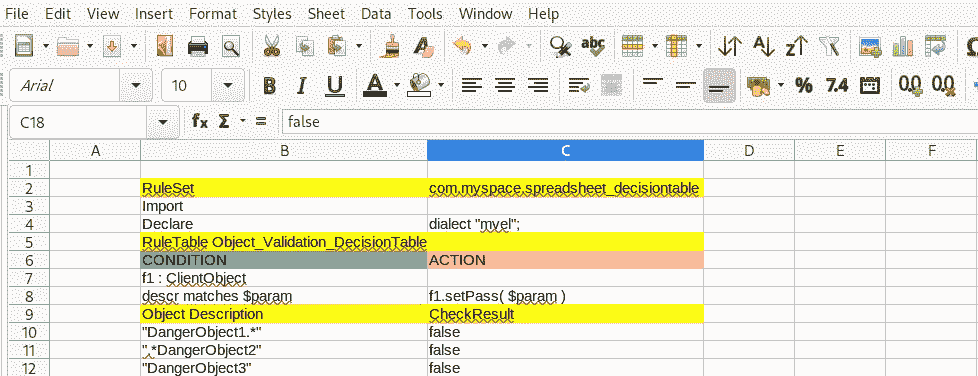

# 如何在 Drools-Part2 中处理 100k 行决策表

> 原文：<https://medium.com/nerd-for-tech/how-to-handle-100k-rows-decision-table-in-drools-part2-2b7fb4de3532?source=collection_archive---------4----------------------->

正如我在上一篇文章中所描述的，我们在解决 100k 行决策表时遇到了一个性能问题。

# 解决方案 2:预编译电子表格规则

顺着解决方案 1 的纵向思路，我觉得可以改善问题对应的情况:

1.  不要在运行时动态加载 Excel 数据，让我们在构建时预编译它
2.  使用 drools 电子表格决策表，以便它可以被 KIE 工作台“版本控制”；

当 drools 使用规则模板+ Excel 来触发规则时，它实际上做的是:

1.  使用 ExternalSpreadsheetCompiler 将规则模板和规则数据(即 Excel 文件)编译成 drl(Drools 规则语言)
2.  Drools 引擎将 drl 编译成 java 字节码
3.  java 字节码形成的规则在 JVM 中被激发

那么我们能在运行时之前做第一步吗？更好的是，我们能完成转型的前两步吗？

幸运的是，答案是肯定的，drools 已经提供了一个友好的 maven 插件(kie-maven-plugin)来预编译 drl，或者将 drools 感知规则格式转换成 java 字节。它被称为 [Drools 可执行模型](http://blog.athico.com/2018/02/the-drools-executable-model-is-alive.html#:~:text=The%20purpose%20of%20the%20executable,lambda's%20for%20the%20index%20evaluation.)。

一石二鸟，它使什么是好的更好。为了应用 drools 可执行模型解决方案，我们需要将原始 Excel 格式转换为 drools 感知电子表格决策表。它可以由“kie-workbench”管理，因此问题 2 得到解决。我们需要做的只是将 drools 语法“header”添加到决策表中。

正如你所看到的:

**B7: f1: ClientObject** ，是事实声明；

**B8: descr 匹配$param** ，是条件逻辑

**C8: f1.setPass($param)** ，是动作逻辑；

就是这样。

让我们快速回顾一下变化，然后测试性能改进。

解决方案 2 存储在[预编译-规则-解决方案](https://github.com/ryanzhang/drools-bigtable/tree/precompile-rule-solution)分支中。

kie-maven-plugin 为我们做的是:

1.  使用 drools-model-compiler 转换电子表格决策表，生成 10206 java 代码(注意，它甚至比 drl 文件更好)
2.  生成的 java 代码被编译成字节码并打包成 jar

因此，当 myapp 客户端代码加载 jar 文件时，它会直接调用字节码，而无需分析 Excel 文件和 drl 解析器等。

重要的是，业务逻辑仍然被包装成它自己的项目，而不是泄漏到通用的应用程序代码和生命周期中。

让我们看看解决方案 2 的性能:

将性能数据放入表格中进行比较:

# 赞成

通过应用 drools 可执行模型，我们获得了两个明显的优势。

1.  运行时性能明显提高。
2.  电子表格决策表可由“kie-workbench”监控

有时候，当一些用户开始采用面向规则的应用程序框架时，这一点并不明显。但是从规则治理的角度来看，这是非常重要的，比如版本控制你的规则数据，部署测试和发布你的业务规则。在 kie workbench 的帮助下，所有这些特性都是现成的。

# 欺骗

我认为解决方案 2 有两个缺点。

1.  编译时间相当长

对于 10k 行数，1.5 分钟的编译时间似乎是可以接受的。它实际上生成并编译了 10k 个小 java 文件。

但是对于 100k 行的数字，它不能得出一个合理的编译时间。大约需要 15 分钟完成。这将变得非常尴尬，无论是开发经验还是 CICD 的经验。只是当规则变成一定级别的金额时，花费了太多的精力。

2.当行数太大时，比如 100k 行，性能提升非常小。

对比预编译它的巨大努力，性能增益并没有我们从表中的对比数据中看到的那么大。

对于一定数量的决策表，预编译规则似乎可以显著提高运行时性能。我认为这值得一试。

然而，当决策表达到 100k 时，似乎仍然不能产生很好的结果。

然而在现实中，关键字或条件值变得非常大是很常见的。因此，我们仍然需要一些更好的解决方案来处理 100k 的行决策表。

在我的下一篇文章中，我将展示一种不同的方法(我称之为横向思维)来转换事实和规则的维度以提高性能。