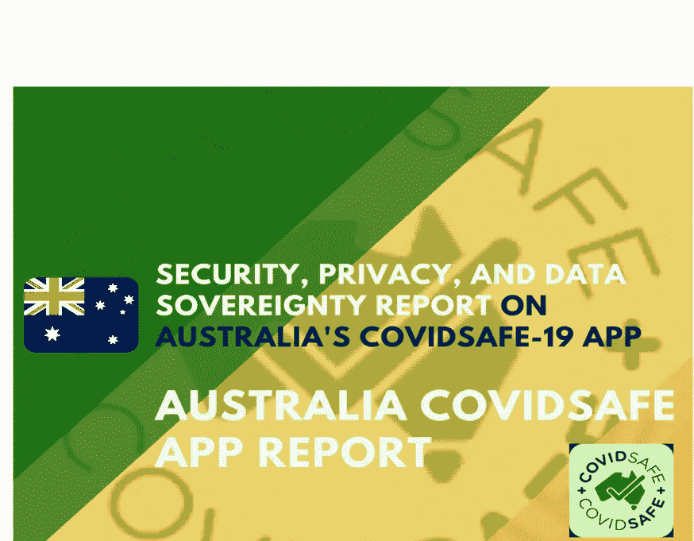
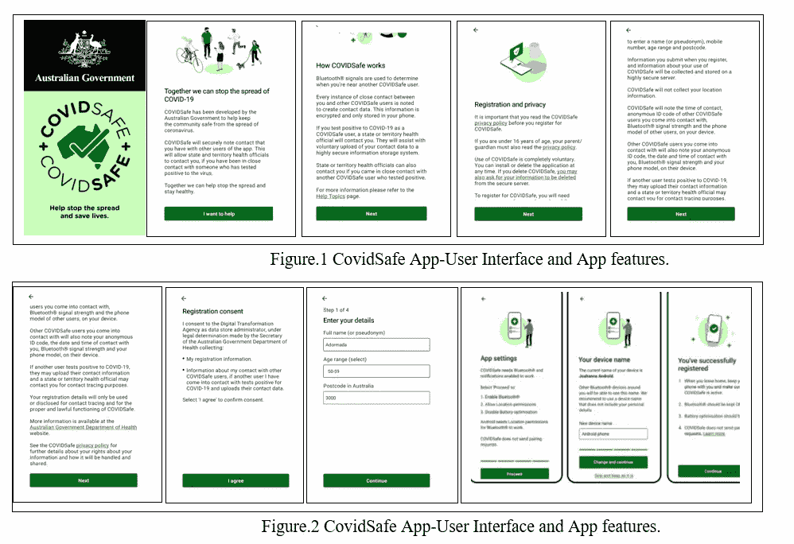
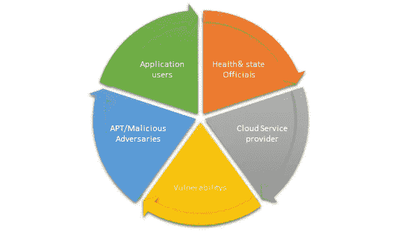
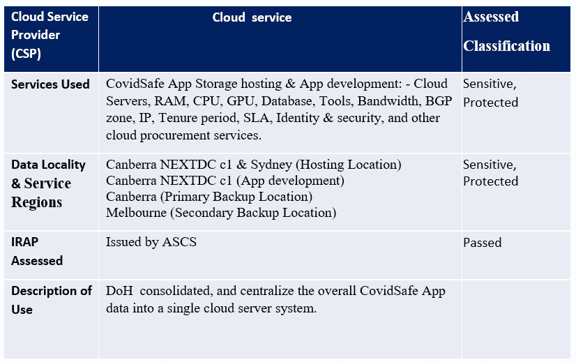
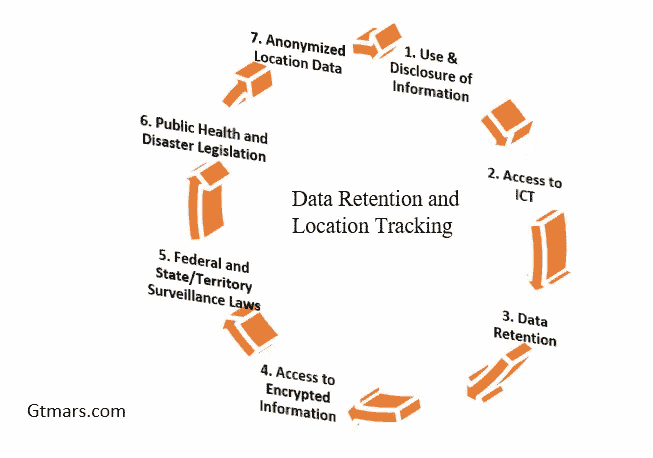

# 澳大利亚的 CovidSafe App 关于澳大利亚公民/合法居民隐私、安全、数据主权的报告？

> 原文：<https://medium.com/nerd-for-tech/how-to-identify-the-security-privacy-and-data-sovereignty-information-of-australias-covidsafe-19-75902ff4b796?source=collection_archive---------1----------------------->

这篇全面的文章记录了澳大利亚卫生部(DoH)的 COVIDSafe 接触追踪应用程序，它如何保存澳大利亚人和移民的个人数据，存储在云上的数据，以及它对安全、位置**、**和澳大利亚公民隐私的威胁和风险。

# 澳大利亚的 CovidSafe 应用程序关于隐私、安全性、合规性和数据主权信息以及澳大利亚公民/合法居民问题的报告？

CovidSafe 应用程序-澳大利亚 2019。

**1。简介:**

★澳大利亚联邦由六个州和联邦授予的两个自治领土组成。卫生部和澳大利亚健康保护主要委员会(AHPPC)各部门单独负责采取初级公共卫生措施应对新冠肺炎大流行，如检测、接触者追踪、发展、社会距离、健康标准和要求、旅行和边境限制，以及在澳大利亚各地区实施协议控制。卫生部和 AHPPC 遵循国家的宪法结构和相关法律、计划和安排，制定了 Covid Safe 应用程序和措施。

★澳大利亚政府卫生部(DoH)现已决定为澳大利亚和非移民公民开发一款新冠肺炎接触者追踪应用程序。应用程序数据将托管在美国一家主要的公共云提供商上，以托管用户新冠肺炎 CovidSafe 的数据。卫生部可以更好地了解每个公民的健康状况，并希望通过虚拟相同工作流接触追踪应用程序将该数据与他们掌握的每个公民的其他数据联系起来。

★它帮助卫生部官员、研究人员和其他公共机构通过云系统以有效的方式管理公民。卫生部联系了一家主要的美国云服务提供商(CSP)将数据托管在云上，并敦促政府将数据托管在澳大利亚境内，以确保用户及其公民的隐私数据安全、数据保护和数据主权。

**1.1 covid safe app 分析的范围:**

> (I)本节根据以下部分的讨论，总结了新冠肺炎卫生部 CovidSafe 应用程序云项目的要求列表。
> 
> (二)用户数据安全存在的威胁和风险 **-** CovidSafe App。
> 
> (iii)分析使用 CovidSafe 应用程序对用户数据、位置和活动隐私的可能威胁。
> 
> (iv)分析可能适用于在澳大利亚境内的美国云存储中存储 CovidSafe 应用程序数据的现有和正在发生的数据主权问题。
> 
> ㈤安全控制的类型和应采取的措施。

1.  **安全控制:**

防止用户数据丢失或泄露的可能的安全控制措施

**2。隐私控制:**

分析用户隐私、数据隐私、位置和用户活动。

**3。数据主权控制:**

确保 CovidSafe 应用程序数据受澳大利亚数据主权法律保护。

**1.2 背景问题:**

> 全球范围内新冠肺炎疫情病例的突然增加已经在全球 215 个国家和地区造成了相当大的混乱。然而，一些国家已经开始使用个体追踪方法来试图控制病毒的传播。许多国家已经开发了跟踪人们及其活动的手机应用程序。卫生部将采用基于云的解决方案，以可扩展、安全和最具成本效益的方式支持和集中整个卫生部组织的 CovidSafe 应用程序信息共享。

来源:谷歌搜索

**1.3 风险评估的范围:**

★本文介绍了一项详细的评估，旨在支持卫生部(DoH)的 CovidSafe 应用战略和实施流程。这份报告记录了**卫生部**新冠肺炎接触者追踪应用程序，该应用程序将澳大利亚公民的个人数据存储在云上，它涵盖了对本国公民的安全、位置和隐私的威胁和风险。DoH 考虑了项目对应用程序用户隐私和数据管理的潜在性、威胁和风险，并提出了多种安全、隐私和数据主权控制措施，以加强用户移动设备上的 CovidSafe 应用程序和 DoH 公共云上的数据。

**2。CovidSafe 应用程序:**

★澳大利亚政府卫生部(DoH)开发了一款名为“ **COVIDSafe** 的应用程序，以应对澳大利亚**的新冠肺炎疫情疫情。COVIDSafe 应用程序有助于保护社区和公共工作人员免受冠状病毒感染。**

**2.1 COVIDSafe App 技术目标:**

★CovidSafe 应用程序在用户智能手机的后台运行，它使用内置的“**蓝牙技术**，并在**10 米范围内**寻找其他安装了 covid safe 应用程序的设备，并记录用户 A 和用户 b 之间发生的活动，如手机号码、姓名、邮政编码、时间戳、距离、参考代码和实际接触持续时间。该应用程序不会计算或记录或跟踪用户的位置。例如，用户 A 和用户 B 在 1.5 米范围内的**同一地点停留了大约 15 分钟或更短时间，这些数据可以存储在智能手机上的用户应用程序中，稍后在安装和注册帐户时，在用户同意的情况下，这些数据将被上传到云系统。所有存储的数据都用最高加密协议**加密，即使是自己的用户也无法解密或访问。事件信息在应用程序中存储的最长时间为**“21 天”**，超过设定时间后，数据将自动删除。****

**2.2 COVIDSafe App UI:**

★在 Android 和 iOS 平台上开发的 COVIDSafe 应用程序可在不损害用户个人隐私和数据的情况下，协助卫生部和卫生官员追踪接触者。下图显示了 COVIDSafe 应用程序的用户界面，以及在机上询问的信息类型，以了解用户在手机上调用的隐私、安全和数据设置控制类型。

**2。COVIDSafe 应用程序门户的个人身份信息(PII)战略:**

★PII 的范围可能从姓名、地址、出生日期和工作地点等常见数据元素，到身份证件、**社会安全号码(SSNs)** 或其他**政府颁发的标识符**、精确的位置信息、病史和生物特征。

> ★下面给出的演练过程有助于理解收集和组织用户信息的内容和方式，还提供了应用程序上使用的数据收集、隐私和技术的**概述。**

下载并安装 COVIDSafe 应用程序

阅读我们如何阻止传播，然后选择“我想帮忙”

了解 COVIDSafe 的工作原理，然后选择“下一步”

阅读注册和隐私信息，然后选择“继续”

阅读同意收集您的注册和联系信息，然后选择“我同意”

要注册，请输入:姓名、年龄、电话号码、邮政编码，然后选择“继续”

输入您的电话号码，然后选择“获取 PIN”来验证您的号码。

输入 6 位密码，然后选择“验证”

选择“继续”继续启用蓝牙和通知。

用户注册并获得许可后，确认状态会显示“COVIDSafe 已激活”。

**3。用户数据安全存在的威胁和风险:**

★在 COVIDSafe 应用中，使用 AI 和 Bigdata 等前沿技术集中数据，高效地创建、收集、分析、处理受影响的新冠肺炎用户数据，存储、维护、传播、披露和处置公共云上前所未有的大量受影响和未受影响的用户敏感 PII。

★通过 COVIDSafe App 请求 PII 的**威胁和风险**要素如图 3 所示

图 3 用户 PII 数据元素的威胁和风险。

**3.1。应用用户:**

★一旦用户成功完成车载过程并启用蓝牙功能，他们就会不时收到有关新冠肺炎的信息和健康相关的通知。然而，由于蓝牙支持的应用程序的普及，可能会利用用户的活动，并开始在用户事先不关心或不了解背景的情况下获取更多数据，这导致了 DoH 和公众对额外数据和隐私的关注。

★最初版本的 **COVIDSafe 1.0.11 应用**将包括附加(设备 id、时间戳)的所有跟踪数据以纯文本格式存储到 SQLite DB 中，并且该应用没有根检测逻辑过程，这导致了对用户移动设备的潜在**链接攻击**。也就是说，后来的版本解决了安全问题。

**匿名数据收集:**

CovidSafe 应用程序收集用户手机型号、应用程序版本和其他未公开数据方法的少量匿名数据，以帮助应用程序开发公司提高应用程序效率和改善更好的用户体验。

**3.2。卫生和国家官员:**

★COVIDSafe App 正在使用类似于**新加坡政府**"**trace together App "**源代码实现的技术的集中式方法。然而，由于用户之间共享令牌，从普通用户收集的数据仍然不太容易受到攻击，但受影响的用户将数据上传到服务器( **AWS 公共云**)存在风险，受影响的用户数据暴露于攻击、服务提供商和 DoH 的未来使用目标。只有 **DoH 可以评估**用户的身份、临时 id，以及在**21 天内更改联系日志**。这引起了对用户跟踪和数据收集的关注，对数据渗透、泄露或攻击造成了严重威胁。

**3.3 云服务提供商和多家厂商:**

★在该项目中，DoH 和 DTA 依靠**外部服务提供商**进行公共云访问、协议、应用程序开发，并在澳大利亚地区托管 CovidSafe 应用程序数据。澳大利亚政府已经选择了一家主要的**美国 AWS 云服务提供商(CSP)** 进行整体托管，如原型、应用程序开发和对 DoH 的运营支持。

★其他多家**第三方公司**参与网络安全相关支持服务【gosource】和 shine on app 开发**吕德**与 **Doh 和 DTA** 签订了两份 app 开发和发布合同。★不同厂商对数据处理、应用程序开发造成的隐私和安全威胁对公众和政府来说都是巨大的。

表 1 云服务提供商(CSP)。

**3.4 漏洞:**

★来自用户的 CovidSafe 应用程序数据存储在用户的设备上，并在标准加密的帮助下通过互联网传输到托管的云服务器。因此，数据是加密和安全的。尽管如此，攻击者仍有可能通过一些可用的环路孔来拦截介质上的这种通信。

★在发布初期，协议实施中存在两个主要的隐私和安全问题，这可能**潜在地允许**恶意第三方确定用户的静态标识符。在用户之间的握手期间，相同的 TempID 将被返回到设备，对 **TempID 模式**构成威胁。在不重新设计协议的情况下，在 **GATT 模式**下运行**有效载荷**和设备标识符时，还有一些问题没有解决。

**3.5 APT/恶意对手:**

★在全球范围内，许多公共部门发布了他们的联系人追踪应用程序的算法和源代码，潜在的对手利用开源材料和学到的架构，通过各种攻击方法操纵系统。在城市地区，攻击者可以使用蓝牙广播或接收器进行安全攻击，而不会留下足迹。另一方面，在 play store 或 iOs 上可以获得伪造或假冒的应用程序，如果 DoH 不对澳大利亚公民进行宣传，成千上万的人可能成为数据受害者。

**3.6 静态数据:**

★托管 AWS 服务器上的数据暴露在 APT 黑客的潜在风险中。托管服务器和 CSP 基础设施在存储和 IAM 上具有纵深防御安全层非常重要，也是一个大问题。主要关注的是授权的 DoH 官员在其系统上使用的应用程序和软件，任何过时的操作系统、软件、插件、工具、浏览器都可能触发攻击者的路径，并通过适当的渠道获得对托管服务器的访问。

★传输到服务器位置的数据是未知的，如果应用程序的数据加密被破坏，它可能会被拦截，数据被盗。

**3.7 蓝牙安全和问题:**

★事实上，CovidSafe App 实现了许多安全模块来保护用户的数据和隐私。

★24/7 开启蓝牙存在安全风险。

★最终用户设备在 100 米范围内对攻击者可见，有助于掩盖黑客身份。

★一个简单的黑客技术就能获得手机内部数据。

★强制配对可以很容易地完成。

★其他第三方应用出于各种目的利用用户数据。

**4。App 数据的隐私安全和位置:**

★在本节中，考虑了以下风险因素以促进隐私安全，以及 CovidSafe 应用程序的位置风险和问题。在本评估报告中，隐私和风险因素以及关于隐私和安全的指导和控制建议被构建为更详细的视角。

**4.1 PII 信任等级:**

> ★根据 2002 年**健康记录和信息隐私法案(HRIP 法案)**中的**健康隐私原则(HPPs)** 和《联邦隐私法案》中的**澳大利亚隐私原则(APPs)** 以及 2020 年隐私修正案(公共健康联系信息)法案，个人身份和团体身份属于 2020 年 4 月 25 日颁布的《2015 年生物安全法》。

★来自这两个类别的 PII 病毒是可追踪的，并且只能由卫生部的卫生官员联系起来识别个人，明确地向公众和立法者说明，未经评估也不受执法机构的控制。因此，DoH 管理层需要指定一个人来执行数据管理和控制的隐私风险模型，以细化信任级别。

**4.2 PII 隐私边界线:**

★卫生部尚未确定员工敏感的 PII 数据的隐私界限，卫生部董事会应意识到其他澳大利亚机构可能会访问任何个人的数据。尽管隐私法(1988 年)法案下的新**法律和参议院委员会针对公众的事实，澳大利亚执法机构禁止访问 CovidSafe 应用程序数据，即使在任何司法管辖区的法院命令下也是如此。但是在疫情结束后，新的立法可能会凌驾于其他联邦、州和地区的法律之上。**

**4.3。数据处理(收集、存储、处理):**

★对云系统操作执行的数据处理操作包括创建、收集、保留、SIEM、分析、传输中的数据、数据备份和披露以及从云中处理 PII。因此，数据操作表明个人处理的数据是有问题的威胁，DAS 需要对数据处理和管理进行风险评估。

**4.4 CovidSafe 源代码关注:**

★然而，CovidSafe App 源代码被**数字转换机构(DTA)** 公布给公众和研究人员，以审查技术漏洞。但是政府没有公布服务器的源代码。这让研究人员迷惑不解，无法进一步审查数据是如何在何种加密标准下存储的。相反，新加坡政府在发布应用程序和服务器端的源代码方面非常自由。

**4.5 位置跟踪-CovidSafe 应用:**

★数据保留和位置跟踪确定了**信息和通信技术(ICT)** 的几个因素，这些因素可能会引发对静态和传输中的应用程序数据的隐私和安全担忧。《国民保健服务法》有一个例外，它允许卫生部在各州和世界卫生组织(世卫组织)之间共享或交换健康监测信息活动。

★澳大利亚电信法案(1997 年)强制要求 1、2、3 级提供商披露其基础设施和公共服务中与 PII 相关的信息，包括(电话、互联网服务、许可证、位置)移动电话的使用。**隐私法(1988)** 允许根据法院命令向执法部门披露信息，并且所要求的理由符合指控嫌疑人或罪犯的国家安全事项。上传到服务器的数据属于上述法案的范畴，对立法造成困扰。

★**1979 年 ASIO 法案**和**犯罪法案(1914)** ，允许使用监视和跟踪的空间。这些州的大规模监控立法禁止在未经个人明确同意的情况下通过 GPS 跟踪 CovidSafe 数据。在第 5 节中，数据主权广泛地涵盖了关于数据保留、收集和个人公民位置的详细联邦法律和法规。

**4.6 自动数据删除:**

★存储在用户手机上的数据，21 天后将根据轮换方案自动删除，删除的数据可以使用恢复软件恢复。如果任何用户向服务器提交了数据，这些数据在新冠肺炎疫情结束之前不会被销毁，这个选项对那些希望自己的数据被删除的用户构成了威胁。

**4.7 CovidSafe 数据周期:**

★普通大众的一个主要问题是，要多久才能跟上应用程序，以及存储的数据的状态如何。**卫生部**预测并确定 App 数据期的结束。当**卫生部和卫生部**发布官方声明时，澳大利亚公众不再要求或强制使用 CovidSafe 应用程序。延长期限后，不得从任何来源下载应用程序，不得从应用程序中收集更多数据，任何官员不得访问任何数据，限制管理员访问应用程序数据，并采取预防措施从服务器上永久删除数据，销毁服务器，从政府规定的日期取消合同。

**4.8 安全观点:**

★从安全角度来看，由于设计缺陷和当前版本不可避免的蓝牙中继攻击的一般性，该应用程序存在一些技术漏洞。对于大多数用户来说，该应用程序似乎不会增加攻击面，那些在手机上使用其他蓝牙相关应用程序的人应该谨慎对待应用程序上的数据和安全设置。

**5。数据主权:**

★澳大利亚的**州、联邦和地区法律**可能与《云与信息法案》法律有所不同，该法律允许 aws 云提供商保证已采取足够的安全措施、合规性和风险评估来保护 CovidSafe 数据。

**5.1 治理、风险和合规:**

★评估从 CSP 继承到云环境的潜在风险可以通过评估澳大利亚隐私原则来缓解。

**5.1.1 数据保留和位置跟踪-CovidSafe 应用:**

★澳大利亚政府出台了《隐私法》( 1988 年),以规范和控制公共部门(服务、政府机构)和私营部门处理其管辖范围内的个人 PII 和其他敏感信息，以及 CSP。

★数据保留和位置跟踪确定了**信息和通信技术(ICT)** 的几个因素，这些因素可能会引发对澳大利亚境内静态和传输中的应用程序数据的隐私和安全担忧。

图 4 数据保留和位置跟踪-CovidSafe 应用程序。

**5.1.2 信息的使用和披露:**

> ★澳大利亚电信法案(1997 年)强制要求 1、2、3 级提供商披露有关其基础设施和公共服务的 PII 相关信息和**，包括使用移动电话的(电话、互联网服务、许可证、位置)。《隐私法》(1988 年)**允许**通过法院命令向执法部门披露信息，并且所要求的理由符合国家安全**事项**以指控**嫌疑人或罪犯** l。上传到服务器的数据属于上述法案的范围，并对立法造成困扰。**

****5.1.3。获取信通技术促进执法:****

**★1979 年**澳大利亚电信(拦截和访问)TIA 法案**规定了适用的规则、政策和程序**澳大利亚安全情报组织(ASIO)** 如果某人因国家安全问题受伤或处于死亡状态，可合法拦截或访问 ICT 相关数据。例如，如果一个人可能因新冠肺炎病毒感染或去世，应用程序数据可以通过该法律访问，并与新法案相冲突。**

****5.1.4。数据保留技术目标:****

**TIA 法案适用于数据保留策略，电信公司必须保留一组给定的电信数据，如设备的位置、连接数据，而不是实际的用户内容，保留时间至少为两年，此外，为了确保 CIA triad 原则，此类信息应受到加密技术的保护。**

****5.1.5。获取加密信息:****

**★2018 年，澳大利亚政府通过了电信和其他立法修正案**(协助和访问)法案 2018** ，以增强和细化 ICT 上的访问权限，提高数据的加密和解密能力。这意味着他们可能会忽略应用数据。**

****5.1.6。联邦和州/地区监视法:****

**★**1979 年 ASIO 法案**和**犯罪法案(1914)** ，允许使用监视和跟踪的空间。这些州的大规模监控立法禁止在未经个人明确同意的情况下通过 GPS 跟踪 CovidSafe 数据。**

****5.1.7。公共卫生和灾害立法:****

**★2007 年**国家健康安全法案**、【2015 年生物安全法案、灾难或紧急状态法以及其他州公共健康法不包含任何关于监控手机流量和位置数据以应对持续疫情的强制措施。有一个例外，NHS 法案，允许卫生部在州际和世界卫生组织(世卫组织)之间共享或交换健康监测信息活动。**

****5.1.8。匿名位置数据:****

> **★2020 年 4 月，主要的 **ISP 之一(沃达丰澳大利亚)**已经**向**联邦和新南威尔士州政府提供了**基于手机的位置数据，以监控**疫情期间关于社交距离的公民活动。**

****5.2 自动数据删除:****

**★存储在用户手机上的数据，21 天后将根据轮换方案自动删除，删除的数据可以使用恢复软件恢复。如果任何用户向服务器提交了数据，这些数据在新冠肺炎疫情结束之前不会被销毁，这个选项对那些希望自己的数据被删除的用户构成了威胁。**

****5.3 CovidSafe 数据周期:****

**★普通大众的一个主要问题是，要多久才能跟上应用程序，以及存储的数据的状态如何。卫生部(MoH)预测并确定 App 数据期的结束。当卫生部和卫生部发布官方声明时，澳大利亚公众不再要求或强制使用 CovidSafe 应用程序。延长期限后，不得从任何来源下载应用程序，不得从应用程序中收集更多数据，任何官员不得访问任何数据，限制管理员访问应用程序数据，并采取预防措施从服务器上永久删除数据，销毁服务器，从政府规定的日期取消合同。**

****6。推荐的安全控制措施:****

**加密-应用 AES 256 位。**

**数据库——按照标准加密原则定期维护和更新。**

**数据泄露——DHHS 通知 OAIC 和受影响的个人。DTA 有一个类似的协议，它应该集成到一个集中的通知协议中。**

**安全漏洞——目前，维多利亚州信息专员办公室负责处理安全漏洞。它与其他澳大利亚网络安全中心(ACSC)和 CERT 不同步。**

**数据安全标准——卫生部应继承维多利亚保护性数据安全标准 V2.0。**

**查询或投诉——应用程序收集的数据应加密存储。**

**PII-PII 的安全数据删除。**

**IAM-监控和管理访问权限。**

**物理安全-监控、跟踪、训练、增加 6 层 DC 安全和控制。**

**数据控制、数据复制、多租户。**

**7 .**。推荐的隐私控制:****

**DTA 代表澳大利亚政府行事，它将为存放数据的国家 COVIDSafe 数据存储提供基础设施和运营支持服务，并作为服务提供给 DoH 部门。DTA 应在其决策机构中进一步制定更正式的框架，以保护公民的隐私和安全。**

**客户端设备/应用程序保护。**

**在服务器端发布源代码。**

**防止未经授权的第三方访问。**

**应记录数据敏感度等级。**

**应实施内容和访问权限。**

**重新评估风险水平。**

**进行治理(PSPF CCSL，1988 年隐私法)和培训。**

**监控和管理访问权限。**

**实施集中(统一)的违规通知策略。**

**云系统的内部程序和实践。**

**州际-州际边境的公民与不同的卫生机构交换数据。**

**风险管理——评估和减轻 App 数据的任何风险。**

**应重新评估数据隐私、安全和位置对 PII 的影响。**

**基于云的消息系统——匿名用户位置，具有消息屏蔽功能。**

****8。推荐的数据主权控制:****

**卫生部和联邦政府应遵守现有的信息和通信技术立法和卫生部门法案，通过制定法律和道德框架指南来保护澳大利亚公民的隐私、数据、安全和主权，从而完整地将疫情的情况纳入其立法。**

**TDIF 认证—隐私、数据保护、安全性、欺诈控制、风险管理等等。**

**云平台年度审计。**

**合规要求:**

**ISAE 3402-国际鉴证业务标准 3402 (SOC 1、SOC 2、SOC 3)**

**ISO/IEC 27001-信息安全**

**ISO 27017-信息安全的国际实践标准**

**ISO 27018-云隐私。**

**《2020 年生物安保决定》和《2015 年生物安保法》要求重新评估这些变化。**

**《法案》并未强制要求安装应用程序，但私营实体要求这样做。应该解决这个问题。**

**2020 年隐私修正案(公共健康联系信息)法案——将其与第 5.1 节中列出的现有联邦法案整合。**

****注:**这篇文章记录了澳大利亚卫生部(DoH)新冠肺炎联系人追踪应用程序，它如何保存澳大利亚人和移民的个人数据，数据存储在云上，它涵盖了安全威胁和风险，位置**，**及其澳大利亚公民的隐私。**

**这是一项关于全球新冠肺炎联系人追踪应用的独立审查和调查研究，澳大利亚卫生部不赞助也不支持这篇文章。**

**如果你对报告有任何疑问，想了解更多。请在评论区告诉我。**

> ****别忘了查看这些文章的** *⬇️最好的小镇*😉**
> 
> **[***如何在浏览器上禁用你的谷歌搜索数据活动、广告个性化、搜索历史、搜索设置？***](/faun/how-to-disable-your-google-search-data-activity-ad-personalization-search-history-search-e713948cf1ae)**
> 
> **[***微软针对软件开发人员的 12 大安全软件开发生命周期(SSDL)实践&安全团队？***](/faun/microsofts-top-12-secure-software-development-lifecycle-ssdl-practices-for-software-developers-f54176667fb5)**
> 
> **[***如何永久关闭或禁用导致高 CPU 使用率的 Microsoft 兼容性遥测服务？***](/faun/how-can-i-permanently-turn-off-or-disable-the-microsoft-compatibility-telemetry-task-to-prevent-aa9f0a264295)**
> 
> **[***如何在您的组织中创建漏洞管理安全团队、角色&职责？*T34**](/faun/how-to-create-a-vulnerability-management-team-work-flow-chart-process-roles-and-be3eb1bad0d3)**
> 
> **[***软件开发人员 14 大 OWASP 安全编码实践***](/faun/top-14-owasp-secure-coding-practices-for-software-developers-5daef14734eb)**
> 
> **[***国土安全部(DHS)如何收集、使用、保护美国公民、居民、B1/B2 游客的个人数据？***](https://gtmars.medium.com/how-the-department-of-homeland-security-dhs-collect-use-protect-the-pii-data-of-u-s-7776e99e2611)**
> 
> **[什么是密码学中的 HMAC 消息认证系统？如何在 cryptool2.1 开源软件上部署？](/faun/what-is-hmac-message-authentication-system-in-cryptography-f385d1480642)**
> 
> **[风险管理概述&将风险管理整合到 SDLC 中](/@gtmars/risk-management-overview-integration-of-risk-management-into-sdlc-ae48de24b743)**
> 
> **[员工终端安全内部调查-模板](/@gtmars/employees-endpoint-security-internal-survey-template-61a16480a08)**

**—————**结束****

**没有勇气，你将一事无成。它是仅次于荣誉的最伟大的精神品质。— —亚里士多德**

**感谢阅读！祝你有愉快的一天！**