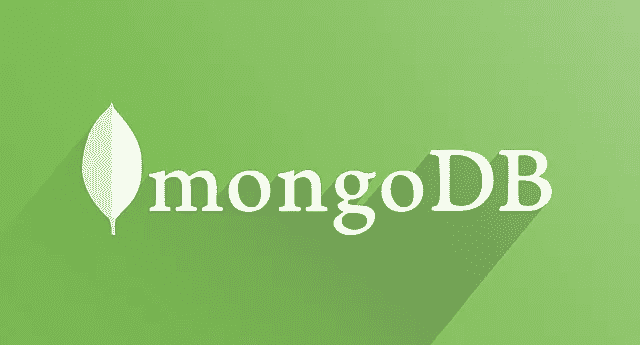

# 如何在 macOS 上安装 mongodb(大苏尔)

> 原文：<https://medium.com/nerd-for-tech/how-to-install-mongodb-on-macos-big-sur-d6df6ac69618?source=collection_archive---------2----------------------->

MongoDB 是一个流行的 NoSQL(不仅仅是 SQL)数据库，由于其易用性和高效性，在业界得到了广泛采用。

在本教程中，我将解释安装 mongodb 的过程，以及在最新版本的 macOS 上安装 MongoDB 所面临的一些挑战。

**在 mac 上安装 mongodb 有两种方法**

1.  使用自制软件(不在本教程中)
2.  从 mongodb 官网下载解压压缩文件。

**安装 mongodb 最新版本的步骤**

1.  进入 mongodb 官方[下载页面](https://www.mongodb.com/try/download/community)和**下载压缩后的**。tgz 文件。
2.  **打开终端，将目录切换到下载文件夹** `cd Downloads`。
3.  我喜欢将我所有的工具安装在我的主目录中，所以我们将下载的归档文件移动到主目录— `mv mongodb-macos-x86_64-4.4.4.tgz ~/`。
4.  **从档案中提取 MongoDB**
5.  **将文件移动到一个新文件夹中，文件名为** `mv mongodb-macos-x86_64-4.4.4 mongodb`。
6.  **创建 mongodb 存储数据的文件夹**也就是`/data/db`。在 macOS Big Sur 上运行命令`mkdir -p /data/db`会抛出错误`mkdir: /data/db: Read-only file system`(自从 Catalina 更新后，根文件夹不再可写)。因此，我在另一个文件夹(包含解压缩文件的 mongodb 文件夹)中创建了目录。`cd ~/mongodb && mkdir -p /data/db`。

**测试我们的安装**

因为 mongodb 在启动之前会检查`/data/db`目录是否存在，所以`**mongod**`命令将会失败。

我在 bash 中创建了一些别名来将 mongodb 指向正确的目录。

打开您的`~/.bash_profile`,在末尾添加以下命令:

`alias mongod='~/mongodb/bin/mongod — -dbpath ~/mongodb/data/db'`

`alias mongo='~/mongodb/bin/mongo'`

保存文件，mongodb 安装和设置就完成了。

重启你的终端或者运行`source ~/.bash_profile`，命令`mongod`(用于启动 mongodb)和`mongo`(用于启动 mongodb 交互式 shell)都将按预期运行。

[欧文·赫斯里](https://unsplash.com/@erwanhesry?utm_source=medium&utm_medium=referral)在 [Unsplash](https://unsplash.com?utm_source=medium&utm_medium=referral) 上的照片