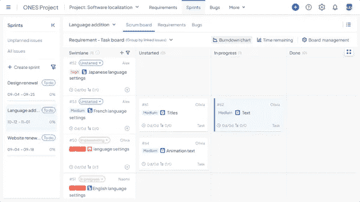
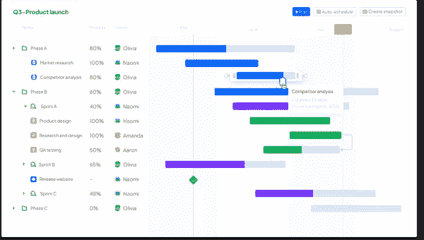

# 如何杀死项目管理中的痛点？

> 原文：<https://medium.com/nerd-for-tech/how-to-kill-the-pain-points-in-project-management-d52de695dbf5?source=collection_archive---------0----------------------->

大型开发团队面临着巨大的挑战。

随着商业竞争日益激烈，公司需要以更快的速度和更稳定的产品交付来应对市场挑战。在项目管理过程中，大型开发团队面临着许多挑战，如项目延期、成本超支、满足业务需求的工具限制以及软件质量差等。而这些都让企业很难更快的交付更好的产品。

这些挑战反映了大型开发团队在项目管理中的以下常见问题:

*   不断变化的需求不能产生显著的商业价值。
*   团队成员不理解工作的目标和意义，导致士气低落。
*   由于缺乏量化数据，不可能通过 PDCA 进行持续改进。
*   工具的多样性造成了信息孤岛，进一步增加了数据量化的难度。

如果开发团队一直在加班，但是项目的整体进度和质量不能满足业务目标，团队的技术领导必须不断地记录工作进度、可能的改进以及改进的结果。

以下是我们针对上述痛点的对策:

# 1.关注商业价值和战略

管理者首先要确定一两个有足够空间和竞争力的战略方向，然后集中资源鼓励和引导团队朝着既定的方向前进。

# 2.在团队合作中实现在线和数字化转变。

使用 ONES.com 开发管理工具，团队可以集成工作流，同步进度，分析统计数据，并科学高效地捕获和回溯数据，帮助经理了解项目的全貌，并尽早识别和解决风险，以确保按时高质量地交付项目。在项目回顾期间，ONES.com 还可以基于集成的项目过程信息量化和分析团队的开发绩效，以促进团队过程改进。

# 3.整合整个开发过程的数据，打破信息孤岛

数据集成是项目管理工具的必备功能。通过打破产品人员、开发人员、测试人员、运维人员之间的协作壁垒，形成闭环的开发管理流程。ONES.com 提供灵活的产品配置和广泛的 API，并将开发数据与工程数据相集成，以消除信息孤岛并提高团队工作效率。

# 4.寻求开放、透明、理解、接受和一致

目标是最直接的行动动机，这意味着管理者应该招募分享团队价值观和接受团队目标的人，应该领导团队关注并确保目标一致，通过与团队成员的持续沟通和协作以敏捷方法执行。

项目管理是公司管理的一种表现。[一锅端](https://ones.com/)。com 为公司提供覆盖整个开发生命周期的专业开发管理解决方案，旨在通过为团队中的各种角色创造有利的协作环境，提高团队效率，确保持续稳定的产品交付。

*原载于 2022 年 10 月 28 日***。**