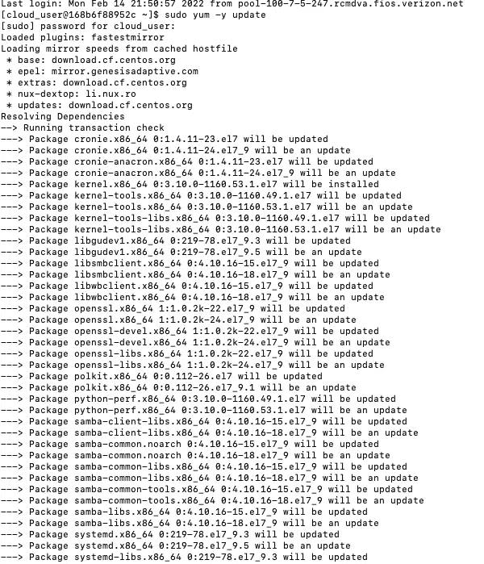
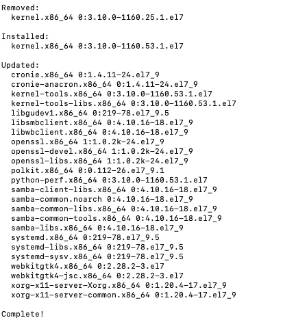
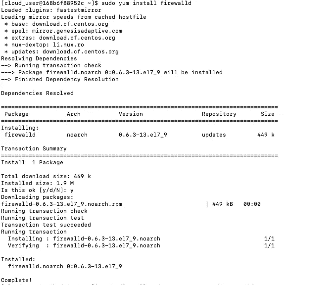
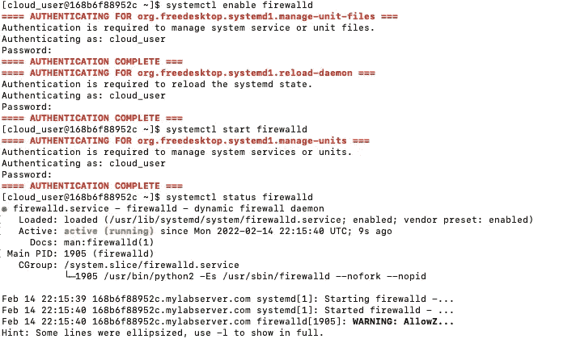
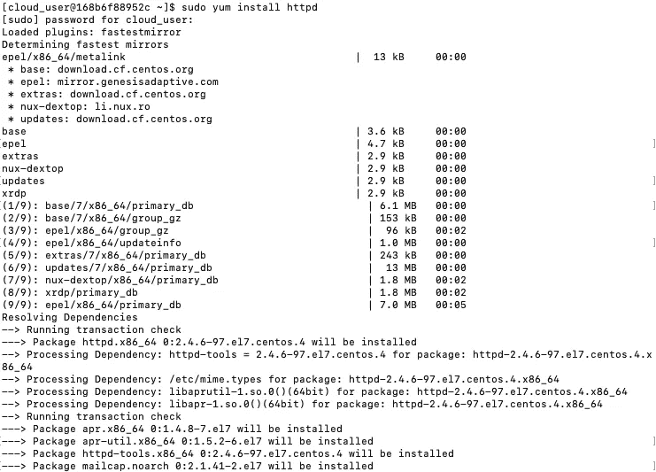
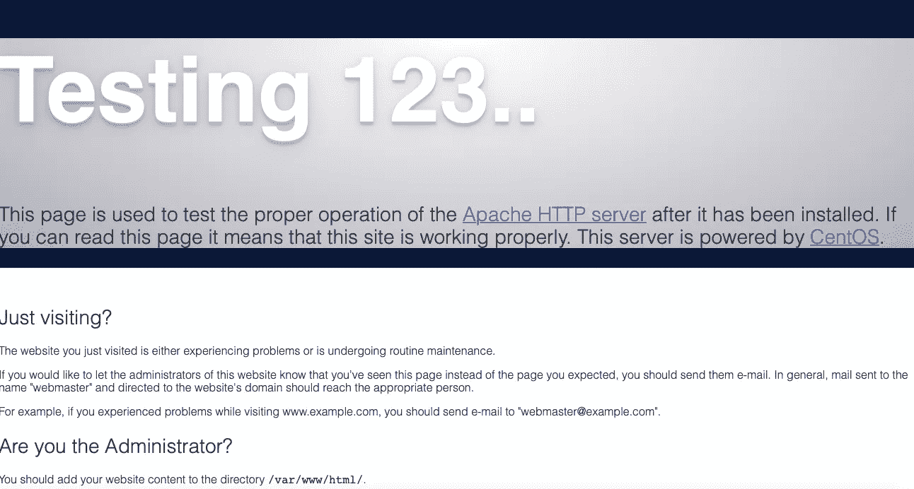

# 如何从 CLI 启动 Apache Web 服务器

> 原文：<https://medium.com/nerd-for-tech/how-to-launch-an-apache-web-server-from-the-cli-5e607e47172a?source=collection_archive---------1----------------------->

好了，伙计们，欢迎回到我的博客！我决定带你们回到基础，向你们展示如何直接从 CLI 安装 Apache web 服务器。如果你已经关注我的页面有一段时间了，与我以前的项目相比，这实际上是一个简单的任务。

目标:您的团队想要在新的 CentOS 7 服务器上测试一个网页。他们想看看是否可以通过互联网访问该页面。您的工作是安装测试 web 服务器，它将为您的团队提供网页。

在我们深入研究这个之前，让我们从一些定义开始，以便我们都在同一页上。

*   什么是阿帕奇？Apache 是一个流行的开源、跨平台的 web 服务器，从数字上看，它是现存最流行的 web 服务器。它由 Apache 软件基金会积极维护。这里有一些公司使用 Apache 来托管他们的网站:思科、IBM、Salesforce、通用电气、Adobe、VMware、施乐、LinkedIn、脸书、惠普、AT & T、西门子、易贝以及更多([来源](https://siftery.com/apache-web-server))。
*   CentOS7 是什么？CentOS(来自**社区企业操作系统**；也称为 CentOS Linux)是一个 Linux 发行版，它提供了一个免费的开源社区支持的计算平台，在功能上与其上游源代码 Red Hat Enterprise Linux (RHEL)兼容。([来源](https://www.redhat.com/en/topics/linux/what-is-centos))
*   什么是 CLI？命令行界面是计算机上的一个程序，允许您创建和删除文件、运行程序以及浏览文件夹和文件。在 Mac 上，它被称为**终端**，在 Windows 上，它是命令提示符。([来源](https://www.codecademy.com/article/command-line-interface))

好的，我相信我们准备好了，让我们开始吧！

**步骤 1** -更新您的服务器

更新

首先，弄清楚你想用什么样的 linux 风格，因为这可能会改变你做这个项目时的命令。我个人使用 CentOS 7 来完成我的大部分项目，我通过云操场服务器 ssh 进入它们，这样我就不用自己的主机终端来完成项目。

但是，如果您使用的是 CentOS 7 服务器，我希望您做的第一件事是确保您的服务器软件包是最新的。要做到这一点，你需要是根用户，或者你可以像我在这里一样作为超级用户执行命令: **sudo yum -y update**

这将需要一秒钟，但最终它会说“完成！”在你的终端底部，让你知道更新是成功的，但正如你从我的截图看到的，它删除了我的旧内核，并安装了一个新版本。它还更新了几个不同的文件。无论是使用 AWS、Python、Terraform 还是仅仅从 CLI 本身来做项目，这都是一个很好的习惯。始终运行命令以确保您使用的是最新版本。

第二步 -设置你的防火墙

根据您使用的服务器，您可以跳过这一步。如果你使用的是 Ubuntu，防火墙通常会预装在你的服务器上。但是由于我喜欢刁难自己(我也不知道为什么)，所以我选择用 CentOS 7，自己安装 firewalld。幸运的是，这是一个相当简单的步骤，我将向您展示如何做。

首先，我们将运行命令-**sudo yum install firewalld**。此命令将开始在服务器上安装防火墙的安装过程。

接下来我们要做的是用命令 **systemctl enable firewalld 启用防火墙。**该命令将在每次服务器启动时启动防火墙。我们将执行的下一个命令是 **systemctl start firewalld。**该命令将立即启动防火墙。我个人喜欢对任何系统使用的下一个命令是检查我刚刚安装完成的任何东西的状态。在我看来，最糟糕的事情是完成一项任务，只是为了结束所有的故障诊断，只是为了意识到它从未正确安装，并且当前没有运行。我使用命令 **systemctl status firewalld** 来显示防火墙的状态，并确保它当前是活动的并且正在运行。你可以在截图上看到绿色的结果。我们将在安装 Apache 后回来完成我们的防火墙。

步骤 3- **安装 Apache**

安装 Apache 实际上是这个项目中最容易的部分。使用命令 **sudo yum install httpd 开始。**该命令将在将 Apache 安装到您的终端的安装过程中启动，只需几秒钟即可完成。如果你使用的是云服务器，你可能会在服务器重启时被注销，并在结束时得到一个诸如“连接丢失”的返回。不要担心，给它几秒钟，然后 SSH 回到您的服务器。您的服务器可能正在重启。

就像我经常说的，在你继续之前，仔细检查以确保你正在安装的服务实际上已经安装了，并且想知道为什么没有工作。问我怎么知道的…通过执行命令 **httpd -v** 来检查是否安装了 Apache

步骤 4- Apache 和防火墙

现在，我们将通过使用命令**sudo firewall-cmd-permanent-add-port = 80/TCP**来允许 HTTP (80)和 HTTPS (443)的默认端口通过防火墙，并使用命令**sudo firewall-cmd-permanent-add-port = 443/TCP**来允许端口 443 通过防火墙。一旦完成，我们就永久允许 Apache 通过 Firewalld 在端口 80 和端口 443 上运行。

下一步是运行命令 **sudo systemctl start httpd** 来启动 Apache。然后运行命令 **sudo systemctl enable httpd** 来确保 Apache 在服务器第一次启动时启动。最后一步是用命令 **sudo systemctl status httpd 检查 Apache 的状态。**完成后，如果您看到 Apache 处于活动状态并正在运行，请继续下一步，因为我们就要完成了。

步骤 5- **检查你的工作**

大约一两分钟后，通过将公共 IP 地址放入您的 web 浏览器，检查 Apache web 服务器是否在工作，并查看出现了什么。如果您遵循了这些步骤，您应该会看到这个页面，显示 Apache web 服务器是活动的。