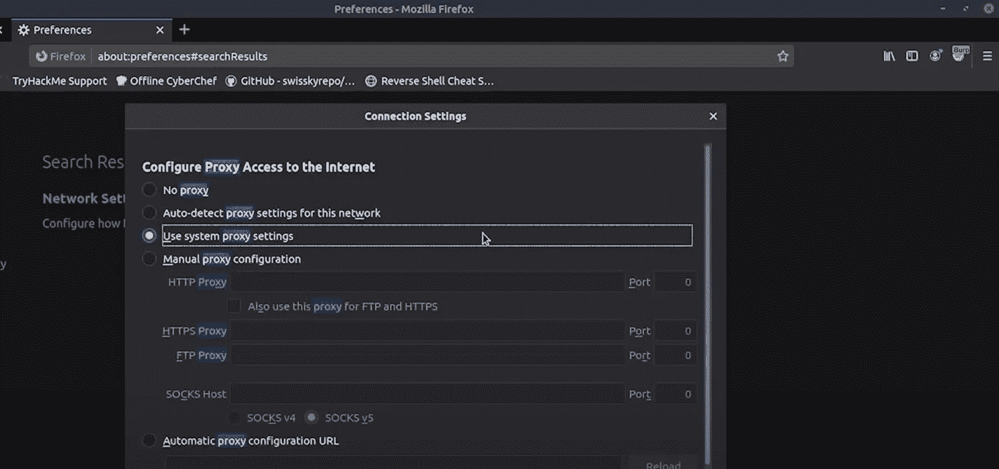
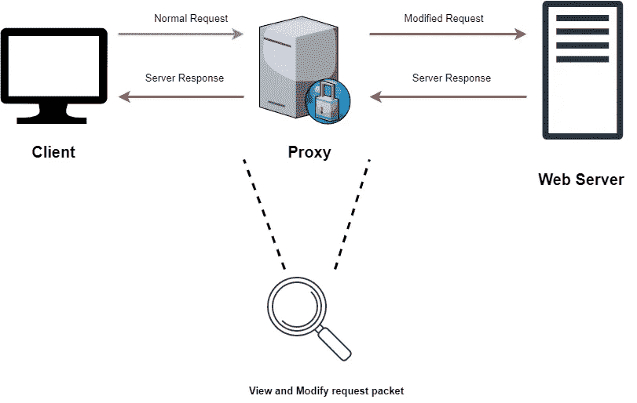
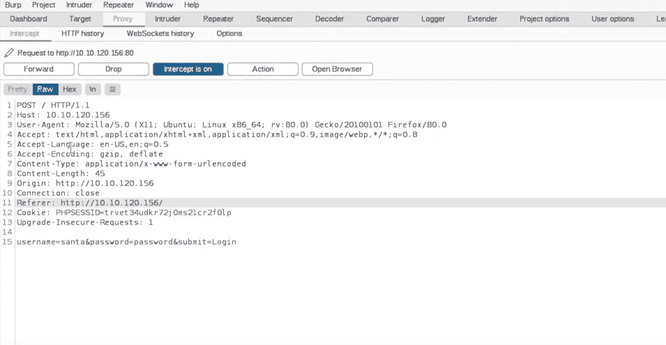
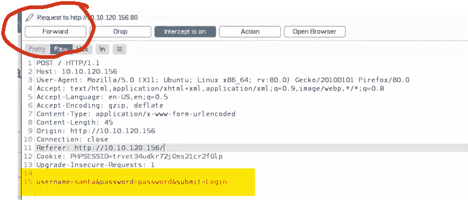

# 如何操作 Web 请求

> 原文：<https://medium.com/nerd-for-tech/how-to-manipulate-web-requests-ea5cf1c80a90?source=collection_archive---------1----------------------->

*无论你是软件开发人员还是网络爱好者，这都是一款可以添加到你的软件库中的工具。*


中间人攻击的基本原理

## 本文的目的:

*   展示在浏览器和与之通信的服务器之间传输 HTTP 数据时捕获数据的能力。
*   演示在将捕获的流量发送到目标 web 服务器之前对其进行修改的能力。

为什么？一个人想要操纵 web 请求有多种原因:满足计算机爱好者的好奇心，帮助开发人员测试网站输入，或者让网络专业人员了解网站的安全性。如果你能想到更多的原因，请留下评论，让我们开始吧！

如果你想看这些技术的应用，也可以观看下面的视频。

用一个 Sub 来支持这个频道，让它了解我最新的网络安全和软件开发视频！

## 从哪里开始

一位老朋友曾经告诉我，这种技术就像是在‘围攻’一个网站。虽然这实际上不会是一场长达 6 个月的战斗，但当我们在 CTF(夺旗)活动中或在同事面前执行这种任务时，这句话总是让我兴奋。

现在，我们将通过在您选择的浏览器上打开一个随机网站来开始这次冒险。(希望您的网页上有一个表格，以便更好地演示以下步骤)。

*   然后，您将使用某种“中间人”代理软件在本地机器上启动代理。(我将使用`BurpeSuite`，但其他软件也存在，如`Mitmproxy`等)。
*   配置您的浏览器设置，将流量临时路由到此代理。



设置浏览器代理设置，如果需要，使用手动代理配置。

一旦这些步骤完成，我们的“围攻”设备就设置好了，随时可以使用！



web 请求生命周期概述。

# 查看捕获的请求

当您的网络流量开始挂起时，您将知道您的代理何时配置成功。这是因为……所有的网络流量都被路由到代理，并存储在代理拦截队列中。我们可以转发排队的不相关请求，直到找到重要的请求(如下所示):



我们希望操作的已捕获 POST 请求。

正如我们所看到的，这个数据包在底部有元数据头和信息有效载荷，有效载荷是:

```
username=santa&password=password&submit=Login
```

# 操纵请求

在 BurpeSuite 中，我们可以在之前显示的窗口中编辑请求:



快速编辑，然后转发

就这么简单，甜蜜，请求操纵！然而，BurpeSuite 还附带了一些额外的特性，当涉及到包操作时，我想详细介绍一下:

*   **入侵者:**用于对 web 应用程序进行自动定制攻击。它的工作原理是接受一个基本的 HTTP 请求，并以系统的方式修改数据。这种系统化的方法包括定义由**字符**表示的“有效载荷标记”，然后在它的位置插入一个“有效载荷”。


使用入侵者“暴力破解”密码表单变量的示例。(注意人物)

*   **Repeater:** 用于发送一个“重复”次数的 web 请求，并分析应用程序的响应。
*   **序列器:**用于分析数据项样本中随机性的质量。您可以使用它来测试应用程序的会话令牌或其他不可预测的重要数据项，如反 CSRF 令牌、密码重置令牌等。
*   **解码器:**用于将编码数据转换为其规范形式，或将原始数据转换为各种编码和哈希形式。它能够使用启发式技术智能地识别几种编码格式。

# **结论**

无论你是技术发烧友、软件开发人员还是网络安全专家，我希望你在“网络代理”软件中发现了一个新工具。通过使用这种“中间人”方法，我们可以手动调节我们的网络流量，以分析我们的机器之间的通信。根据不同的用例，我们还可以修改和尝试发送不同的请求数据。希望你喜欢快速浏览。

***附:完成本练习后，不要忘记将您的浏览器代理设置重新配置为“无代理”！***