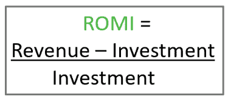
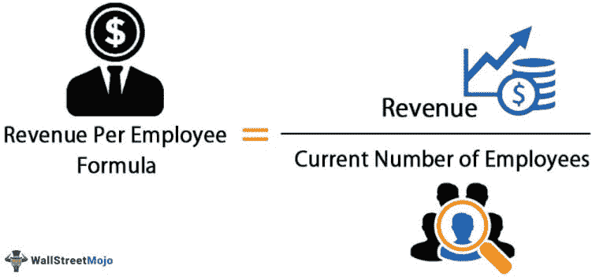

# 如何衡量和最大限度地提高在家工作的效率？

> 原文：<https://medium.com/nerd-for-tech/how-to-measure-and-maximize-work-from-home-productivity-e51ba69f5ee7?source=collection_archive---------8----------------------->

如何衡量和最大限度地提高在家工作的效率？

[**来源**](https://www.apollotechnical.com/working-from-home-productivity-statistics/)

您是否担心决定在家工作的员工的生产力？

远程工作对雇主来说有很多好处，包括节约成本和提高员工生产率。员工从提高的生产力中受益，因为远程工作更好地平衡了他们的职业和个人生活。由于当前的新冠肺炎疫情，成千上万的组织正在将远程工作作为默认选项。

然而，因为你的员工不再在同一个办公室，许多雇主不确定量化他们的生产力。

在本帖中，我们将向你展示如何计算在家工作的员工的生产力。

我们将探索您可以用来评估员工绩效的关键措施，并为提高您公司的成功和远程员工在家的工作效率提供建议。

**让我们开始吧-**

# **如何衡量远程员工的工作效率？**

[**来源**](https://blog.otter.ai/how-to-measure-productivity-in-your-remote-workforce/)

在评估远程员工的绩效时，您不能只做假设，对吗？

毕竟，员工的生产力与公司的成功息息相关。

虽然评估内部办公室员工的绩效可能很简单，但监控远程工作人员可能没有那么简单。

别担心了。

您可以使用 KPI(关键绩效指标)评估所有远程员工的工作效率。

你可能想知道-

# **什么是 KPI？**

KPI 是可衡量的标准，根据公司的主要目标和目的来评估公司的成功及其员工。

**这里有一些 KPI 可以帮助您评估远程员工的绩效:**

## **1。远程销售团队的绩效指标**

**a .每个销售代理的收入**

要计算每个代理的收入，请将您的年销售额除以您的远程销售团队中销售代理的总数。

[来源](https://www.commonality.co/kpi-examples/average-revenue-per-sales-rep)

你可以看到每个代理平均为你的公司贡献了多少收入，这将向你展示你的家庭销售团队在工作时的效率。

**b .每位销售代表的销售额**

这个效率统计向你展示了每个远程代理完成了多少销售，这直接表明了他们销售你的产品的能力。

但是，请记住，具体的销售数量因员工的经验水平、客户群和任期而异。

**c .导致赢的转化率**

销售线索赢得百分比是一个常用的 KPI，用于评估销售员工的工作效率。进入销售漏斗的销售线索数量除以确认的交易数量。

[**来源**](https://biz30.timedoctor.com/measure-productivity-employees-working-from-home/)

这是一个奇妙的远程工作统计数据，它将为您提供销售团队在达成交易方面的效率的准确指示。

## **2。远程营销团队的绩效指标**

以下指标将帮助您确定远程营销团队的效率:

**答:总参与度**

营销部门跟踪一个品牌在社交网站上的粉丝数量。

术语“完全投入”指的是你的粉丝有多投入。有了它，你可以看到你的观众中有多少喜欢、转发、评论和分享。

这个统计数据是一个很棒的方法，可以确定你的内容是否与你的观众有联系，或者你是否需要重新评估你的营销方法以获得更多的积极追随者。

**b .网站线索转化率**

线索转化率显示网站访问者转化为线索的转化率。这个生产力统计对远程工作者很有帮助，因为它展示了你如何有效地吸引合适的受众，以及你的网站如何成功地将人们转化为潜在客户。

[**来源**](https://popupsmart.com/encyclopedia/conversion-rate)

## **c .营销投资回报(ROMI)**

前两节中的 KPI 表明了营销活动的成功程度。ROMI 被定义为收入和投资之间的差额与总投资的比率。

[**来源**](https://www.anduro.com/blog/should-roi-for-marketing-be-high-or-low)

**3。远程支持团队的绩效指标**

如果您管理远程支持人员，这三个指标会很有帮助:

**a .平均回答速度(ASA)**

客户不喜欢长时间等待，所以这个统计是客户满意度最重要的 KPI 之一。它跟踪一个人回答一个来电询问需要多长时间。

[**来源**](https://www.pointillist.com/blog/27-call-center-metrics-kpis/)

这个指标不同于其他指标。此处较高的值并不保证有更好的结果。

毕竟，目标是保持平均响应时间尽可能低。如果你接听电话的平均速度很高，说明你的电话代理效率不够高，或者你的支持团队不够大。

**b .通话量**

取决于您的呼叫中心，呼叫量是拨入或拨出呼叫的总数。

例如，如果您运营一个呼入呼叫中心，成功处理的来电数量将决定远程支持人员的工作效率。

**c .顾客满意度得分(CSAT)**

CSAT 是衡量客户满意度的常用 KPI。它是由一个问题决定的，该问题要求消费者按照 1 到 5(非常差)到 5(非常快乐)的等级来评价他们的快乐。

要确定消费者对服务的总体满意度，只需计算 CSAT 得分的平均值。高 CSAT 分数表明你的支持团队更有效率，从而提高客户保持率。

## **4。远程人力资源团队的绩效指标**

如果你担心你的人力资源部门没有在家完成工作，只需用这些数字来看看他们的进展如何:

**a .年度员工离职率**

员工离职率分为非自愿离职率和自愿离职率。公司通常会单独计算离职率，这样可以集中精力减少自愿离职。

[**来源**](https://resources.workable.com/tutorial/calculate-employee-turnover-rate)

自愿离职指的是离开你公司的人。相比之下，非自愿离职是指那些被解雇、退休等的员工。从组织里。

另一方面，了解员工流动的原因可能有助于你更好地管理公司文化，提高员工保留率。

**b .每个员工的利润**

一个公司上一年的利润除以全职员工的数量来计算这个 KPI。

[**来源**](https://www.wallstreetmojo.com/revenue-per-employee/)

但是，这个统计对 HR 绩效的意义是什么？

如果每个员工的平均利润很低，这意味着你的人力资源团队正在招聘不合适的人，或者没有教好你的远程员工。

**c .每个员工的费用**

这个数字表明你在一个普通员工身上花了多少钱，是一个效率统计。

每个员工的开支 KPI 用上一年的运营成本除以员工总数。

[**来源**](https://biz30.timedoctor.com/measure-productivity-employees-working-from-home/)

如果你的人力资源人员因为员工成本高而遇到困难，他们要么雇用成本较低的员工，要么减少雇佣费用。

# **最大限度提高远程员工生产率的七个技巧**

仅仅知道如何计算 [**员工生产率**](https://www.workstatus.io/best-employee-productivity-cloud-software?utm_source=medium&utm_medium=guest-post-rn&utm_campaign=RN) 是不够的。

如果你想让你的公司发展，你必须知道如何提高员工的生产力。

## **这里有七个提高远程员工工作效率的想法:**

**1。尽量以结果为导向**

[**来源**](https://www.5feedback.com/en/result-oriented/)

你认为工作时间长的员工能更好地完成额外的任务吗？

那可能不是真的。

一些工人可能在电脑前坐了八个小时却一事无成，而另一些人可以在四个小时内完成同样的工作。

不要因为人们工作时间长而给他们报酬，而是鼓励一种重视结果并根据他们的表现给他们报酬的文化。员工会更专注于在最短的时间内完成尽可能多的任务，让你的组织快速发展。

**2。创建工作流程文档**

[**来源**](https://us.experteer.com/magazine/learn-how-to-document-your-work-processes-and-save-your-team-time/)

远程工作的员工都非常熟悉联系到某人却发现他们离线的沮丧感。

您可以通过记录您的过程来轻松避免这种情况，因为它们可能会导致工作流瓶颈。

想一想。

远程工作人员无需等待，因为他们需要了解的有关工作的一切都存储在 Google Drive 等云服务中，让他们能够阅读说明并简单地回去工作！

改善招聘流程的另一个重要步骤是建立一个资源库。资源库还将帮助您减少新员工的入职时间。记得把你的文档保存在云存储中，这样每个人都可以随时访问它。

## **3。设定明确的目标和期限**

[**来源**](https://www.responsesource.com/blog/how-to-meet-deadlines-at-work/)

当一个项目不能按时完成时，所有的组织都有困难。

如果你想让你的员工高效工作，让你的企业按时运转，为任务设定一个截止日期是至关重要的。时间表不仅能让你在截止日期前完成工作，还能鼓励你的员工按时完成工作。

此外，如果您没有为远程员工设定明确的期望，他们可能会轻视自己的工作，变得效率低下，尤其是因为他们在家工作。

个人和团队目标有助于员工确定对他们的期望，并帮助他们更快地实现目标。

## **4。跟踪进度**

[**来源**](https://www.xzito.com/blog/bid/91369/Company-Scorecard-A-Progress-Tool-to-Achieve-Your-Organization-s-O)

如果你管理的是一个办公室团队，你会在员工工作的时候一直监控他们。

然而，当人们在家工作时，有更少的方法来跟踪他们在做什么。如果你不检查他们，他们可能会在工作中偷懒。

这就是为什么有必要使用像 Workstatus 这样的 [**劳动力管理软件**](https://bit.ly/3nlC0ZQ) 来监控您的远程员工，以分析一天中的生产力水平。

这也向你的员工表明他们的雇主对他们有信心，让他们更专注于自己的工作。

## **5。促进远程工作人员之间的沟通**

[**来源**](https://www.surepayroll.com/resources/blog/how-to-manage-a-remote-team)

全职在家工作比你想象的要复杂得多。

你通常都是一个人工作，所以没有人可以一起休息或者一起出去吃午饭。

缺乏团队合作会导致团队成员之间的不和和误解。这不仅会破坏人际关系，还会扰乱你生意的顺利进行。

鼓励你的员工互相保持联系。这可以帮助团队成员更好地理解彼此，减少冲突。为了增强团队的化学反应，你也可以利用虚拟团队建设活动。

更少的冲突将允许您的远程团队将更多的时间投入到他们的任务和公司目标中。

## **6。确保员工之间的透明度**

[**来源**](https://blog.vantagecircle.com/transparency-in-the-workplace/)

在相距遥远的远程员工之间建立信任更加困难。面对面互动的机会更少，建立关系更具挑战性。

这可能会导致员工感觉远离全局，因为他们正在自己做出战术选择。

透明度允许您的团队与您和团队的其他成员自由交流，从而提高员工的参与度。

透明度也能让你的员工看到你公司的起伏，这将有助于他们信任你这个老板。

## 7 .**。使用在线生产力跟踪工具**

当你的员工在公司时，你有机会亲自监督他们。

但是，当它们分布在许多地方时，您如何计算工作时间并监控员工的工作效率呢？

为此，你需要 [**远程员工生产力跟踪软件**](https://www.workstatus.io/solutions/productivity-attendance-monitoring?utm_source=medium&utm_medium=guest-post-rn&utm_campaign=RN) ，它可以跟踪你的员工在家工作时在做什么。

幸运的是， **Workstatus** 可以帮助您完成所有这些任务，甚至更多！

# **什么是工作状态？**

[**工作状态**](https://bit.ly/3qlRuis) 是最受公司和小企业欢迎的在线生产力时间跟踪器。这是一款远程员工生产力管理软件，能够:

*   监控在任何特定任务上花费的时间。
*   实时跟踪员工工作效率，并生成实时工作效率测量和跟踪报告，提供特定时间段的统计数据。
*   提供 [**每周工时计算器**](https://www.workstatus.io/best-time-tracking-software-online?utm_source=medium&utm_medium=guest-post-rn&utm_campaign=RN) 用于有效监控远程员工的业务生产力。
*   防止员工在工作时间浪费时间。

注意:为了保护用户隐私，Workstatus 仅在工作时间监控远程工作者的活动。

## **收尾思路**

衡量在家工作的员工的生产率似乎是一个令人生畏的问题，主要是如果你习惯于管理一个内部办公室员工团队的话。

然而，对企业来说，跟踪远程员工的工作效率变得越来越重要。随着最近冠状病毒的流行和远程工作使用的增加，远程测量工作效率变得前所未有的重要。

然而，这并不意味着作为雇主你应该过度担心。

如果操作正确，它可以帮助你提高产量，培养高产员工。

遵循这篇博客中的建议，你很快就会拥有一个生产力测量系统。

记得使用我们在本文中讨论的指标和生产力软件，如 **Workstatus** 来立即提高您的远程团队的生产力！

[**在此申请免费演示远程员工生产力跟踪软件**](https://bit.ly/3njb3Wm)

感谢阅读！！