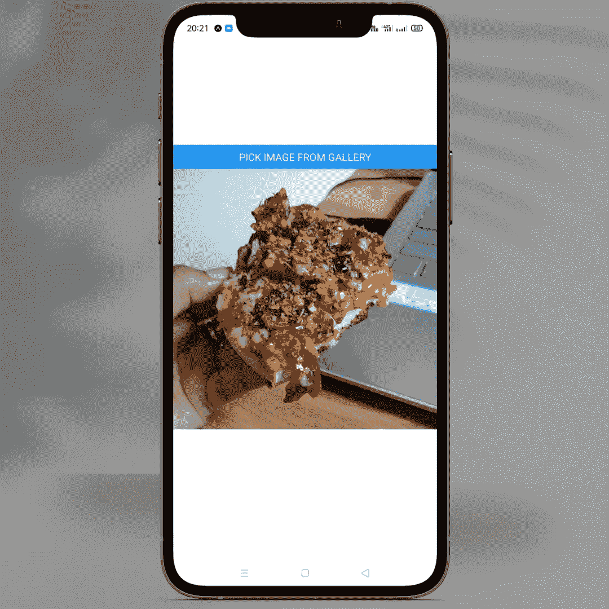

# 如何在 React 原生应用中从内部存储中挑选图像或视频

> 原文：<https://medium.com/nerd-for-tech/how-to-pick-image-or-video-from-internal-storage-in-react-native-app-5bc7188a65bc?source=collection_archive---------2----------------------->

## 在本机应用程序中使用图像拾取器

你好，本地开发者..！！

当你开始构建你的应用程序时，在某个阶段你必须在你的应用程序中添加一个上传媒体的特性。如今，超过 90%的移动应用程序允许用户从内部存储中提取图像或视频，并上传到应用程序中。在社交媒体上很常见。无论您是发布图片还是更新个人资料照片，您通常都会从设备的内部存储中选择媒体。作为开发人员，如何在应用程序中添加这样的功能？让我们用一个快速指南来看看它是如何工作的。所以，让我们先来一杯咖啡。


卡斯帕·卡米尔·鲁宾在 [Unsplash](https://unsplash.com?utm_source=medium&utm_medium=referral) 上的照片

# React 本机应用程序的设置和安装

使用命令: ***expo init Picker*** 在您的首选目录中启动一个 **expo-CLI** 项目(您可以根据自己的选择将其命名为)。选择空白模板并完成 javascript 依赖项的安装。之后，使用命令在父目录中安装以下软件包:

> npm 安装展示-图像拾取器

expo-image-picker 具有内置功能，可帮助您从设备的内部存储中拾取图像和视频。

我们已经完成了安装部分。让我们现在开始黑吧。

# **React Native(Javascript)中图像拾取器的代码**

**App.js**

```
import React, { useState, useEffect } from 'react';
import { StyleSheet ,Text, View, Button, Image} from 'react-native';
import * as ImagePicker from 'expo-image-picker';
```

从各自的包中导入上述组件，因为我们将在我们的项目中使用它们。

```
const [hasGalleryPermission, setHasGalleryPermission] = useState(null);
const [image, setImage] = useState(null);useEffect(() => {
    (async () => {
      const galleryStatus = await ImagePicker.requestMediaLibraryPermissionsAsync();
      setHasGalleryPermission(galleryStatus.status === 'granted');})();
  }, []);
```

我们请求用户允许我们访问画廊。权限的初始状态被设置为 null，但是当用户允许访问图库时，权限的状态将会改变。这就是为什么我们在这里使用 react-hook 的 useState。

useEffect 的数据异步存储在一个数组中。如果你删除了这个数组，那么每次用户打开应用程序时，应用程序都会询问图库权限，这有点烦人，而且会给用户带来不好的体验。

```
const pickImage = async () => {
    let result = await ImagePicker.launchImageLibraryAsync({
      mediaTypes: ImagePicker.MediaTypeOptions.Images,
      allowsEditing: true,
      aspect: [1, 1],
      quality: 1,
    });console.log(result);if (!result.cancelled) {
      setImage(result.uri);
    }
};if (hasGalleryPermission === false) {
    return <Text>No access to Gallery</Text>;
}
```

您可以在这里自定义从内部存储器中选择媒体。我将媒体类型设置为仅图像，但是您可以使用 **"ImagePicker。MediaTypeOptions.All"** 来导入图像和视频，或者您可以使用 **"ImagePicker。MediaTypeOptions.Videos"** 从内部存储器导入视频。您可以允许编辑使用默认编辑，如裁剪图像功能等。你也可以选择媒体的方面，我们大多数人更喜欢[4，3]，你可以相应地定制这些值。添加您一次导入的数量。例如，Instagram 将该功能设置为 10，您一次从内部存储中导入的照片不能超过 10 张。你也可以根据你的应用自定义这个。

如果用户拒绝访问图库，屏幕上将出现“禁止访问图库”的文字。

```
<View style={{ flex: 1, justifyContent:'center'}}>
  <Button title="Pick Image From Gallery" onPress={() =>     pickImage()} />
  {image && <Image source={{uri: image}} style={{flex:1/2}}/>}
</View>
```

因为我们主要关注这些东西的功能而不是样式。您可以相应地设计它们的样式。现在，在终端窗口中运行这个应用程序，并在您的设备上运行 expo 应用程序。从图库中选择一张图片。我拍了一张照片，它就像这样出现在屏幕上。



从 React Native 的内部存储(图库)中选择图像

现在检查您的终端窗口，在这里您使用命令:npm start 运行这个项目。在那里你会看到图像的全部信息。比如，图像的高度是多少。图像的 URI，图像的类型和宽度。我们在 pickImage 函数中控制台记录了大量信息。您可以使用这些信息来进一步增强您的应用程序。

本文到此为止。如果你在某个地方丢失了，那么完整的代码在这里。

```
import React, { useState, useEffect } from 'react';
import { Text, View, Button, Image} from 'react-native';
import * as ImagePicker from 'expo-image-picker';export default function App() {
  const [hasGalleryPermission, setHasGalleryPermission] = useState(null);
  const [image, setImage] = useState(null);useEffect(() => {
    (async () => {const galleryStatus = await ImagePicker.requestMediaLibraryPermissionsAsync();
      setHasGalleryPermission(galleryStatus.status === 'granted');})();
  }, []);const pickImage = async () => {
    let result = await ImagePicker.launchImageLibraryAsync({
      mediaTypes: ImagePicker.MediaTypeOptions.Images,
      allowsEditing: true,
      aspect: [1, 1],
      quality: 1,
    });console.log(result);if (!result.cancelled) {
      setImage(result.uri);
    }
  };if (hasGalleryPermission === false) {
    return <Text>No access to camera</Text>;
  }
  return (
    <View style={{ flex: 1, justifyContent:'center'}}>
          <Button title="Pick Image From Gallery" onPress={() => pickImage()} />
          {image && <Image source={{uri: image}} style={{flex:1/2}}/>}
    </View>
  );
}
```

感谢阅读！！，如果这篇文章对你有帮助，那就鼓掌直到你的手流血。