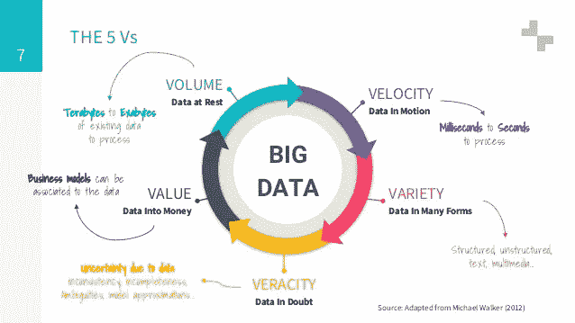
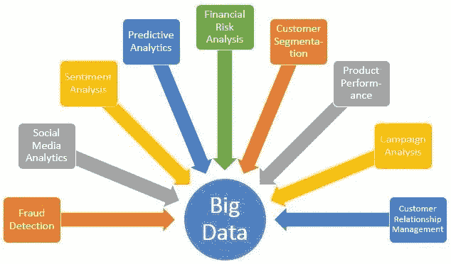
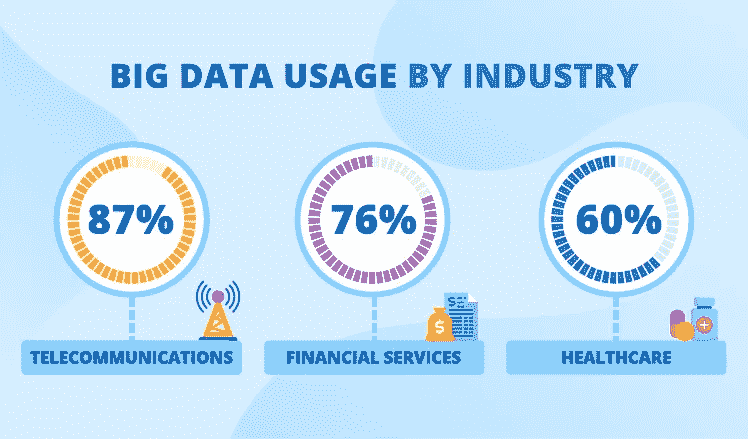

# 如何在大数据的帮助下预防商业中的沉船事故？

> 原文：<https://medium.com/nerd-for-tech/how-to-pre-vent-ship-wrecks-in-business-with-the-help-of-big-data-7dce7e4900e7?source=collection_archive---------34----------------------->

数据科学结合了计算机科学和统计学来解决工业和许多科学领域中令人兴奋的数据密集型问题。大数据的使用允许企业观察各种与客户相关的模式和趋势。观察客户行为对于激发忠诚度非常重要，因此**大数据**分析可以帮助改变所有业务运营。处理和存储大数据的系统已经成为组织中[数据管理](https://searchdatamanagement.techtarget.com/definition/data-management)架构的常见组件，与支持[大数据分析](https://searchbusinessanalytics.techtarget.com/definition/big-data-analytics)用途的工具相结合。

世界每天都在创造大量的结构化和非结构化数据。因此，对它的利用的需求已经变得对企业有吸引力。基本上，大数据和分析市场正在以更快的速度扩张。预计到 2023 年将增长到 770 亿美元。以下事实略微揭示了大数据在 2021 年的重要性。

*   每天，全球各地的人们都在生成 2.5 万亿字节的数据。
*   近 90%的数据是在过去三年中生成的。
*   对于 90%的企业来说，非结构化数据是这一领域的最大障碍。
*   2020 年，大数据在很大程度上取决于自动化分析。

## **什么是大数据？**

大数据是组织收集的结构化、半结构化和非结构化数据的组合，可以从中挖掘信息，并用于[机器学习](https://searchenterpriseai.techtarget.com/definition/machine-learning-ML)项目、[预测建模](https://searchenterpriseai.techtarget.com/definition/predictive-modeling)和其他高级分析应用。简而言之，大数据是一个数据集合，其数量庞大，但随着时间呈指数级增长。这是一个庞大而复杂的数据，传统的数据管理工具无法有效地存储和处理它。它通常以五个 V 为特征:

*   许多环境中的大 ***卷*** 的数据；
*   大数据系统中频繁存储的数据类型种类繁多*；和*
*   *生成、收集和处理大量数据的 ***速度*** 。*
*   ****准确性*** 指被分析数据的质量。*
*   ****值*** 相当于可变现的货币。*

# ***大数据的五个 V***

*常规数据分析和我们所说的“大”数据有什么区别？大数据的五个 V 是定义它的特征。*

**

## *大数据量*

***数据量**指的是需要分析和处理的数据集的大小，现在通常大于 TB 和 Pb。庞大的数据量需要与传统存储和处理能力截然不同的处理技术。换句话说，这意味着大数据中的数据集太大，无法用普通的笔记本电脑或台式机处理器处理。大容量数据集的一个例子是尼日利亚拉各斯当天的所有信用卡交易。*

## *大数据的速度*

***速度**指生成数据的速度。高速数据产生的速度如此之快，以至于需要独特的(分布式)处理技术。高速生成的数据的一个例子是 Twitter 消息或脸书帖子。*

## *各种大数据*

*大数据来自各种来源，通常是以下三种类型之一:[结构化、半结构化和非结构化数据](https://www.bigdataframework.org/data-types-structured-vs-unstructured-data/)。数据类型的多样性通常需要不同的处理能力和专业算法。高度多样化数据集的一个例子是在一个城市的不同位置生成的 CCTV 音频和视频文件。*

## *大数据的准确性*

***准确性**指被分析数据的质量。高准确性数据有许多记录，这些记录对分析很有价值，并以有意义的方式对整体结果做出贡献。另一方面，低准确性数据包含高百分比的无意义数据。这些数据集中没有价值的部分被称为噪声。高准确性数据集的一个例子是来自医学实验或试验的数据。*

## ***大数据的价值***

*最后，代表**值**的 V 位于大数据金字塔的顶端。这指的是将海啸般的数据转化为业务的能力。数据价值是一个更微妙的概念。它通常被量化为数据可能创造的潜在社会或经济价值。大数据的附加值分析每个大数据应用程序中产生的结果、优先级和整体相关性。价值是指任何数据集中固有的经济和社会财富。只要你不叫它新油。*

*高容量、高速度和高多样性的数据必须使用高级工具(分析和算法)进行处理，以揭示有意义的信息。由于数据的这些特征，处理这些数据集的存储、处理和分析的知识领域被称为大数据。*

# *大数据分析如何防止船只失事*

*要从大数据分析应用程序中获得有效且相关的结果，详细了解可用数据是关键。这就是为什么数据准备的所有步骤，包括数据集的剖析、清理、验证和转换，在分析过程中至关重要。使用大数据对于许多领先公司在竞争中胜出至关重要。事实上，从 IT 到医疗保健，您几乎可以在每个领域找到使用大数据的例子。*

*[谈到医疗保健](https://www.simplilearn.com/big-data-in-healthcare-sector-rar359-article)，大数据专注于发现在初始临床试验中尚不明确的风险和益处。它可以更好地分析试验，并帮助预测结果。其他一些早期采用这一概念的人一直在使用各种产品中嵌入的传感器的数据。这有助于公司确定这些产品在现实世界中是如何使用的。有了这些知识，创建新的服务和设计未来的产品变得更加容易。*

*以客户数据为例，数据的高频率和实时性至关重要。例如，评估指标的能力，包括消费者忠诚度，以前都是追溯处理的。有了大数据，这种做法正被更广泛地使用。这大大增强了预测的能力。类似地，高频允许企业实时测试理论。大数据与**比较分析**检查客户行为指标和实时客户参与度，以便将公司的产品、服务和品牌与其竞争对手的产品、服务和品牌进行比较。它结合了**社交媒体收听**分析人们在社交媒体上对企业或产品的评论，这可以帮助识别潜在的问题，并为营销活动锁定目标受众。所采用的**营销分析****提供的信息可用于改进营销活动以及产品、服务和商业计划的促销优惠。最后，通过**情感分析，**可以分析收集的所有客户数据，以揭示他们对公司或品牌的感受、客户满意度、潜在问题以及如何改善客户服务。***

******

***毫无疑问，许多企业没有意识到对大数据分析的需求。他们必须知道，揭示有价值的有见地的信息可以让企业提高对消费者的价值。这可以通过分析市场变化的模式、趋势、客户行为和数据之间的相关性来实现。 [*目前，全球 96%的公司已经确认增加了对大数据的投资。*](https://leftronic.com/big-data-statistics/)***

***此外，数据设备允许您在整个组织中刻画一个完整的信息场景。数据调查是你可以享受的主要好处。除此之外，还可以通过大数据统计守护微妙的数据。这些分析在增加企业收入方面发挥着至关重要的作用。确保你尽可能有效地使用基本资源是至关重要的。***

***一项研究表明，采用数据驱动营销策略的公司可以增加 20%的 T4 收入，降低 30%的成本。***

***竞争组织为推动业务发展而采用的最突出的大数据解决方案包括:***

***自 1976 年以来一直是商业分析软件和服务的领导者的 SAS[SAS](https://www.sas.com/en_us/home.html)表示，SAS - 成为小企业不再是获取市场和商业情报的障碍。SAS 将您的数据转化为有助于制定决策的见解，并为您的业务提供全新的视角，无论它是小型、中型还是大型组织。***

*****ALTERYX -** 分析复杂的商业智能不一定是火箭科学。 [Alteryx](https://www.alteryx.com/) 提供先进的数据挖掘和分析工具，以简单易懂的方式呈现信息。Alteryx 将您企业的内部数据与公开可用的信息相结合，帮助您做出更好的商业决策。这些见解使您能够从仪表板上创建图表、故事情节和交互式视觉效果。它还提供支持团队讨论的协作功能。***

***谷歌分析- 你不需要昂贵的软件来收集数据。它可以从你已经拥有的资产开始——你的网站。[谷歌分析](https://www.google.com/analytics)，谷歌的免费数字分析平台，为小企业提供了在一个地方分析来自所有接触点的网站数据的工具。借助 Google Analytics，您可以提取长期数据来揭示趋势和其他有价值的信息，以便做出明智的数据驱动型决策。***

*****kiss metrics-**[kiss metrics](https://www.kissmetrics.io/)让你能够根据客户的行为来理解、细分和吸引他们。借助 Kissmetrics，您可以根据客户行为创建、管理和自动交付一次性电子邮件和持续电子邮件活动。该平台衡量的不仅仅是打开次数和点击量。该公司还推出了电子商务 Kissmetrics，旨在提高你的脸书和 Instagram 投资回报率，降低购物车放弃率，并推动更多的重复购买。***

***众所周知，信用卡交易充满了无价的数据。虽然访问权限一度仅限于拥有大量资源的公司，但客户情报公司 Tranzlogic 让缺乏大企业预算的小企业也能获得这些信息。Tranzlogic 与商户和支付系统合作，从信用卡购买中提取和分析专有数据。您可以使用这些信息来衡量您的销售业绩，评估您的客户和客户群，改进促销和忠诚度计划，开展更有效的营销活动，编写更好的业务计划，以及执行其他有助于做出明智业务决策的任务。***

# ***大数据的重要性***

***大数据的重要性体现在帮助做出更好的业务决策/更有洞察力的市场情报、了解客户需求、提供更智能的服务或产品、改善业务运营或基本创收。***

***公司[在其系统中使用大数据](https://searchbusinessanalytics.techtarget.com/feature/8-big-data-use-cases-for-businesses-and-industry-examples)来改善运营、提供更好的客户服务、创建个性化营销活动以及采取其他最终可以增加收入和利润的行动。有效使用 it 的企业比那些不使用 it 的企业拥有潜在的竞争优势，因为他们能够做出更快、更明智的商业决策。***

***例如，大数据提供了对客户的宝贵见解，公司可以利用这些见解来完善其营销、广告和促销活动，以提高客户参与度和转化率。可以对历史和实时数据进行分析，以评估消费者或企业买家不断变化的偏好，使企业能够更好地响应客户的需求。***

******

***医学研究人员也使用大数据来识别疾病迹象和风险因素，医生也使用大数据来帮助诊断患者的疾病和医疗状况。此外，来自电子健康记录、社交媒体网站、网络和其他来源的数据组合为医疗保健组织和政府机构提供了关于传染病威胁或爆发的最新信息。在能源行业，大数据帮助石油和天然气公司确定潜在的钻井位置，并监控管道运营；同样，电力公司用它来跟踪电网。***

***金融服务公司使用大数据系统进行风险管理和市场数据的实时分析。制造商和运输公司依靠大数据来管理供应链和优化交付路线。其他政府用途包括应急响应、预防犯罪和智能城市计划。***

***最后，尽管大数据的重要性怎么强调都不为过，但问题是:为什么大数据分析真的很重要？**大数据**分析帮助组织利用他们的**数据**，并使用它来识别新的机会。这反过来又会导致更聪明的商业行为、更高效的运营、更高的利润和更满意的客户。***