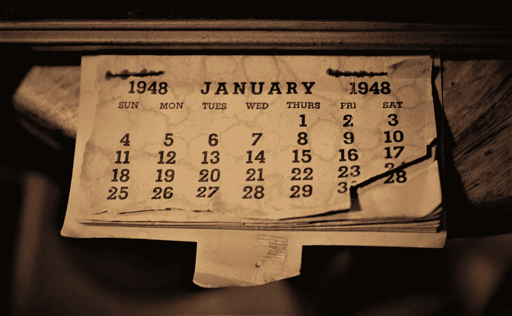

# 如何准备存储在 MongoDB 中的 Python 日期对象，并按日期和日期范围运行查询。

> 原文：<https://medium.com/nerd-for-tech/how-to-prepare-a-python-date-object-to-be-inserted-into-mongodb-and-run-queries-by-dates-and-range-bc0da03ea0b2?source=collection_archive---------1----------------------->

我如何设法在 MongoDB 中插入日期并在日期之间运行查询。



# 介绍

我认为计算机科学中最乏味的事情之一是处理日期和时区。如果计算机科学只是按天排序记录或在数据库中查询几天之间创建的记录，我会认为自己已经出局了。我了解到时间戳的存储方式很重要，它可以让你运行正确的查询，或者给你一天的时间。我的案子很简单，但我花了几个小时才理清。我们有一个 MongoDB 集合，时间戳存储为一个字符串。(第一大错误)。此外，每个记录的结构是嵌套的 JSON(第二个错误),这在查询文档时不是最好的。易于可视化，但不易于查询。
所以，假设我们必须存储用户做出的动作，对于每个动作，我们希望存储一个时间戳。
初始数据格式如下

```
{
  "user_email": "[jakebrown@test.com](mailto:jakebrown@test.com)",
  "delivery": {
    "box1": {
      "97cc5e852cf44fc38fdb55dc006d1d01": {
        "owner_name": "Peter Parker",
        "owner_email": "[peter.parker@spiderman.com](mailto:peter.parker@spiderman.com)",
        "registration_date": "2021-03-01T18:12:07+00:00"
      }
    },
    "box2": {
      "a7bd1e34f809410590679cd2c1172cd3": {
        "owner_name": "Dylan Dog",
        "owner_email": "[dylan.dog@test.com](mailto:dylan.dog@test.com)",
        "registration_date": "2021-03-02T12:12:01+00:00"
      },
      "box3": {
        "b787fdeb892d406196fda2ca9a15074b": {
          "owner_name": "Nathan Never",
          "owner_email": "[nathan.never@alpha.com](mailto:nathan.never@alpha.com)",
          "registration_date": "2020-12-02T18:12:07+00:00"
        }
      },
      "box4": {
        "1f8741da011640988359fec4d47225f3": {
          "owner_name": "Jerry Drake",
          "owner_email": "[jerry.drake@misterno.com](mailto:jerry.drake@misterno.com)",
          "registration_date": "2021-02-02T14:07:07+00:00"
        }
      }
    }
  }
}
```

上述结构有两个问题。第一个是*注册日期*值被存储为字符串。它不允许我按日期范围查询结果。以字符串格式存储的日期很好显示，并且假设日期与标准格式匹配，相对容易转换回一个 *datetime* 对象，但是我不能运行类似

```
{“registration_date”: {“$gte”: ‘2021–03–03T18:12:07+00:00’, “$lte”: ‘2021–03–02T18:12:07+00:00’}}
```

第二个问题是通过 ID(例如，1f 8741 da 011640988359 FEC 4d 47225 f 3)进行查询非常棘手，ID 是每个嵌套字典的键。在这方面，这篇[文章](https://www.mongodb.com/blog/post/building-with-patterns-the-attribute-pattern)非常详细，帮助我理解了我在最初的数据设计中所犯的错误。

# 按照 MongoDB 的方式重构数据

在浏览了 MongoDB 的文档之后，我意识到存储时间戳的正确方式是 JavaScript 日期类型。句号。

正如官方[文档](https://docs.mongodb.com/manual/reference/method/Date/#Date)所报道的，

> MongoDB 没有特殊的 datetime 对象，它使用 JavaScript 日期类型，以 [BSON](https://docs.mongodb.com/manual/reference/bson-types/#document-bson-type-date) 的形式存储。在内部， [Date](https://docs.mongodb.com/manual/reference/bson-types/#document-bson-type-date) 对象被存储为一个有符号的 64 位整数，表示自 Unix 纪元(1970 年 1 月 1 日)以来的毫秒数。[官方 BSON 规范](http://bsonspec.org/#/specification)将 BSON 日期类型称为 *UTC 日期时间*。BSON 日期类型是有符号的。负值表示 1970 年之前的日期。
> 
> Date()在 mongo shell 中以字符串形式返回当前日期。
> 
> new Date()将当前日期作为[日期](https://docs.mongodb.com/manual/reference/bson-types/#document-bson-type-date)对象返回。mongo shell 用 ISODate 助手包装了 [Date](https://docs.mongodb.com/manual/reference/bson-types/#document-bson-type-date) 对象。ISODate 在 [UTC](https://en.wikipedia.org/wiki/Coordinated_Universal_Time?oldid=803266145) 中。

MongoDB 使用函数 ISODate()自动包装日期。ISODate()是一个内置函数，它包装了本机 JavaScript Date 对象，提供了一种以人类可读格式表示日期的便捷方式，保留了日期查询和索引的全部用途。

因此，MongoDB 为日期提供了默认的 ISO 表示。如果您需要不同于 ISO 的格式，您需要在客户端进行转换。

完美。因此，我首先决定将 *registration_date* 键的类型修改为 datetime，这只是为了意识到，对于我的原始数据结构，不可能只获得与我的查询标准相匹配的记录。这是一个嵌套结构，所以所有的结构都被返回。然后我决定修改结构，让它更简单。存储更多的记录，但更容易查询。

为了将 *registration_date 作为*一个 Python datetime 插入，我使用了函数`[*datetime.today()*](https://docs.python.org/3/library/datetime.html#datetime.datetime.today)`

```
payload_to_insert = {  
    "user_email": "[jakebrown@test.com](mailto:jakebrown@test.com)",
    "owner_name": "Peter Parker"
    "owner_email": "[peter.parker@spiderman.com](mailto:peter.parker@spiderman.com)",
    "box_id" : "a7bd1e34f809410590679cd2c1172cd3",
    "registration_date": datetime.today().replace(microsecond=0)

}
```

*registration_date* 现在是一个 datetime 对象，它被 MongoDB 存储为 JavaScript 日期类型，然后它与 MongoDB 运行日期查询所需的内容兼容。

此外，曾经是键的 ID 现在是一个属性值。我修改了数据结构，使其易于查询。

为了进行双重检查，我们可以从 MongoDB shell 中运行一个查询来查看 registration_date 的格式是 date()。

```
db.test.find()
{ "_id" : ObjectId("..."), "registration_date" : new Date("2021-03-02T14:51:15+0000") }
```

现在，让我们用 Python 和 [datetime](https://docs.python.org/3/library/datetime.html) 函数来运行一些查询。

# 按日期范围查询

可能是有史以来最常见的查询之一，“*给我日历上两天内的所有结果*”。这就是像 https://material.angular.io/components/datepicker/examples[这样的组件存在的原因。](https://material.angular.io/components/datepicker/examples)

我们已经吸取了教训，我们知道我们需要日期时间对象。因此，让我们先将字符串转换为日期时间，然后创建我们的查询。

```
from datetime import datetime, timedeltafrom_date = datetime.strptime(from_date, '%Y-%m-%d')
to_date = datetime.strptime(to_date, '%Y-%m-%d')criteria = {"$and": [{"registration_date": {"$gte": from_date, "$lte": to_date}}, {"owner_email": "[peter.parker@spiderman.com](mailto:peter.parker@spiderman.com)"}]}
```

然后我们可以在 find()中使用*标准*

```
import json
from pymongo import MongoClient
from bson.json_util import dumps
from datetime import datetime, timezone
from datetime import timedelta

def query_by_range_of_dates(mongo_url, db_name, collection_name, owner_email, from_date,
                            to_date):
    client = MongoClient(mongo_url)
    db_instance = client[db_name]

    from_date = datetime.strptime(from_date, '%Y-%m-%d')
    to_date = datetime.strptime(to_date, '%Y-%m-%d')

    criteria = {"$and": [{"registration_date": {"$gte": from_date, "$lte": to_date}}, {"owner_email": owner_email}]}

    return json.loads(dumps(db_instance[collection_name].find(criteria)))
```

# 按特定日期查询

如果我希望在某一天完成所有操作，该怎么办？对于给定日期的查询，我们需要使用当天 00:00 到 23:59:59 的范围。

```
from datetime import datetime, timedeltafrom_date_str = day_to_query + "T00:00:00+00:00"
to_date_str = day_to_query + "T23:59:59+00:00"
from_date = datetime.strptime(from_date_str, '%Y-%m-%dT%H:%M:%S%z')
to_date = datetime.strptime(to_date_str, '%Y-%m-%dT%H:%M:%S%z')
criteria = {"$and": [{"registration_date": {"$gte": from_date, "$lte": to_date}}, {"owner_email": "[peter.parker@spiderman.com](mailto:peter.parker@spiderman.com)"}]}
```

注意:我需要指定 UTC 时区，因为默认情况下，MongoDB 将 Date()对象存储为 ISOFormat()。

# 使用时间增量进行查询

查询日期的另一个有用的方法是从给定的天数开始回溯。

```
from datetime import datetime, timedeltatoday = datetime.today()
days_back = today - timedelta(days=30)
criteria = {"$and": [{"registration_date": {"$gte": days_back}}, {"owner_email": [peter.parker@spiderman.com](mailto:peter.parker@spiderman.com)}]}
```

# 总结一下

在存储和查询日期时，MongoDB 日期可能会导致一些挫折。此外，当我们需要查询嵌套数据结构时，它并不是我们最好的朋友。我明白了简单并不总是容易的。将日期存储为字符串既简单又易于可视化。但是，查询起来并不容易。

以下是对我有帮助的资源列表

*   [https://docs . MongoDB . com/manual/reference/operator/aggregation/dateFromString/](https://docs.mongodb.com/manual/reference/operator/aggregation/dateFromString/)
*   [https://www . tutorialspoint . com/how-to-search-date-between-two-dates-in-MongoDB](https://www.tutorialspoint.com/how-to-search-date-between-two-dates-in-mongodb)
*   [https://www . bogotobogo . com/python/MongoDB _ py mongo/python _ MongoDB _ py mongo _ tutorial _ Range _ Queries _ Counting _ indexing . PHP](https://www.bogotobogo.com/python/MongoDB_PyMongo/python_MongoDB_pyMongo_tutorial_Range_Queries_Counting_Indexing.php)
*   [https://www . MongoDB . com/blog/post/building-with-patterns-the-attribute-pattern](https://www.mongodb.com/blog/post/building-with-patterns-the-attribute-pattern)
*   [https://developer . MongoDB . com/community/forums/t/query-nested-objects-in-a-document-with-unknown-key/14511](https://developer.mongodb.com/community/forums/t/query-nested-objects-in-a-document-with-unknown-key/14511)
*   [https://julien.danjou.info/python-and-timezones/](https://julien.danjou.info/python-and-timezones/)
*   [https://stack overflow . com/questions/47390554/py mongo-date-range same-date-with-different-time-query-returns-no-results](https://stackoverflow.com/questions/47390554/pymongo-date-rangesame-date-with-different-time-query-returns-no-results)
*   [https://www . tutorialspoint . com/How-to-prepare-a-Python-date-object-to-be-inserted-MongoDB](https://www.tutorialspoint.com/How-to-prepare-a-Python-date-object-to-be-inserted-into-MongoDB)

## 系统快照

*   Python 3.7
*   MongoDB 4.4.1
*   pymongo 3.11.3