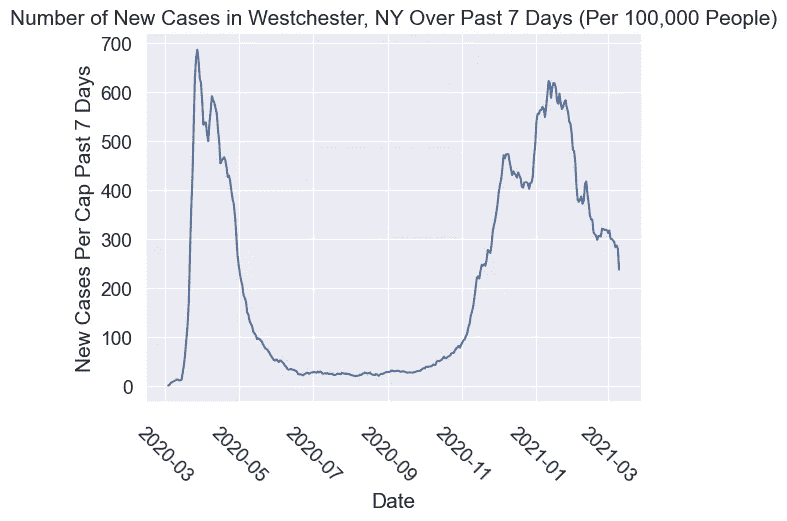

# 如何使用 Python 快速查看本地新冠肺炎数据

> 原文：<https://medium.com/nerd-for-tech/how-to-quickly-view-local-covid-19-data-using-python-6a5ede8ac70a?source=collection_archive---------22----------------------->

# 个性化新冠肺炎数据

不幸的是，此时此刻，新冠肺炎对当地的影响应该是显而易见的。我们都非常清楚，Covid 病例的数量有高峰和低谷。当判断做某些事情的风险时，如果不确定 Covid 目前如何影响他们的领域，就很难正确看待你的行动。为了消除这种不确定性，**我决定编写一个脚本，在不到 10 秒的时间内显示一个县最近的病例数**。有了这个一键式工具，我就有了更多的权力来决定我在公共场合会接受什么样的风险。我很乐意帮助传播这些知识，以便您也可以了解对您最重要的 Covid 统计数据！

# 数据

多亏了《纽约时报》的出色工作，人们可以非常容易地访问 [Covid 数据](https://github.com/nytimes/covid-19-data)。数据细化到县一级，每天更新并维护重要的统计数据(新病例、住院、死亡等)。)在 csv 文件中。这些数据也显示在纽约时报网站的仪表板上。虽然可以在他们的数据和仪表板中查看许多不同的统计数据，但对于这个项目，我的目标是快速查看过去 7 天内新病例的历史数量(每 100，000 人)。这张图表让我能够衡量我所在的县目前患有 Covid 的人口比例，以及与 Covid 开始以来的其他时期相比的情况。

# 代码

对于这个项目，有三个重要步骤:

1.  检索数据
2.  设计数据
3.  展示洞察力

## 检索数据

为了访问这些数据，你需要使用一个非常重要的库:`git`。这个图书馆将把我们与《纽约时报》提供的新冠肺炎数据联系起来。为此，我编写了以下命令:

```
from git import Repo
repo = Repo(‘../covid-19-data’)
repo.remotes.origin.pull()
```

第一个命令在当前文件夹之外查找“新冠肺炎数据”文件夹(克隆自纽约时报存储库)。第二个命令更新我本地机器上的这个文件夹。

## 设计数据

根据《纽约时报》提供的数据，人们可以查看从口罩使用到总病例的任何信息。在这个项目中，我将着眼于过去 7 天每 10 万人中新增病例的数量。为了获得正确格式的数据，我将使用`Pandas` 库。首先，我们将数据缩小到所需的县(在本例中是 Westchester)。

```
import pandas as pd
us_counties = pd.read_csv(“../covid-19-data/us-counties.csv”, infer_datetime_format=True)
westchester_data = us_counties[us_counties[‘county’] == ‘Westchester’]
westchester_data.reset_index(inplace=True)
```

接下来，我们将把病例总数扩展到 10 万人。如果我们想比较威彻斯特和其他地方的数据，这将有助于我们。

```
westchester_pop = 967506
scale_to_100k = westchester_pop / 100000
westchester_data[‘total_cases_per_100k’] = westchester_data[‘cases’] / scale_to_100k
```

有了缩放后的数据，我们现在可以计算过去 7 天每 100，000 人中的新病例数。为了迈出这重要的一步，我们将计算每天人均新增病例数。这样，我们将结合前 7 天的值来获得我们的最终统计数据。(注意`numpy`是导入的，这样我们可以在文件末尾为当前日期留一个空白，因为我们不知道明天会发生多少病例)。

```
import numpy as np
new_cases = [westchester_data['total_cases_per_100k'][idx+1] -
             westchester_data['total_cases_per_100k'][idx] 
             for idx in range(len(westchester_data)-1)]
new_cases.append(np.nan)
westchester_data['new_cases_per_cap'] = new_cases
westchester_data['new_cases_per_cap_past_7_days'] =      westchester_data['new_cases_per_cap'].rolling(window=7, min_periods=0).sum()
```

太好了！我们的数据格式正确！现在保存数据:

```
westchester_cases = westchester_data.to_csv("../westchester_coronavirus.csv")
```

## 可视化见解

为了创建可视化效果，我使用了`seaborn` 库，并使用`PIL.Image.`直接查看图表。我使用`sns.lineplot()`函数查看过去 7 天人均新增病例数的线图。如果我们将这个数字除以 7，这将是(我们知道的)目前感染冠状病毒的人数。保存该文件后，我们可以使用以下方式显示图像:

```
import seaborn as sis
from PIL import Image
desired_file_path = # the filepath for the image (a string)
im = Image.open(desired_file_path)   
im.show()
```

完成后，我们就可以查看数据了！



截至 2021 年 3 月 11 日，纽约州威彻斯特的新增病例数

从这个图表中，我们可以看到 Covid 案例正在急剧下降。为了了解当前的案件量，我喜欢将它与过去相同数量的案件进行比较:2020 年 3 月中旬，2020 年 5 月初和 2020 年 11 月中旬。纽约时报[将当前形势](https://www.nytimes.com/interactive/2021/us/westchester-new-york-covid-cases.html)(2021 年 3 月)归类为“非常高的风险”。

这个脚本的伟大之处在于您可以完全控制想要查看的数据！如果你想比较你的县和当地的县，这是很容易做到的。你控制着信息的获取，进而控制着你的公共生活。因此，请随意在[这个回购](https://github.com/gregfeliu/Westchester_covid_tracker/tree/main/scripts)中找到脚本，并绘制您所在地区的新冠肺炎数据！