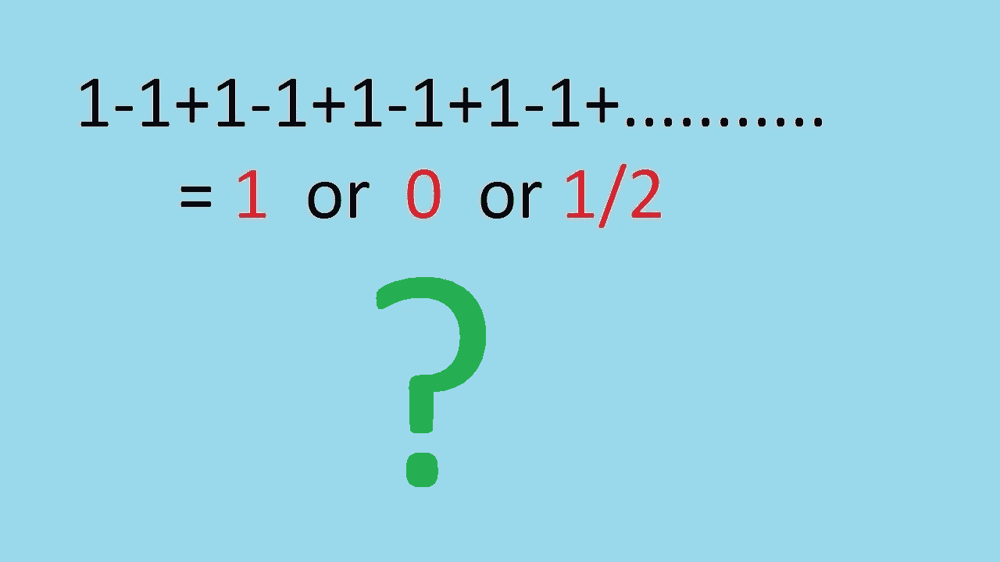

# 如何反驳格兰迪的系列

> 原文：<https://medium.com/nerd-for-tech/how-to-refute-grandis-series-37f5c3cff3f9?source=collection_archive---------0----------------------->

页（page 的缩写）YouTube 上的数学爱好者

## 格兰迪级数是塞萨罗和的一个例子，它给出了一个趋向于无穷大的序列的和。我们来看看如何反驳这个著名的系列。

格兰迪系列是一个非常著名的系列，由意大利数学家、哲学家和牧师 Guido Grandi 制作。该系列最简单的形式可以描述为:

s = 1–1+1–1+1–1+1–1+1–1+…

这个系列没完没了，永不停息。然而，看看这个系列，人们会说这个系列的答案将是:0，如果这个系列以-1 结束，1，如果这个系列以+1 结束。但是，格兰迪是这样做的:

设 S = 1–1+1–1+1–1+1–1+…
1–S = 1-(1–1+1–1+1+1–1+…)
1–S = 1–1+1–1+1–1+1–1+…(打开括号)
1–S = S(从推导的第一步开始代入 S)
1 = 2S
S = 1/2

在这里，格兰迪证明了我们都说是 0 和 1 的数列的和实际上是 1/2！世界上许多数学家都在讨论这个话题。还有很多这样的塞斯萨罗总和，你们都可以读到。但现在，我将展示如何反驳格兰迪的系列。

我们必须做的第一件事是看看这个系列的最后一期。

让我们以最后一项为–1
S = 1–1+1–1+1–1+1–1+…–1
1–S = 1-(1–1+1+1–1+1+1–1+…–1)
1–S = 1–1+1–1+1–1+1+1–1+…+ 1
1–S = S+1(从第一步开始代入 S)
0 = 2S
S = 0

让我们以最后一项为+1
S = 1–1+1–1+1–1+1–1+…+1
1–S = 1 –( 1–1+1+1–1+1–1 +…+ 1)
1–S = 1–1+1–1+1–1+1+…–1
1–S = S–1(从第一步开始代入 S)
2 = 2S
S = 1

这是我们在开始时得到的两个解决方案！这次我们做了什么不同？不同的是，格兰迪忽略了最后一项，不管最后一项是什么，都用 S 代替。考虑到最后一项，我们找不到数列的总和。这是因为，取一个 cessàro 和，其极限为无穷大。通过包括最后一项，我们间接地限制了这个系列。这就是为什么我们可以用这个方法给一个有限的格兰迪级数赋值。但是有了无限的限制，我们就不能。无限性是数学中许多不同悖论的原因。这也是斯里尼瓦瑟·拉马努金发现所有自然数的和等于-1/12 的原因！所以要记住，塞萨罗和是一个无穷级数的求和，不能被限制。

如果你喜欢这篇文章，请阅读[带一元可分解二次因子的综合除法](https://srivishnuvusirikala.medium.com/synthetic-division-with-a-monic-factorizable-quadratic-divisor-f6cca12cb93e)。

或者，如果你是一个物理爱好者，请阅读[当人们不使用运动方程时会犯的一个常见错误](https://srivishnuvusirikala.medium.com/a-common-mistake-that-people-make-when-they-do-not-use-the-equations-of-motion-7f1cedf068cb?sk=c8d98479399381e258090854e2304c71)。