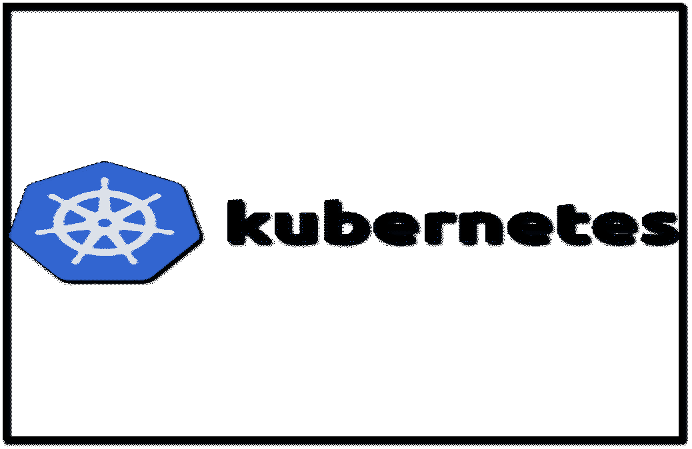
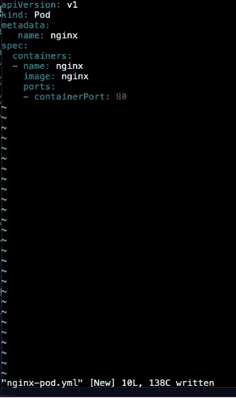
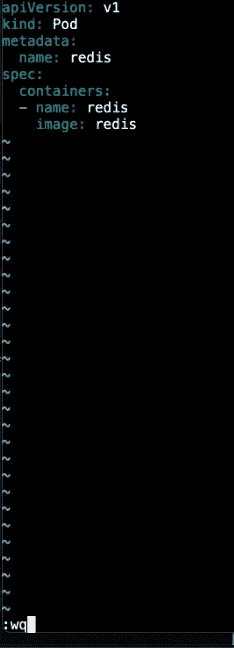
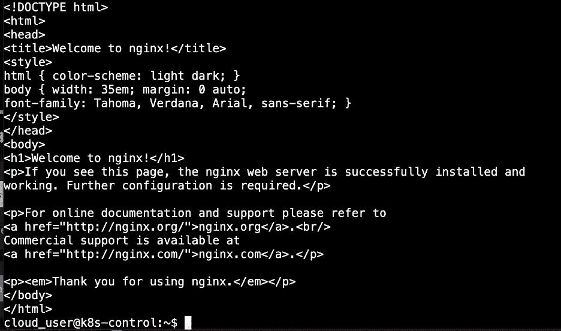
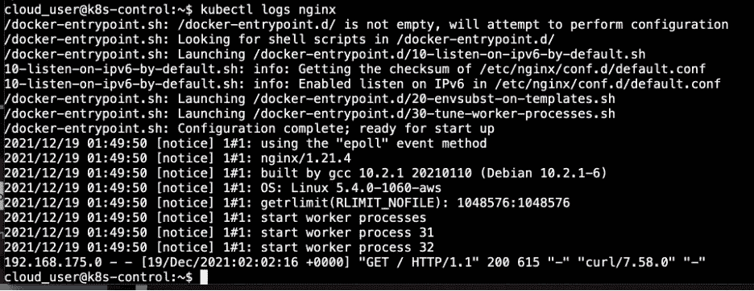

# 如何使用 Kubernetes 运行容器

> 原文：<https://medium.com/nerd-for-tech/how-to-run-containers-with-kubernetes-cb00e7c926b7?source=collection_archive---------4----------------------->

图片来源:Unsplash 的 Alan Veas

在我的职业转型之旅中，我的导师给我的最重要的建议是需要不断学习。技术在不断发展，人们必须通过频繁学习新的 DevOps 工具来保持敏锐。Kubernetes 是云中最热门的工具之一，它是一个强大的容器编排平台。之前，这个博客讨论了 Docker 中容器的使用。基于我对容器的了解，这次更新将涵盖一个连续学习者的第一手资料 Kubernetes 的冒险经历。

**Kubernetes 是什么，为什么它在 DevOps 这么受欢迎？**

在其官方[网站](https://kubernetes.io/)上，Kubernetes 被描述为“自动化部署、扩展和管理容器化应用的开源系统”简而言之，它运行容器。根据该网站，Kubernetes 的工作原理是将“组成应用程序的容器分成逻辑单元，以便于管理和发现”。也被称为“K8s”，Kubernetes 促进了跨多个云提供商的容器化应用的扩展和操作。Kubernetes 的多功能性允许 DevOps 工程师在混合和本地环境以及云中使用它。Kubernetes 热情高涨的其他原因包括:

**Kubernetes 作为代码工具与基础设施很好地结合在一起**

基础设施即代码(IaC)是通过编码配置文件而不是手动方法来创建和管理基础设施。IaC 通过重复、统一和一致性来促进自动化。自动化减少了对人工干预的需求，并允许 DevOps 工程师将更多的时间和精力用于其他任务。这样做，也降低了人为错误的风险。将 IaC 与 Kubernetes 结合使用可以增加对容器的跟踪，同时增强容器化应用的可靠性和恢复。虽然 Kubernetes 提供了一个图形用户界面(GUI)组件，但它也有一个命令行界面(CLI)，称为“kubectl”。使用“kubectl”简化了编码，并且通过扩展，简化了对用户有益的特性的实现。

**Kubernetes 因用户输入而不断改进**

最初由谷歌工程师于 2014 年 6 月发布，Kubernetes 的开源格式有助于各种用户的不断输入和增强。Kubernetes 目前由云计算原生计算基金会(CNCF)托管，受益于用户组、工作组、委员会和特殊兴趣小组(SIG)成员的持续工作。这些不同组件的成员关注平台的不同方面，这导致了频繁的 Kubernetes 升级和新的迭代。在撰写本文时，版本 1.23.1 是最新的 Kubernetes 版本。

Kubernetes 标志的官方图像之一

**本次活动的目的**

这个学习活动让 Kubernetes 的新用户有机会使用 Kubernetes Pods 在一个已存在的集群中运行容器。在该场景中，学员通过“kubectl”创建 pod 并检查容器日志以确保功能正常。

**物资/集结地**

云教育平台上的沙盒。用于开展实践活动的学习平台提供了三个必要的完成节点:云服务器控制平面节点、云服务器工作节点 1 和 2。相应地，该平台还提供登录它们所需的凭证。

现在我们有了材料，也知道了项目的目标，让我们开始吧！

**第一步:创建一个 NGINX Pod，作为一个简单的 Web 服务器**

访问控制平面节点后，创建一个 YAML 文件，作为 NGINX pod 的定义文件。将其命名为“nginx — pod ”,并使用 vi 命令创建它:

vi nginx-pod.yml

进入 vi 文本编辑器后，在 nginx-pod.yml 文件中输入以下配置细节:

定义文件“nginx-pod.yml”的图像

如您所见，API 版本是“1”，种类是“Pod”，这个容器将运行的映像是“nginx”。端口规格为“80”您可能还记得另一个与 NGINX 相关的项目，NGINX 监听 80 端口。要允许与 NGINX 容器通信，请将“containerPort”指定为“80”。

现在我们已经创建了 YAML 定义文件，输入以下命令来创建 pod:ku bectl create-f nginx-pod . yml

命令中的“-f”标志允许在 pod 创建期间传入一个文件，在本例中是“nginx-pod.yml”。

一个新的 nginx pod 是“kubectl create -f nginx-pod.yml”命令的结果

如果正确完成了前面的步骤，输入 kubectl create -f nginx-pod.yml 命令将返回“pod/nginx created”响应。

**第二步:使用 Kubernetes Pod 创建并运行 Redis 实例**

要为 Redis pod 创建 YAML 定义文件，我们将使用一个熟悉的命令，但 pod 名称略有不同:

“vi redis-pod.yml”命令的图像

对于 redis 实例，指定其种类也是“Pod”，容器的名称为“redis”，图像为“Redis”。与 NGINX pod 不同，不需要暴露任何通信端口。在这种实践学习体验中，NGINX 充当 web 服务器。Redis 是“一个开源的(BSD 许可的)、内存中的**数据结构存储**，用作数据库、缓存和消息代理”，正如其网站上解释的那样。Redis 是“远程字典服务器”的简写，它使用内存中的数据集，允许用户通过不同的方法持久保存数据。因此，这是一个很好的学习机会与 Kubernetes 结合。

Redis 的 YAML 定义文件的可视化

完成定义文件的必要细节后，输入以下命令创建 Redis pod:ku bectl create-f Redis-pod . yml

Redis pod 是作为“kubectl create -f redis-pod.yml”命令的结果生成的

**第三步:检查豆荚以确保它们正常工作**

至此，我们已经生成了一个充当 web 服务器的 NGINX pod 和一个 Redis pod。为了确保我们在正确的轨道上，输入以下命令来检查两个 pod 的状态:

kubectl 获得 pods -o 宽

在这个命令中，“-o wide”标志将产生一个输出，其中包含关于焦点中的窗格的更多详细信息。

来自“kubectl get pods -o wide”命令的附加 pod 输出细节

输出表明两个 pod 当前都在运行。

“nginx”pod 的 IP 地址特写

然而，我们需要更深入地研究，以确保 NGINX web 服务器 pod 能够有效地工作和通信。为了确保“nginx”pod 的正常功能，我们可以卷曲它的 IPv4 地址。

“curl 192.168.194.65”地址的图像，用于确认 pod 功能

来自卷曲的 IP 地址的结果显示了 NGINX 欢迎页面的文本版本。有了这个结果，我们可以确认“nginx”pod 功能正常！

“nginx”pod 的卷曲 IP 地址的输出

**第四步:检查 NGINX 容器日志**

实践经验的最后一部分是检查 NGINX Web 服务器 pod 的日志。

要检查我们的工作，输入这个命令:kubectl logs nginx

“nginx”容器日志的截图，显示关于所有 pod 活动的条目

现在我们有了。最新命令的输出显示了“nginx”pod 的所有活动。日志还包括关于卷曲的 IP 地址的条目。因此，我们已经成功完成了本实验的要求。

这是一个简单而有趣的学习 Kubernetes 基础知识的机会，由一位云专家提供。展望未来，我打算精通 K8s，并通过一个更高级的项目展示增强的技能水平。

感谢您花时间阅读我的学习冒险！