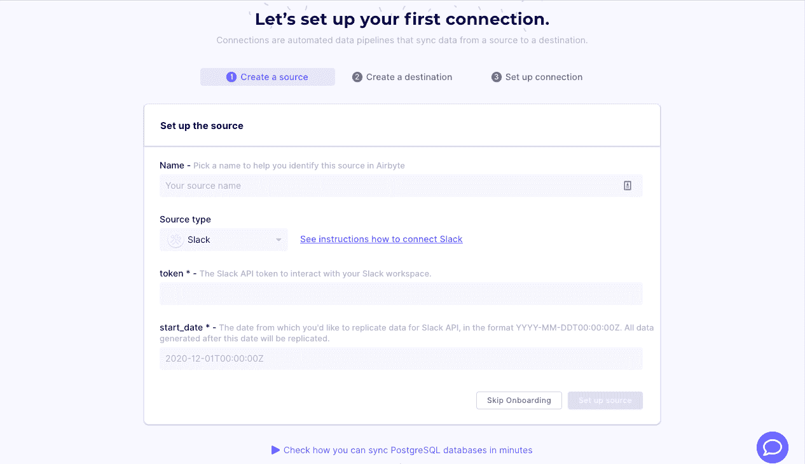
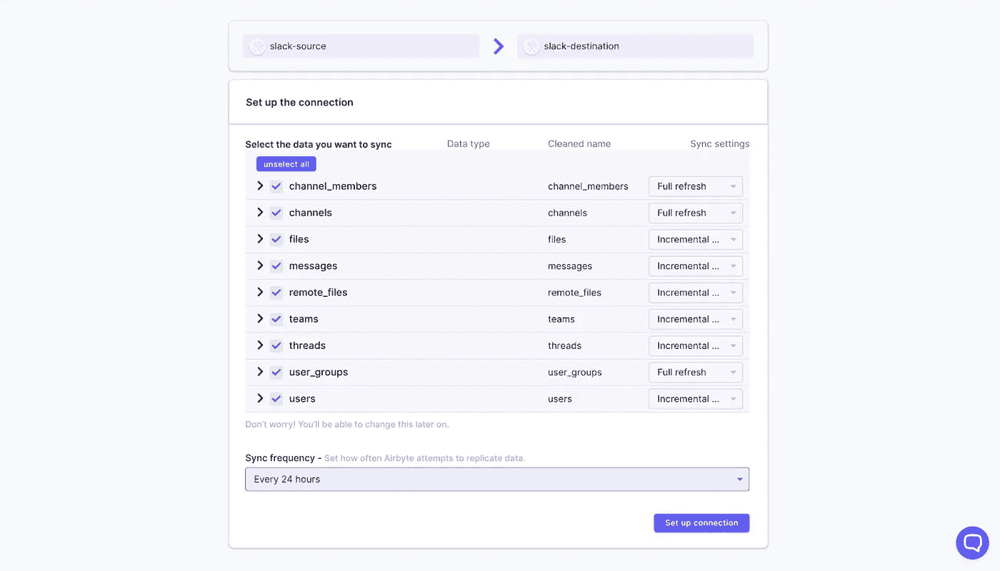

# 如何在空闲计划中保存和搜索空闲历史记录

> 原文：<https://medium.com/nerd-for-tech/how-to-save-and-search-through-your-slack-history-on-a-free-slack-plan-a403b3abc1f5?source=collection_archive---------11----------------------->


[松弛空闲层](https://slack.com/pricing/paid-vs-free)仅保存最后的 10K 消息。对于 social Slack 实例，升级到付费计划来保留这些消息可能不切实际。类似地，对于像 Airbyte 这样的开源项目，我们通过一个公共 Slack 实例与我们的社区进行交互，为每个 Slack 成员支付一个座位的成本是令人望而却步的。

然而，搜索旧邮件会非常有帮助。失去那段历史就像某种高级形式的失忆。关于 Java 8 流的笑话是什么？这个投稿人的问题听起来很熟悉——我们以前没见过吗？但是你就是想不起来！

本教程将向您展示如何免费使用 Airbyte 保存这些消息(即使 Slack 删除了对它们的访问权限)。它还将为您提供一种便捷的搜索方式。

具体来说，我们会将消息从您的 Slack 实例导出到一个名为 [MeiliSearch](https://github.com/meilisearch/meilisearch) 的开源搜索引擎中。我们将重点关注如何在您的本地工作站上运行此设置。我们将在最后提到如何建立一个更加生产化的管道。

我们希望简化这一过程，因此，尽管我们将链接到一些外部文档以进行进一步探索，但我们将在此提供您启动和运行这一过程所需的所有说明。

# 1.设置 MeiliSearch

首先，让 MeiliSearch 在我们的工作站上运行。MeiliSearch 有大量的文档供[开始使用](https://docs.meilisearch.com/reference/features/installation.html#download-and-launch)。然而，对于本教程，我们将给出使用 Docker 设置 MeiliSearch 所需的所有说明。

```
docker run -it --rm \
  -p 7700:7700 \
  -v $(pwd)/data.ms:/data.ms \
  getmeili/meilisearch
```

就是这样！

MeiliSearch 将数据存储在`$(pwd)/data.ms`中，所以如果您更喜欢将它存储在其他地方，只需调整这个路径。

# 2.如何将您的时差信息复制到 MeiliSearch

## a.设置 Airbyte

确保安装了 Docker 和 Docker Compose。如果您还没有设置 Docker，请按照这里的[说明](https://docs.docker.com/desktop/)在您的机器上设置它。然后，运行以下命令:

```
git clone https://github.com/airbytehq/airbyte.git
cd airbyte
docker-compose up
```

如果您遇到任何问题，请随时查看我们更广泛的[入门](https://docs.airbyte.io/getting-started)以获得更多帮助。

一旦你看到一个 Airbyte 横幅，UI 在`[http://localhost:8000/](http://localhost:8000/)`就准备好了。一旦您设置了您的用户首选项，您将被带到一个要求您设置信号源的页面。在下一步，我们将回顾如何做到这一点。

## b.设置 Airbyte 的松弛源连接器

在 Airbyte UI 中，从下拉列表中选择 Slack。我们在这里提供了在 Airbyte [中设置松弛源的逐步说明。这些将指导您如何完成本页的表格。](https://docs.airbyte.io/integrations/sources/slack#setup-guide)



在这些说明结束时，您应该已经在 Airbyte UI 中创建了一个 Slack 源。目前，只需将您的 Slack 应用程序添加到单个公共频道(您可以稍后将其添加到更多频道)。只有来自该通道的消息才会被复制。

Airbyte 应用程序现在会提示您设置一个目的地。接下来，我们将介绍如何设置 MeiliSearch。

## c.设置 Airbyte 的 MeiliSearch 目的地连接器

回到 Airbyte 界面。它应该还在提示你设置一个目的地。从下拉列表中选择“MeiliSearch”。对于主机字段，设置:`http://localhost:7700`。`api_key`可以留空。

## d.设置复制

在下一页，您将被要求选择您想要复制的数据流。我们建议取消选中“文件”和“远程文件”,因为在这个搜索引擎中你真的不能很容易地搜索它们。



至于频率，我们建议每 24 小时一次。

# 3.搜索 MeiliSearch

保存连接后，Airbyte 应该立即开始复制数据。完成后，您应该会看到以下内容:


当同步完成后，您可以通过向 MeiliSearch 发出搜索请求来检查这一切是否正常。根据 Slack 实例的大小，复制可能需要几分钟时间。

```
curl 'http://localhost:7700/indexes/messages/search' --data '{ "q": "<search-term>" }'
```

例如，在我复制的一条消息中，我有以下消息:“欢迎使用 airbyte”。

```
curl 'http://localhost:7700/indexes/messages/search' --data '{ "q": "welcome to" }'
# => {"hits":[{"_ab_pk":"7ff9a858_6959_45e7_ad6b_16f9e0e91098","channel_id":"C01M2UUP87P","client_msg_id":"77022f01-3846-4b9d-a6d3-120a26b2c2ac","type":"message","text":"welcome to airbyte.","user":"U01AS8LGX41","ts":"2021-02-05T17:26:01.000000Z","team":"T01AB4DDR2N","blocks":[{"type":"rich_text"}],"file_ids":[],"thread_ts":"1612545961.000800"}],"offset":0,"limit":20,"nbHits":2,"exhaustiveNbHits":false,"processingTimeMs":21,"query":"test-72"}
```

# 4.通过用户界面搜索

让 curl 请求搜索你的 Slack 历史有点笨拙，所以我们修改了 MeiliSearch 在[他们的文档](https://docs.meilisearch.com/learn/tutorials/getting_started.html#integrate-with-your-project)中提供的示例 UI 来搜索 Slack 结果。

将这个 [html 文件](https://github.com/airbytehq/airbyte/blob/master/docs/tutorials/slack-history/index.html)下载(或复制粘贴)到您的工作站。然后，使用浏览器打开它。您现在应该能够在搜索栏中输入搜索词，并立即获得结果！


# 5.“生产化”保存松弛历史

你可以在这里找到如何在各种云平台[上托管](https://docs.airbyte.io/deploying-airbyte) [Airbyte](http://airbyte.io) 的说明。

关于如何在云平台上托管 MeiliSearch 的文档可以在[这里](https://docs.meilisearch.com/running-production/#a-quick-introduction)找到。

如果您想使用上一节中提到的 UI，我们建议将其静态托管在 S3、GCS 或同等平台上。