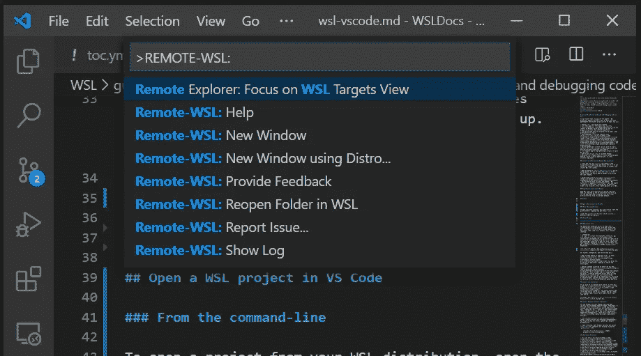
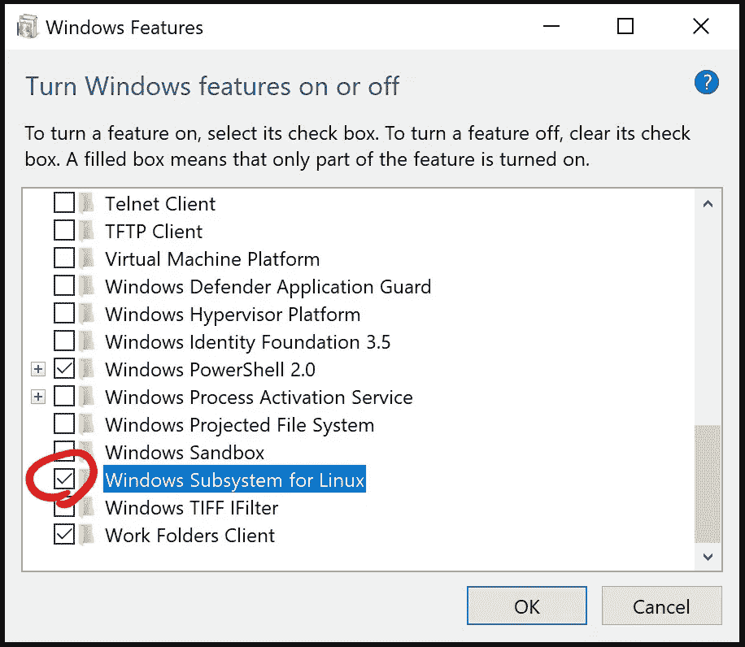
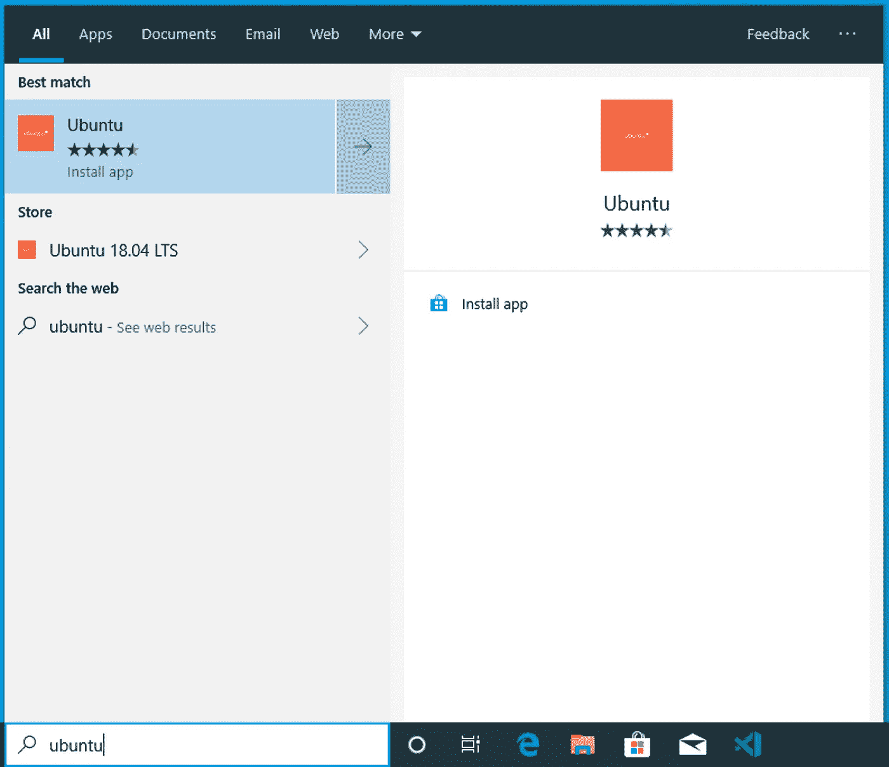
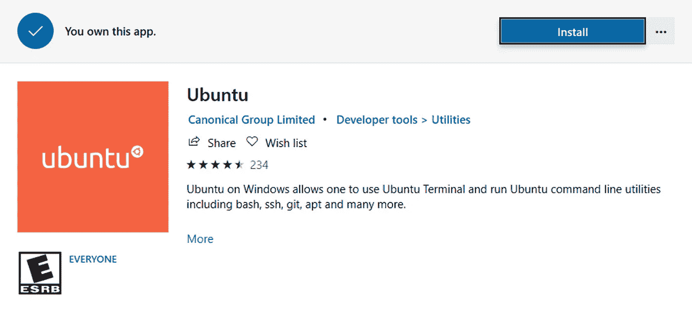
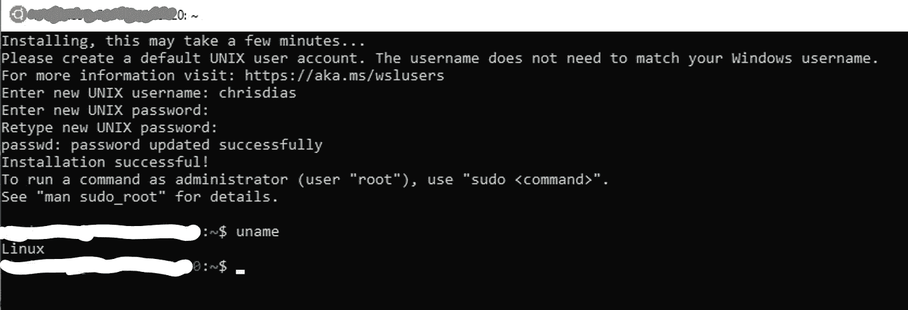

# 如何在 Windows 10 上用 Visual Studio 代码设置 Windows 子系统 Linux (WSL 2)

> 原文：<https://medium.com/nerd-for-tech/how-to-setup-windows-subsystem-linux-with-visual-studio-code-on-windows-10-b06fdbe9b30b?source=collection_archive---------0----------------------->



如果你是 Linux 的粉丝，但是运行 windows，并且不想为你的开发过程而经历切换这两个操作系统的麻烦，那么 Windows subsystem for Linux(WSL)是你的选择。WSL 允许您在 windows 上运行原生 Linux 命令，同时享受您喜爱的 windows 工具和应用程序。事实上，有了 WSL，您可以在 windows 上运行整个 Linux 内核！在本文中，我将指导您在我们的 windows ten 上安装 Ubuntu，并为您的代码开发环境设置 VS 代码。

# **在您的 windows 上启用 WSL**

默认情况下，Windows 不启用 WSL。因此，在安装 Ubuntu 之前，您需要在 windows 上启用 WSL 功能。在你的 windows 搜索栏上，输入“*功能*”在结果栏上，选择“**打开和关闭 Windows 功能，”**打开如下对话框。向下滚动并选中 **Windows Subsystem for Linux，**如图中突出显示的。之后，点击 ok，重启你的 *PC* 。



# **WSL—WSL 1 和 WSL 2 哪个？(更新)**

wsl1 和 wsl2 有什么区别，应该用哪个？根据微软文档，很明显，wsl1 是第一个发布的 **wsl** 并且 **wsl 2** 在系统调用兼容性方面比 **wsl 1** 有所更新。由于 Linux 二进制使用系统调用文件系统管理，wsl1 使用由 **wsl** 团队构建的转换层来管理 Linux 和 Windows 文件上的文件系统，但是速度较慢或者可能与一些重要的 Linux 本地应用不兼容，除非 WSL 团队发布了支持更新。另一方面， **wsl 2** 在 Linux 自己的内核上升级了完整的系统调用功能。因此，wls1 针对从 Linux 更快地访问 windows 文件进行了优化，而使用 **wsl 2** 支持在原生 Linux 应用上更快的性能。由于我们可能希望使用更多的 Linux 本地支持应用程序来充分利用 Linux 环境，而不必等待来自 **WSL** 团队的更新，我们将在这里使用 wsl2。要默认启用 **wsl 2** ,请在您的 windows PowerShell 或命令行上运行以下命令——

```
Enable-WindowsOptionalFeature -Online -FeatureName VirtualMachinePlatform -NoRestart 
```

然后**重启你的系统**确保它正常运行。重启系统后，以管理员身份打开 Powershell(点击 ***以管理员身份运行*** )并运行此命令将其设置为默认设置—

```
wsl --set-default-version 2
```

现在你的电脑可以接受最新的 Ubuntu 版本了。如果在任何时间点，你想恢复到 **wsl 1** ，你可以运行；

```
dism.exe /online /disable-feature /featurename:VirtualMachinePlatform /norestart
wsl --set-default-version 1
```

# **在 Windows 上安装 Ubuntu 发行版**

现在，wsl2 设置为默认，我们可以安装 Ubuntu 的最新稳定版本。要安装 Ubuntu，请到微软商店或 windows 搜索栏输入 Linux 发行版。选择 Ubuntu 并按照提示进行操作。



点击**安装**



一旦完成点击启动，你会看到 Ubuntu 终端被打开。您需要设置用户名和密码。就是这样。您已经成功地在 windows 上运行了 Linux！



# **设置 Visual Studio 开发代码。**

首先，要在 WSL 上使用 VS 代码，您需要在 windows 上安装并通过远程访问它，因为 WSL 没有图形界面。因此，如果您还没有安装 VS 代码，就让我们来安装吧。转到 [VS 代码页这里](https://code.visualstudio.com/)。选择 windows 并安装它。为了远程访问 VS 代码，我们需要在 WSL 的 VS 代码上安装[远程扩展](https://marketplace.visualstudio.com/items?itemName=ms-vscode-remote.remote-wsl)。打开您的 VS 代码并单击

*ctrl +shift+x*

并在市场搜索栏上输入“ *wsl* ”。选择远程— WSL，然后按安装。


一旦安装完成，回到 Ubuntu 终端并输入代码。—注意*“代码“+”。”(代码。)*。当您单击 enter 时，您将看到消息“正在安装 VS 代码服务器 c7d83e57…”

这里发生的事情是，WSL 正在安装一个更小的 VS 代码服务器，它与 Windows(客户端)上安装的 VS 版本相匹配。然后，服务器将与 Windows 上的 VS 代码通信，小型服务器将接收我们对 Windows VS 代码所做的任何更改。服务器将依次在 WSL 中安装和托管扩展。因此，我们运行的代码(例如 python 或 JavaScript)与基于工具和资源(例如包或框架)的代码相比，我们在 WSL 中而不是在 windows 中运行。

# **总结**

在本文中，我们通过在 windows 10 上启用 WSL 功能来安装 Ubuntu。设置好用户名和密码后，我们就可以在 windows 上访问 Ubuntu 终端了。我们还通过 VS 代码远程扩展为我们的 WSL 开发工作流设置了 VS 代码。通过扩展，安装在 windows 上的 VS 代码可以利用来自 WSL 的资源和工具。感谢您的阅读，希望对您有所帮助。如果您有任何问题或改进建议，请随时在下面发表评论。谢谢你。