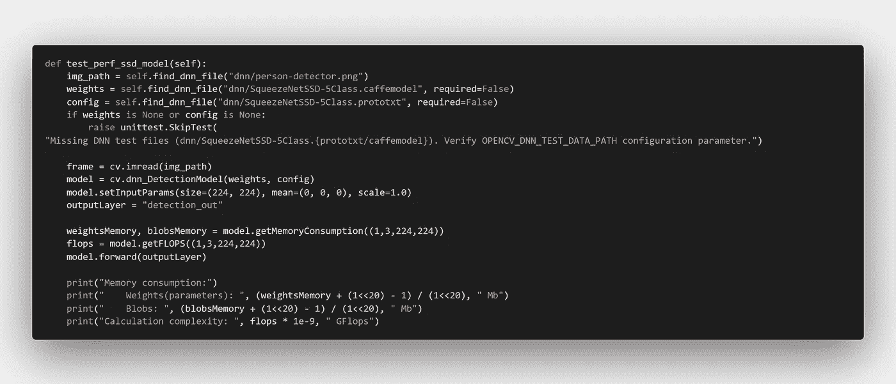

# 如何测试 Caffe2 模型的性能(。caffemodel)

> 原文：<https://medium.com/nerd-for-tech/how-to-test-the-performance-of-the-caffe2-model-caffemodel-fbce2e4d9c68?source=collection_archive---------9----------------------->



## 深度学习框架 Caffe2 模型的性能

我们的 OpenCV 框架有几个 API 来执行 Caffe2、Tensorflow、OpenVINO 模型等。

OpenCV 提供了一个统一的 API 来测试视频推理的准确性、深度学习模型的准确性、对所需应用程序进行基准测试以及测试模型在以下方面的性能:

模型数据的 GFlops 和 Mb

> **Caffe2 模型(。caffemodel)由模型权重和从 OpenCV API 输出的整个 blob 内存组成。**

> 请仔细阅读这段关键代码。

```
import cv2weights = self.find_dnn_file("dnn/{caffemodel name}.caffemodel", required=False)config = self.find_dnn_file("dnn/{prototxt name}.prototxt", required=False)if weights is None or config is None: raise Exception("Missing DNN test files (dnn/caffemodel name.{prototxt/caffemodel}). Verify OPENCV_DNN_TEST_DATA_PATH configuration parameter.")# Use OpenCV to Instantiate Caffe2 Model
**model = cv2.dnn_DetectionModel(weights, config)
model.setInputParams(size=(224, 224), mean=(0, 0, 0), scale=1.0)** # set output layer for forward pass
**outputLayer = "detection_out"** # Evaluate Memory Consumption
**weightsMemory, blobsMemory = model.getMemoryConsumption((1,3,224,224))**# calculate FLOPS
**flops = model.getFLOPS((1,3,224,224))
model.forward(outputLayer)**print("Memory consumption:")print("    Weights(parameters): ", (**weightsMemory** + (1<<20) - 1) / (1<<20), " Mb")print("    Blobs: ", (**blobsMemory** + (1<<20) - 1) / (1<<20), " Mb")print("Calculation complexity: ", **flops** * 1e-9, " GFlops")
```

谢谢你。