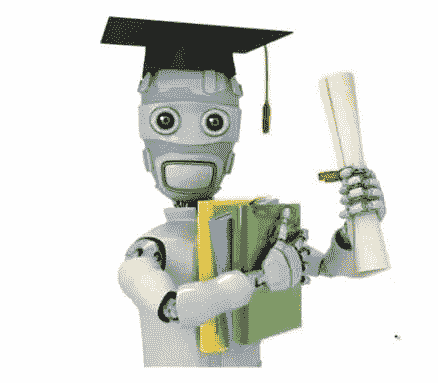
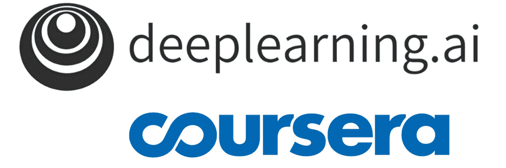
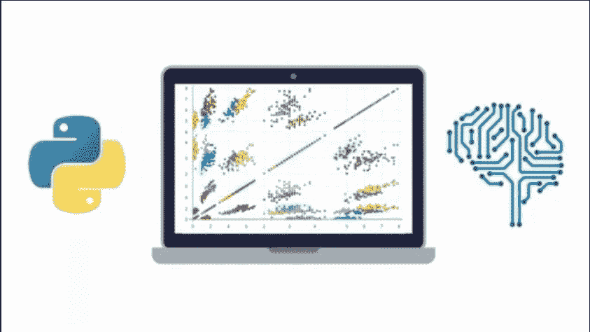
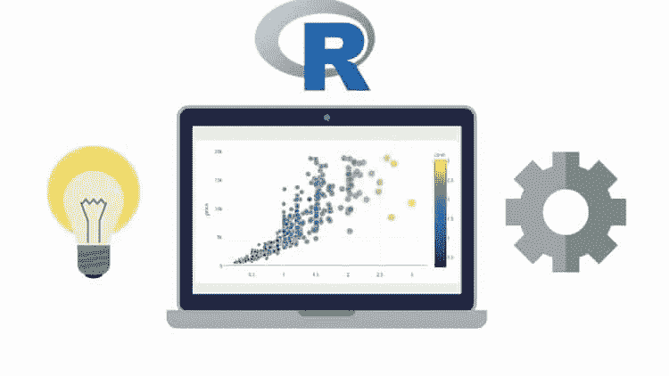

# 如何理解机器学习？

> 原文：<https://medium.com/nerd-for-tech/how-to-understand-machine-learning-237492943525?source=collection_archive---------23----------------------->

纵观技术进步的方式，尤其是在自动化领域取得了巨大的进步，机器学习被用于不同的行业，分别为不同的公司带来好处。随着不同行业中出现的数据的快速增长，有必要使用这些数据并了解分别给出的不同趋势。使用不同的机器学习技术，我们将理解数据并执行机器学习分析，这将确保我们获得预测的最佳输出。

随着互联网上出现大量关于这一最新技术的文章和信息，学习这一领域的正确工具和技术以充分利用它变得非常重要。Coursera.org 和 Edx.org 有不同的课程，分别教授数据科学和机器学习的基础知识。由于每天都在制作许多机器学习课程，因此在选择过程中做出正确的选择以分别成为机器学习工程师或数据科学家变得非常重要。

在实际进入该领域之前，理解机器学习背后的理论非常重要。在理解机器学习模型如何工作之后，人们将会很好地理解它们的超参数，这些超参数分别对于不同的机器学习目的是重要的。因此，关键是要了解机器学习背后的理论，然后再去实际实现它。

以下是机器学习初学者可以接触到的一些最好的机器学习理论课程。这些课程提供了机器学习的基础，教授机器学习的理论方面。

1.  **吴恩达的机器学习**

这是斯坦福大学教授吴恩达教授的课程，他也曾在谷歌大脑工作过。这个课程非常好，更加专注于理论，而且有一些很酷的项目可以用来实际实现机器学习。使用的编程语言是 Octave。讲师在帮助学生理解不同机器学习算法背后的理论方面做得很好，并且还提供了一些使用这些算法的实用技巧和建议。还有导师对一些业内最优秀的机器学习和深度学习科学家进行的采访。我肯定会推荐这门课，在这门课中，我们将学习机器学习的基础知识，以及它们在 Octave 中的实际实现。

图片摘自[https://www . I-programmer . info/news/105-artificial-intelligence/12329-machine-learning-at-all-levels-on-coursera . html](https://www.i-programmer.info/news/105-artificial-intelligence/12329-machine-learning-at-all-levels-on-coursera.html)

**2。吴恩达深度学习特殊化**

这也是由吴恩达教授的，课程清单涵盖了 stratch 的深度学习概念。有一个项目，学生可以实现 stratch 的逻辑回归机器学习算法。他们在这个专业中有一个 5 门课程的列表，在那里你可以学到深度学习的基础。如果一个人能花时间和精力来完成专业化，这个课程真的很好。当分别执行机器学习和深度学习任务时，人们将对深度学习以及一些实用的技巧和建议有非常好的理解。

图片取自[https://towards data science . com/the-deep-learning-specialization-2503 b 9 ee 7 ff 6](https://towardsdatascience.com/the-deep-learning-specialization-2503b9ee7ff6)

**3。用于数据科学和机器学习的 Python 训练营**

这是一门很好的机器学习课程，由何塞·波尔蒂利亚教授不同的机器学习技术。本课程主要侧重于机器学习的实践方面，但也提供了良好的理论背景。学生们必须参考加雷斯·詹姆斯所著的《统计学习导论》一书中的概念。因此，学生必须完成学习理论概念的工作。总的来说，讲师在机器学习的实践方面做了非常好的讲座，在那里人们可以了解机器学习和深度学习中使用的大多数工具和技术。

图片摘自[https://course upload . com/python-for-data-science-and-machine-learning-boo 200321/](https://courseupload.com/python-for-data-science-and-machine-learning-boo200321/)

**4。斯里坎特·维尔马的应用人工智能课程**

依我看，这是最好的课程之一。这门课讲授的内容非常清楚，学生很容易理解。除此之外，还有 30 个关于机器学习和深度学习的实时项目。还有一个工作保证索赔的课程。因此，我肯定会建议你去看看这个课程。他们有一个特定的网站，公司在那里发布对机器学习工程师或数据科学家的要求。课程中的一个挫折是需要很长时间才能完成。它有大约 150 多个小时的内容。如果你想要一门涵盖机器学习基础和其他重要重大发展的综合课程，那么我会建议你去上这门课。

图片取自[https://www.linkedin.com/in/satish-atcha-7a8b8379/?originalSubdomain=in](https://www.linkedin.com/in/satish-atcha-7a8b8379/?originalSubdomain=in)

**5。R 的数据科学和机器学习训练营**

最近，R 语言越来越受欢迎，它被不同的数据科学家和机器学习研究人员用于统计分析和结果。因此，上面的课程教学生如何使用 R 编程语言实现机器学习和深度学习模型，这真的很方便。看一看 Kaggle 的不同代码，你可以很好地了解 R 是如何用于不同的 Kaggle 比赛的，这真的会很方便。何塞·波尔蒂利亚是这门课的讲师，而且是在 Udemy。你可以探索这个课程，分别用机器学习和数据分析来了解 R 的工作原理。我也强烈推荐这门课程。

图片取自[https://udemydownload . com/data-science-and-machine-learning-boot camp-with-r-udemy-free-download/](https://udemydownload.com/data-science-and-machine-learning-bootcamp-with-r-udemy-free-download/)

**结论**

总而言之，我们已经看到，在将机器学习模型应用到生产中之前，理解机器学习的理论方面是非常重要的。当涉及到在部署机器学习算法之前获得理论知识时，上述课程应该给学生带来优势。希望这篇文章能帮助学生在理解机器学习时，决定选择正确的课程。谢谢你。