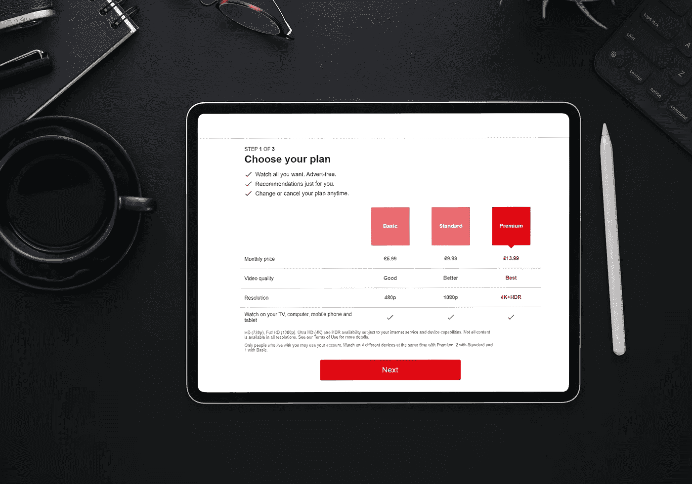
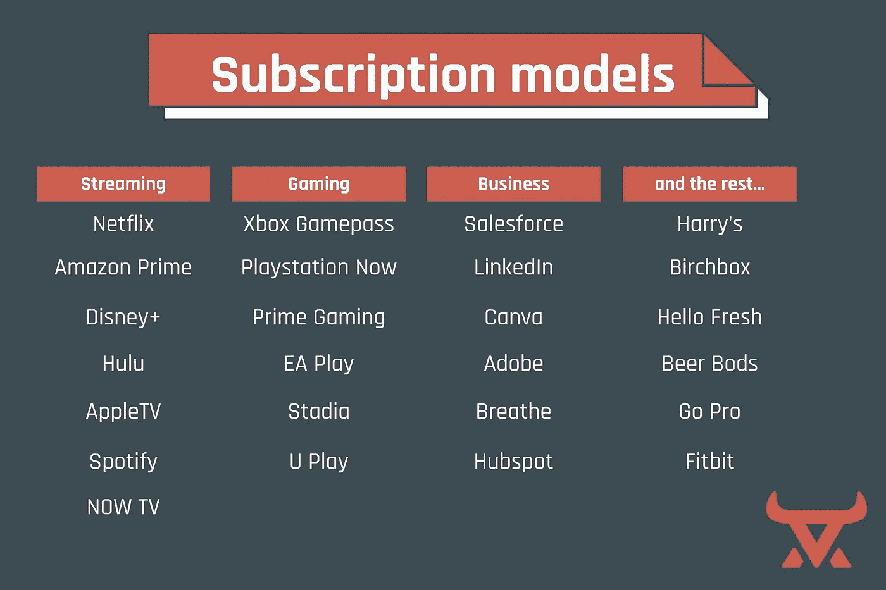

# 如何使用订阅模式来增加应用的收入

> 原文：<https://medium.com/nerd-for-tech/how-to-use-a-subscription-model-to-boost-your-apps-revenues-94c4f53b3?source=collection_archive---------13----------------------->

点击订阅按钮。并按铃…

# 何时收取一次性费用，何时使用订阅模式

之前，我们看到通过你的应用[赚钱的最有效方式之一是应用内购买](https://tdcolvin.medium.com/the-only-five-effective-ways-to-earn-money-through-your-app-752b1c1826cb)。人们可以在安卓的谷歌 Play 商店或 iOS 的 App Store 上使用自己的账户付费解锁功能或购买数字内容。

设置应用内购买时，您可以选择是一次性付款还是定期订购。从长远来看，订阅总会让你赚得更多，但它们并不适合所有的事情。

有时存在一个灰色区域——该功能可能需要一次性付费才能解锁，或者如果处理得当，可以合理地作为订阅来呈现。在这种情况下，走订阅路线有明显的优势。

**那么，如何通过订阅模式来构建你的应用，从而实现收入最大化呢？**

## 当客户期望一次性付款时

这似乎是显而易见的，但是用户希望只为他们将使用一次或解锁一次的东西支付一次。虚拟宠物狮子的一桶狮子食物应该一次付清。文件的日文翻译应一次性付费。在画图 app 里解锁一种特殊的画笔，要一次付费。

## 当客户期望订阅时

相比之下，订阅只有在被视为提供了*服务*，而不是*功能*的情况下才是合理的。想要 10GB 的云存储？这是一项服务，你可以按月收费。当用户停止付费时，他们就失去了存储空间，就像他们停止付费租用物理世界中的仓库空间一样。想要访问内容库，比如网飞或 Spotify？那也是一种服务。

## 从订阅角度考虑，实现收入最大化

照片由[米歇尔·亨德森](https://unsplash.com/@micheile?utm_source=medium&utm_medium=referral)在 [Unsplash](https://unsplash.com?utm_source=medium&utm_medium=referral) 上拍摄

考虑一下大约 2010 年的微软 Office 的案例。有各种各样的办公版本，大部分都是 100 英镑以上的当地英镑、欧元或等值美元。你买了一个特定的版本，比如说 Office 2010，并且一直使用它，直到你付费升级到一个更高的版本。

人们确实坚持了下来。许多企业运行的 Office 版本已有十年或更久，因为它“足够好”。所以微软永远不会从这些用户身上获得任何收入。

因此，在一个历史性的举动中，微软开始在订阅的基础上提供 Office。尽管顾客期望一次性付款，他们是如何做到的？嗯，通过将 Office 重新定义为服务。它不仅是一个软件包，而且你会自动收到所有的新版本更新。还有额外的服务，如 OneDrive、用于视频会议的 Lync(现在是 Skype / Teams)和按需支持。个人现在每月为基本相同的软件支付超过 6 英镑/欧元/美元*。两年后，你支付给微软的钱已经比你直接购买时多了。你继续付钱。*

*那么，我们如何将这种思维应用到移动应用程序中呢？嗯，从*服务*而不是*功能*的角度来考虑。*

*让我们以上面的一次性付款为例。在虚拟宠物狮子应用程序中，不是向€2 收取一个月的狮子食物供应，而是向€1/月提供无限的狮子食物。或许可以放一些狮子玩具来娱乐。这是一种服务:只要你继续付钱，食物就会源源不断地送来。*

*服务应该尽可能不受限制。在文件翻译的情况下，你可以提供无限制的翻译服务，比如€10 英镑/月，而不是€10 英镑/月，来翻译单个文件。(当然，这是假设这些是机器翻译，所以一旦你花了钱设置好，你提供这种服务的成本是很小的。)*

*如果因为供应成本高而不得不限制服务，那么提供使用层级会很有效。例如，10GB 云存储每月 5 元，30GB 每月 10 元。如本例中所示，随着您向上移动，这些层显然应该更物有所值(每 GB 成本更低)；这促使人们往上爬，最终付给你更多的钱。*

## *解锁功能怎么样？*

*我举了一个例子，在一个绘图应用程序中解锁一种特殊的画笔需要支付一笔费用。这不太符合服务模式——即使按月付费，感觉也不像是服务，因此可能会遇到阻力。那么，我们能做些什么来获得经常性收入呢？*

*一种选择是效仿微软，将其与其他类似服务的东西捆绑在一起。你能添加一个托管的在线画廊，让用户可以与他们的朋友分享吗？云存储选项，或者协作工具，或者一系列新的画笔怎么样？所有这些东西都感觉像服务。*

*和所有类似的改变一样，确保你和你的观众一起测试它们。如果对新服务模式的接受度有限，那就重新考虑一下。*

## *内容库的订阅*

*如果你有一个内容库——比如育儿视频或科学论文——通过订阅提供访问权限是非常自然的。但是这种服务有自己的一套期望。为了证明订阅是合理的，图书馆必须要么是巨大的，要么是定期变化的 T2。*

***浩如烟海**就像家谱网站提供的人口普查数据。人口普查中有如此多的数据，订阅是合理的，因为你可以无限制地查询和使用它。服务不是数据本身，而是对数据的访问。*

*定期更换就像一个纵横字谜应用程序，每天都有新的谜题。订阅是合理的，因为用户定期收到新的东西。那是一种服务。*

**

*当然，最好的服务是这两点。像网飞、亚马逊 Prime 和 Now TV 这样的电视服务有大量可供观看的内容，这些内容会定期更新，它们的数亿用户证明了这样一个事实，即人们觉得它们物有所值。*

*所以总结一下，如果你有兴趣在你的应用中加入订阅服务，考虑服务，而不是功能。想一想你能在经常性的基础上提供什么。尽可能让服务不受限制，如果内容库足够大或定期更新，可以订阅内容库。不要落入陷阱，试图把订阅强加给不属于你的观众。这往往会产生相反的结果。请记住，[出色的应用体验也会增加你的受众和收入。](https://tdcolvin.medium.com/attract-more-users-to-your-app-and-earn-more-money-from-them-93fd786ea57)*

**Tom Colvin 是贝辛斯托克应用开发机构*[*Apptaura*](http://www.apptaura.com)*的 CTO。**