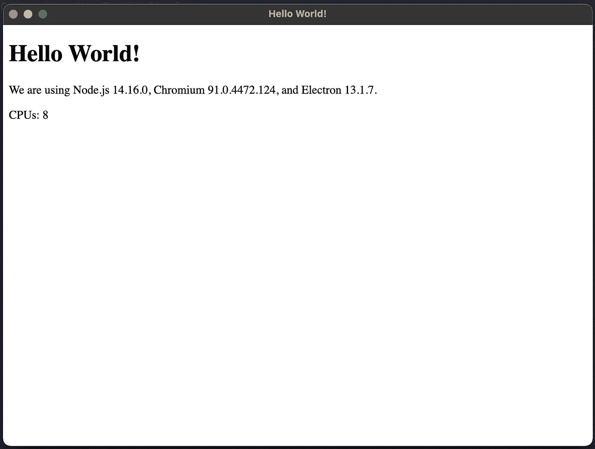

# 如何在你的电子应用中使用 Rust 与 Neon 绑定

> 原文：<https://medium.com/nerd-for-tech/how-to-use-rust-inside-your-electron-application-using-neon-bindings-64bd83fec316?source=collection_archive---------2----------------------->

```
// What is it for?
/* If you have an Electron application that needs to be more performant in some tasks, if you need to access something on operating system or even to try the Rust language.
```

Github 库:【https://github.com/cazetto/neon-electron 


[穆利亚迪](https://unsplash.com/@mullyadii?utm_source=medium&utm_medium=referral)在 [Unsplash](https://unsplash.com?utm_source=medium&utm_medium=referral) 上的照片

大家好。这是我第一次在 Medium 上投稿，希望大家喜欢！

今天我们将使用 Rust 语言的超级能力创建一个电子应用程序。

## 先决条件:

安装节点:https://nodejs.org/en/download/

安装铁锈:[https://www.rust-lang.org/tools/install](https://www.rust-lang.org/tools/install)

# 生锈的部分

## 霓虹是什么？

> Neon 是一个库和工具链，用于在你的 NodeJS 应用程序和库中嵌入 Rust。

## 什么是霓虹项目？

> 霓虹项目既是一个[节点](https://nodejs.org/en/) [npm](https://www.npmjs.com/) 包，又是一个[锈](https://www.rust-lang.org/) [板条箱](https://crates.io/)包。

首先，我们将创建一个新的霓虹灯项目。

我引用了 Neon 文档，我们项目的基础是 Neon hello-world 教程的代码结果。

[**https://neon-bindings.com/docs/hello-world**](https://neon-bindings.com/docs/hello-world)

我们将首先创建一个名为 neon-electronic 的 neon 项目:

```
npm init neon neon-electron
```

这将生成一个包含一个`Cargo.toml`和一个`package.json`文件的新项目，让我们看看这是什么:

[Cargo](https://doc.rust-lang.org/cargo/) 是 Rust 包管理器，就像在 node 中我们有 [npm](https://www.npmjs.com/) ，在 Rust 中我们有 [Cargo](https://doc.rust-lang.org/cargo/) 。

我们有一个`src/lib.rs`，这就是神奇发生的地方，这个文件是我们应用程序的 Rust 部分，在本教程中，我们将共享关于您计算机中 CPU 数量的信息，就像在 Neon Bindings hello world 教程中一样。

首先在我们的 Cargo.toml 中添加`num_cpus` Rust 库作为依赖项。

```
[dependencies]
num_cpus = "1"
```

运行 yarn 来安装依赖项:

```
yarn
```

现在，在`lib.rs,`内部，我们将创建通过[num _ CPU](https://crates.io/crates/num_cpus)Rust crate 读取 CPU 数量的函数:

```
fn get_num_cpus(mut cx: FunctionContext) -> JsResult<JsNumber> { Ok(cx.number(num_cpus::get() as f64));}
```

最后，我们从 Rust 代码中导出我们的函数，它将在生成的文件`index.node`中可用。

```
#[neon::main]*fn* main(*mut* cx: ModuleContext) -> NeonResult<()> { cx.export_function("get", get_num_cpus)?; Ok(())}
```

`lib.rs`代码变成了:

现在我们应该能够重建项目了:

```
npm run build -- --release
```

现在我们可以通过在终端中打开 NodeJS 并运行生成的代码来测试它:

```
node> const cpuCount = require('.')> cpuCount.get()4
```

# 电子部分

将电子作为从属项添加:

```
yarn add -D electron
```

将电子启动脚本添加到`package.json`

```
{
  "scripts": {
    "dev": "electron ./src/main.js",
  }
}
```

创建一个`src/main.js`文件:

创建`src/preload.js`脚本:

创建`src/index.html`文件:

## 将两部分结合起来:

在我们的`src/index.html`中，我们需要添加一个新元素来显示 CPU 的数量。

```
<p> <span>CPUs:</span> <span *id*="number-of-cpus"></span></p>
```

`src/ndex.html`文件变成:

在`src/preload.js`文件中我们需要导入 Neon 生成的代码:

```
const lib = require('../index.node');
```

DOMContentLoader 回调内部:

```
const numberOfCPUs = lib.get();const numberOfCPUsElement = document.getElementById(‘number-of-cpus’);numberOfCPUsElement.innerText = numberOfCPUs;
```

比，`src/preloader.js`就变成了:

这样，我们就可以运行`yarn dev`并看到我们的应用程序运行时从 Rust 到 NodeJS 的 CPU 数据数量。



也就这些了，可以随意和这个帖子互动，问点什么或者建议点什么，如果有错就告诉我。

让我知道这个教程是否对你有帮助，这样我就可以指导自己写更好的帖子。

希望你喜欢它🚀