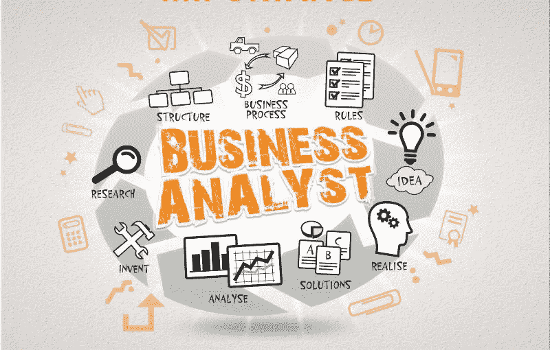

# 如何写业务需求报告！

> 原文：<https://medium.com/nerd-for-tech/how-to-write-a-business-requirement-report-63863b152acf?source=collection_archive---------1----------------------->

每个商业分析师的问题是，在他们职业生涯的早期，他们可能会有这个问题。

## **如何写出一份完美的业务需求报告？**

作为一名业务分析师，向开发团队和客户端提供适当的细节是一项核心职责，以确保项目在更新和实现的计划时间表内达到时间表。因此，业务分析报告是业务分析师用来定义在需求收集会议上讨论的主要需求的常用工具。

**什么是 BRD / BRR？**

业务需求文档(BRD)是一个正式的文档，它指定了组织希望通过与供应商合作来完成特定项目而实现的目标和期望。

如果我们考虑一个成功的 BRD，可以主要有五个部分来解释任何项目的需求和变化。

1.  ***执行摘要***
2.  ***项目概述及目标***
3.  ***项目范围***
4.  ***业务需求***
5.  ***词汇***

## *1。执行摘要*

该部分通常包括文件的唯一目的、创建的原因以及为 BRD 的其余部分设置的基础阶段，因此总是希望对其进行描述，以便抓住客户的注意力并传递与即将开始的项目相关的所有重要信息。可以快速了解[如何写执行摘要](https://writingcenter.uagc.edu/writing-executive-summary)？在链接处。

## **2。项目概述和目标。**

这是 BRD 的主要组成部分之一，因为它包含了项目的目标和宗旨。第二部分还包含项目对组织和利益相关者的影响、涉及的部门、为了实现目标应该采取的主要行动等。

在准备本节时，总是希望添加更多的图表来解释复杂的流程，如运营和组织影响。此外，它总是期望涵盖最重要的点，如完成将要处理的项目的策略，以及团队将参与项目时间表等。

## 3.项目范围

最重要的一点是，项目概述和范围在某些情况下可能会混淆，因此我们应该分别了解它们之间的区别。范围给出了对项目将会是什么以及谁是被交付来创造价值的项目的清晰理解。而概述只是简单地说明了项目将如何、何时、由谁在给定的时间表内交付。

## **4。业务需求**

这是 BRD 最关键的部分，因为它传达了在项目时间表内要实现的项目目标。建议业务分析师使用编写业务需求的聪明王子原则。

特定于 s 的，

m-可测量，

可实现的，

r 相关

受时间限制的

因为它涵盖了客户可能向供应商提出的所有可能的问题，所以它以简单有效的方式向客户传达了需求解释。以可理解的格式向客户编写需求需要一些经验，同时也建议与主要利益相关者和开发团队举行头脑风暴会议，以指定优先级，如低、中、高，这样总是可以轻松地完成优先级，并将其交付给客户。

## 5.词汇表

高级经理和客户总是建议并期望使用术语表，因为每个人都无法了解我们在文档主体中所写的内容。因此术语表部分主要包含缩写列表、复杂术语的定义、图表的解释等。因此，我们可以保证，任何阅读 BRD 作品的人都能理解所传达的全部信息。

现在让我们看看一些经常出现的问题，

## **谁应该参与业务需求文档的创建？**

*   主要团队
*   外部利益相关者
*   产品所有者
*   领域 SME(主题专家)
*   可能需要的其他卖方团队(取决于具体情况)。

## 谁负责创建业务需求文档(BRD)？

传统上，知道项目核心价值的是业务分析师或项目经理的工作。但是它可以根据场景和项目角色的需求而改变。

## 创建 BRD 的先决条件是什么？

业务分析师应该了解项目范围和价值的内外，让所有重要的利益相关者参与进来，确定并包括阶段，并对项目阶段进行基准测试，最后(可选)拥有一个模板，以便轻松创建 BRD。

从来没有一个完美的 BRD，以至于把它当作圣经，满足项目涉众的所有需求和期望总是正确的 BRD。因此，上述几点将有助于任何人谁是寻找一个模板来创建一个 BRD。我强烈建议你创建你自己的 BRD 模板，这样你将学会为你自己的用例创建一个 BRD，这样你就可以掌握在项目时间表的不同阶段出现的文档艺术。

在那之前，为所有人干杯！！！🥂🥂

