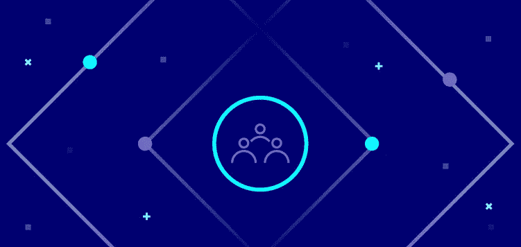

# Twilio 如何塑造细分市场

> 原文：<https://medium.com/nerd-for-tech/how-twilio-is-shaping-segment-1921d01b03fa?source=collection_archive---------3----------------------->

来自 Signal conference 的最大新闻是 Twilio Engage 的发布，这是一个基于去年收购的 Segment 的“增长自动化”平台。在公告中，Twilio 强调了其利用细分市场更深入地推进营销领域的计划。

正如我[去年](https://rudderstack.com/blog/why-twilio-acquired-segment)所写的，Twilio 正在定位细分市场，追逐通常花费在 Salesforce、Adobe、Braze 和 Iterable 等工具上的大笔营销预算。目前的客户依赖 Twilio 进行电子邮件和消息传递基础设施建设，利用细分市场作为营销工具是 Twilio 超越 API 并提升其地位以增加钱包份额和利润的一种方式。

对“增长自动化”的关注并不令人意外。近年来，营销被重新贴上了增长黑客和数字优化等术语的标签，所以看到“增长自动化”这个术语并不令人震惊。从根本上说，增长自动化平台是*营销自动化平台*，尽管是由数据管道和 API 驱动的现代平台。

这是 Twilio 的一项明智的商业举措，但这对作为其成功基础的细分市场核心客户数据基础设施(CDI)平台意味着什么？Braze 等细分市场的下游合作伙伴对此会有什么反应？最重要的是，这对细分市场的最终用户意味着什么？

**先说下游合作伙伴**。随着这一产品的推出，Segment 现在直接与 Braze、Iterable 和 Customer.io 等公司竞争。[根据 Segment](https://segment.com/blog/cdp-report-2021/) 的说法，这些营销自动化系统是其用户的第二大热门目的地，这意味着他们的许多客户正在向他们发送数据。对于 Braze 这样的公司来说，这一变化意味着直接的竞争对手现在拥有了为他们的系统提供数据的管道。他们庞大的客户群也为 Twilio 的销售团队提供了积极销售 Twilio Engage 的初步目标清单。不用说，如果我在经营一家营销自动化公司，我会很担心。

**接下来是 Twilio 围绕细分市场核心 CDI 产品的长期战略。**我个人的假设是，CDI 组件不是 Twilio 细分市场愿景的一部分。如果企业营销美元是目标，产品将遵循该路线图，堆栈范围的 CDI 将被取消优先级。更重要的是，细分市场增长的一个巨大驱动力是他们与供应商之间的共生关系，供应商会让他们参与交易以简化数据集成。现在，Twilio Engage 正在与这些供应商竞争，这种增长动力在该细分市场中大大减弱。Twilio 不太可能继续投资于一个已经失去了上市成功关键基础的产品。

**最后，这对细分市场的客户意味着什么？**数据是任何营销自动化工具的价值所在，因此 Segment 的核心渠道不会有任何变化，但创新和投资将专注于营销产品，如旅程。具有讽刺意味的是，随着营销自动化成为主要用例，细分数据最有价值的目的地现在是…细分市场。

在高层次上，细分市场客户可以期待看到产品的发展，以服务于更多的营销使用案例和营销用户。不可避免的是，对跨堆栈的数据集成关注较少，特别是当它涉及到核心基础架构时，如云数据仓库、数据湖和实时数据库(如 Redis)，所有这些现在都是现代客户数据堆栈的核心组件。

缩小对营销用户的关注意味着，随着时间的推移，运行细分市场的工程团队在管理规模和复杂性不断增加的堆栈时，可能会遇到数据集成挑战。

这个消息让我对构建 RudderStack 感到前所未有的兴奋，我们的核心任务是帮助开发人员解决整个堆栈中的数据集成问题。

[免费注册](https://app.rudderlabs.com/signup?type=freetrial)，今天就尝试方向舵堆栈。

*本博客最初发表于:* [*https://rudderstack.com/blog/how-twilio-is-shaping-segment*](https://rudderstack.com/blog/how-twilio-is-shaping-segment)