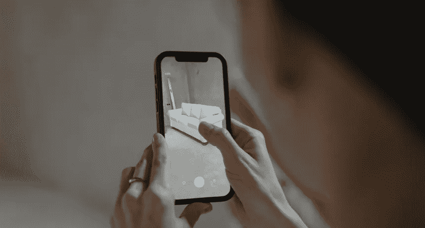
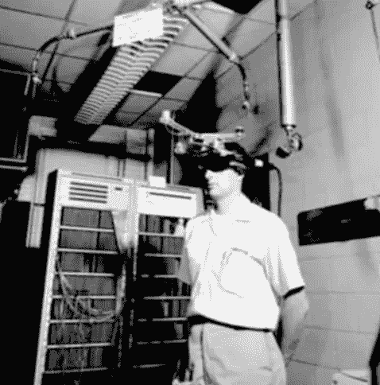

# 人类将如何适应增强现实？

> 原文：<https://medium.com/nerd-for-tech/how-will-humans-adapt-to-augmented-reality-7fe2db719928?source=collection_archive---------13----------------------->

照片由来自[佩克斯](https://www.pexels.com/photo/person-holding-black-iphone-6474473/?utm_content=attributionCopyText&utm_medium=referral&utm_source=pexels)的[马体·米罗什尼琴科](https://www.pexels.com/@tima-miroshnichenko?utm_content=attributionCopyText&utm_medium=referral&utm_source=pexels)拍摄

2016 年 7 月，从澳大利亚、新西兰和美国开始，然后席卷全球，人们从码头上摔下来，绊倒并摔倒，去了很多急诊室缝针，数百万个脚趾被撞破，人们头朝下撞到电线杆和树上，发出了很多笑声。他们盯着智能手机的屏幕。与另一个维度互动。这就是[口袋妖怪 Go](https://www.theverge.com/2017/7/6/15888210/pokemon-go-one-year-anniversary-timeline) 。这是第一次全球范围内人类以一种全新的方式联系在一起，这是我们以前从未尝试过的。增强现实(AR)已经到来。在第一个例子中，我们适应得很好。算是吧。

总的来说，我们学会了在多了一层的物质世界中导航。这是非常深刻的，因为 AR 增加了一个全新的情境层。对人类来说，地点是我们文化中的一个导向元素。它定义了我们的行为方式，我们在一个地方做什么，并将我们的社会规范编织在一起。我们在清真寺或教堂的行为与在商场、法庭或办公室的行为不同。随着增强现实开始发挥作用，它将改变我们的位置感。

今天，我们从建筑物的建筑设计、结构中的标识、户外标识和室内设计中获取关于一个地方的信息，无论是公园、机场还是医院。这些结构告诉我们关于建筑的本质，如何在社会环境中表现，以及谁拥有和经营建筑或公共空间。如果这是一栋老旧的办公楼，有点破旧，我们可能会认为它的主人粗心大意，而且这栋楼里的公司可能并不富裕。我们根据其他地方的过去经验，通过观察他人的行为和活动来观察一个地方。我们在没有增强的情况下做到了这一点，现在仍然如此，而且在一段时间内还会继续这样做。

我们获得的信息来自物质世界，由我们的大脑处理。我相信你们中的大多数人，当你不得不去一个新的地方时，会提前花一些时间查看谷歌或苹果地图，也许还会查看街景选项，检查建筑和周围地区。从某种意义上说，这是在增加现实。就在 16 年前，你不可能做到这一点！因此，在某种程度上，我们已经开始增强我们的位置感。

尽管 AR 已经有 50 多年的历史了，但它在今天仍然处于初级阶段。第一项 AR 技术被称为达摩克利斯之剑，因为它需要一个头盔，并通过电线从头顶连接到天花板支架。AR/VR 之父被认为是[伊凡·苏泽兰](https://atomicdigital.design/blog/1965-ivan-sutherland-father-of-ar)。今天，在大多数智能手机中，它都放在我们的口袋里。有了虚拟现实，我们需要一个戴在眼睛上的设备；有了增强现实，我们可以通过手机或平板电脑屏幕观看；或许很快，当人们更容易接受眼镜时，我们就可以通过眼镜观看了。

伊凡·苏泽兰与达摩克利斯之剑 AR 装置 1965 年

将 AR 眼镜推向市场的第一次尝试是通过谷歌眼镜。这是一场消费者灾难，但在制造业和医疗保健等利基市场却相当成功。目前，通过我们的手机，AR 在社会和文化上都是可以接受的。很大程度上是因为我们已经接受了智能手机和它们的摄像头每天都在我们面前。已经正常化了。

但随着增强现实的出现，它将改变我们看待空间的方式。它会改变我们在这些空间的行为方式吗？在某些情况下可能是，在其他情况下不是。但它也带来了一些有趣的问题，如隐私，对于人类和建筑物的所有者。例如，谁将拥有在 AR 应用程序中发布的关于建筑物的信息的权利？那些买不起带 AR 功能的智能手机的人将如何在空间中导航？他们会处于劣势吗？大楼所有者会跟踪你在商场等空间中的活动，向你发送情境广告吗？很恐怖吗？

我们将如何塑造公共空间？城市规划者将如何考虑使用 AR 进行城市设计的选项？建筑师会在建筑设计考虑中使用 AR 吗？有些人已经在用它带领客户参观一栋新建筑的内部，或者翻修一栋旧建筑。

虽然我们无法确定 AR 将如何改变我们，或者我们将如何改变 AR 以适应我们的欲望，但它将导致社会变革。自从我们从树上掉下来，发现骨头和石头可以用作工具，所有的技术都发展起来了。随着社交媒体改变了人类沟通的方式并影响了我们的时间感，增强现实将改变我们的位置感。