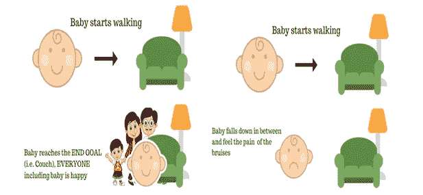
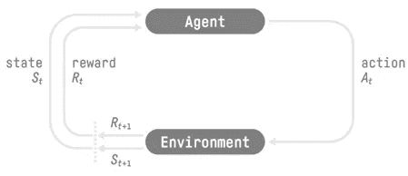
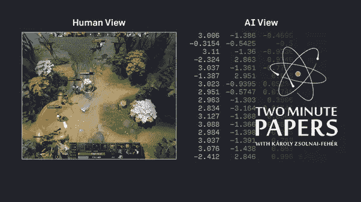
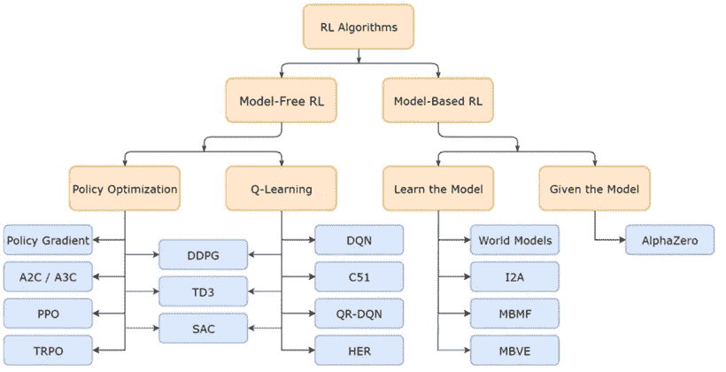
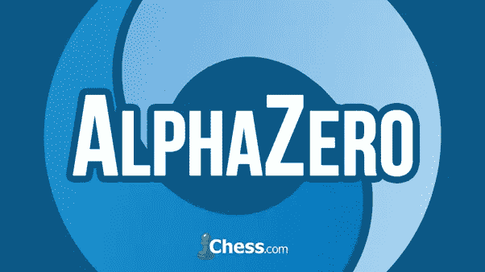

# 基于强化学习的推荐系统未来会怎样——第二部分:推荐系统中的强化学习

> 原文：<https://medium.com/nerd-for-tech/how-will-reinforcement-learning-based-recommendation-system-be-in-the-future-part-2-92d153ae71c4?source=collection_archive---------6----------------------->

## 强化学习是如何根据情境(环境)做出最大化我们将获得的回报的行动。这就像用户对推荐系统的反应。

您也可以查看本系列中的帖子:

*   [第一部分:推荐系统](https://neurondai.medium.com/how-will-reinforcement-learning-based-recommendation-system-be-in-the-future-part-1-recommender-34ab562ab257)
*   [第三部分:基于强化学习的推荐系统](https://neurondai.medium.com/how-will-reinforcement-learning-based-recommendation-system-be-in-the-future-part-3-288c8c5df380)

在强化环境中，学习者必须在没有被告知做什么的情况下，通过尝试这些动作来发现哪种方式可以获得最高的回报。这个动作可能不仅影响眼前的奖励，还会影响情境，那么它会改变我们下一次选择动作的方式。

***一个关于孩子如何练习联系父母并收到礼物的例子，其本质与强化学习*** 相同

我们很容易想象强化学习类似于婴儿试图开始走路。如果他能一步一步走到父母身边，就会收到赞美或礼物，这叫正向奖励。相反，如果他摔倒了，他会感到疼痛，并开始哭泣，这就是所谓的消极奖励。然而，由于受到父母礼物的诱惑，婴儿一次又一次地尝试，直到他达到目标并继续走得更远。这也是强化学习系统的目的:尝试错误，直到它可以最大化它的回报并继续进一步发展。以婴儿为例，我们可以对强化学习过程建模如下:

这一过程包括:

*   代理人:像婴儿一样，代理人将向环境发出动作，然后从环境中观察状态，并接收其动作的奖励。
*   环境:代理交互并返回奖励和状态的地方。
*   动作:就像婴儿选择走路的方式(小步还是大步，向右还是向左)，这是代理与环境交互的决定
*   奖励:代理人从环境中获得的一个结果，这个结果可能是积极的也可能是消极的。
*   状态:智能体在与环境交互后会观察它的状态，就像婴儿观察自己的位置是否还远离父母一样。

但是除了代理和环境，我们可以确定 RL 的四个主要子元素。

*   策略:代理的核心，它本身足以决定行为，将环境的状态映射到处于这些状态时要采取的行动。
*   奖励:在每个时间步上，环境向代理发送一个名为奖励的数字。代理人的目标是最大化其长期获得的总报酬。因此，报酬信号决定了对代理人来说什么是好信号，什么是坏信号。
*   价值函数:指定一个状态的价值是从该状态开始，代理在未来可以期望累积的总奖励量。
*   环境模型:这模仿了环境的行为，允许对环境的行为做出推断。

***玩游戏需要人类大量的技能和敏锐的反应能力来处理情况并做出决定。但是现在强化学习 AI 可以在 2018 年的 DOTA 游戏中做到这一点。来源:两分钟论文***

# **钢筋分类法**

强化学习算法分为两类:无模型的和基于模型的。

*   基于模型的 RL 使用经验来构建环境中的过渡和直接结果的内部模型。然后通过在这个世界模型中搜索或计划来选择适当的动作。
*   无模型 RL 使用经验来直接学习两个更简单的量(状态/动作值或策略)中的一个或两个，这两个量可以实现相同的最优行为，但是不需要估计或使用世界模型。给定一个策略，一个状态具有一个值，该值是根据从该状态开始预期产生的未来效用来定义的。

**钢筋的分类**

上图是 RL 算法分类的总结。在无模型方面，我们有两种类型的算法:策略优化(PO)和 Q 学习。第一类的一些算法是策略梯度、高级参与者-批评家(A2C)、异步高级参与者-批评家(A3C)、邻近策略优化(PPO)和信任区域策略优化(TRPO)。对于后者，我们有深度 Q 学习(Q-Learning with Deep Learning)和 DQN 的一些变体。然而，我们也有三种算法是 PO 和 Q 学习的干扰，它们是深度确定性策略梯度(DDPG)、软行动者批评(SAC)和双延迟 DDPG (TD3)。关于基于模型的 RL，我们现在有一些来自深层思想的模型，如 AlphaZero 和一些理想的模型，如世界模型(基于方差自动编码器)，想象力增强代理(I2A，使用 LTSM 与编码器)……等等。

***Alpha Zero——深度思维的强化学习产物——不仅打败了职业棋手，也打败了目前最好的 AI，成为新的游戏之王***

*有用资源:*

[强化学习简介](https://www.freecodecamp.org/news/an-introduction-to-reinforcement-learning-4339519de419/)

[我们关于强化学习的旧博文](https://neurondai.medium.com/reinforcement-learning-apply-ai-in-open-environment-d84d150a9ef2)

阅读原文和最新文章，网址:

[https://www . neuro nd . com/blog/reinforcement-learning-based-recommendation-system-part-2](https://www.neurond.com/blog/reinforcement-learning-based-recommendation-system-part-2)

NeurondAI 是一家转型企业。请联系我们:

*网站*:[https://www.neurond.com/](https://www.neurond.com/)