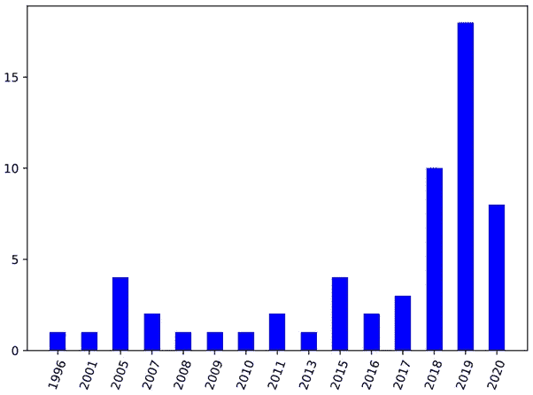
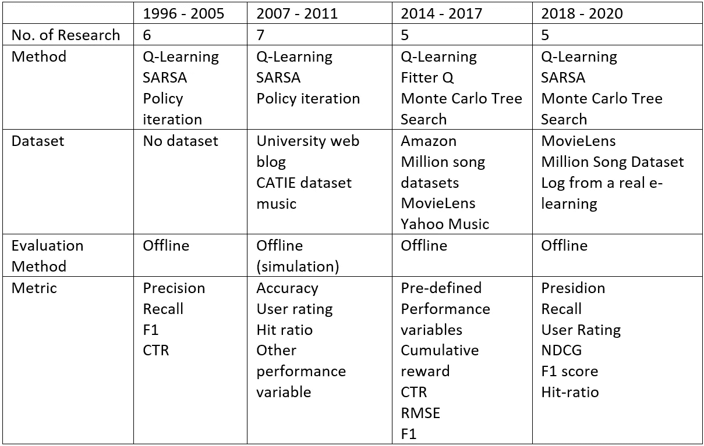
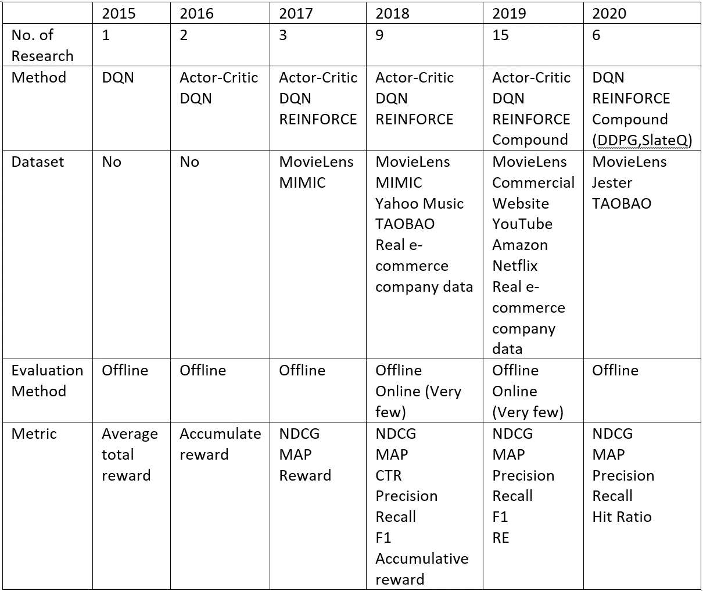
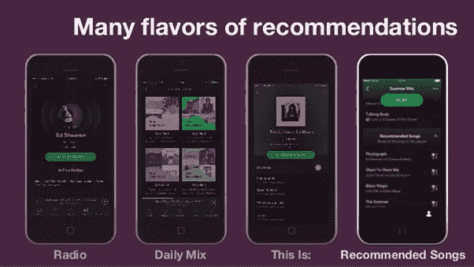
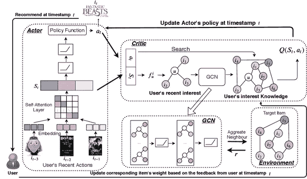
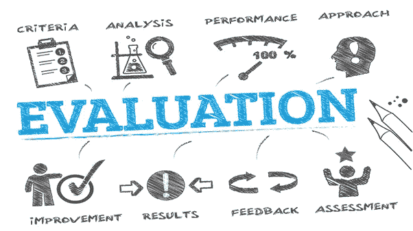

# 基于强化学习的推荐系统未来会怎样——第三部分:基于强化学习的推荐系统

> 原文：<https://medium.com/nerd-for-tech/how-will-reinforcement-learning-based-recommendation-system-be-in-the-future-part-3-288c8c5df380?source=collection_archive---------4----------------------->

## 基于强化学习的推荐系统在算法和应用方面都在不断发展。

这是我们系列的第三篇博客，你可以随时查看系列中的其他帖子来了解更多关于我们的工作。

*   [第一部分:推荐系统](https://neurondai.medium.com/how-will-reinforcement-learning-based-recommendation-system-be-in-the-future-part-1-recommender-34ab562ab257)
*   [第二部分:推荐系统中的强化学习](https://neurondai.medium.com/how-will-reinforcement-learning-based-recommendation-system-be-in-the-future-part-2-92d153ae71c4)

# **基于强化学习的推荐系统**

**开发流程**

正如我们上面提到的，在强化学习(RL)的本质中，当与环境交互时，代理试图最大化回报。这类似于推荐系统的问题，推荐系统算法试图把最好的项目推荐给用户，最大化用户的满意度。从大的方面来说，我们可以把推荐系统系统看成一个代理，代理之外的任何东西都可以看成环境。但是在现实生活中，由于在巨大的派系和状态空间中数据量巨大，一些 RL 算法无法进行。除了一些适合推荐系统的 RL 算法之外，深度 RL 算法的趋势正在出现，并在一些相关方面得到了严格的考虑。调查中的下表向我们展示了许多研究论文中使用的算法。

摘自“*基于强化学习的推荐系统:综述”*—[(arxiv.org)](https://arxiv.org/pdf/2101.06286.pdf)

在下面的柱状图中，RL 从 1996 年到 2020 年在推荐系统中的应用。然而，在 2018 年之前，关于这一主题的研究论文并不多，只有不到 5 篇。这可能是因为 RL 已经被开发和测试，所以只有少量的研究关注这个话题。此外，我们还缺乏庞大的数据集、在线测试环境和统一/标准的评估方法。从 2018 年到现在，使用来自 RL 和深度强化学习(DRL)的许多算法研究该主题出现了爆发。从这些研究论文的结果来看，我们有一些主流的算法，这些算法有常用的数据集来训练，也有评价推荐系统的指标。这些将在下一部分解释。

来源:基于强化学习的推荐系统:调查—[2101.06286.pdf(arxiv.org)](https://arxiv.org/pdf/2101.06286.pdf)

# **强化学习算法**

从下表可以看出，强化学习算法在早期就已经应用于 RS 中。从时间差分法(Q-Learning/SARSA)和动态规划(Policy iteration)开始，研究人员对他们用来进行研究的方法进行了较少的改变。从那时到现在，尽管他们正在开发许多新的算法，但是时间差分 Q-Learning 和 SARSA 仍然是一种流行的方法，因为它具有下面介绍的优点。此外，更多数据集——尤其是现实生活中的数据集，如 Amazon 和 movie lens——值得使用，因为它们的结构化数据和元数据为每个项目/用户提供了更多信息。然而，大多数评估程序是离线的，通过建立一个模拟环境，并使用一些指标，这些指标在每篇研究论文中都有变化。然后，我们有一个流行指标的列表:

*   精确度:真阳性与总阳性的比率
*   回忆:真阳性与真阳性比率(包括真阳性和假阴性)
*   F1 得分:精确度和召回率调和平均值
*   NDCG:标准化的折扣累积收益，一个衡量推荐系统质量的指标。
*   点击率(CTR ):点击率，是用户对某个推荐细节的点击率与看到该推荐的总用户数之比。
*   RMSE:均方根误差

总结自“【arxiv.org】*基于强化学习的推荐系统:综述”*—

每种方法都有自己的算法，各有优缺点。

*   动态规划(DP):在表格方法中，DP 方法由于其巨大的计算费用和对环境的广泛理解的需要而不流行和不实用。尽管这种算法具有大量的状态，但是当执行策略或值迭代方法的甚至一次迭代时，它通常是不可行的。
*   蒙特卡罗(MC):这种表格方法不需要更多的环境知识，只需要抽样经验，如与环境的相互作用。然而，MC 方法仍然有一些局限性。它们不引导，并且它们仅在完成情节之后更新值函数，因此它们的收敛很慢。为了提高 MC 的效率，对 MC 进行了升级，称为 MCTS。
*   时间差异:这些方法在遥感发展的大部分时期都非常流行，因为它们简单、无模型、计算量小，并且可以用一个方程表示。这些方法预防措施是 Q 学习和 SARSA。
*   Fitted-Q:一个灵活的框架，可以使任何近似架构适合 Q 函数，但它的局限性是计算和内存开销高。

# **深度强化学习算法**

虽然比原始的 RS 算法来得晚，但是深度强化学习方法已经向研究人员证明了它们的可行性和有效性，但是每种方法仍然有小的缺点。在下表中，在 6 年中，进行了更多的研究，其中主导方法是深度 Q 学习和行动者-批评家，但是到目前为止，2020 年的趋势是结合两种或更多种方法，其优点可以支持解决其他方法的缺点。数据集也变得更加多样化，倾向于在娱乐和电子商务中使用一些流行的数据集。虽然评价程序仍处于离线状态，但一些研究已经建立了在线评价，并取得了良好的初步效果。用 DRL 评价 RS 的指标仍然和上面的 RL 一样，如精度、召回率、NDCG、F1、命中率……我们对这些方法进行了简单的描述。

总结自“*基于强化学习的推荐系统:综述”*——【arxiv.org】

*   DQN:这种方法从三个方面修改了原有的 Q 学习算法，以提高稳定性。首先，它使用经验重放和一种在重放存储器中保存代理在不同时间步长上的经验的方法，然后在训练阶段使用它们来更新权重。其次，为了降低更新权重的复杂性，当前更新的权重保持固定，并被馈送到复制网络，其输出被用作 Q 学习目标。第三，为了限制误差导数的规模，奖励函数被简化。然而，DQN 有三个问题。首先，在某些情况下，它高估了行动价值，使得学习效率低下，并导致次优政策。其次，DQN 随机均匀地选择经验来重放，而不考虑其重要性，使得学习过程缓慢而低效。第三，DQN 不能处理连续的，这有计算费用和高度不可行。
*   强化:一种直接更新策略权重的蒙特卡罗随机梯度方法。然而，它的问题是它的高方差和学习速度慢，这是由 MC 的性质决定的。目前，已经开发了一些不同技术来处理高方差问题。
*   Actor-critical:该算法通过计算 actor 给出的状态-动作对的值并提供对所选动作的反馈，使用一个 critical 来批评 actor 生成的策略，这通过减少方差和加速学习来处理强化问题。
*   复合:许多研究人员考虑并开发了许多 DRL 算法的组合，因为它们可以利用每种方法的优点并减少它们的缺点。我们可以举的一个例子是 DDPG，一个结合了 DQN 和 DGP(两者都是 DRL 方法)的算法，已经证明了它比单一方法的增强和潜在的效率。在未来，许多研究人员将考虑更多的复合方法，以找到满足一些不断更新的标准的最佳组合。

# **障碍和未来改进**

单个项目到多个项目推荐:RL 算法已经被开发来从周围许多不同的动作中选择一个动作。但是在 RS 领域，系统倾向于生成项目列表。在许多研究中，大量综述性研究论文都考虑了单项推荐问题。近年来，研究趋势是关于推荐项目列表。然而，研究者不得不面对巨大的组合学作用空间的问题，因为当作用空间越大，对探索、推广和优化的需求就越多。

Spotify 为用户推荐更多类型的混合磁带/情绪/音乐内容，包括许多歌曲

**算法架构:**目前，大多数使用 DRL 方法的现有 RS 已经在许多环境中被开发和测试。然而，这些方法是基于物理过程设计的，而不是基于用户复杂和动态的本质。因此我们应该有更有创造性方法来处理这个问题。除了 RS 中流行的一些 RL 算法，深度学习和 RL (compound)的结合正在成为未来趋势算法的一个有价值的研究方向。

虽然仍在开发和测试中，但深度强化学习将是未来推荐系统的主流方法

**可解释的推荐:**一个 RS 不仅能为用户提供推荐，还能解释系统为什么推荐这些项目的原因。关于推荐的解释可以改善用户体验，提高系统的信任度，帮助 RS 做出更好/更准确的决策。此外，该标准有助于开发人员跟踪 RS 的运行情况，然后发现并修复错误或根据需要修改算法结构。然而，尽管这一标准在提高强化学习质量方面有潜在的贡献，但仍然没有得到足够的重视。因此，今后应该有更多的研究者关注这方面的问题。

研究人员仍然需要在效率或性能等方面达成一个共同的评估标准

**改进推荐系统中 RL 的评价方法:**推荐系统中 RL 的评价需要改进。在逆向学习过程中，智能体与环境交互以学习做什么，这与在线评价相似，即逆向学习生成推荐并实时接收用户反馈。然而，大多数评论性的研究论文只是使用离线评估，因为进行在线评估需要付出巨大的代价，并且在推荐系统中部署 RL 在实际业务中风险很大。另一方面，许多研究人员利用 MovieLens、Amazon、任何真实业务数据库等可用数据集开发了离线评估模拟，但这些模拟中的大多数用户模型过于简单，无法反映真实用户的行为。虽然有一些模拟用户行为的方法，但我们必须开发一个功能强大的模拟器和一个评估框架，用于未来推荐系统中的用户体验。

阅读原文和最新文章，网址:

[https://www . neuro nd . com/blog/reinforcement-learning-based-recommendation-system-part-3](https://www.neurond.com/blog/reinforcement-learning-based-recommendation-system-part-3)

NeurondAI 是一家转型企业。请联系我们:

*网站*:[https://www.neurond.com/](https://www.neurond.com/)