# 人力资源分析—数据科学家的工作变化

> 原文：<https://medium.com/nerd-for-tech/hr-analytics-job-change-of-data-scientists-9d6073c24538?source=collection_archive---------1----------------------->

使用 Python 预测谁将跳槽到新工作的机器学习方法！

一家活跃在大数据和数据科学领域的公司希望从成功通过公司举办的一些课程的人中招聘数据科学家。许多人报名参加他们的培训。公司想知道这些候选人中谁在培训或寻找新工作后真正想为公司工作，因为这有助于降低培训或规划课程的成本、时间和质量，并对候选人进行分类。与人口统计、教育、经验相关的信息从候选人注册和登记中掌握。

## 灵感

*   预测一个候选人将为公司工作的概率，是一个*的二元分类问题*
*   *解释模型，说明哪些特征影响候选人决策*

## *用户指南*

*[***Colab 笔记本***](https://github.com/Priyanka-Dandale/HR-Analytics-Job-Change-of-Data-Scientists) 可在我的 GitHub 存储库或 [***查看她的***](/nerd-for-tech/easy-downloading-kaggle-data-to-google-drive-1be0a8835baa)***e***了解如何将数据从 Kaggle 直接下载到您的 Google Drive，并在 Google Colab 中轻松使用！*

## *理解数据*

*这个[***Kaggle competition***](https://www.kaggle.com/arashnic/hr-analytics-job-change-of-data-scientists)**是*设计用来了解导致一个人离开目前工作岗位去做 HR 研究的因素。通过使用当前凭证、人口统计和经验数据的模型，您需要预测候选人寻找新工作或将为公司工作的概率，并解释影响员工决策的因素。**

## **数据概述**

**总共有 ***19，158*** 个观察值或行数。它包含以下 14 个**列**:**

*   ****登记者标识:**求职者的唯一标识**
*   ****城市:**城市代码**
*   ****城市 _ 发展 _ 指数:**城市发展指数(有标度)**
*   ****性别:**候选人的性别**
*   ****相关经历:**候选人的相关经历**
*   ****注册 _ 大学:**注册的大学课程类型(如果有)**
*   **教育程度:候选人的教育程度**
*   ****专业 _ 学科:**考生的教育专业学科**
*   ****经历:**候选人总经历年数**
*   ****company_size:** 当前雇主公司的员工人数**
*   ****公司类型:**当前雇主的类型**
*   ****last_new_job:** 上一份工作和当前工作之间的年数差异**
*   ****培训 _ 时数:**完成的培训时数**
*   ****目标:** 0 —不找工作变动，1 —找工作变动**

****

**前 5 条意见**

****

**前 5 条意见**

## **数据校正**

> **注意:在训练数据中，在 company_size 列中有一个人为错误，即 Oct-49，在 pandas 中，它被打印为 10/49，因此我们需要将其转换为 np.nan (NaN ),即 numpy null 或缺失条目。**

## **基本探索性数据分析**

*****观察总数是多少？****——19158。***

******数据中是否有缺失值？******

****

> **注意:8 个特性缺少值。**

**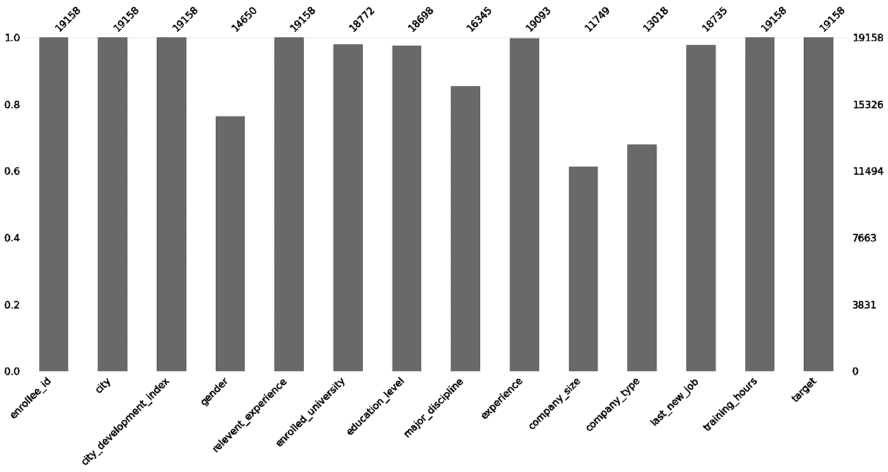**

*   **上面的条形图让您了解了每列中有多少值。在我们的例子中，company_size 和 company_type 包含最缺少的值，随后是性别和专业。**

**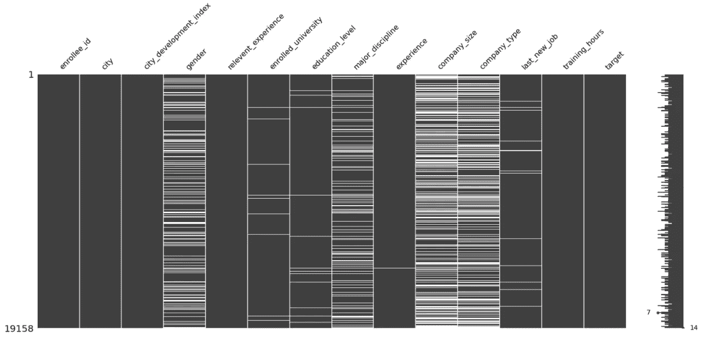**

*   **使用上面的矩阵，您可以非常快速地找到数据集中的缺失模式。在我们的例子中，company_size 和 company_type 列具有或多或少相似的缺失值模式。**

**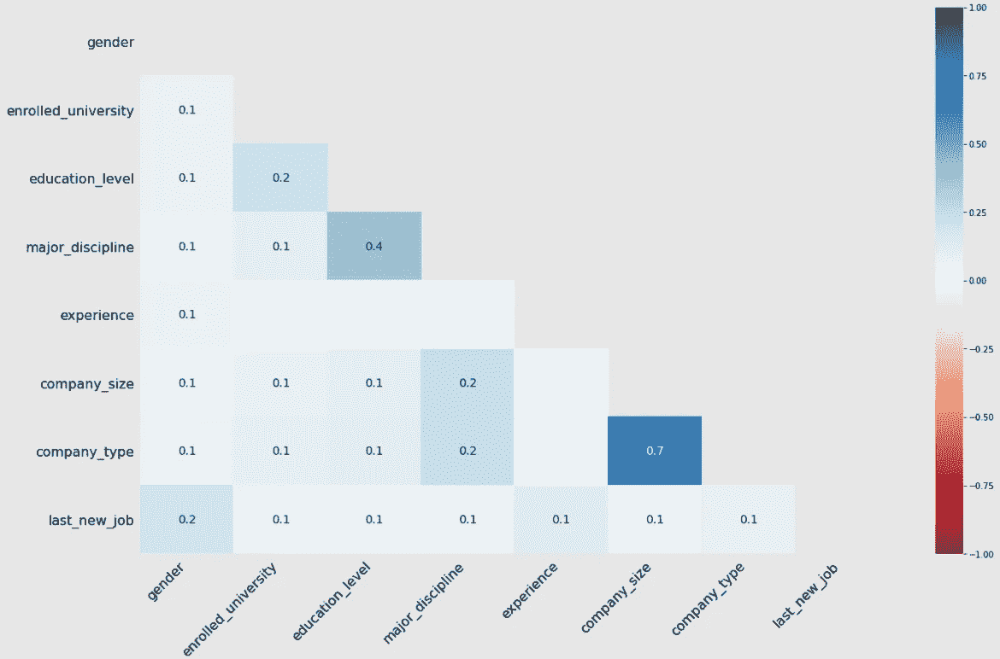**

*   **热图显示了每两列之间缺失的相关性。在我们的例子中，company_size 和 company_type 之间的相关性是 0.7，这意味着如果其中一个存在，那么另一个很可能也存在。**

*****目标的分布是什么？*****

**希望换工作的数据科学家人数为 4777 人，不想换工作的人数为 14381 人，数据呈现出不平衡状态！😥**

**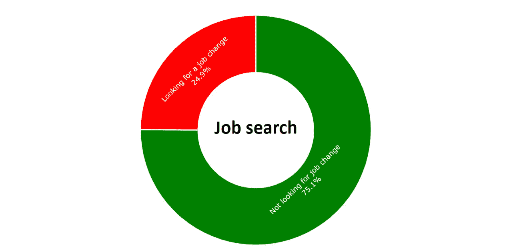**

*****排名前 10 的城市是哪些？*****

****

*****城市发展的最大指数是多少？*****

**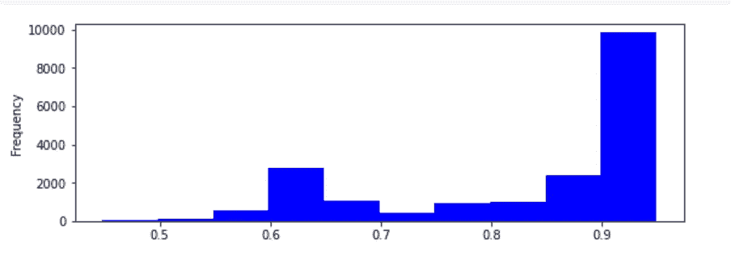****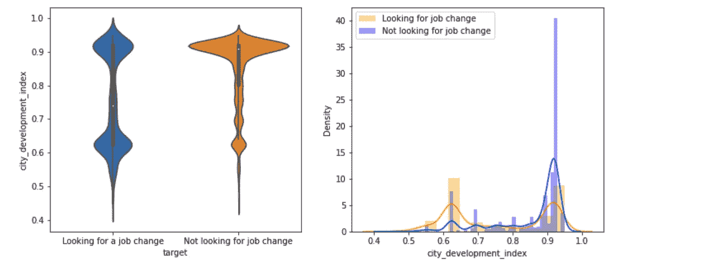**

*   **城市发展指数是区分目标的一个显著特征。**

*****换工作的性别渴望:*****

**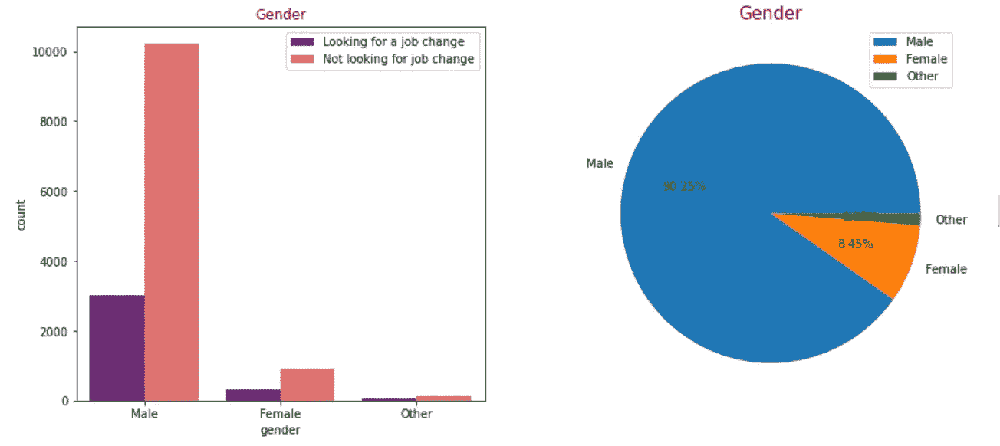**

*****相关经历有影响吗？*****

**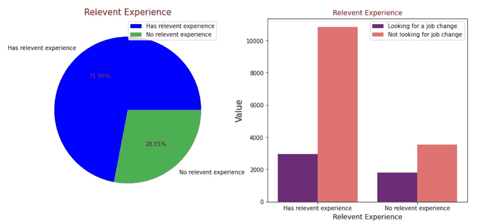**

*****教育大学类型重要吗？*****

**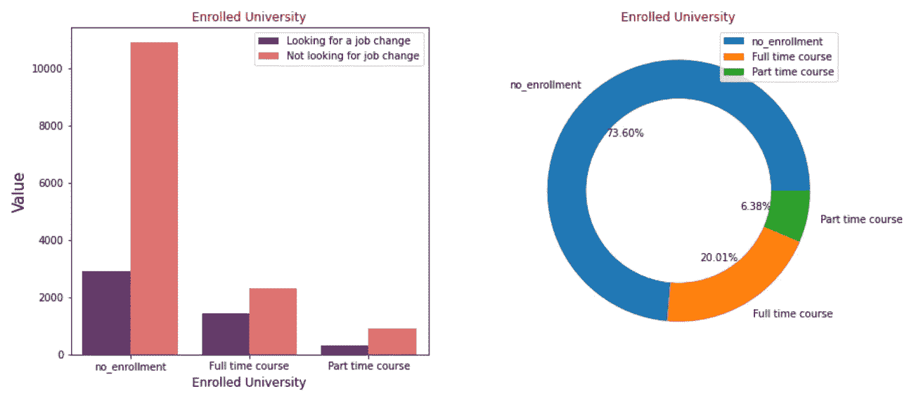**

*   **大约有 73%的人没有上过大学。**

*****受教育程度有影响吗？*****

**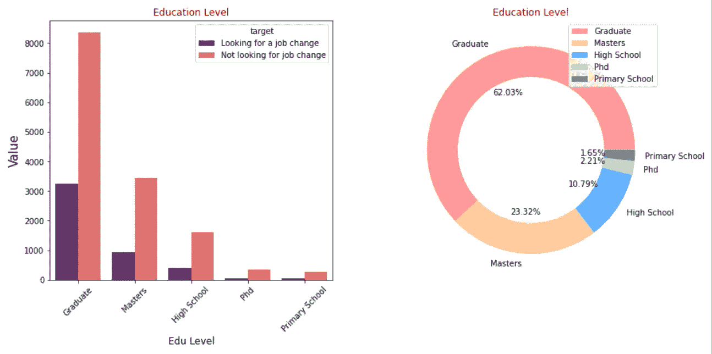**

*****一个大学科的作用是什么？*****

**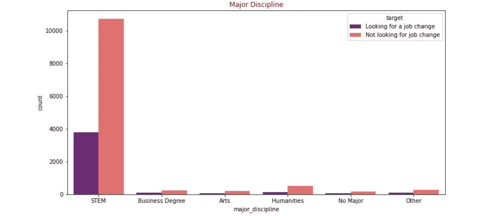**

**多年的工作经验对换工作的愿望有影响吗？**

**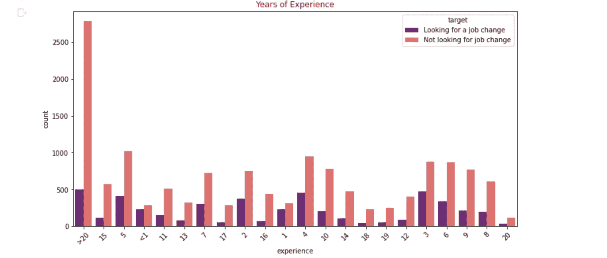**

*   **如果一个员工有超过 20 年的工作经验，他/她可能不会想换工作。**

*****公司规模对跳槽欲望有什么影响？*****

**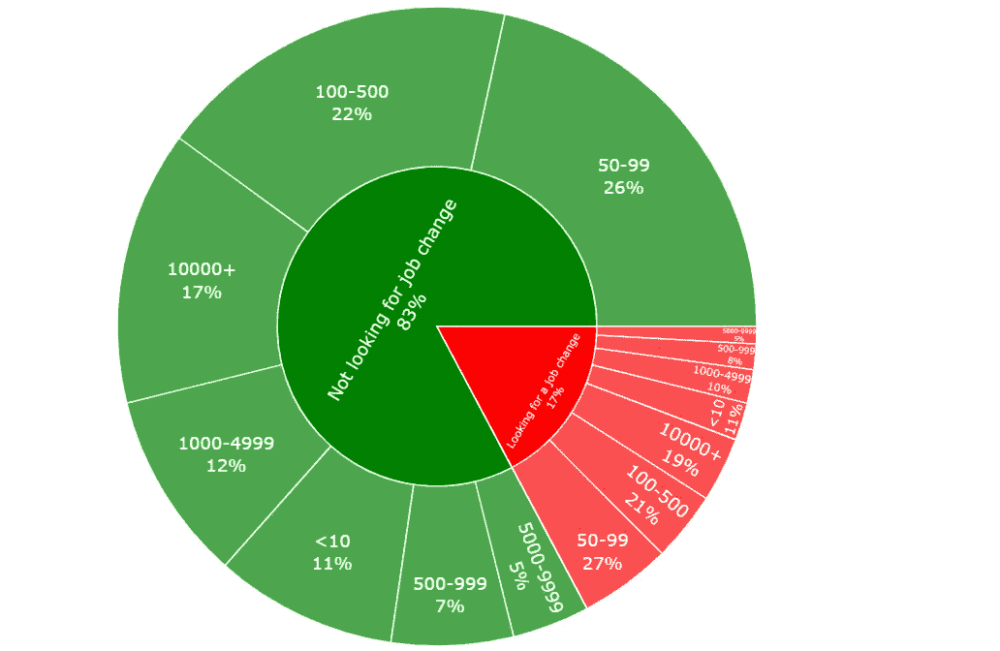**

*****公司类型重要吗？*****

**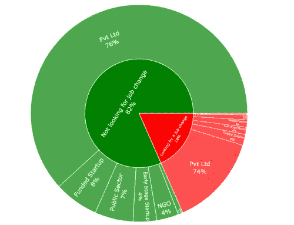**

*****上一份工作和现在工作的年数差距有影响吗？*****

**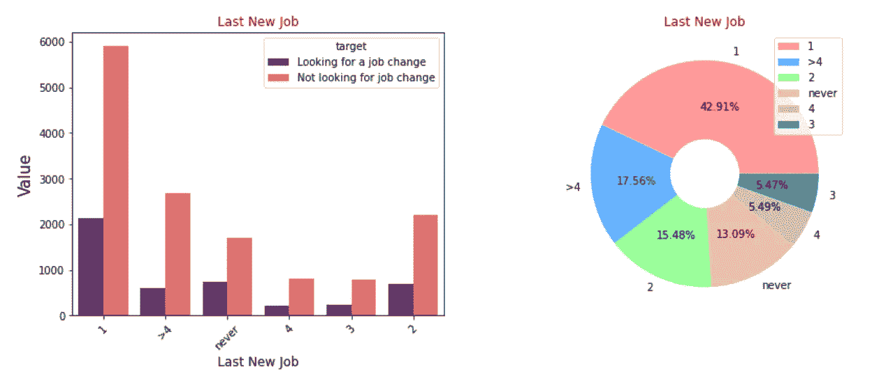**

*****多件训练会减少减员吗？——***根本不是，我猜！**

**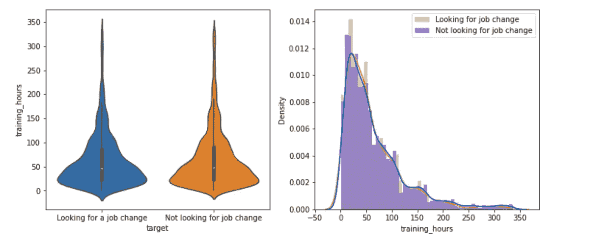**

## **数据预处理**

**让我们首先删除不必要的列，即“enrollee _ id”和“city ”,前者是唯一的值，后者在这种情况下意义不大。**

## **缺失值插补—鼠标**

**MICE(链式方程多重插补)插补是一种多重插补方法，它通常比均值插补等单一插补方法要好。如上所示，有 8 个特性缺少值。MICE 用于填充那些特征中缺失的值。**

## **列车测试分离**

**一旦缺失值被估算，数据可以被分成训练验证(测试)部分，并且可以在训练数据集上建立模型。在此之前请注意，数据是高度不平衡的，因此我们首先需要平衡它。为此，使用 [**合成少数过采样技术(SMOTE)**](https://machinelearningmastery.com/smote-oversampling-for-imbalanced-classification/) 。**

**在对整个数据应用 SMOTE 之后，数据集被分成训练和验证。在训练数据集上拟合和变换 StandardScaler，并且在验证数据集上使用相同的变换。标准缩放器**移除平均值，并将每个特征/变量缩放至单位方差**。该操作以独立的方式按特征执行。StandardScaler 可能会受到异常值(如果它们存在于数据集中)的影响，因为它涉及每个要素的经验平均值和标准差的估计。**

****

**在将数据分成训练和验证之后，我们将得到下面的类标签分布，这表明数据不遵循不平衡标准。**

****

# **模型构建和验证**

**具有 20133 个观察值的训练数据集被用于模型建立，并且所建立的模型在具有 8629 个观察值的验证数据集上被验证。**

**构建并评估了以下模型。**

****

**XGBoost 和 Light GBM 都有 90 以上的好准确度分数。因为 XGBoost 是梯度提升机器的一个**可扩展且精确的实现，并且它已经被证明推动了提升树算法的计算能力的极限，因为它是为了模型性能和计算速度的唯一目的而构建和开发的。****

## **XGBoost 分类器**

**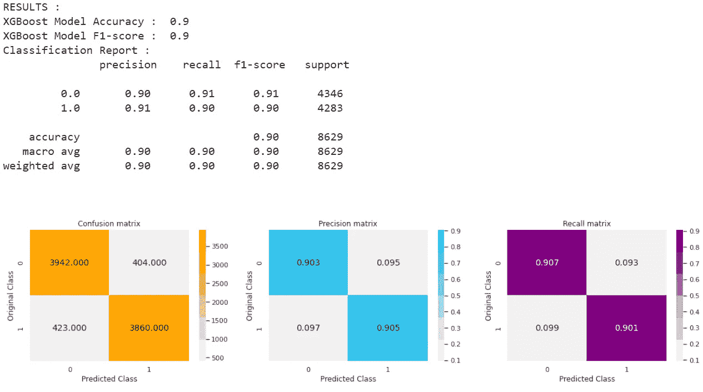****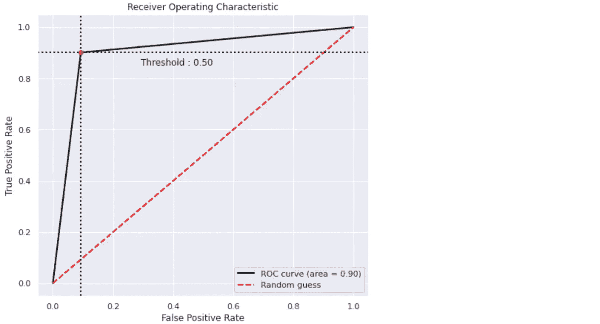**

## **光梯度增强模型**

******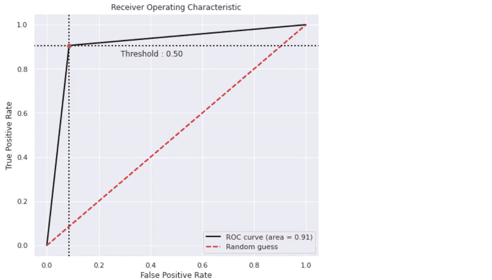**

**与 XGBOOST 相比，通过应用轻度 GBM，准确性和 AUC 评分仅略有增加，但训练程序的执行时间有显著差异。Light GBM 比 XGBOOST 快 7 倍，在处理大型数据集时是一个更好的方法。**

**更多性能指标查看—[*https://medium . com/nerd-for-tech/machine-learning-model-performance-metrics-84f 94d 39 a 92*](/nerd-for-tech/machine-learning-model-performance-metrics-84f94d39a92)**

**感谢你阅读❤**

# **资源**

*   ****Kaggle 竞赛—**[**https://www . ka ggle . com/arashnic/HR-analytics-job-change-of-data-scientists**](https://www.kaggle.com/arashnic/hr-analytics-job-change-of-data-scientists)[**。**](https://www.kaggle.com/arashnic/hr-analytics-job-change-of-data-scientists)**

**_______________________________________________________________**

**对于任何建议或疑问，请在下面留下您的评论，并关注更新。**

**如果你喜欢这篇文章，请点击👏图标来支持它。这将有助于其他媒体用户找到它。分享一下，让别人也能看！**

**快乐学习！😊**