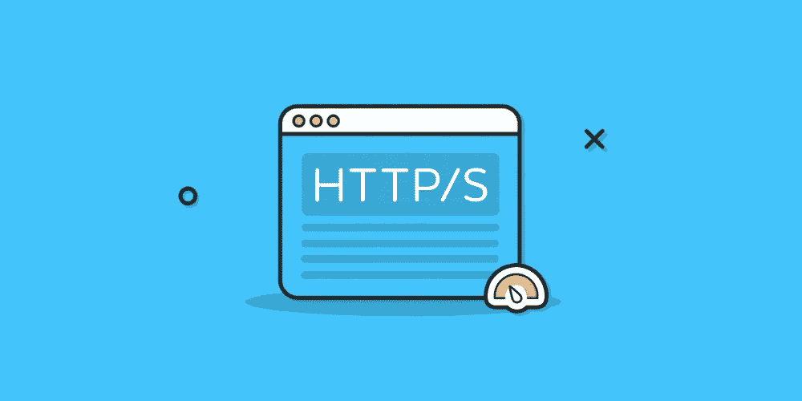

# HTTP 基础知识

> 原文：<https://medium.com/nerd-for-tech/http-basics-d86fbf8107ec?source=collection_archive---------4----------------------->

你是否发现请求和响应、方法和状态代码令人困惑？这里有一篇文章，用最简单的方式把事情做好。

超文本传输协议的缩写，HTTP 是一种协议，基本上作为一种语言工作，用于在**服务器**和**客户端**之间的通信。每次你访问一个网页，点击一个按钮或者输入你的电子邮件来订阅一份时事通讯你正在使用 HTTP 并经历一个**请求&响应**周期。

为了使通信更加安全，我们使用 HTTPS，这基本上是你安装一个证书到你的网络主机。该证书可以是一个 **SSL 证书**或一个 **TLS 证书**。它所做的就是对客户端和服务器之间的请求和响应进行加密。每当你进入那个网站时，你的 URL 旁边就会出现警告标志或锁定标志。

对服务器的每个请求都有一个附加的**方法**。我们总共使用四种方法来处理我们的请求:

1.  **获取:**从服务器获取数据。
2.  **POST:** 向服务器提交数据。
3.  **PUT:** 更新服务器中已经存在的数据。
4.  **删除:**删除服务器中已经存在的数据。

每个请求和响应包含一个**头**和一个**体**。

通常，头部包含三个东西:请求方法、路径和我们用来发送请求的协议。另一方面，主体保存服务器和客户机之间使用头中提到的路径和方法进行通信的数据。例如，如果你向服务器请求一个网站的 html&css，你就发送了一个 GET 请求。当 html&css 保存在响应的主体中时，您得到的响应是什么。或者，如果您将填写好的表单发送到服务器，您就发送了一个 POST 请求，您在该表单中输入的信息保存在该请求的正文中。

来自服务器的每个响应都有一个状态代码，通知我们请求的进展情况。有许多代码，但是，我们可以了解基本结构，以了解问题发生时在哪里:

**1xx:** 如果您的响应给出的状态代码是 100 左右，这意味着请求已经收到，正在处理中。

如果您的响应给出的状态代码是两百左右，这意味着请求已被成功接收、理解和接受。

**3xx:** 如果您的响应给出了一个 300 左右的状态代码，这意味着要么必须采取进一步的行动，如授权或输入，要么重定向到另一个路由。

**4xx:** 如果您的响应给出的状态代码是 400 左右，这意味着该请求有些错误或者遗漏了什么。

**5xx:** 如果您的响应给出的状态代码是 500 或更多，这意味着尽管请求是健康的，但服务器未能给出正确的响应。

以下是最基本的状态代码:

*   200:好的
*   201: OK 已创建(新的东西已创建)
*   301:移至新的网址
*   304:未修改(缓存版本)
*   400:错误请求
*   401:未经授权
*   404:未找到
*   500:内部服务器错误

要检查网站内发生了什么，只需右键单击并选择“检查”。然后，在打开的窗口中，选择网络选项卡。在那里，您可以看到所有的 HTTP 通信步骤:请求或响应。状态栏保存状态代码。如果您双击每个响应，您可以看到从消息头(请求和响应)和消息体到操作完成时间的所有信息。

要发送和接收来自 URL 的请求，还可以使用一个叫做 **Postman** 的工具。Postman 主要由开发人员使用，它为您提供了每个请求的更高级的外观，并通过帮助您保存请求或输入 JSON 数据而变得非常方便。要开始，只需在安装后点击新的请求按钮，并选择一种方法。然后，输入您要将请求发送到的 URL，然后，只需单击 send。在下面，您可以看到响应的代码或预览，或者检查标题、Cookies、响应状态代码，甚至是响应的大小。

**注意:**当您使用 put 或 post 方法时，您可以输入要通过 Postman 发送的数据。但是请记住，在消息头中，您需要指定您发送的请求的内容类型。例如，如果您正在发送 JSON 数据，请转到请求信息下的 Headers 部分，选择 Content:type 作为键，然后将值设置为 JSON。之后，您可以在 body 选项卡下的响应正文中输入 JSON 数据。