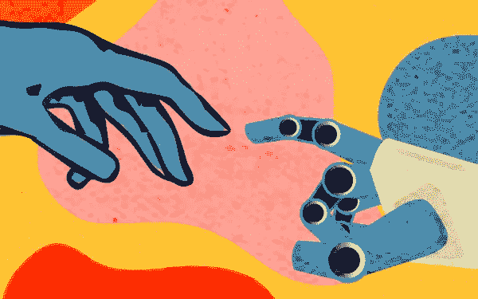

# UX 学科中的人的因素

> 原文：<https://medium.com/nerd-for-tech/human-factors-in-ux-discipline-ea18bea7e2e5?source=collection_archive---------12----------------------->

W 由于强调以用户或人为中心的设计，[人为因素](https://mockitt.wondershare.com/ui-ux-design/human-factors.html?utm_source=other_media_sites&utm_medium=social&utm_campaign=md&utm_term=medium_post&utm_content=post_md_md_en_20087918_2021-03-11)有助于确保家庭医疗保健适合相关人员、任务和环境，并确保提供的护理安全、有效和高效。根据[国际人类工程学协会](https://www.ergonomics.jp/e_index/e_outline.html)的说法，“人的因素是一门科学学科，涉及对人类和系统中其他元素之间的相互作用的理解，以及应用理论、原则、数据和其他方法进行设计以优化人类福祉和整体系统性能的专业”(国际人类工程学协会，2010)。

# 人为因素的目标

因此，人的因素涉及将已知的人类行为、能力、局限性和其他特征应用到系统、任务/活动、[环境](https://mockitt.wondershare.com/ui-ux-design/interactive-environments.html?utm_source=other_media_sites&utm_medium=social&utm_campaign=md&utm_term=medium_post&utm_content=post_md_md_en_20087918_2021-03-11)和设备/技术的[设计中。它还涉及支持任务执行或技术/设备使用的培训计划和教学材料的设计。](https://mockitt.wondershare.com/design/design-system.html?utm_source=other_media_sites&utm_medium=social&utm_campaign=md&utm_term=medium_post&utm_content=post_md_md_en_20087918_2021-03-11)

人为因素关注人们如何与任务、设备/技术以及环境相互作用，以理解和评估这些相互作用。人为因素的目标是优化人和系统的效率和有效性、安全、健康、舒适和生活质量。

莫基特会说用户体验是人的因素的一个子领域。人的因素从更广阔的角度看待各种[人机交互](https://mockitt.wondershare.com/ui-ux-design/interaction-design.html?utm_source=other_media_sites&utm_medium=social&utm_campaign=md&utm_term=medium_post&utm_content=post_md_md_en_20087918_2021-03-11)。它是关于[工程学](https://mockitt.wondershare.com/ui-ux-design/usability-engineer.html?utm_source=other_media_sites&utm_medium=social&utm_campaign=md&utm_term=medium_post&utm_content=post_md_md_en_20087918_2021-03-11)、[人体工程学](https://mockitt.wondershare.com/ui-ux-design/ergonomics.html?utm_source=other_media_sites&utm_medium=social&utm_campaign=md&utm_term=medium_post&utm_content=post_md_md_en_20087918_2021-03-11)、风险[心理学](https://mockitt.wondershare.com/ui-ux-design/psychology.html?utm_source=other_media_sites&utm_medium=social&utm_campaign=md&utm_term=medium_post&utm_content=post_md_md_en_20087918_2021-03-11)、自动化心理学、神经科学等等。人为因素方法可以应用于许多行业，如汽车、航空或医学工程，而[用户体验](https://mockitt.wondershare.com/ui-ux-design/what-is-ux-design.html?utm_source=other_media_sites&utm_medium=social&utm_campaign=md&utm_term=medium_post&utm_content=post_md_md_en_20087918_2021-03-11)更多的是关于网络技术。

[UX 的研究](https://mockitt.wondershare.com/ui-ux-design/ux-research.html?utm_source=other_media_sites&utm_medium=social&utm_campaign=md&utm_term=medium_post&utm_content=post_md_md_en_20087918_2021-03-11)是关于一个网站或应用程序的可用性，使用会唤起什么样的情感，以及人们对该品牌的看法。人因科学研究的主要目标是减少人为错误，使人机交互更加安全。

# 人为因素如何影响[产品设计](https://mockitt.wondershare.com/ui-ux-design/product-design-vs-ux-design.html?utm_source=other_media_sites&utm_medium=social&utm_campaign=md&utm_term=medium_post&utm_content=post_md_md_en_20087918_2021-03-11)？

人们不会经常改变他们做事的方式来适应设计缺陷，所以设计定制的怪癖是很重要的。牙膏盖是一个典型的例子:与牙膏管分开，弯曲的牙膏盖导致牙膏变硬，被浪费。UX 的设计师们需要考虑用户如何在特定领域与他们的产品或应用程序交互，并为他们提供更好的用户体验。如今，许多制造商制造出铰接式牙膏盖和其他连接到牙膏管上的设计，以防使用者忘记关闭牙膏盖。

# 人为因素与 UX

那么，当我们谈论人性化设计时，它和 UX 设计一样吗？不一定。人性化设计源于人体工程学，它主要关注人们如何与技术互动。它是关于让一个系统变得可用，尤其是在人机交互方面。另一方面，用户体验(UX)涵盖了用户与产品交互时所经历的一切。UX 设计的目标是使一个系统既有用又令人愉快。当人们评估一个产品时，他们通常从可用性和受欢迎程度两方面来判断它的 T2。使产品可用的人为因素是更大的用户体验的一部分。因此，UX 设计师应该很好地理解设计中的人的因素，以创造出伟大的产品。

# 人的因素设计原则

## 控制感

用户应该[控制](https://mockitt.wondershare.com/ui-ux-design/controls.html?utm_source=other_media_sites&utm_medium=social&utm_campaign=md&utm_term=medium_post&utm_content=post_md_md_en_20087918_2021-03-11)与系统的交互，而不是反过来。设计系统时，请记住以下几点:

*   提供充分的反馈——使用视觉和听觉线索来帮助用户理解系统的当前状态。
*   系统操作管理—用户应该控制系统操作，例如中断或完成操作。
*   个性化——根据你对用户的了解提供内容，给人一种系统正在适应用户需求的印象。
*   交互元素，比如按钮，在交互时应该总是提供视觉反馈。

## 效率

用户应该能够在最短的时间内完成他们的任务。将复杂的任务分解成简单的步骤。通过这样做，您可以降低复杂性并简化决策过程。减少完成任务所需的步骤数量，删除所有不必要的步骤，并使导航路径尽可能短。确保你的用户可以把所有的时间投入到手头的任务中，而不是产品界面上。

## 错误管理

犯错是人之常情。但这不代表你的用户喜欢！系统处理错误的方式对用户有着巨大的影响。这包括错误预防、错误纠正，以及在错误发生时帮助用户回到正轨。

设计错误处理时，需要记住以下几点:

*   尽可能防止错误发生。创建用户旅程并对其进行分析，以确定用户可能会遇到麻烦的地方。
*   保护用户不犯致命错误。创建防御层，防止用户获得致命的错误状态。例如，设计系统对话框，要求用户确认他们的操作(如删除文件或他们的整个帐户)。
*   “删除帐户”操作的系统对话框。图像信用堆栈流量。
*   支持“撤销”操作。使逆转行动成为可能。
*   当错误发生时，提供消息帮助用户解决问题。
*   永远不要责怪用户。如果你实践了以用户为中心的设计，你就知道这不是用户的错；反而是你的设计缺陷导致用户犯错。

# 识别人为因素的方法

既然你已经理解了什么是人为因素设计，那就让我们深入了解如何将这些原则融入到你的设计过程中。第一步是了解你的用户以及他们可能会在哪里陷入困境——所以当然，[用户测试](https://mockitt.wondershare.com/ui-ux-design/ux-testing.html?utm_source=other_media_sites&utm_medium=social&utm_campaign=md&utm_term=medium_post&utm_content=post_md_md_en_20087918_2021-03-11)是关键！

这里有一些测试方法来了解工作中的人为因素:

*   “认知走查”是一种可用性技术，在这种技术中，UX 的实践者从用户的角度出发处理一系列的任务。认知演练在原型阶段非常有效，因为它保持了焦点的简单性:新用户能轻松完成工作吗？
*   “适度可用性测试”——通过这种测试，人为因素专家观察测试者如何与产品互动。当团队拥有高度准确的产品原型时，适度的可用性测试提供了最大的价值。试着让测试者在测试过程中大声思考，这会让你对用户体验有更有价值的了解。
*   “情境研究”是定性研究的一种形式，在这种研究中，UX 的从业者观察用户如何在他们的自然环境中与产品互动，比如工作场所。一旦你把产品发布到市场上，看看用户在现实生活中是如何与产品互动的，这是非常理想的。

# 结论

人的因素在成功产品的开发中起着重要的作用。人因设计原则有助于您识别系统中可以改进的地方，并在使用系统时提高生产率、安全性和整体满意度。

感谢您花时间阅读这篇文章。[了解更多关于 Mockitt 的信息](https://mockitt.wondershare.com/?utm_source=other_media_sites&utm_medium=social&utm_campaign=md&utm_term=medium_post&utm_content=post_md_md_en_20087918_2021-03-11)

我们为 UX 初学者创建了一个[终极指南](https://mockitt.wondershare.com/ux-beginner.html?utm_source=other_media_sites&utm_medium=social&utm_campaign=md&utm_term=medium_post&utm_content=post_md_md_en_20087918_2021-03-11)，它收集了来自多个 UXers 的知识、经验和建议。

订阅我们的 [YouTube](https://www.youtube.com/channel/UCESxamaRS8nOGpWYvP1VSqA) [脸书](https://www.facebook.com/mockitt) [Instagram](https://www.instagram.com/wondershare.mockitt/)

*原载于*[*https://mockitt.wondershare.com*](https://mockitt.wondershare.com/ui-ux-design/human-factors.html?utm_source=other_media_sites&utm_medium=social&utm_campaign=md&utm_term=medium_post&utm_content=post_md_md_en_20087918_2021-03-11)*。*