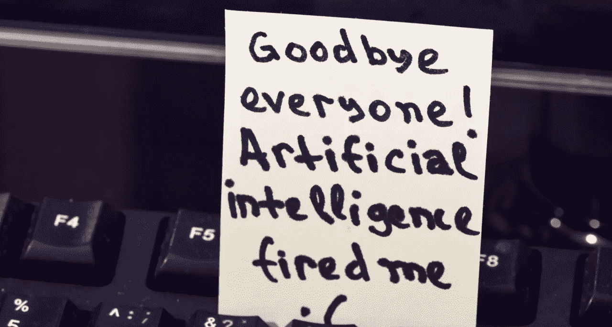
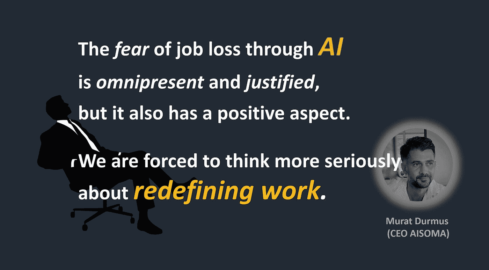

# 人工智能时代的人力资源管理

> 原文：<https://medium.com/nerd-for-tech/human-resource-management-in-the-age-of-ai-176e8f8414fc?source=collection_archive---------19----------------------->

shutterstock(瓦迪姆·ZH)

一些快速的想法。

你不必成为预言家，也能预见到人工智能在人力资源管理领域也将发挥必不可少的作用。它将对我们未来连接人们的方式产生决定性的影响。

对于大多数组织来说，利用人机合作来改善将人们与合适的工作联系起来的过程是一种相对较新的招聘方式。虽然有许多有利的进步和新颖的解决方案可以促进更具包容性的招聘，但仍有一些风险需要考虑。首先，我们必须挑战招聘经理知道什么是理想员工的假设。事实可能是，许多组织不知道在他们的环境中哪种类型的人具有哪种技能组合。为了生成大型、健壮的模型，我们不仅需要关于潜在雇员的更多数据，还需要关于过去雇员表现的数据。这些通常被认为是专有的数据将改善机器学习系统，并有助于揭露偏见和组织的隐形招聘做法。为了让人机合作能够实现更具包容性的人才实践，我们还需要做更多的工作来理解算法偏差。求职者必须能够知道他们的个人资料是如何被机器学习工具解读的，雇主将使用这些工具来告知他们的招聘决定。

彼得·卡佩里(Peter Cappelli)、普拉桑娜·坦贝(Prasanna Tambe)和瓦列里·雅库博维奇(Valery Yakubovich)等教授在 2018 年的白皮书中写道，“人力资源决策的结果(如谁被聘用和解雇)对个人和社会产生了如此严重的后果，以至于对公平的担忧——包括程序和分配正义——至关重要。”([来源](https://papers.ssrn.com/sol3/papers.cfm?abstract_id=3263878))

> 组织需要坚定地确保他们系统的决策算法符合他们的价值观。道德实践，包括充分了解影响算法招聘模型的因素，对于防止偏见以及这些工具促进向包容性人才的转变至关重要。

这可能也是有趣的(我关于正念人工智能的新书):

链接(亚马逊):[人工智能思想书:励志思想&人工智能语录](https://www.amazon.com/gp/product/B08Z4BWN1X/ref=dbs_a_def_rwt_bibl_vppi_i0)