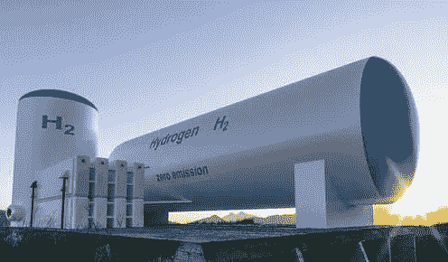

# 氢气是未来零碳排放的燃料

> 原文：<https://medium.com/nerd-for-tech/hydrogen-is-the-future-fuel-for-zero-carbon-emissions-e2325165f26e?source=collection_archive---------5----------------------->

# 介绍

氢是宇宙中最轻的元素，因此也是最丰富的元素。太阳是由氢驱动。它通常是通过电解分离水分子产生的，只产生氧气作为副产品。氢气是未来 50 年内地球脱碳的主要解决方案。氢气作为一种能量载体，有点像石油或天然气，通常通过管道或运输到需要的地方。它每单位质量储存的能量是传统汽油的 3 倍，当它在空气中“燃烧”时，释放出储存的能量，它只是与氧气结合，提供水作为副产品，二氧化碳零排放。

今天，在这篇文章中，找到 YouTube 视频的链接:[https://youtu.be/B_gbKh7q-Zk.](https://youtu.be/B_gbKh7q-Zk.)这通常是一个非常令人惊讶的视频来了解氢，因为氢是未来零碳排放的燃料。

# 描述

该行业一直在生产氢气，作为可靠的下一代燃料，为汽车提供动力，为家庭供暖并发电。事实上，它对气候的损害比以前想象的要大。氢气有能力成为我们家庭和企业中天然气的低碳替代品。

# 生产

氢气通常由不同的国内资源生产。这可能会促进潜在的近零温室气体排放。[一旦产生，氢在电池中产生电能，只释放水蒸气和温暖的空气。](https://www.technologiesinindustry4.com/)它与固定能源和运输能源部门一起保持着有希望的增长。
氢气通常由国内资源生产，如:

*   天然气，
*   煤
*   太阳能
*   风
*   生物量

什么时候才能为高效电池电动汽车提供动力，氢有望帮助加强国家能源安全，节约燃料，并使我们的运输能源选择多样化，以建立一个更具弹性的系统？氢是一种能量载体。这将把我们依赖化石燃料的经济转变为氢经济，从而提供一种零排放的交通燃料。

# 储氢

氢的能量含量很低。这给储存氢带来了挑战，因为它需要高压、低温或化学过程才能紧凑地储存。对于轻型车辆来说，克服这一挑战至关重要，因为它们通常尺寸和重量有限，无法储存燃料。
通常情况下，轻型汽车的氢储存能力应该能够使高尔夫球行驶 300 英里，以满足消费者的需求。由于氢的体积能量密度比汽油低，因此与其他气体燃料相比，在车辆上储存这么多氢需要更大的罐，压力也更好。中型和重型车辆具有更大的油箱空间，但可能会面临重量限制，从而降低整个负载潜力，以保持在美国运输部的限制范围内。
该行业还指出氢气是继续建设管道等天然气基础设施的理由，称未来输送天然气的管道可以输送更清洁的天然气和氢气混合物。氢最终可能会在储能或为某些类型的交通工具提供动力方面发挥作用——比如飞机或长途卡车，在这些地方，转向电池电力也可能具有挑战性——人们越来越一致地认为，依赖天然气的更广泛的氢经济可能会破坏气候。

# 应对全球变暖

甲烷是气体的主要成分。在解决供暖问题上，这比之前认为的要重要得多。自 19 世纪以来，全球平均气温的上升基本上都是由化石燃料的燃烧造成的。
氢研究描述了继续使用化石燃料并添加一些额外的东西作为一种可能的气候解决方案的潜力。它既没有充分考虑排放，也没有对未来成本做出现实的假设。

# 蒸汽重整过程

在蒸汽-甲烷重整过程中，甲烷在 3-25 巴压力(1 巴= 14.5 磅/平方英寸)下，在催化剂的存在下与蒸汽反应，提供氢气、一氧化碳气体和相对少量的二氧化碳。蒸汽重整是吸热的——也就是说，必须向该方法提供热量以使反应继续进行。大多数氢燃料很可能是由气体通过一种能源密集和污染的方法制成的，这种方法被称为未来的蒸汽重整过程。[利用蒸汽、高温和高压将甲烷分解成氢气和一氧化碳气体。](https://www.technologiesinindustry4.com/)但这也没有考虑到产生氢气、为蒸汽重整过程提供动力和进行二氧化碳捕获的气体。

# 一种清洁的替代燃料

现在的重点是氢气可能是一种清洁的替代燃料，其产生的温室气体排放微不足道。如果氢是下一个运输燃料，第一个用来生产大量氢的能源不一定是可再生的清洁能源。碳封存经常被认为是消除燃煤产生的 CO2 排放的一种方式，其中气体被捕获并封存在气井或枯竭的油井中。然而，这些地点的供应并不普遍，二氧化碳的存在可能会酸化地下水。

更多详情请访问:[https://www.technologiesinindustry4.com/](https://www.technologiesinindustry4.com/2021/08/hydrogen-is-the-future-fuel-for-zero-carbon-emissions.html)