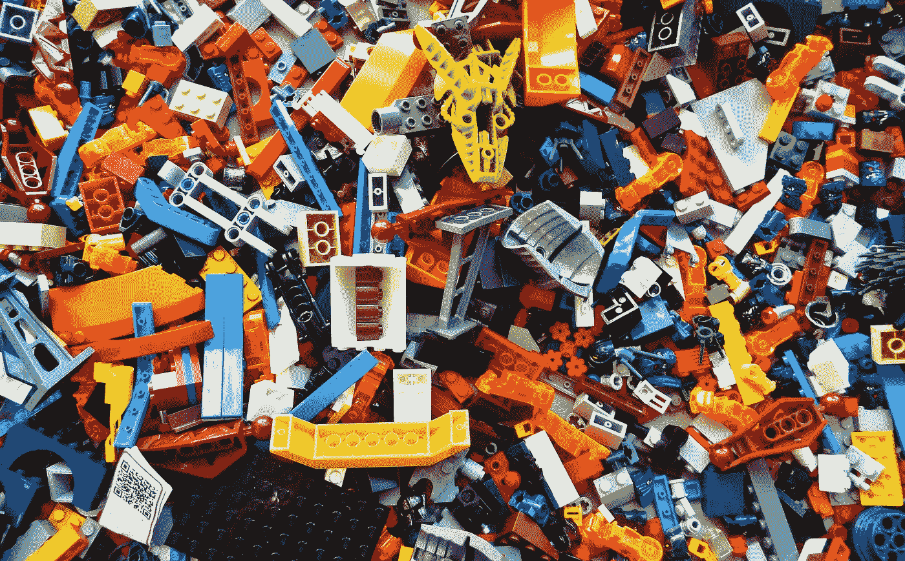

# 我为我的出版物发布了所有代码

> 原文：<https://medium.com/nerd-for-tech/i-released-all-the-code-for-my-publication-a531ba5d0564?source=collection_archive---------13----------------------->

## 为什么公开我的代码比隐藏好

如果你爱一样东西，就让它去吧。谁知道它会把你引向何方？图片由[丹金](https://unsplash.com/@danielcgold?utm_source=medium&utm_medium=referral)在 [Unsplash](https://unsplash.com?utm_source=medium&utm_medium=referral) 上拍摄

# 开放代码是值得努力的

Juan Rumimpunu 在 [Unsplash](https://unsplash.com?utm_source=medium&utm_medium=referral) 上拍摄的照片

结果已处理，评论已提交，论文已准备就绪。我究竟为什么要花额外的 8 个多小时来清理、评论和提交我的代码到 GitHub，为了一些技术上已经“完成”的事情？

因为科学应该得到比粗制滥造的代码更好的东西，或者更糟，没有透明度...

老实说，我发布难以辨认和难以运行的代码是虚伪的，尽管我抱怨(计算神经)科学缺乏可重复性。

当“代码是公开可用的”时，我感到很沮丧，因为代码所做的只是产生第一个数字的一部分。当然，我可以说作者已经在那段代码中投入了精力，甚至已经将生成的结果包含在图像中，但是我只是期望**更多**来自一个支持同行评审的学科。通过共享虚拟实验的方法和实现，理论和计算领域有可能变得更加容易接近。与许多受昂贵实验设备限制的领域相比，这种可及性尤其重要。

## 代码满足开放科学规范的最低要求是什么？

对许多人来说，开放科学不仅仅意味着逻辑上的可及性，也意味着智力上的可及性。也就是说，仅仅因为代码可以通过调用命令再次运行，并不意味着它实际上对测试假设有用。

为了比重新生成现有的结果更有用，记录良好的代码有助于

*   从论文中理解算法的细微差别
*   对于图中范围之外的范围，改变清楚标记的参数
*   扩展模型以包括自己感兴趣的领域
*   将该模型与其他类似模型进行比较
*   通过观察算法是如何实现的来学习一个领域，因为这些算法是“常识”
*   为算法的独立实现提供了蓝图
*   通过跟踪存储库的提交历史来检查开发过程

此外，花时间清理代码通常会导致

*   通过重新检查捕捉错误和缺陷
*   提高代码效率和实现

“开放科学”应该不再是一个术语。我认为在今天这个时代，科学应该是开放的，可以被默认为。就像你提交一份手稿供同行审阅一样，代码也应该接受检查，更重要的是，接受扩展思想的检查。一些期刊在努力改变心态方面比其他期刊做得更好。

# 我的代码看起来像什么

**所有这些产品都有各自的功能，但我能轻松找到我想要的吗？**照片由[里克·梅森](https://unsplash.com/@egnaro?utm_source=medium&utm_medium=referral)在 [Unsplash](https://unsplash.com?utm_source=medium&utm_medium=referral) 上拍摄

代码一开始完全是一团糟。

单个目录中的文件。在几个文件中加载方法。严重缺乏评论。

此外，对于一个更大的项目来说，它们都在一个更大的代码库的子目录中。

这不符合开放科学的精神——为了可复制性而共享代码。仅仅因为它运行了，并不意味着它对理解正在发生的事情特别有用。

情况变得更糟。

代码以 NEURON 的类 C 语言 HOC 开始，用于定义、运行和保存神经元模型，并在 MATLAB 中分析输出文件。这在 2015 年似乎是合理的，因为神经元的 Python 接口针对*nix 操作系统，而我有一台 Windows 笔记本电脑，实验室使用 Matlab 脚本来分析实验数据——我可以利用这种经验。2017 年底，一台 Linux 机器诞生了，我想使用更多的 Python 来减少我正在使用的语言数量(Python 用于我的机器学习模型，Javascript 用于 web，Java 用于另一个项目，而 HOC/MATLAB 用于这个研究项目)。

犹豫着要不要用 Python 重写所有的特设模型，我转而开始使用 Python 作为脚本语言来调用特设文件来完成繁重的工作。我花了很多时间写我已经有的东西——用 NEURON 和 MATLAB——所以我的哲学是保留有用的东西，但用更好的语言包装它。

另外，我是唯一一个使用这个代码库的人，“它能变得多糟糕？”

扩展实验是通过用 Python 拼凑配置文件来完成的，这些配置文件依次配置 NEURON，并用基于 Python 的参数包装模拟的原理运行。

是的，变得很糟糕…

幸运的是，对于代码质量来说，合作者的一个看似简单的请求产生了一个新的 Python 文件，它完成了所有的模拟设置和分析。

因此，进一步的实验越来越多地在 Python 中进行。这些年来，我变得越熟练，代码就越快越干净。

> 但是我的研究中结果优先的方法意味着代码维护的很差。

结果的速度是用代码债务换来的。一旦公开发布“到野外”，这种代码债务就不再成为个人问题，而是减缓理解代码模型的速度，并产生智力债务——在理解本可以更好地构建和解释的东西上浪费智力。如果我想让我的结果被询问和建立，代码需要改进。

# 我如何使代码可发布

***批量清洗总比不清洗好。但是我不应该等到事情变得这么糟糕…*** 照片由[Unsplash](https://unsplash.com/@thecreative_exchange?utm_source=medium&utm_medium=referral)上的创意交流拍摄

我的第一步是将文件类型分组到文件夹中。

Python 文件被放在几乎根的`src`中，因为这些文件被用作实验、脚本或其他的入口。特设文件，您转到`hoc_files`(注意，`hoc`目录会导致 PyNEURON 的名称冲突)。NMODL(一种指定神经元中通道行为的语言)你去`mod`。MATLAB 文件，你去`matlab`。

然后，对于这些文件夹中的每一个，基于文件功能创建子目录。神经元模型到`hoc_files/cells`，突触规范到`hoc_files/synapses`等等。实用程序文件和功能被发送到`utils`。

对于 Python 来说，具有强大重构*能力的 IDE 就派上了用场。这也是最混乱的地方。因为实验包含在文件中，所以我对其进行了更改，以便将设置、模拟、分析和绘图分开。反过来，我试图将一个实验的文件包含到一个文件夹中，在`src`中有一个对应的文件，这是一个基本文件，主要是用几行(< 50 行)来运行这个实验。实验中常用的方法被移动到`utils`文件夹中，并被分组为文件操作(如保存、加载)、神经元接口方法、常用绘图助手等。使用 IDE 的重构，在文件/文件夹之间移动方法时，会保留对方法的引用。

此外，`config.settings`文件保存了一些通常有用的常量和配置，而`config.shared`文件通过自动编译 NMODL 文件、加载实用程序文件等方式提供了一致的 NEURON 体验。只需调用`INIT_NEURON()`。

将文件放在正确的位置，提高注释与代码的比率对我来说很重要，这样我的代码不仅可以很好地组合起来重新运行，而且可以被另一个人(以及 6 个多月内的我)理解。除了行内注释，还关注了文档字符串注释和将变量/方法重命名为自文档化。

为每个项目创建一个新的环境(例如使用`virtualenv`或`conda`)是一个很有前途的想法，这样就可以跟踪包需求。这也意味着一个人在他们的计算机上尝试你的代码可以创造一个新的环境，不会污染或与他们现有的环境相冲突。您可以使用
`conda env export --from-history > environment.yml` ( `--from-history`表示只有您明确要求安装的包才会出现在文件中)
或
`pip freeze > requirements.txt`导出

最后，在当今时代，交互式笔记本(如 [Jupyter](https://jupyter.org) )使得遍历一些代码以产生一些结果比目录中的文件和单独的自述文件容易得多。当然，在这种情况下，一个限制是一些分析是在 MATLAB 中完成的，所以那些模拟和结果被省略了。我知道 MATLAB-Python 绑定是存在的，但我也希望笔记本能在像 [Binder](http://mybinder.org) 这样的服务中运行，以减少摩擦。如果这是您想要的，请创建一个拉取请求。

虽然日志记录不一致(HOC 文件有自己的日志记录，而我用的是 Python 的`logging`模块)，但至少重现了论文中的数字。在这种情况下，论文中的完整数字没有被复制，但是其中的次要情节。有些人喜欢在 Illustrator 或 Inkscape 中结合这些功能。幸运的是，我的其他项目只需在矢量编辑软件中稍作调整，就可以用 Python 生成完整的图形(包括文字和所有内容)。

现在我们有了一个自述文件、一个说明性的笔记本、结构清晰的文件、文件和方法的注释，以及一个使用笔记本或可以在终端中调用的`src`级 Python 文件来再现图形的简单方法。

> 它并不完美，永远不会完美，没关系。

这部法典有很长的历史。我们一起经历了很多。一路走来，我们学到了很多东西，代码中包含了大量假设。但它就在那里。尽管让任何人看到这一切都很可怕，但这对科学来说也是最好的。这对我来说更重要。

*重构=重构代码，使其功能相同，但速度、可读性和/或可扩展性有所提高。

# 课程

诚实的(代码)清理是开发早期养成的好习惯。图片由[诚信公司](https://unsplash.com/@honest?utm_source=medium&utm_medium=referral)在 [Unsplash](https://unsplash.com?utm_source=medium&utm_medium=referral) 上拍摄

*   注释您的代码。很多。评论太多而不是不够。使用自我记录的代码，编写文件头，在评论中重复使用自述文件，反之亦然。
*   构建您的文件和方法。早点做。经常重组。
*   通过防止个人代码债务来防止社会知识债务。
*   彻底测试你的代码。正式的单元测试比非正式的数字要好。数字比根本不测试要好。
*   现在花费的时间就是以后节省的时间。总会有一个高峰。时间永远不够。尽可能优先考虑易读性。
*   规划项目的布局。
*   如果你的需求改变了，准备好放弃这个计划。
*   你的代码很有价值。你的代码很珍贵。但是囤积起来有什么用呢？

## 关于舀的一个注记

由于“发表或毁灭”科学模型的危险，科学家们担心他们的工作会被别人发表。很公平。关于这一点有一个更大的讨论，但在这里我将声明如下:

*   使用正确的许可发布您的代码会限制其他人在没有适当授权的情况下发布与您的工作相关的结果。
*   将你的代码发布到一个在线存储库中会给出一个可信的智力原创的时间戳。
*   允许他人在你的工作基础上更容易产生新的成果。任何一个正派的科学家都会引用你的研究成果。
*   如果你被过度抢先，那么你的工作显然重要到足以被抢先(不确定我的工作是否符合这个标准)。
*   发布部分代码比什么都不发布要好。
*   发布不透明的代码是令人讨厌的:它与声称开放的开放科学背道而驰。也就是说，可用但难以辨认的代码可以声称是(逻辑上)可访问的，但却阻止了其他人使用它。
*   科学家们希望进行比目前可能的更多的合作。
*   培养“矿”的态度是反科学的。至少科学是为了人类的普遍进步。自私的科学有什么用？
*   懒惰不是借口。你花了多少精力来写你的手稿和产生好的数字？你已经花了几个小时来做这个作品的展示或海报给别人看。当然，编写你引以为豪的代码也值得同样的爱。它比你制作的任何纸张或海报都更容易重复使用。

# 鳍状物

这些就是我决定发布我的作品的原因。

也许你觉得这样做不舒服。我要求你克服这种不安全感。我钦佩那些让自己脆弱的人。

也许你在等待代码变得“完美”。我挑战你无论如何要释放它。[做得比完美更好](http://blog.daverooney.ca/2014/01/pragmatic-agile-done-is-better-than.html)。

也许分享你的作品会有更多的障碍。我要求你分享你所能分享的。作为一名科学家，你是一名专业的问题解决者。

也许你的合作者或主管不希望代码在线。我挑战你去说服他们。营造开放的环境。

分享你的代码是可以做到的。我认为*应该默认为*。

当然，也可能有例外。但我认为应该这样对待他们:例外。

我认为科学可以做得更好。

我认为我们都应该过得更好。

感谢 [Grace Lindsay](https://twitter.com/neurograce) 和 [Kira Düsterwald](https://twitter.com/kiradusterwald) 的有益建议和编辑。

这个问题中的代码是发表在《公共科学图书馆计算生物学》上的论文“氯化物动力学改变了神经元的输入输出特性”

(论文链接待定)

**GitHub 回购:**

 [## ChrisCurrin/氯化物动力学 io 神经元

### 氯化物动力学改变神经元的输入输出特性…

github.com](https://github.com/ChrisCurrin/chloride-dynamics-io-neuron) 

**个人网站:**

 [## 克里斯托弗·柯林-主页

### 与人工智能和计算神经科学领域的研究经验，我探索…

chriscurrin.com](https://chriscurrin.com) 

***照片来自***[***Unsplash.com***](http://unsplash.com)