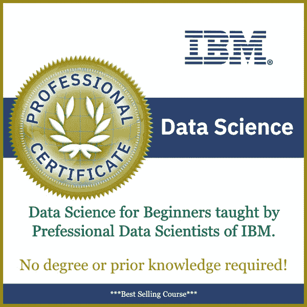

# IBM 数据科学专业证书(由 IBM 提供)

> 原文：<https://medium.com/nerd-for-tech/ibm-data-science-professional-certificate-offered-by-ibm-c62fa537378?source=collection_archive---------3----------------------->

启动你在数据科学和 ML 领域的职业生涯。建立数据科学技能，学习 Python 和 SQL，分析和可视化数据，建立机器学习模型。不需要学位或以前的经验！

启动你在数据科学和 ML 领域的职业生涯。建立数据科学技能，学习 Python 和 SQL，分析和可视化数据，建立机器学习模型。

不需要学位或以前的经验！

## 注册链接:

[***https://www . coursera . org/professional-certificates/IBM-data-science/***](https://coursera.pxf.io/9WB1n0)

# 您将学到的内容:

*   *了解什么是数据科学，数据科学家工作的各种活动，以及像数据科学家一样思考和工作的方法*
*   *使用专业数据科学家使用的工具、语言和库开发实践技能*
*   *导入和清理数据集，分析和可视化数据，使用 Python 构建和评估机器学习模型和管道*
*   *应用各种数据科学技能、技术和工具来完成项目并发布报告*

# 您将获得的技能:

1.  数据科学
2.  Python 编程
3.  数据分析
4.  熊猫
5.  Numpy
6.  云数据库
7.  关系数据库管理系统
8.  结构化查询语言
9.  预测建模
10.  数据可视化(DataViz)
11.  型号选择

# 这个专业证书有 10 门课程

**1。什么是数据科学:**揭示数据中的见解和趋势的艺术自古就有。古埃及人利用人口普查数据来提高税收效率，他们准确预测了尼罗河每年的洪水。从那时起，从事数据科学工作的人已经为他们的工作开辟了一个独特的领域。这个领域就是数据科学。在本课程中，我们将会见一些数据科学从业者，并大致了解当今的数据科学。

**2。数据科学工具:**最流行的数据科学工具有哪些，你如何使用它们，它们有什么特点？在本课程中，您将了解 Jupyter 笔记本电脑、JupyterLab、RStudio IDE、Git、GitHub 和 Watson Studio。您将了解每个工具的用途、它们可以执行的编程语言、它们的特性和局限性。使用托管在技能网络实验室云中的工具，您将能够测试每个工具，并按照指示运行 Python、R 或 Scala 中的简单代码。在课程结束时，您将在 IBM Watson Studio 上使用 Jupyter 笔记本创建一个最终项目，并展示您准备笔记本、编写 Markdown 以及与同事分享工作成果的熟练程度。

**3。数据科学方法:**尽管在过去几十年中计算能力和数据访问能力有所提高，但我们在决策过程中使用数据的能力要么丧失，要么根本没有最大化。通常，我们对提出的问题以及如何正确地将数据应用于手头的问题没有牢固的理解。

**4。面向数据科学的 Python，AI &开发:**通过这篇对初学者友好的 Python 介绍，开始学习面向数据科学的 Python，以及一般的编程。Python 是世界上最流行的编程语言之一，对能够应用 Python 基础知识来推动跨行业业务解决方案的专业人员的需求从未像现在这样大。

**5。用于数据科学的 Python 项目:**这个小型课程旨在为您展示处理数据的基本 Python 技能。本课程的完成包括动手项目，您将使用 Python 开发一个简单的仪表板。

**6。使用 Python 进行数据科学的数据库和 SQL:**世界上的大部分数据都驻留在数据库中。SQL(或结构化查询语言)是一种功能强大的语言，用于与数据库通信并从中提取数据。如果你想成为一名数据科学家，数据库和 SQL 的工作知识是必须的。

**7。用 Python 进行数据分析:**学习如何用 Python 分析数据。本课程将带您从 Python 的基础开始，探索许多不同类型的数据。您将学习如何准备数据进行分析，执行简单的统计分析，创建有意义的数据可视化，从数据预测未来趋势，等等！

**8。用 Python 实现数据可视化:**“一图胜千言”。我们都熟悉这个表达。当试图解释从越来越大的数据集的分析中获得的洞察力时，它尤其适用。数据可视化在小规模和大规模数据的表示中起着重要的作用。

**9。使用 Python 进行机器学习:**本课程使用一种平易近人且广为人知的编程语言 Python，深入研究机器学习的基础知识。在本课程中，我们将回顾两个主要部分:首先，您将了解机器学习的目的以及它在现实世界中的应用。第二，你将对机器学习的主题有一个总体的了解，比如监督与非监督学习、模型评估和机器学习算法。

10。应用数据科学顶点:这个顶点项目课程将让您体验数据科学家在实际生活中处理数据时所经历的事情。您将了解位置数据和不同的位置数据提供商，如 Foursquare。您将学习如何对 Foursquare API 进行 RESTful API 调用，以检索世界各地不同街区的场馆数据。您还将通过抓取 web 数据和解析 HTML 代码，学习如何在数据不可用的情况下发挥创造力。您将利用 Python 及其 pandas 库来操作数据，这将帮助您提高探索和分析数据的技能。

# 关于本专业证书:

数据科学是十年来最热门的职业之一，对能够分析数据并交流结果以告知数据驱动决策的数据科学家的需求从未如此之大。IBM 的这份专业证书将帮助任何有兴趣从事数据科学或机器学习**职业的人发展与职业相关的技能和经验。**

成为一名数据科学家需要博士学位，这是一个神话。任何有学习热情的人都可以参加这个专业证书——**不需要事先了解计算机科学或编程语言**——并发展技能、工具和投资组合，以作为入门级数据科学家在就业市场上拥有竞争优势。

该计划由 9 门在线课程组成，将为您提供**最新的工作就绪工具和技能**，包括开源工具和库、Python、数据库、SQL、数据可视化、数据分析、统计分析、预测建模和机器学习算法。您将通过在 IBM Cloud 中使用真实的数据科学工具和真实世界的数据集进行实践来学习数据科学。

成功完成这些课程后，您将建立一个数据科学项目组合，为您投身数据科学这一激动人心的职业提供信心。

除了获得 Coursera 的专业证书，您还将获得 IBM 的**数字徽章，以表彰您在数据科学方面的熟练程度。**

## 注册链接:

[***https://www . coursera . org/professional-certificates/IBM-data-science/***](https://coursera.pxf.io/9WB1n0)

# 应用学习项目:

这个专业证书非常强调应用学习。除了第一门课程，所有其他课程都包括 IBM Cloud 中的一系列动手实验，这些实验将为您提供适用于实际工作的**实用技能**，包括:

**工具:** Jupyter / JupyterLab、GitHub、R Studio 和 Watson Studio

**库** : Pandas，NumPy，Matplotlib，Seaborn，Folium，ipython-sql，Scikit-learn，ScipPy 等。

**项目:**随机相册生成器，预测房价，最佳分类器模型，邻里之战

# 什么是专业证书？

## 培养技能，为工作做好准备:

无论你是想开始一份新的职业，还是改变你目前的职业，Coursera 上的专业证书都能帮助你做好就业准备。在你最方便的时间和地点，按照你自己的进度学习。立即注册，通过 7 天免费试用探索新的职业道路。您可以随时暂停学习或终止订阅。

## 动手项目:

将你的技能应用到实际项目中，建立一个作品集，向潜在雇主展示你的工作准备情况。您需要成功完成项目才能获得证书。

## [https://www . coursera . org/professional-certificates/IBM-data-science/](https://coursera.pxf.io/9WB1n0)

## 获得职业证书:

当您完成该计划中的所有课程后，您将获得一个证书，与您的职业网络分享，并获得职业支持资源，帮助您开始新的职业生涯。许多专业证书都有认可专业证书的雇佣伙伴，其他人可以帮助你准备认证考试。您可以在适用的个人专业证书页面上找到更多信息。

**披露:这篇文章包含附属链接，意思是当你点击链接并购买时，会收到佣金。**