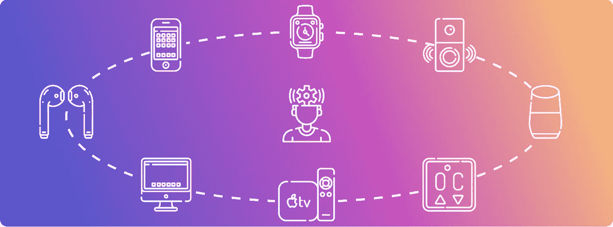
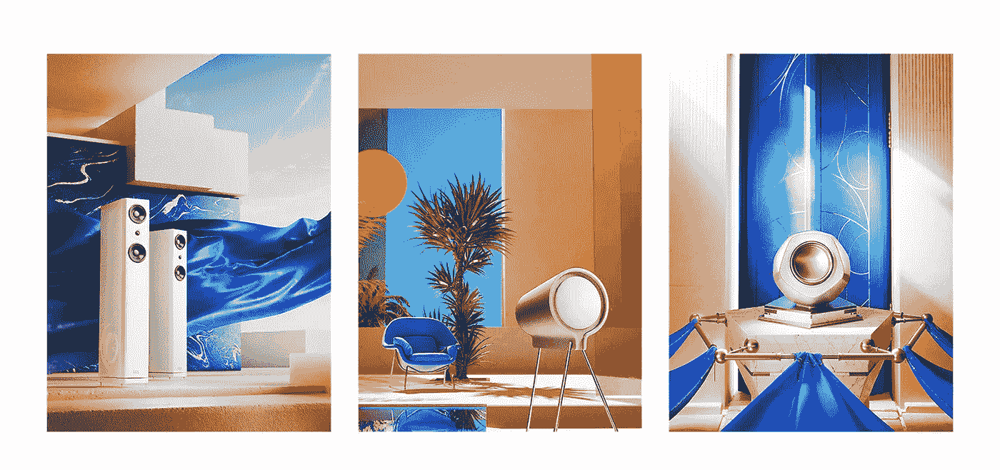
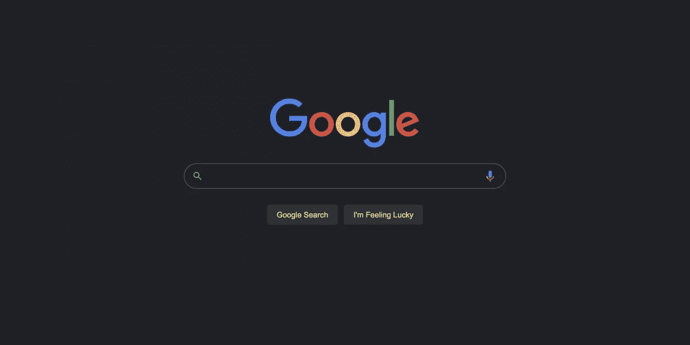
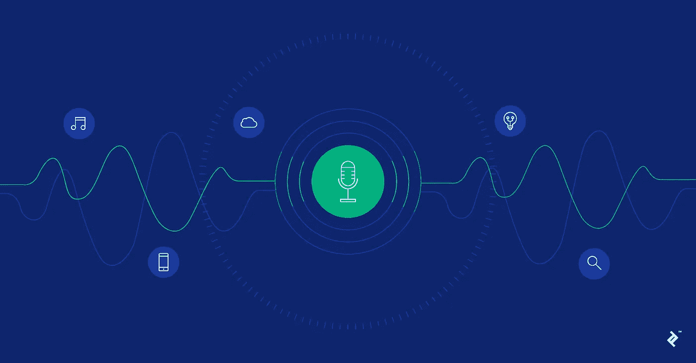
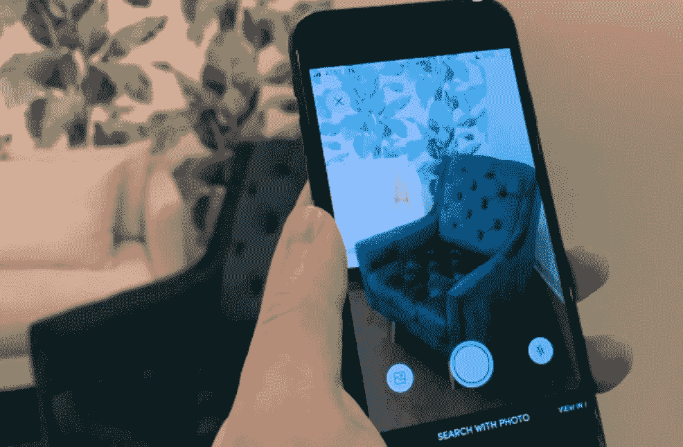

# UX 闻起来——如果我们能预测 UX 未来几年的趋势

> 原文：<https://medium.com/nerd-for-tech/if-we-can-smell-the-future-of-ux-design-eac98c890d4e?source=collection_archive---------17----------------------->

Y 年复一年， [Wondershare Mockitt](https://bit.ly/3ewCXuz) 注意到用户与产品联系方式的变化。作为 UX 的设计师，紧跟这些变化是非常重要的。当人们说 [UX 趋势](https://bit.ly/3hVzfwl)时常变化时，他们指的是设计师设计出有效、易用、互动愉快的产品的方式确实发生了变化。从本质上说，改变 UX 的趋势可能涉及强调整体 UX 设计的一部分高于另一部分。然而，大多数预测的 UX 趋势并不新鲜。

当您遇到它们时，许多已经蓄势待发，等待被广泛采用。

# 2019 年 UX 设计趋势

一些在 2019 年被广泛采用的 UX 设计趋势包括设备无关设计、讲故事和 3D 可视化。

***与设备无关的设计***

[设备无关的方法如何改进你的设计|作者科林·米勒](https://uxdesign.cc/how-a-device-agnostic-approach-could-improve-your-design-190585fdb0e7)

在 2019 年之前，典型的 UX 设计意味着要么用于移动设备，要么用于桌面设备，或者有时两者都有。然而，用户与产品交互的设备越来越多。随着纯语音设备和助手以及可穿戴设备的兴起，尤其是在 2019 年，为移动和桌面进行设计已经不够了。

[与设备无关的设计](https://uxdesign.cc/how-a-device-agnostic-approach-could-improve-your-design-190585fdb0e7)旨在提供跨许多设备和系统的无缝体验，而不需要进行特殊调整。2019 年，很明显，好的设计不会强迫客户选择他们可以与产品互动的设备；相反，高质量的设计让用户可以使用他们选择的任何设备与产品进行交互。

从本质上说，好的 UX 设计应该更多地强调用户的旅程，而不仅仅是人们使用的设备。与设备无关的体验是为跨个体技术的交互而设计的，智能手表和扬声器的兴起使这一概念成为 2019 年的优先事项。

与设备无关的设计具有适应性和动态性。它允许用户体验连续的使用旅程，通常会通过不同的设备而没有明显的摩擦。因此，用户可以无缝地从笔记本电脑或智能手机切换到另一种设备，而不会遇到任何问题或设计上的重大变化。

***虚幻产品照片***

[蓝色&金色| Behance 上的超现实产品摄影](https://www.google.com/url?sa=i&url=https%3A%2F%2Fwww.behance.net%2Fgallery%2F62552267%2FBlue-Gold-Surreal-Product-Photography&psig=AOvVaw1k5sKb8HTVkl0UBRLNInOi&ust=1614929126280000&source=images&cd=vfe&ved=0CA0QjhxqFwoTCJDE5tKOlu8CFQAAAAAdAAAAABAD)

经典和现实的产品形象已经成为过去。接管的 UI/UX 设计趋势是使用超现实的项目照片，而不是实际的图像。

事实上，当你展示要销售的商品时，尤其是当有很多选择时，浏览目录的顾客很容易厌倦重复看到同一类型产品的图片。然而，你可以通过混合实际的摄影和顶级的用户界面/UX 设计来创造一个超现实的产品渲染来增加趣味。这一趋势确实在 2019 年流行起来。

这种趋势变得普遍的一个行业是电子商务领域，在那里，商家被期望展示他们待售商品的图片。古驰和耐克这两家公司已经大量采用了这一趋势。亚马逊上的一些卖家也利用这一点给他们的产品带来一些与众不同的光环，在众多类似的产品中脱颖而出。这种趋势开始流行的另一个领域是旅游业，目的地的形象可能是吸引用户的关键因素。

主要想法是通过展示有趣和不真实的元素来迷惑客户并吸引他们的注意力。它们迫使潜在消费者发挥想象力，在网站上停留更长时间。这样，您可以增加平均会话时间，并可能提高转化率。

***黑暗模式***

[谷歌搜索渐黑模式](https://www.gsmarena.com/google_search_is_getting_dark_theme_will_match_your_preferred_theme-news-47702.php)

[黑暗模式](https://chrome.google.com/webstore/detail/dark-mode/dmghijelimhndkbmpgbldicpogfkceaj?hl=en)是另一个 UX 设计趋势，已经存在了一段时间，但在 2019 年得到了更大的采用。许多设计师已经在他们的网站和应用程序上选择了黑暗模式。但随着苹果和安卓都推出了两种黑暗模式([强制黑暗模式](https://www.geeksforgeeks.org/how-to-force-dark-mode-on-web-contents-in-chrome/)和系统黑暗模式)，以及微软和谷歌等公司发布其电子邮件应用的黑暗版本，黑暗 UI 设计在 2019 年确实蓬勃发展。Instagram 等其他应用程序也在 2019 年推出了黑暗模式选项。

黑暗模式带来了很多好处。首先，是美学；黑暗模式显然看起来超现代。此外，至少在许多应用中，暗模式比亮模式看起来更漂亮。此外，它可以减少眼睛疲劳和屏幕眩光，这使它成为注重健康的移动设备用户的明显首选。其他好处包括节省电池电量，特别是在有机发光二极管和 AMOLED 屏幕的情况下。

享受黑暗模式好处的不仅仅是用户；设计师也越来越多地被迷人的颜色、鲜明的线条和清晰的分色所吸引，这些都是深色用户界面的一部分。

# 2020 年 UX 设计趋势

语音用户界面(Voice UI)和 3D 图形等趋势也将在 2020 年流行起来。

***【语音用户界面(VUI)***

[设计 Voice 语音用户界面|作者弗雷德里克·古森斯](/toptal-publications/designing-a-vui-voice-user-interface-bec6848eea5)

尽管在整个 UX 设计中越来越多地采用语音已经成为一段时间的趋势，但 2020 年可以被描述为语音 UI 年。

语音 UI 使用语音识别，使用户能够使用语音命令与产品进行交互。世界正变得越来越快节奏，语音技术正准备取代图形用户界面，使一般用户体验更加无缝。键盘可以用于写博客等文本密集型任务，但对于搜索、发布更新和获取方向等简单任务，已经证明人们更喜欢使用语音。

相信语音 UI 会是一个趋势，实际上会持续很久。事实和数字支持这一点。例如，所有“五大”科技公司，即 Alphabet(谷歌)、亚马逊、苹果、脸书和微软，都在语音技术上投入了大量资金。

据报道，2019 年估计有 59%的在线搜索是通过语音完成的；在一些特定的垂直领域，如[食品和餐馆搜索，语音搜索的比例甚至高达 68%](https://searchengineland.com/nine-voice-search-stats-to-close-out-2019-326884) 。此外，[到 2025 年，语音和语音接口行业预计将达到近 250 亿美元](https://www.marketsandmarkets.com/PressReleases/speech-voice-recognition.asp)。所有这些都强调了用户界面设计者在设计 UX 时加入语音用户界面的必要性。

***评书***

[将传统故事讲述与品牌故事讲述、情商和用户体验联系起来](https://uxdesign.cc/how-does-traditional-storytelling-relate-to-brand-storytelling-emotional-intelligence-and-the-30339cfe048e)

一流的设计加上完美的装饰和吸引力不再是稀罕物。事实上，到 2020 年，这已经成为惯例。大多数公司现在生产出界面很棒的产品，好的用户界面已经变得不那么重要了。UX 设计师的工作在于创造产品和用户之间的情感联系。

讲述精彩故事的能力对于客户的正面体验至关重要。在 UX 设计中，你在整个设计过程中使用[讲故事](https://bit.ly/3ftuEQf)来确保所有的工作都集中在用户的需求和你想要给这些用户的价值上。在整个设计项目中有一个故事意味着在[设计过程](https://bit.ly/3wH7Pi2)结束时营销设计也很简单，因为你已经确切知道该讲哪个故事来展示你的产品如何提供价值。

好的故事有助于在用户中建立共鸣和情感联系，所有这些都是为了产生期望的转化。文本风格及其吸引客户并让他们购买东西的能力是 UI/UX 设计的关键方面，在 2019 年获得了大量采用。虽然漂亮的设计可以抓住用户的注意力，但一个好的故事可以吸引他们关注品牌，并突出他们在整个画布中的重要性。

***三维可视化***

[Wayfair 的应用增加了 3D 可视化工具，包括互动照片&一个房间规划师](https://techcrunch.com/2019/11/13/wayfairs-app-adds-3d-visualization-tools-for-shoppers-including-interactive-photos-a-room-planner/)

真实镜头和图像的 3D 渲染和计算机图形增强已经存在了一段时间，但主要应用于电影制作和视频游戏开发。直到 2020 年，它才真正在 UX 世界流行起来。过去，设计者在构建 web 产品时通常会避免使用它们，因为它们通常加载缓慢，并且在 web 上的性能很差。然而，在 2020 年，随着更好的浏览器和硬件使 3D 图形加载更容易、更快成为可能，这一切都变了。

三维图形很吸引人，也很有趣，在用户界面设计中应用三维图形可以提供更好的用户体验。有几种方法可以将 3D 图形应用到 UI 设计中。例如，它可以与[动画](https://bit.ly/3yK8nWc)和插图一起使用——网站和应用程序上常用的插图人物可以 3D 重现。

3D 也适用于印刷和字母插图。由积木和机器部件构成的字母以及醒目的颜色在三维空间中呈现时显得更加有效。此外，3D 可视化已经应用于编辑摄影和现实生活摄影，以创造更具冲击力的视觉效果。

# 连接岁月

没错，年复一年流行的 UX 潮流各不相同。很多时候，某一年突出的用户体验趋势似乎并不总是与下一年或随后几年流行的趋势相联系。例如，黑暗模式的盛行和讲故事的日益流行之间没有明显的联系。

但是设计师需要注意一些模式和教训。不时发生的变化，更多地反映了技术作为一个整体的进化性质，以及用户如何与他们互动。如果我们粗略地看一下 2018 年至 2020 年间用户体验趋势的变化，我们会注意到对单纯产品外观的重视有所减少。此外，我们注意到两个突出的模式，即未来技术的兴起和日益增长的对个性化人类体验的需求。

# 未来科技的兴起

人工智能、3D 和其他“未来派”技术已经在我们身边出现了一段时间，但它们真的没有被日常采用——至少在用户体验方面没有。直到最近。再往前，我们将体验 AI 等现象在用户体验中的应用。语音助手和人脸解锁只是一个开始。智能午睡、智能拍摄和美容将会得到广泛应用。

这里的重点将是功能，以及如何将这些技术应用到产品设计中，以使用户体验更加无缝。其他可能应用于用户体验的技术包括 5G 和物联网(IoT)。

# 人类的角度

过去，用户界面(当然还有 UX)设计的重点是应用程序或网站的外观——物理吸引力和美感。但是，虽然美丽可以吸引用户，但却无法留住他们。统计数据表明，超过 75%的 T2 用户在使用 72 小时后不会返回应用程序。

为了让用户继续使用某个产品，他们经常需要与这样的产品联系在一起。而让这一切发生的工具就是优质内容。一种经过时间考验能够留住用户的内容是讲故事。

# 预测趋势的方法

预测、跟踪和跟上 UX 趋势是增加商业成功的可靠途径，尤其是如果根据趋势中获得的洞察力采取具体行动的话。然而，我们必须注意到，没有明确的方式或方法来正确预测或预测趋势，特别是在 UX。

还必须指出的是，把研究以前的趋势作为预测未来趋势的一种方式，并不是一种有效的策略。事实上，很多时候，它不起作用。这是因为许多 UX 趋势——甚至那些在过渡时期获得广泛采纳的趋势——可能不会持续。即使是经得起时间考验的趋势，人们也不能肯定地说它们将如何演变。

有没有一种确定的方法来掌控一切？

绝对的。那就是成为潮流的鼻祖！你实际上可以启动一个新的用户体验趋势，或者促成正确的冷门的广泛采用。

*这些想法从何而来？*

产生想法的一个方法是经常实验。你可以改变现有的做事方式。再者，可以关注领域内的其他人。来自其他设计师的想法。

另一种方法是从“外部”获得建议。本质上，这涉及到倾听实际用户。你可以通过直接与他们交谈或研究现有数据来做到这一点。他们想在没见过的产品中看到什么？这两种方法各有优缺点。

虽然后一种方法看起来像是你实际上在响应用户的渴望，但它并不总是有效的。首先，它会限制创造力。此外，用户并不总是知道他们想要什么。有时，由产品设计师或开发人员来想出她/他认为用户会喜欢的东西。例如，在 iPhone 发布之前，没有人真正渴望它。

感谢您花时间阅读这篇文章。[了解更多关于摩奇特的信息](https://bit.ly/3ewCXuz)

我们为 UX 初学者创建了一个[终极指南](https://bit.ly/2OLPPlW)，它收集了来自多个 UXers 的知识、经验和建议。

订阅我们的[YouTube](https://www.youtube.com/channel/UCESxamaRS8nOGpWYvP1VSqA)脸书 insta gram

*最初发表于*[*【https://mockitt.wondershare.com】*](https://mockitt.wondershare.com/ui-ux-design/ux-trends.html)*。*