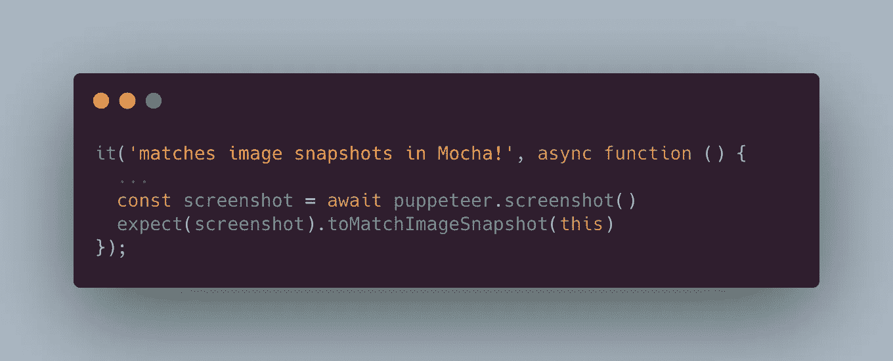

# 使用 Mocha 进行图像快照测试

> 原文：<https://medium.com/nerd-for-tech/image-snapshot-testing-with-mocha-cabc3e691fc6?source=collection_archive---------29----------------------->

快照测试是一种测试机制，很长时间以来似乎都是由 [Jest](https://github.com/facebook/jest) 独占的。主要思想是将期望值生成到一个单独的文件中，并将实际测试值与这些保存的值进行比较。也可以通过传递环境变量来更新快照。这种测试方法非常适合复杂的数据，比如大型字符串、DOM 内容或图像。我写了一个包来使用图像快照测试，也和[摩卡](https://github.com/mochajs/mocha)一起使用。

# 用 Jest 进行快照测试

快照测试本身是 Jest 的[内置特性](https://jestjs.io/docs/en/snapshot-testing)，当专门搜索图像快照时，您会很快找到 [jest-image-snapshot](https://github.com/americanexpress/jest-image-snapshot) ，它在比较和更新图像快照方面做得很好。它还提供了一些便利的特性，比如 base64 diff 输出，这允许我们从 CI 环境中查看 diff(因为不能保存或查看 diff 图像文件)。

# 摩卡怎么样？

虽然这一切都很棒，但是如果我出于某种原因没有使用 Jest 呢？如果我在用摩卡呢？

对于简单的快照测试，有一些选项。对于柴用户，有[摩卡柴快照](https://github.com/monojitb02/mocha-chai-snapshot)。对于 expect 用户，有 [expect-mocha-snapshot](https://github.com/blogfoster/expect-mocha-snapshot) 。它基本上通过注入人工测试上下文来包装 jest 快照逻辑。亚历山大·贝莱茨基的功劳！

仍然缺少的是将图像快照测试移植到 Mocha 的包。因为我目前使用 expect 作为断言库，所以我专注于寻找这个问题的解决方案。

我开始尝试将 jest-image-snapshot 与 expect-mocha-snapshot 结合使用，结果比预期的更容易兼容 mocha。我把它放到自己的 NPM 包里，名为[expect-mocha-image-snapshot](https://github.com/dword-design/expect-mocha-image-snapshot)。用法非常类似于 Jest，您只需通过`this`传递测试上下文。下面是一个简单的代码示例:

如果你对它是如何工作的感兴趣，你可以看看这个代码。这很简单。

# 结论

这是我用 Mocha 测试图像快照的指南。如果你喜欢[expect-mocha-image-snapshot](https://github.com/dword-design/expect-mocha-image-snapshot)，可以在 GitHub 上打个星支持我。还有，让我知道你对它的想法。

**如果你喜欢我正在做的事情，请关注我的** [**Twitter**](https://twitter.com/seblandwehr) **或者查看我的** [**网站**](https://sebastianlandwehr.com/) **。也可以考虑在** [**给我买杯咖啡**](https://www.buymeacoffee.com/dword)**[**PayPal**](https://www.paypal.com/paypalme/SebastianLandwehr)**或者**[**Patreon**](https://www.patreon.com/dworddesign)**进行捐赠。非常感谢！❤️****

***原载于*[*sebastianlandwehr.com*](https://sebastianlandwehr.com/blog/image-snapshot-testing-with-mocha)**